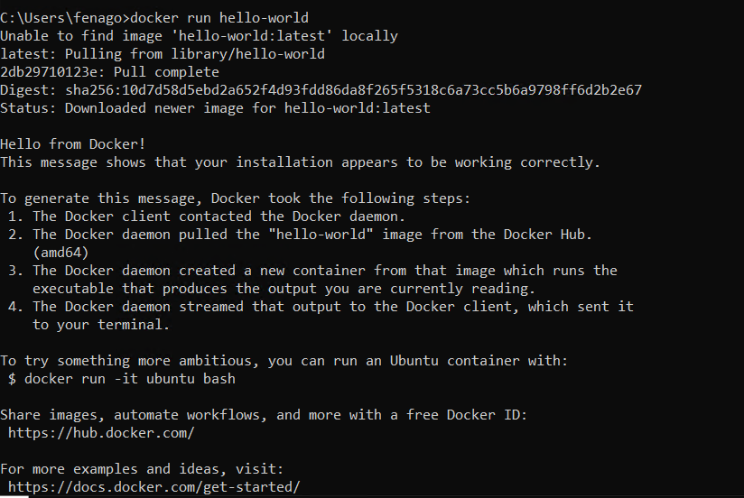
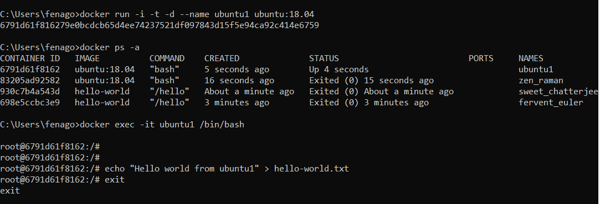

Running My First Docker Container
====================================

Docker first runs a container, if it does not have
the container image stored in its local cache, it will download the
container image from a container image registry. To view the container
images that are stored locally, use the `docker images`
command.

The following exercise will demonstrate how to use the
`docker run`, `docker ps`, and
`docker images` commands to start and view the status of a
simple `hello-world` container.


Exercise 1.01: Running the hello-world Container
------------------------------------------------

In this exercise, you will use the `docker run` command to
start the `hello-world` container and the
`docker ps` command to view the status of the container after
it has finished execution. This will provide a basic overview of running
containers in your local development environment:

1.  Enter the `docker run` command in a Bash terminal or
    PowerShell window. This instructs Docker to run a container called
    `hello-world`:

    
    ```
    docker run hello-world
    ```
    

    Your shell should return output similar to the following:

    



    What just happened? You told Docker to run the container,
    `hello-world`. So, first, Docker will look in its local
    container cache for a container by that same name. If it doesn\'t
    find one, it will look to a container registry on the internet in an
    attempt to satisfy the command. By simply specifying the name of the
    container, Docker will, by default, query Docker Hub for a published
    container image by that name.

    As you can see, it was able to find a container called the
    `library/hello-world` and began the process of pulling in
    the container image layer by layer. You will get a closer look into
    container images and layers in *Lab 2*, *Getting Started with
    Dockerfiles*. Once the image has fully downloaded, Docker runs the
    image, which displays the `Hello from Docker` output.
    Since the primary process of this image is simply to display that
    output, the container then stops itself and ceases to run after the
    output displays.

2.  Use the `docker ps` command to see what containers are
    running on your system. In your Bash or PowerShell terminal, type
    the following command:

    
    ```
    docker ps
    ```
    

    This will return output similar to the following:

    
    ```
    CONTAINER ID      IMAGE     COMMAND      CREATED
      STATUS              PORTS                   NAMES
    ```
    

    The output of the `docker ps` command is empty because it
    only shows currently running containers by default. This is similar
    to the Linux/Unix `ps` command, which only shows the
    running processes.

3.  Use the `docker ps -a` command to display all the
    containers, even the stopped ones:

    
    ```
    docker ps -a
    ```
    

    In the output returned, you should see the `hello-world`
    container instance:

    
    ```
    CONTAINER ID     IMAGE           COMMAND     CREATED
      STATUS                          PORTS         NAMES
    24c4ce56c904     hello-world     "/hello"    About a minute ago
      Exited (0) About a minute ago                 inspiring_moser
    ```
    

    As you can see, Docker gave the container a unique container ID. It
    also displays the `IMAGE` that was run, the
    `COMMAND` within that image that was executed, the
    `TIME` it was created, and the `STATUS` of the
    process running that container, as well as a unique human-readable
    name. This particular container was created approximately one minute
    ago, executed the program `/hello`, and ran successfully.
    You can tell that the program ran and executed successfully since it
    resulted in an `Exited (0)` code.

4.  You can query your system to see what container images Docker cached
    locally. Execute the `docker images` command to view the
    local cache:

    
    ```
    docker images
    ```
    

    The returned output should display the locally cached container
    images:

    
    ```
    REPOSITORY     TAG        IMAGE ID        CREATED         SIZE
    hello-world    latest     bf756fb1ae65    3 months ago    13.3kB
    ```
    

    The only image cached so far is the `hello-world`
    container image. This image is running the `latest`
    version, which was created 3 months ago, and has a size of 13.3
    kilobytes. From the preceding output, you know that this Docker
    image is incredibly slim and that developers haven\'t published a
    code change for this image in 3 months. This output can be very
    helpful for troubleshooting differences between software versions in
    the real world.


5.  If you execute the same `docker run` command over again,
    then, for each `docker run` command a user inputs, a new
    container instance will be created. It should be noted that one of
    the benefits of containerization is the ability to easily run
    multiple instances of a software application. To see how Docker
    handles multiple container instances, run the same
    `docker run` command again to create another instance of
    the `hello-world` container:

    
    ```
    docker run hello-world
    ```
    

    You should see the following output:

    
    ```
    Hello from Docker!
    This message shows that your installation appears to be 
    working correctly.
    To generate this message, Docker took the following steps:
     1. The Docker client contacted the Docker daemon.
     2. The Docker daemon pulled the "hello-world" image from 
        the Docker Hub.
        (amd64)
     3. The Docker daemon created a new container from that image 
        which runs the executable that produces the output you 
        are currently reading.
     4. The Docker daemon streamed that output to the Docker client, 
        which sent it to your terminal.
    To try something more ambitious, you can run an Ubuntu container 
    with:
     $ docker run -it ubuntu bash
    Share images, automate workflows, and more with a free Docker ID:
     https://hub.docker.com/
    For more examples and ideas, visit:
     https://docs.docker.com/get-started/
    ```
    

    Notice that, this time, Docker did not have to download the
    container image from Docker Hub again. This is because you now have
    that container image cached locally. Instead, Docker was able to
    directly run the container and display the output to the screen.
    Let\'s see what your `docker ps -a` output looks like now.

6.  In your terminal, run the `docker ps -a` command again:

    
    ```
    docker ps -a
    ```
    

    In the output, you should see that the second instance of this
    container image has completed its execution and entered a stopped
    state, as indicated by `Exit (0)` in the
    `STATUS` column of the output:

    
    ```
    CONTAINER ID     IMAGE           COMMAND       CREATED
      STATUS                      PORTS               NAMES
    e86277ca07f1     hello-world     "/hello"      2 minutes ago
      Exited (0) 2 minutes ago                        awesome_euclid
    24c4ce56c904     hello-world     "/hello"      20 minutes ago
      Exited (0) 20 minutes ago                       inspiring_moser
    ```
    

    You now have a second instance of this container showing in your
    output. Each time you execute the `docker run` command,
    Docker will create a new instance of that container with its
    attributes and data. You can run as many instances of a container as
    your system resources will allow. You created one instance in this
    example 20 minutes ago. The second instance you created 2 minutes
    ago.

7.  Check the base image again by executing the
    `docker images` command once more:

    
    ```
    docker images
    ```
    

    The returned output will show the single base image that Docker
    created two running instances from:

    
    ```
    REPOSITORY     TAG       IMAGE ID        CREATED         SIZE
    hello-world    latest    bf756fb1ae65    3 months ago    13.3kB
    ```
    

In this exercise, you used `docker run` to start the
`hello-world` container. To accomplish this, Docker downloaded
the image from the Docker Hub registry and executed it in the Docker
Engine. Once the base image was downloaded, you could create as many
instances of that container as you wanted using subsequent
`docker run` commands.


Exercise 1.02: Managing Container Life Cycles
---------------------------------------------

In this exercise, you will work with the official Ubuntu base container
image. This image will be used to start container instances that will be
used to test the various container life cycle management commands, such
as `docker pull`, `docker start`, and
`docker stop`. This container image is useful because the
default base image allows us to run container instances in long-running
sessions to understand how the container life cycle management commands
function. In this exercise, you will also pull the
`Ubuntu 18.04` container image and compare it with the
`Ubuntu 19.04` container image:

1.  In a new terminal or PowerShell window, execute the
    `docker pull` command to download the
    `Ubuntu 18.04` container image:

    
    ```
    docker pull ubuntu:18.04
    ```
    

    You should see the following output indicating that Docker is
    downloading all the layers of the base image:

    
    ```
    5bed26d33875: Pull complete 
    f11b29a9c730: Pull complete 
    930bda195c84: Pull complete 
    78bf9a5ad49e: Pull complete 
    Digest: sha256:bec5a2727be7fff3d308193cfde3491f8fba1a2ba392
            b7546b43a051853a341d
    Status: Downloaded newer image for ubuntu:18.04
    docker.io/library/ubuntu:18.04
    ```
    

2.  Use the `docker pull` command to download the
    `Ubuntu 19.04` base image:

    
    ```
    docker pull ubuntu:19.04
    ```
    

    You will see similar output as Docker downloads the
    `Ubuntu 19.04` base image:

    
    ```
    19.04: Pulling from library/ubuntu
    4dc9c2fff018: Pull complete 
    0a4ccbb24215: Pull complete 
    c0f243bc6706: Pull complete 
    5ff1eaecba77: Pull complete 
    Digest: sha256:2adeae829bf27a3399a0e7db8ae38d5adb89bcaf1bbef
            378240bc0e6724e8344
    Status: Downloaded newer image for ubuntu:19.04
    docker.io/library/ubuntu:19.04
    ```
    

3.  Use the `docker images` command to confirm that the
    container images are downloaded to the local container cache:

    
    ```
    docker images
    ```
    

    The contents of the local container cache will display the
    `Ubuntu 18.04` and `Ubuntu 19.04` base images,
    as well as our `hello-world` image from the earlier
    exercise:

    
    ```
    REPOSITORY     TAG        IMAGE ID         CREATED         SIZE
    ubuntu         18.04      4e5021d210f6     4 weeks ago     64.2MB
    ubuntu         19.04      c88ac1f841b7     3 months ago    70MB
    hello-world    latest     bf756fb1ae65     3 months ago    13.3kB
    ```
    

4.  Before running these images, use the `docker inspect`
    command to get verbose output about what makes up the container
    images and how they differ. In your terminal, run the
    `docker inspect` command and use the image ID of the
    `Ubuntu 18.04` container image as the main argument:

    
    ```
    docker inspect UPDATE_ME
    ```
    

    The `inspect` output will contain a large list of all the
    attributes that define that container. For example, you can see what
    environment variables are configured within the container, whether
    the container has a hostname set when the image was last updated,
    and a breakdown of all the layers that define that container. This
    output contains critical debugging details that can prove valuable
    when planning an upgrade. The following is the truncated output of
    the `inspect` command. In the `Ubuntu 18.04`
    image, the `"Created"` parameter should provide the date
    and time the container image was built:

    
    ```
    "Id": "4e5021d210f6d4a0717f4b643409eff23a4dc01c4140fa378b1b
           f0a4f8f4",
    "Created": "2020-03-20T19:20:22.835345724Z",
    "Path": "/bin/bash",
    "Args": [],
    ```
    

5.  Inspecting the `Ubuntu 19.04` container, you can see that
    this parameter is different. Run the `docker inspect`
    command in the `Ubuntu 19.04` container image ID:

    
    ```
    docker inspect UPDATE_ME
    ```
    

    In the displayed output, you will see that this container image was
    created on a different date to the `18.04` container
    image:

    
    ```
    "Id": "c88ac1f841b74e5021d210f6d4a0717f4b643409eff23a4dc0
           1c4140fa"
    "Created": "2020-01-16T01:20:46.938732934Z",
    "Path": "/bin/bash",
    "Args": []
    ```
    

    This could be critical if you knew that a security vulnerability
    might be present in an Ubuntu base image. This information can also
    prove vital to helping you determine which version of the container
    you want to run.

6.  After inspecting both the container images, it will be clear that
    your best choice is to stick with the Ubuntu Long Term Support 18.04
    release. As you saw from the preceding outputs, the 18.04 release is
    more up to date than the 19.04 release. This is to be expected as
    Ubuntu will generally provide more stable updates to the long-term
    support releases.

7.  Use the `docker run` command to start an instance of the
    Ubuntu 18.04 container:

    
    ```
    docker run -d ubuntu:18.04
    ```
    

    Notice that this time we are using the `docker run`
    command with the `-d` flag. This tells Docker to run the
    container in daemon mode (or in the background). If we omit the
    `-d` flag, the container will take over our current
    terminal until the primary process inside the container terminates.

    Note

    A successful invocation of the `docker run` command will
    usually only return the container ID as output. Some versions of
    Docker will not return any output.

8.  Check the status of the container using the `docker ps -a`
    command:

    
    ```
    docker ps -a
    ```
    

    This will reveal a similar output to the following:

    
    ```
    CONTAINER ID     IMAGE           COMMAND        CREATED
      STATUS                     PORTS         NAMES
    c139e44193de     ubuntu:18.04    "/bin/bash"    6 seconds ago
      Exited (0) 4 seconds ago                 xenodochial_banzai
    ```
    

    As you can see, your container is stopped and exited. This is
    because the primary process inside the container is
    `/bin/bash`, which is a shell. The Bash shell cannot run
    without being executed in an interactive mode since it expects text
    input and output from a user.

9.  Run the `docker run` command again, passing in the
    `-i` flag to make the session interactive (expecting user
    input), and the `-t` flag to allocate a **pseudo-tty**
    handler to the container. `pseudo-tty` handler will
    essentially link the user\'s terminal to the interactive Bash shell
    running inside the container. This will allow Bash to run properly
    since it will instruct the container to run in an interactive mode,
    expecting user input. You can also give the container a
    human-readable name by passing in the `--name` flag. Type
    the following command in your Bash terminal:
    
    ```
    docker run -i -t -d --name ubuntu1 ubuntu:18.04
    ```
    

10. Execute the `docker ps -a` command again to check the
    status of the container instance:

    
    ```
    docker ps -a 
    ```
    

    You should now see the new instance running, as well as the instance
    that failed to start moments ago:

    
    ```
    CONTAINER ID    IMAGE          COMMAND         CREATED
      STATUS            PORTS               NAMES
    f087d0d92110    ubuntu:18.04   "/bin/bash"     4 seconds ago
      Up 2 seconds                          ubuntu1
    c139e44193de    ubuntu:18.04   "/bin/bash"     5 minutes ago
      Exited (0) 5 minutes ago              xenodochial_banzai
    ```
    

11. You now have an Ubuntu container up and running. You can run
    commands inside this container using the `docker exec`
    command. Run the `exec` command to access a Bash shell,
    which will allow us to run commands inside the container. Similar to
    `docker run`, pass in the `-i` and
    `-t` flags to make it an interactive session. Also pass in
    the name or ID of the container, so that Docker knows which
    container you are targeting. The final argument of
    `docker exec` is always the command you wish to execute.
    In this case, it will be `/bin/bash` to start a Bash shell
    inside the container instance:

    
    ```
    docker exec -it ubuntu1 /bin/bash
    ```
    

    You should immediately see your prompt change to a root shell. This
    indicates that you have successfully launched a shell inside your
    Ubuntu container. The hostname of the container,
    `cfaa37795a7b`, is taken from the first twelve characters
    of the container ID. This allows the user to know for certain which
    container are they accessing, as seen in the following example:

    
    ```
    root@cfaa37795a7b:/#
    ```
    

12. From inside the container, you are very limited in terms of what
    tools you have available. Unlike a VM image, container images are
    extremely minimal in terms of the packages that come preinstalled.
    The `echo` command should be available, however. Use
    `echo` to write a simple message to a text file:
    
    ```
    root@cfaa37795a7b:/# echo "Hello world from ubuntu1" > hello-world.txt
    ```


    

13. Run the `exit` command to exit from the Bash shell of the
    `ubuntu1` container. You should return to your normal
    terminal shell:

    
    ```
    root@cfaa37795a7b:/# exit
    ```
    

    The command will return output like the following. Please note that
    the output may vary for every user running the command:

    
    ```
    user@developmentMachine:~/
    ```
    

14. Now create a second container called `ubuntu2` that will
    also run in your Docker environment using the
    `Ubuntu 19.04` image:
    
    ```
    docker run -i -t -d --name ubuntu2 ubuntu:19.04
    ```
    

15. Run `docker exec` to access a shell of this second
    container. Remember to use the name or container ID of the new
    container you created. Likewise, access a Bash shell inside this
    container, so the final argument will be `/bin/bash`:

    
    ```
    docker exec -it ubuntu2 /bin/bash
    ```
    

    You should observe your prompt change to a Bash root shell, similar
    to how it did for the `Ubuntu 18.04` container image:

    
    ```
    root@875cad5c4dd8:/#
    ```
    

16. Run the `echo` command inside the `ubuntu2`
    container instance to write a similar `hello-world`-type
    greeting:
    
    ```
    root@875cad5c4dd8:/# echo "Hello-world from ubuntu2!" > hello-world.txt
    ```
    

17. Currently, you have two Ubuntu container instances running in your
    Docker environment with two separate `hello-world`
    greeting messages in the home directory of the root account. Use
    `docker ps` to see the two running container images:

    
    ```
    docker ps
    ```

**Note:** Run above command in new terminal.

    The list of running containers should reflect the two Ubuntu
    containers, as well as the time elapsed since they have been
    created:

    
    ```
    CONTAINER ID    IMAGE            COMMAND        CREATED
      STATUS              PORTS               NAMES
    875cad5c4dd8    ubuntu:19.04     "/bin/bash"    3 minutes ago
      Up 3 minutes                            ubuntu2
    cfaa37795a7b    ubuntu:18.04     "/bin/bash"    15 minutes ago
      Up 15 minutes                           ubuntu1
    ```
    

18. Instead of using `docker exec` to access a shell inside
    our containers, use it to display the output of the
    `hello-world.txt` files you wrote by executing the
    `cat` command inside the containers:

    
    ```
    docker exec -it ubuntu1 cat hello-world.txt
    ```
    

    The output will display the `hello-world` message you
    passed into the container in the previous steps. Notice that as soon
    as the `cat` command was completed and the output
    displayed, the user was moved back to the context of your main
    terminal. This is because the `docker exec` session will
    only exist for as long as the command the user is executing will
    run.

    In the earlier example of the Bash shell, Bash will only exit if the
    user terminates it by using the `exit` command. In this
    example, only the `Hello world` output is displayed
    because the `cat` command displayed the output and exited,
    ending the `docker exec` session:

    
    ```
    Hello world from ubuntu1
    ```
    

    You will observe the contents of the `hello-world` file
    displayed, followed by a return to your main terminal session.

19. Run the same `cat` command in the `ubuntu2`
    container instance:

    
    ```
    docker exec -it ubuntu2 cat hello-world.txt
    ```
    

    Similar to the first example, the `ubuntu2` container
    instance will display the contents of the
    `hello-world.txt` file provided previously:

    
    ```
    Hello-world from ubuntu2!
    ```
    

    As you can see, Docker was able to allocate an interactive session
    on both the containers, execute the command, and return the output
    directly in our running container instances.

20. In a similar manner to that you used to execute commands inside our
    running containers, you can also stop, start, and restart them. Stop
    one of your container instances using the `docker stop`
    command. In your terminal session, execute the
    `docker stop` command, followed by the name or container
    ID of the `ubuntu2` container:

    
    ```
    docker stop ubuntu2
    ```
    

    This command should return no output.

21. Use the `docker ps` command to view all running container
    instances:

    
    ```
    docker ps
    ```
    

    The output will display the `ubuntu1` container up and
    running:

    
    ```
    CONTAINER ID    IMAGE           COMMAND        CREATED
      STATUS              PORTS               NAMES
    cfaa37795a7b    ubuntu:18.04    "/bin/bash"    26 minutes ago
      Up 26 minutes                           ubuntu1
    ```
    

22. Execute the `docker ps -a` command to view all container
    instances, regardless of whether they are running, to see your
    container in a stopped state:

    
    ```
    docker ps -a
    ```
    

    The command will return the following output:

    
    ```
    CONTAINER ID     IMAGE            COMMAND         CREATED
      STATUS                      PORTS             NAMES
    875cad5c4dd8     ubuntu:19.04     "/bin/bash"     14 minutes ago
      Exited (0) 6 seconds ago                      ubuntu2
    ```
    

23. Use the `docker start` or `docker restart`
    command to restart the container instance:

    
    ```
    docker start ubuntu2
    ```
    

    This command will return no output, although some versions of Docker
    may display the container ID.

24. Verify that the container is running again by using the
    `docker ps` command:

    
    ```
    docker ps
    ```
    

    Notice that `STATUS` shows that this container has only
    been up for a short period (`1 second`), although the
    container instance was created 29 minutes ago:

    
    ```
    CONTAINER ID    IMAGE           COMMAND         CREATED
      STATUS              PORTS               NAMES
    875cad5c4dd8    ubuntu:19.04    "/bin/bash"     17 minutes ago
      Up 1 second                             ubuntu2
    cfaa37795a7b    ubuntu:18.04    "/bin/bash"     29 minutes ago
      Up 29 minutes                           ubuntu1
    ```
    

    From this state, you can experiment with starting, stopping, or
    executing commands inside these containers.

25. The final stage of the container management life cycle is cleaning
    up the container instances you created. Use the
    `docker stop` command to stop the `ubuntu1`
    container instance:

    
    ```
    docker stop ubuntu1
    ```
    

    This command will return no output, although some versions of Docker
    may return the container ID.

26. Perform the same `docker stop` command to stop the
    `ubuntu2` container instance:
    
    ```
    docker stop ubuntu2
    ```
    

27. When container instances are in a stopped state, use the
    `docker rm` command to delete the container instances
    altogether. Use `docker rm` followed by the name or
    container ID to delete the `ubuntu1` container instance:

    
    ```
    docker rm ubuntu1
    ```
    

    This command will return no output, although some versions of Docker
    may return the container ID.

    Perform this same step on the `ubuntu2` container
    instance:

    
    ```
    docker rm ubuntu2
    ```
    

28. Execute `docker ps -a` to see all containers, even the
    ones in a stopped state. You will find that the stopped containers
    no longer exist due to the fact they have been deleted by our
    previous command. You may also delete the `hello-world`
    container instances, as well. Delete the `hello-world`
    container using the container ID captured from the
    `docker ps -a` output:
    
    ```
    docker rm UPDATE_ME
    ```
    

29. To completely reset the state of our Docker environment, delete the
    base images you downloaded during this exercise as well. Use the
    `docker images` command to view the cached base images:

    
    ```
    docker images
    ```
    

    The list of Docker images and all associated metadata in your local
    cache will display:

    
    ```
    REPOSITORY     TAG        IMAGE ID        CREATED         SIZE
    ubuntu         18.04      4e5021d210f6    4 weeks ago     64.2MB
    ubuntu         19.04      c88ac1f841b7    3 months ago    70MB
    hello-world    latest     bf756fb1ae65    3 months ago    13.3kB
    ```
    

30. Execute the `docker rmi` command followed by the image ID
    to delete the first image ID:

    
    ```
    docker rmi UPDATE_ME
    ```
    

    Similar to `docker pull`, the `rmi` command will
    delete each image and all associated layers:

    
    ```
    Untagged: ubuntu:18.04
    Untagged: ubuntu@sha256:bec5a2727be7fff3d308193cfde3491f8fba1a2b
    a392b7546b43a051853a341d
    Deleted: sha256:4e5021d210f65ebe915670c7089120120bc0a303b9020859
    2851708c1b8c04bd
    Deleted: sha256:1d9112746e9d86157c23e426ce87cc2d7bced0ba2ec8ddbd
    fbcc3093e0769472
    Deleted: sha256:efcf4a93c18b5d01aa8e10a2e3b7e2b2eef0378336456d86
    53e2d123d6232c1e
    Deleted: sha256:1e1aa31289fdca521c403edd6b37317bf0a349a941c7f19b
    6d9d311f59347502
    Deleted: sha256:c8be1b8f4d60d99c281fc2db75e0f56df42a83ad2f0b0916
    21ce19357e19d853
    ```
    

    Perform this step for each image you wish to delete, substituting in
    the various image IDs. For each base image you delete, you will see
    all of the image layers get untagged and deleted along with it.

It is important to periodically clean up your Docker environment as
frequently building and running containers can cause large amounts of
hard disk usage over time. Now that you know how to run and manage
Docker containers in your local development environment, you can use
more advanced Docker commands to understand how a container\'s primary
process functions and how to troubleshoot issues. In the next section,
we will look at the `docker attach` command to directly access
the primary process of a container.

**Note**

To streamline the process of cleaning up your environment, Docker
provides a `prune` command that will automatically remove old
containers and base images:

`docker system prune -fa`


Exercise 1.03: Attaching to an Ubuntu Container
-----------------------------------------------

The `docker attach` command is used to attach to a running
container in the context of the primary process. In this exercise, you
will use the `docker attach` command to attach to running
containers and investigate the main container `entrypoint`
process directly:

1.  Use the `docker run` command to start a new Ubuntu
    container instance. Run this container in interactive mode
    (`-i`), allocate a TTY session (`-t`), and run
    it in the background (`-d`). Call this container
    `attach-example1`:

    
    ```
    docker run -itd --name attach-example1 ubuntu:latest
    ```
    

    This will start a new Ubuntu container instance named
    `attach-example1` using the latest version of the Ubuntu
    container image.

2.  Use the `docker ps` command to check that this container
    is running in our environment:

    
    ```
    docker ps 
    ```
    

    The details of the running container instance will be displayed.
    Take note that the primary process of this container is a Bash shell
    (`/bin/bash`):

    
    ```
    CONTAINER ID    IMAGE            COMMAND          CREATED
      STATUS              PORTS               NAMES
    90722712ae93    ubuntu:latest    "/bin/bash"      18 seconds ago
      Up 16 seconds                           attach-example1
    ```
    

3.  Run the `docker attach` command to attach to the primary
    process inside this container, (`/bin/bash`). Use
    `docker attach` followed by the name or ID of the
    container instance:

    
    ```
    docker attach attach-example1
    ```
    

    This should drop you into the primary Bash shell session of this
    container instance. Note that your terminal session should change to
    a root shell session, indicating you have successfully accessed the
    container instance:

    
    ```
    root@90722712ae93:/#
    ```
    

    It should be noted here that using commands such as `exit`
    to terminate a shell session will result in stopping the container
    instance because you are now attached to the primary process of the
    container instance. By default, Docker provides the shortcut key
    sequence of *Ctrl* + *P* and then *Ctrl* + *Q* to gracefully detach
    from an `attach` session.

4.  Use the keyboard combinations *Ctrl* + *P* and then *Ctrl* + *Q* to
    detach from this session gracefully:

    
    ```
    root@90722712ae93:/# CTRL-p CTRL-q
    ```
    

    Note

    You will not type the words `CTRL-p CTRL-q`; rather, you
    will press and hold the *Ctrl* key, press the *P* key, and then
    release both keys. Then, press and hold the *Ctrl* key again, press
    the *Q* key, and then again release both keys.

    Upon successful detachment of the container, the words
    `read escape sequence` will be displayed before returning
    you to your main terminal or PowerShell session:

    
    ```
    root@90722712ae93:/# read escape sequence
    ```
    

5.  Use `docker ps` to verify that the Ubuntu container is
    still running as expected:

    
    ```
    docker ps
    ```
    

    The `attach-example1` container will be displayed, still
    running as expected:

    
    ```
    CONTAINER ID    IMAGE            COMMAND          CREATED
      STATUS              PORTS               NAMES
    90722712ae93    ubuntu:latest    "/bin/bash"      13 minutes ago
      Up 13 minutes                           attach-example1
    ```
    

6.  Use the `docker attach` command to attach once more to the
    `attach-example1` container instance:

    
    ```
    docker attach attach-example1
    ```
    

    You should be put back into the Bash session of the primary process:

    
    ```
    root@90722712ae93:/#
    ```
    

7.  Now, terminate the primary process of this container using the
    `exit` command. In the Bash shell session, type the
    `exit` command:

    
    ```
    root@90722712ae93:/# exit
    ```
    

    The terminal session should have exited, returning you once more to
    your primary terminal.

8.  Use the `docker ps` command to observe that the
    `attach-example1` container should no longer be running:

    
    ```
    docker ps
    ```
    

    This should return no running container instances:

    
    ```
    CONTAINER ID    IMAGE            COMMAND              CREATED
      STATUS              PORTS               NAMES
    ```
    

9.  Use the `docker ps -a` command to view all the containers,
    even ones that have been stopped or have exited:

    
    ```
    docker ps -a
    ```
    

    This should display the `attach-example1` container in a
    stopped state:

    
    ```
    CONTAINER ID      IMAGE                COMMAND 
      CREATED            STATUS    PORTS           NAMES
    90722712ae93      ubuntu:latest        "/bin/bash"
      20 minutes ago     Exited (0) 3 minutes ago  attach-example1
    ```
    

    As you can see, the container has gracefully terminated
    (`Exited (0)`) approximately 3 minutes ago. The
    `exit` command gracefully terminates a Bash shell session.

10. Use the `docker system prune -fa` command to clean up the
    stopped container instances:

    
    ```
    docker system prune -fa
    ```
    

    This should remove all stopped container instances, including the
    `attach-example1` container instance, as seen in the
    following output:

    
    ```
    Deleted Containers:
    ry6v87v9a545hjn7535jk2kv9x8cv09wnkjnscas98v7a762nvnw7938798vnand
    Deleted Images:
    untagged: attach-example1
    ```
    

In this exercise, we used the `docker attach` command to gain
direct access to the primary process of a running container. This
differs from the `docker exec` command we explored earlier in
the lab because `docker exec` executes a new process
inside a running container, whereas `docker attach` attaches
to the main process of a container directly. Careful attention must be
paid, however, when attaching to a container not to stop the container
by terminating the main process.

In the next activity, we will put together the Docker management
commands we covered in this lab to start putting together the
building block containers that will become the Panoramic Trekking
microservices application stack.


Activity 1.01: Pulling and Running the PostgreSQL Container Image from Docker Hub
---------------------------------------------------------------------------------

Panoramic Trekking is the multi-tier web application that we will be
building throughout this book. Similar to any web application, it will
consist of a web server container (NGINX), a Python Django backend
application, and a PostgreSQL database. Before you can start deploying
the web application or the frontend web server, you must first deploy
the backend database.

In this activity, you are asked to start a PostgreSQL
database container with default credentials.

**Note**

The official Postgres container image provides many environment variable
overrides you can leverage to configure the PostgreSQL instance. Review
the documentation for the container on Docker Hub at
<https://hub.docker.com/_/postgres>.

Perform the following steps:

1.  Create a Postgres database container instance that will serve as the
    data tier of our application stack.
2.  Use environment variables to configure the container at runtime to
    use the following database credentials:
    
    ```
    username: panoramic
    password: trekking
    ```
    
3.  Verify whether the container is running and healthy.

**Expected Output:**

The following output should be returned on running `docker ps`
command:


```
CONTAINER ID  IMAGE         COMMAND                 CREATED
  STATUS              PORTS               NAMES
29f115af8cdd  postgres:12   "docker-entrypoint.s…"  4 seconds ago
  Up 2 seconds        5432/tcp            blissful_kapitsa
```


In the next activity, you will access the database that has just been
set up in this activity inside the container instance. You will also
interact with the container to fetch the list of databases running in
the container.


Summary
=======

In this lab, you learned the fundamentals of containerization. Using commands such as `docker run`, `docker start`,
`docker exec`, `docker ps`, and
`docker stop`, we have explored the basics of container life
cycle management through the Docker CLI. Through the various exercises,
we launched container instances from the same base image, configured
them using `docker exec`, and cleaned up the deployments using
other basic container life cycle commands such as `docker rm`
and `docker rmi`.
