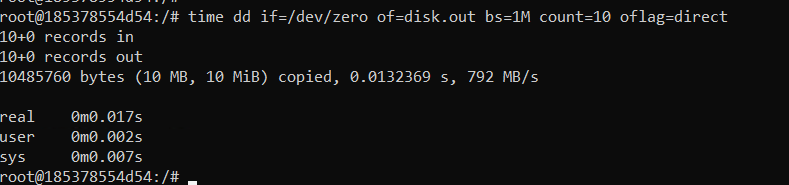
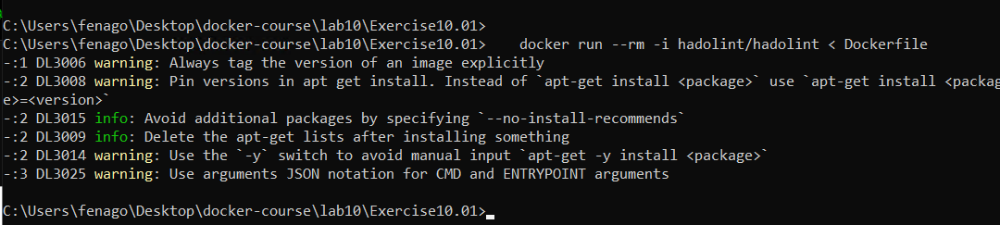

Lab 10: Best Practices
======================


In this lab, you will learn some of the best practices to use when
working with Docker and your container images. This will enable you to
monitor and manage the resources used by your container and limit their
effect on your host system. You will analyze Docker\'s best practices
and learn why it\'s important to only be running one service per
container, ensuring that your containers are scalable and immutable and
making sure that your underlying applications start in a short amount of
time. This lab will help you to enforce these best practices by
linting your `Dockerfiles`
files before your applications and containers are running with the help
of `hadolint's` `FROM:latest` command and
`dcvalidator`.

Managing Container CPU Resources
================================

This section of the lab will show you how to set limits on the
amount of CPU being used by the container, as a container running
without limits can use up all the available CPU resources on a host
server. We will be looking at optimizing our running Docker container,
but the actual issue with a large amount of CPU being used usually lies
with the underlying infrastructure or the applications running on the
container.


Exercise 10.01: Understanding CPU Resources on Your Docker Image
----------------------------------------------------------------

In this exercise, you will first create a new Docker image that will
help you generate some resources on your system. We will demonstrate how
to use the `stress` application installed on the image. The
application will allow you to start monitoring resource usage on your
system, as well as allowing you to change the number of CPU resources
being used by the image:

1.  Create a new `Dockerfile` and open your favorite text
    editor to enter the following details. You will be creating the
    image using Ubuntu as a base because the `stress`
    application is not yet provided as a package to be easily installed
    on an Alpine base image:
    
    ```
    FROM ubuntu
    RUN apt-get update && apt-get install stress
    CMD stress $var
    ```
    

2.  Build the new image and tag it as `docker-stress` using
    the `-t` option of the `docker build` command:
    
    ```
    docker build -t docker-stress .
    ```
    

3.  Stop and remove all the other containers first before running the
    new `docker-stress` image to make sure that the results
    are not confused by other containers running on our system:
    
    ```
    docker rm -f $(docker -a -q)
    ```
    
    **Note:** Above command should be run in `git bash` only. It will not work in cmd/powershell

4.  On *line 3* of the `Dockerfile`, you\'ll notice that the
    `CMD` instruction is running the stress application
    following the `$var` variable. This will allow you to add
    command-line options directly to the stress application running on
    the container via environment variables, without having to build a
    new image every time you want to change the functionality. Test this
    out by running your image and using the `-e` option to add
    environment variables. Add `var="--cpu 4 --timeout 20"` as
    a command-line option to the `stress` command:

    
    ```
    docker run --rm -it -e var="--cpu 4 --timeout 20" docker-stress
    ```
    

    The `docker run` command has added the
    `var="--cpu 4 --timeout 20"` variable, which will
    specifically run the `stress` command with these
    command-line options. The `--cpu` option is stating that
    four CPUs or cores of the system will be used, and the
    `--timeout` option will allow the stress test to run for
    the designated number of seconds specified -- in this case,
    `20`:

    
    ```
    stress: info: [6] dispatching hogs: 4 cpu, 0 io, 0 vm, 0 hdd
    stress: info: [6] successful run completed in 20s
    ```


5.  Run the `docker stats` command to see what effect this has
    on your host system. Limit the output provided to only give CPU
    usage by using the `--format` option:

    
    ```
    docker stats --format "table {{.Name}}\t{{.Container}}\t{{.CPUPerc}}"
    ```
    

    Unless you have a container running on your system, you should only
    see the table headings, similar to the output provided here:

    
    ```
    NAME                CONTAINER           CPU %
    ```
    

6.  While the `stats` command is running, move into a new
    terminal window and run the `docker-stress` container
    again, as in *step 4* of this exercise. Use the `--name`
    option to make sure you are viewing the correct image when using the
    `docker stress` command:
    
    ```
    docker run --rm -it -e var="--cpu 4 --timeout 20" --name docker-stress docker-stress
    ```
    

7.  Move back to the terminal running `docker stats`. You
    should now see some output presented on your table. Your output will
    be different from the following as you may have a different number
    of cores running on your system. The following output is showing
    that 203% of our CPU percentage is being used. The system on which
    the command is run has all cores. It shows that the stress
    application is using 100% of four of the cores available:
    
    ```
    NAME                CONTAINER           CPU %
    docker-stress       c8cf5ad9b6eb        203.43%
    ```
     

8.  Manage the number of cores that your `docker-stress` image
    can have access to by using the `--cpus` option and
    specifying the number of cores you want to allow the image to use.
    In the following command, `2` is set as the number of
    cores our container is allowed to use:
    
    ```
    docker run --rm -it -e var="--cpu 8 --timeout 20" --cpus 2 --name docker-stress docker-stress
    ```
    

9. Move back to the terminal running `docker stats`. You will
    see that the CPU percentage being used does not exceed much more
    than 200%, showing that Docker is restricting resource usage to only
    two of the cores available on our system:

    
    ```
    NAME                CONTAINER           CPU %
    docker-stress       79b32c67cbe3        208.91%
    ```
    

    So far, you have only been running one container on our system at a
    time. The next section of this exercise will allow you to run two
    containers in detached mode. Here, you will test using the
    `--cpu-shares` option on one of your running containers to
    limit the number of cores it can use.

10. If you don\'t have `docker stats` running in a terminal
    window, do so by starting it up as you have done previously to allow
    us to monitor the processes that are running:
    
    ```
    docker stats --format "table {{.Name}}\t{{.Container}}\t{{.CPUPerc}}"
    ```
    

11. Access another terminal window and start up two
    `docker-stress` containers -- `docker-stress1`
    and `docker-stress2`. The first will use a
    `--timeout` value of `60` to have the stress
    application running for 60 seconds, but here, limit the
    `--cpu-shares` value to `512`:

    
    ```
    docker run --rm -dit -e var="--cpu 8 --timeout 60" --cpu-shares 512 --name docker-stress1 docker-stress
    ```
    

    The container\'s ID will be returned as follows:

    
    ```
    5f617e5abebabcbc4250380b2591c692a30b3daf481b6c8d7ab8a0d1840d395f
    ```
    

    The second container will not be limited but will have a
    `--timeout` value of only `30`, so it should
    complete first:

    
    ```
    docker run --rm -dit -e var="--cpu 8 --timeout 30" --name docker-stress2 docker-stress
    ```
    

    The container\'s ID will be returned as follows:

    
    ```
    83712c28866dd289937a9c5fe4ea6c48a6863a7930ff663f3c251145e2fbb97a
    ```
    

12. Move back to our terminal running `docker stats`. You\'ll
    see two containers running. In the following output, we can see the
    containers named `docker-stress1` and
    `docker-stress2`. The `docker-stress1` container
    has been set to have only `512` CPU shares while other
    containers are running. It can also be observed that it is only
    using half the amount of CPU resources as our second container named
    `docker-stress2`:
    
    ```
    NAME                CONTAINER           CPU %
    docker-stress1      5f617e5abeba        190.25%
    docker-stress2      83712c28866d        401.49%
    ```
    

13. When your second container completes the CPU percentage for the
    `docker-stress1` container, it is then allowed to move up
    to using almost all cores available on the running system:
    
    ```
    NAME                CONTAINER           CPU %
    stoic_keldysh       5f617e5abeba        598.66%
    ```
    

CPU resources play an important part in making sure that your
applications are running at their best. This exercise has shown you how
easy it is to monitor and configure your container\'s processing power
while it is still on your system before deploying it into a production
environment. The next section will move on to performing similar
monitoring and configuration changes on our container\'s memory.


Managing Container Memory Resources
===================================


The next section will provide you with hands-on experience in analyzing
the memory resources on your Docker image.


Exercise 10.02: Analyzing Memory Resources on Your Docker Image
---------------------------------------------------------------

This exercise will help you analyze how memory is used by your active
containers while running on your host system. Once again, you will be
using the `docker-stress` image created earlier, but this time
with options to only use memory on the running container. This command
will allow us to implement some of the memory-limiting options available
to ensure our running containers do not bring down our running host
system:

1.  Run the `docker stats` command to display the relevant
    information you need for the percentage memory and memory usage
    values:

    
    ```
    docker stats --format "table {{.Name}}\t{{.Container}}\t{{.MemPerc}}\t{{.MemUsage}}"
    ```
    

    This command will provide an output like the following:

    
    ```
    NAME        CONTAINER       MEM %         MEM USAGE / LIMIT
    ```
    

2.  Open a new terminal window to run the `stress` command
    again. Your `docker-stress` image will only utilize CPU
    when you use the `--cpu` option. Use the `--vm`
    option in the following command to start up the number of workers
    you wish to spawn to consume memory. By default, each of them will
    consume `256MB`:

    
    ```
    docker run --rm -it -e var="--vm 2 --timeout 20" --name docker-stress docker-stress
    ```
    

    When you move back to monitor the running container, the memory used
    only reached about 20% of the limit. This may be different for
    different systems. As only two workers are running to consume 256 MB
    each, you should only see it reach around 500 MB of memory usage:

    
    ```
    NAME            CONTAINER      MEM %      MEM USAGE / LIMIT
    docker-stress   b8af08e4d79d   20.89%     415.4MiB / 1.943GiB
    ```
    

3.  The stress application also has the `--vm-bytes` option to
    control the number of bytes that each worker being spawned up will
    consume. Enter the following command, which has set each worker to
    `128MB`. It should show a lower usage when you monitor it:

    
    ```
    docker run --rm -it -e var="--vm 2 --vm-bytes 128MB --timeout 20" --name stocker-stress docker-stress
    ```
    

    As you can see, the stress application struggles to push the memory
    usage up very far at all. If you wanted to use all 8 GB of RAM you
    have available on your system, you could use
    `--vm 8 --vm-bytes` of 1,024 MB:

    
    ```
    NAME            CONTAINER      MEM %    MEM USAGE / LIMIT
    docker-stress   ad7630ed97b0   0.04%    904KiB / 1.943GiB
    ```
    

4.  Reduce the amount of memory available to the
    `docker-stress` image with the `--memory`
    option. In the following command, you will see that we have set the
    available memory of the running container to be limited to
    `512MB`:
    
    ```
    docker run --rm -it -e var="--vm 2 --timeout 20" --memory 512MB --name docker-stress docker-stress
    ```
    

5.  Move back to the terminal running `docker stats`, and you
    will see that the percentage of memory used spikes to almost 100%.
    This isn\'t a bad thing as it is only a small percentage of the
    memory allocated to your running container. In this instance, it is
    512 MB, which is only a quarter of what it was previously:
    
    ```
    NAME            CONTAINER      MEM %     MEM USAGE / LIMIT
    docker-stress   bd84cf27e480   88.11%    451.1MiB / 512MiB
    ```
    

6.  Run more than one container at a time and see how our
    `stats` command responds. Use the `-d` option as
    part of the `docker run` commands to run the container as
    a daemon in the background of your host system. Both of the
    `docker-stress` containers are now going to use six
    workers each, but our first image, which we will name
    `docker-stress1`, is limited to `512MB` of
    memory, while our second image, named `docker-stress2`,
    which is only running for 20 seconds, will have an unlimited amount
    of memory:
    
    ```
    docker run --rm -dit -e var="--vm 6 --timeout 60" --memory 512MB --name docker-stress1 docker-stress

    docker run --rm -dit -e var="--vm 6 --timeout 20" --name docker-stress2 docker-stress
    ```
    

7.  Move back to the terminal running `docker stats`. You can
    see that only one container, the `docker-stress1`
    container, is limited to 512 MB, while the
    `docker-stress2` image is allowed to run on a lot more
    memory:

    
    ```
    NAME             CONTAINER       MEM %    MEM USAGE / LIMIT
    docker-stress1   ca05e244d030    37.10%   190MiB / 512MiB
    docker-stress2   6d9cbb966b77    31.03%   617.3MiB / 1.943GiB
    ```
    

    If you wait a few moments, the `docker-stress1` image will
    be left to run on its own:

    
    ```
    NAME             CONTAINER      MEM %    MEM USAGE / LIMIT
    docker-stress1   ca05e244d030   16.17%   82.77MiB / 512MiB
    ```
    

This part of the lab has helped to identify how you can run your
containers and monitor usage so that when they are moved into
production, they are not stopping the host system by using up all the
available memory. You should now be able to identify how much memory
your image is using and also limit the amount available if there are
issues with long-running or memory-intensive processes. In the next
section, we will look at how our container consumes the device\'s read
and write resources on our host system disks.


Managing the Container Disk\'s Read and Write Resources
=======================================================

The `docker stats` command also allows us to see the data
being transferred to and from our running container. It has a dedicated
column that can be added to our table using the `BlockIO`
value in our `docker stats` command, which represents the read
and writes to our host disk drive or directories.

Exercise 10.03: Understanding Disk Read and Write
-------------------------------------------------

This exercise will allow you to become familiar with viewing the disk
read and write of your running container. It will allow you to start
running your containers by configuring limits for the disk usage speeds
with the options available at runtime:

1.  Open a new terminal window and run the following command:

    
    ```
    docker stats --format "table {{.Name}}\t{{.Container}}\t{{.BlockIO}}" 
    ```
    

    The `docker stats` command with the `BlockIO`
    option helps us monitor the levels of input and output moving from
    our container to the host system\'s disk.

2.  Start the container to access it from the bash command line. Perform
    some tests directly on a running `docker-stress` image.
    The stress application does give you some options to manipulate the
    disk utilization on your container and the host system, but it is
    limited to the only disk writes:
    
    ```
    docker run -it --rm --name docker-stress docker-stress /bin/bash
    ```
    

3.  Unlike the CPU and memory usage, the block input and output show the
    total amount used by the container, so it will not be dynamic and
    change as the running container performs more changes. Move back to
    your terminal running `docker stats`. You should see
    `0B` for both input and output:
    
    ```
    NAME                CONTAINER           BLOCK I/O
    docker-stress       0b52a034f814        0B / 0B
    ```
    

4.  You will be using the bash shell in this instance as it gives access
    to the `time` command to see how long each of these
    processes take. Use the `dd` command, which is a Unix
    command used to make copies of filesystems and backups. In the
    following option, create a copy of our `/dev/zero`
    directory, using the `if` (input file) option, and output
    it to the `disk.out` file with the `of` (output
    file) option. The `bs` option is the block size or the
    amount of data it should read at a time and `count` is the
    total amount of blocks to read. Finally, set the `oflag`
    value to `direct`, which means the copy will avoid the
    buffer cache, so you are seeing a true value of disk reads and
    writes:
    
    ```
    time dd if=/dev/zero of=disk.out bs=1M count=10 oflag=direct
    ```
    
    

5.  Move back into the terminal running your `docker stats`
    command. You will see just over 10 MB of data sent to the host
    system\'s disk. Unlike CPU and memory, you do not see this data
    value go down after the transfer has occurred:

    
    ```
    NAME                CONTAINER           BLOCK I/O
    docker-stress       0b52a034f814        0B / 10.5MB
    ```
    

    You\'ll also notice that the command in *step 4* was almost
    instantly completed, with the `time` command showing it
    took only `0.01s` in real-time to complete. You will see
    what happens if you restrict the amount of data that can be written
    to disk, but first, exit out of the running container so that it no
    longer exists on our system.

6.  To start our `docker-stress` container up again, set the
    `--device-write-bps` option to `1MB` per second
    on the `/dev/sda` device drive:
    
    ```
    docker run -it --rm --device-write-bps /dev/sda:1mb --name docker-stress docker-stress /bin/bash
    ```
    

7.  Run the `dd` command again, preceded by the
    `time` command, to test how long it takes. You should see
    that the command takes a lot longer than what it did in *step 4*.
    The `dd` command is once again set to copy `1MB`
    blocks, `10` times:

    
    ```
    time dd if=/dev/zero of=test.out bs=1M count=10 oflag=direct
    ```
    

    Because the container is limited to only write 1 MB per second, this
    command takes 10 seconds, as displayed in the following output:

    
    ```
    10+0 records in
    10+0 records out
    10485760 bytes (10 MB, 10 MiB) copied, 10.0043 s, 1.0 MB/s
    real    0m10.006s
    user    0m0.000s
    sys     0m0.004s
    ```
    

We\'ve been able to easily see how our running container can affect the
underlying host system, specifically when using disk read and write. We
have also been able to see how we can easily limit the amount of data
that can be written to our device, so there is less contention between
running containers.


Using Docker Linter for Your Images
-----------------------------------

To run `hadolint` over your `Dockerfiles`, you need
to have the `hadolint` Docker image on your system. As you
know by now, this is simply a matter of running the
`docker pull` command with the name and repository of the
required image. In this instance, both the repository and image are
called `hadolint`.

Exercise 10.04: Linting Your Dockerfiles
----------------------------------------

This exercise will help you understand how to access and run
`hadolint` on your system to help you enforce best practices
on your `Dockerfiles`. We will also use an online
`Dockerfile` linter called `FROM:latest` to compare
the warnings we receive:

1.  Pull the image from the `hadolint` repository with the
    following `docker pull` command:
    
    ```
    docker pull hadolint/hadolint
    ```
    

2.  You have a `Dockerfile` ready to go with the
    `docker-stress` image you used to test and manage your
    resources earlier in this lab. Run the `hadolint`
    image to lint this `Dockerfile`, or any other
    `Dockerfile`, and send it to the `Dockerfile`
    using the less than (`<`) symbol, as in the
    following command:

    
    ```
    cd C:\Users\fenago\Desktop\docker-course\lab10\Exercise10.04

    docker run --rm -i hadolint/hadolint < Dockerfile
    ```
    
    As you can see from the following output, even though our
    `docker-stress` image was relatively small,
    `hadolint` has given quite a few different ways where we
    can improve the performance and help our image adhere to the
    best practices:

    
    
    

    **Note:**

    If your `Dockerfile` runs successfully through
    `hadolint` and there are no issues found, there will be no
    output presented to the user on the command line.

3.  `hadolint` also gives you the option to suppress different
    checks with the `--ignore` option. In the following
    command, we have chosen to ignore the `DL3008` warning,
    where it is suggesting that you pin the applications you are
    installing to a specific version number. Execute the
    `docker run` command to suppress the `DL3008`
    warning. Note that you need to provide the full `hadolint`
    command after specifying the image name you are running, as well as
    an extra dash (`-`) before you provide the
    `Dockerfile`:

    
    ```
    docker run --rm -i hadolint/hadolint hadolint --ignore DL3008 - < Dockerfile
    ```
    

    You should get output like the following:

    
    ```
    /dev/stdin:1 DL3006 Always tag the version of an image explicitly
    /dev/stdin:2 DL3009 Delete the apt-get lists after installing 
    something
    /dev/stdin:2 DL3015 Avoid additional packages by specifying 
    '--no-install-recommends'
    /dev/stdin:2 DL3014 Use the '-y' switch to avoid manual input 
    'apt-get -y install <package>'
    /dev/stdin:3 DL3025 Use arguments JSON notation for CMD and 
    ENTRYPOINT arguments
    ```
    

`hadolint` is not the only application that you can use to
ensure your `Dockerfiles` are adhering to best practices.
The next steps in this exercise will look at an online service named
`FROM:latest` to also help enforce best practices on your
`Dockerfiles`.

4.  To use `FROM:latest`, open your favorite web browser and
    enter the following URL:

    
    ```
    https://www.fromlatest.io
    ```
    

    When the web page loads, you should see a page similar to the one in
    the following screenshot. On the left-hand side of the web page, you
    should see a sample `Dockerfile` entered, and on the
    right-hand side of the web page, you should see a list of potential
    issues or ways to optimize your `Dockerfile`. Each of the
    items listed on the right-hand side has a dropdown to provide more
    details to the user:

    
    

5.  As in the previous part of this exercise, we will use the
    `Dockerfile` from our `docker-stress` image. To
    use this with `FROM:latest`, copy the following lines of
    code into the left-hand side of the web page over the sample
    `Dockerfile` provided by the site:

    
    ```
    FROM ubuntu
    RUN apt-get update && apt-get install stress
    CMD stress $var
    ```
    

    As soon as you post the `Dockerfile` code into the web
    page, the page will start to analyze the commands. As you can see
    from the following screenshot, it will provide details on how to
    resolve potential issues and optimize the `Dockerfile` to
    have the image build quicker:

    

    


Both `hadolint` and `FROM latest` provide
easy-to-use options to help you make sure your `Dockerfiles`
are adhering to best practices.


Activity 10.01: Using hadolint to Improve the Best Practices on Dockerfiles
---------------------------------------------------------------------------

`hadolint` provides a great way to enforce best practices when
you are creating your Docker images. In this activity, you will once
again use the `Dockerfile` from the `docker-stress`
image to see whether you can use the recommendations from
`hadolint` to improve the `Dockerfile` so that it
adheres to best practices as much as possible.

The steps you\'ll need to complete this activity are as follows:

1.  Ensure you have the `hadolint` image available and running
    on your system.
2.  Run the `hadolint` image over the `Dockerfile`
    for the `docker-stress` image and record the results.
3.  Make the recommended changes to the `Dockerfile` from the
    previous step.
4.  Test the `Dockerfile` again.

You should get the following output on the successful completion of the
activity:


Summary
=======

This lab has seen us go through a lot of theory as well as some
in-depth work on exercises. We started the lab by looking at how our
running Docker containers utilize the host system\'s CPU, memory, and
disk resources. We looked at the ways in which we can monitor how these
resources are consumed by our containers and configure our running
containers to reduce the number of resources used.

We then looked at the Docker best practices, working through a number of
different topics, including utilizing base images, installing programs
and cleanup, developing your underlying application for scalability, and
configuring your applications and images. We then introduced some tools
to help you enforce these best practices, including `hadolint`
and `FROM:latest` to help you lint your `Dockerfile`.