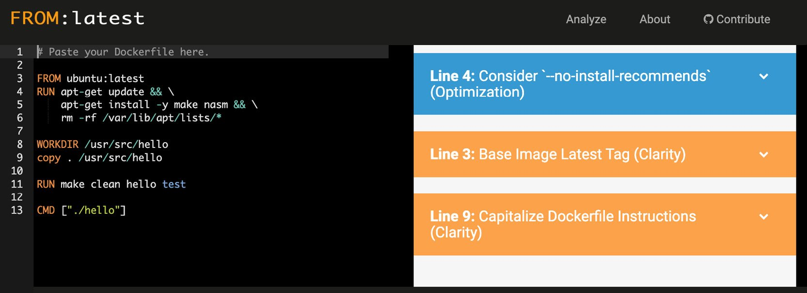
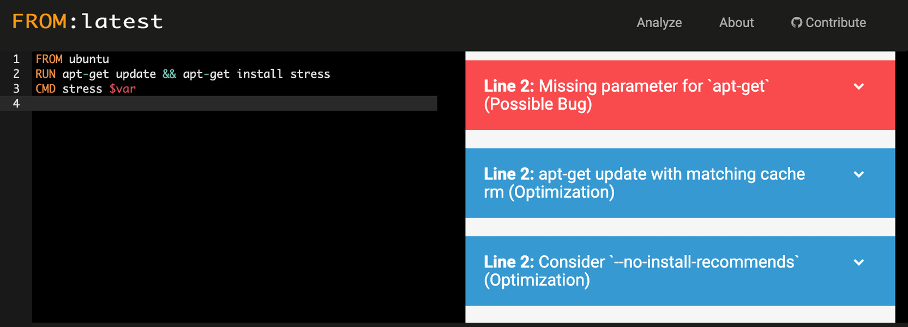
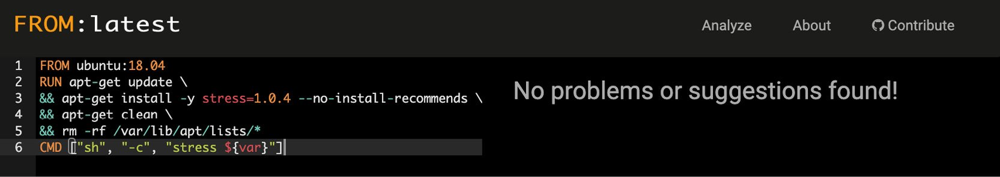

Lab 10: Best Practices
======================


In this lab, you will learn some of the best practices to use when
working with Docker and your container images. This will enable you to
monitor and manage the resources used by your container and limit their
effect on your host system. You will analyze Docker\'s best practices
and learn why it\'s important to only be running one service per
container, ensuring that your containers are scalable and immutable and
making sure that your underlying applications start in a short amount of
time. This lab will help you to enforce these best practices by
linting your `Dockerfiles` and `docker-compose.yml`
files before your applications and containers are running with the help
of `hadolint's` `FROM:latest` command and
`dcvalidator`.

Managing Container CPU Resources
================================

This section of the lab will show you how to set limits on the
amount of CPU being used by the container, as a container running
without limits can use up all the available CPU resources on a host
server. We will be looking at optimizing our running Docker container,
but the actual issue with a large amount of CPU being used usually lies
with the underlying infrastructure or the applications running on the
container.


Exercise 10.01: Understanding CPU Resources on Your Docker Image
----------------------------------------------------------------

In this exercise, you will first create a new Docker image that will
help you generate some resources on your system. We will demonstrate how
to use the `stress` application installed on the image. The
application will allow you to start monitoring resource usage on your
system, as well as allowing you to change the number of CPU resources
being used by the image:

1.  Create a new `Dockerfile` and open your favorite text
    editor to enter the following details. You will be creating the
    image using Ubuntu as a base because the `stress`
    application is not yet provided as a package to be easily installed
    on an Alpine base image:
    
    ```
    FROM ubuntu
    RUN apt-get update && apt-get install stress
    CMD stress $var
    ```
    

2.  Build the new image and tag it as `docker-stress` using
    the `-t` option of the `docker build` command:
    
    ```
    docker build -t docker-stress .
    ```
    

3.  Stop and remove all the other containers first before running the
    new `docker-stress` image to make sure that the results
    are not confused by other containers running on our system:
    
    ```
    docker rm -f $(docker -a -q)
    ```
    
    **Note:** Above command should be run in `git bash` only. It will not work in cmd/powershell

4.  On *line 3* of the `Dockerfile`, you\'ll notice that the
    `CMD` instruction is running the stress application
    following the `$var` variable. This will allow you to add
    command-line options directly to the stress application running on
    the container via environment variables, without having to build a
    new image every time you want to change the functionality. Test this
    out by running your image and using the `-e` option to add
    environment variables. Add `var="--cpu 4 --timeout 20"` as
    a command-line option to the `stress` command:

    
    ```
    docker run --rm -it -e var="--cpu 4 --timeout 20" docker-stress
    ```
    

    The `docker run` command has added the
    `var="--cpu 4 --timeout 20"` variable, which will
    specifically run the `stress` command with these
    command-line options. The `--cpu` option is stating that
    four CPUs or cores of the system will be used, and the
    `--timeout` option will allow the stress test to run for
    the designated number of seconds specified -- in this case,
    `20`:

    
    ```
    stress: info: [6] dispatching hogs: 4 cpu, 0 io, 0 vm, 0 hdd
    stress: info: [6] successful run completed in 20s
    ```
    

    Note

    If we need to run the `stress` command continuously
    without stopping, we will simply not include the
    `--timeout` option. Our examples all include the
    `timeout` option as we don\'t want to forget and
    continuously use resources on a running host system.

5.  Run the `docker stats` command to see what effect this has
    on your host system. Limit the output provided to only give CPU
    usage by using the `--format` option:

    
    ```
    docker stats --format "table {{.Name}}\t{{.Container}}\t{{.CPUPerc}}"
    ```
    

    Unless you have a container running on your system, you should only
    see the table headings, similar to the output provided here:

    
    ```
    NAME                CONTAINER           CPU %
    ```
    

6.  While the `stats` command is running, move into a new
    terminal window and run the `docker-stress` container
    again, as in *step 4* of this exercise. Use the `--name`
    option to make sure you are viewing the correct image when using the
    `docker stress` command:
    
    ```
    docker run --rm -it -e var="--cpu 4 --timeout 20" --name docker-stress docker-stress
    ```
    

7.  Move back to the terminal running `docker stats`. You
    should now see some output presented on your table. Your output will
    be different from the following as you may have a different number
    of cores running on your system. The following output is showing
    that 400% of our CPU percentage is being used. The system on which
    the command is run has six cores. It shows that the stress
    application is using 100% of four of the cores available:
    
    ```
    NAME                CONTAINER           CPU %
    docker-stress       c8cf5ad9b6eb        400.43%
    ```
    

8.  Once again, run the `docker-stress` container, this time
    with `8` set for the `--cpu` option:

    
    ```
    docker run --rm -it -e var="--cpu 8 --timeout 20" --name docker-stress docker-stress
    ```
    

    As you can see in the following stats output, we have hit the limit
    where your Docker container is using almost 100% of all six cores on
    our system, leaving a small amount for processing power for minor
    processes on our system:

    
    ```
    NAME                CONTAINER           CPU %
    docker-stress       8946da6ffa90        599.44%
    ```
    

9.  Manage the number of cores that your `docker-stress` image
    can have access to by using the `--cpus` option and
    specifying the number of cores you want to allow the image to use.
    In the following command, `2` is set as the number of
    cores our container is allowed to use:
    
    ```
    docker run --rm -it -e var="--cpu 8 --timeout 20" --cpus 2 --name docker-stress docker-stress
    ```
    

10. Move back to the terminal running `docker stats`. You will
    see that the CPU percentage being used does not exceed much more
    than 200%, showing that Docker is restricting resource usage to only
    two of the cores available on our system:

    
    ```
    NAME                CONTAINER           CPU %
    docker-stress       79b32c67cbe3        208.91%
    ```
    

    So far, you have only been running one container on our system at a
    time. The next section of this exercise will allow you to run two
    containers in detached mode. Here, you will test using the
    `--cpu-shares` option on one of your running containers to
    limit the number of cores it can use.

11. If you don\'t have `docker stats` running in a terminal
    window, do so by starting it up as you have done previously to allow
    us to monitor the processes that are running:
    
    ```
    docker stats --format "table {{.Name}}\t{{.Container}}\t{{.CPUPerc}}"
    ```
    

12. Access another terminal window and start up two
    `docker-stress` containers -- `docker-stress1`
    and `docker-stress2`. The first will use a
    `--timeout` value of `60` to have the stress
    application running for 60 seconds, but here, limit the
    `--cpu-shares` value to `512`:

    
    ```
    docker run --rm -dit -e var="--cpu 8 --timeout 60" --cpu-shares 512 --name docker-stress1 docker-stress
    ```
    

    The container\'s ID will be returned as follows:

    
    ```
    5f617e5abebabcbc4250380b2591c692a30b3daf481b6c8d7ab8a0d1840d395f
    ```
    

    The second container will not be limited but will have a
    `--timeout` value of only `30`, so it should
    complete first:

    
    ```
    docker run --rm -dit -e var="--cpu 8 --timeout 30" --name docker-stress2 docker-stress2
    ```
    

    The container\'s ID will be returned as follows:

    
    ```
    83712c28866dd289937a9c5fe4ea6c48a6863a7930ff663f3c251145e2fbb97a
    ```
    

13. Move back to our terminal running `docker stats`. You\'ll
    see two containers running. In the following output, we can see the
    containers named `docker-stress1` and
    `docker-stress2`. The `docker-stress1` container
    has been set to have only `512` CPU shares while other
    containers are running. It can also be observed that it is only
    using half the amount of CPU resources as our second container named
    `docker-stress2`:
    
    ```
    NAME                CONTAINER           CPU %
    docker-stress1      5f617e5abeba        190.25%
    docker-stress2      83712c28866d        401.49%
    ```
    

14. When your second container completes the CPU percentage for the
    `docker-stress1` container, it is then allowed to move up
    to using almost all six cores available on the running system:
    
    ```
    NAME                CONTAINER           CPU %
    stoic_keldysh       5f617e5abeba        598.66%
    ```
    

CPU resources play an important part in making sure that your
applications are running at their best. This exercise has shown you how
easy it is to monitor and configure your container\'s processing power
while it is still on your system before deploying it into a production
environment. The next section will move on to performing similar
monitoring and configuration changes on our container\'s memory.


Managing Container Memory Resources
===================================


The next section will provide you with hands-on experience in analyzing
the memory resources on your Docker image.


Exercise 10.02: Analyzing Memory Resources on Your Docker Image
---------------------------------------------------------------

This exercise will help you analyze how memory is used by your active
containers while running on your host system. Once again, you will be
using the `docker-stress` image created earlier, but this time
with options to only use memory on the running container. This command
will allow us to implement some of the memory-limiting options available
to ensure our running containers do not bring down our running host
system:

1.  Run the `docker stats` command to display the relevant
    information you need for the percentage memory and memory usage
    values:

    
    ```
    docker stats --format "table {{.Name}}\t{{.Container}}\t{{.MemPerc}}\t{{.MemUsage}}"
    ```
    

    This command will provide an output like the following:

    
    ```
    NAME        CONTAINER       MEM %         MEM USAGE / LIMIT
    ```
    

2.  Open a new terminal window to run the `stress` command
    again. Your `docker-stress` image will only utilize CPU
    when you use the `--cpu` option. Use the `--vm`
    option in the following command to start up the number of workers
    you wish to spawn to consume memory. By default, each of them will
    consume `256MB`:

    
    ```
    docker run --rm -it -e var="--vm 2 --timeout 20" --name docker-stress docker-stress
    ```
    

    When you move back to monitor the running container, the memory used
    only reached about 20% of the limit. This may be different for
    different systems. As only two workers are running to consume 256 MB
    each, you should only see it reach around 500 MB of memory usage:

    
    ```
    NAME            CONTAINER      MEM %      MEM USAGE / LIMIT
    docker-stress   b8af08e4d79d   20.89%     415.4MiB / 1.943GiB
    ```
    

3.  The stress application also has the `--vm-bytes` option to
    control the number of bytes that each worker being spawned up will
    consume. Enter the following command, which has set each worker to
    `128MB`. It should show a lower usage when you monitor it:

    
    ```
    docker run --rm -it -e var="--vm 2 --vm-bytes 128MB --timeout 20" --name stocker-stress docker-stress
    ```
    

    As you can see, the stress application struggles to push the memory
    usage up very far at all. If you wanted to use all 8 GB of RAM you
    have available on your system, you could use
    `--vm 8 --vm-bytes` of 1,024 MB:

    
    ```
    NAME            CONTAINER      MEM %    MEM USAGE / LIMIT
    docker-stress   ad7630ed97b0   0.04%    904KiB / 1.943GiB
    ```
    

4.  Reduce the amount of memory available to the
    `docker-stress` image with the `--memory`
    option. In the following command, you will see that we have set the
    available memory of the running container to be limited to
    `512MB`:
    
    ```
    docker run --rm -it -e var="--vm 2 --timeout 20" --memory 512MB --name docker-stress docker-stress
    ```
    

5.  Move back to the terminal running `docker stats`, and you
    will see that the percentage of memory used spikes to almost 100%.
    This isn\'t a bad thing as it is only a small percentage of the
    memory allocated to your running container. In this instance, it is
    512 MB, which is only a quarter of what it was previously:
    
    ```
    NAME            CONTAINER      MEM %     MEM USAGE / LIMIT
    docker-stress   bd84cf27e480   88.11%    451.1MiB / 512MiB
    ```
    

6.  Run more than one container at a time and see how our
    `stats` command responds. Use the `-d` option as
    part of the `docker run` commands to run the container as
    a daemon in the background of your host system. Both of the
    `docker-stress` containers are now going to use six
    workers each, but our first image, which we will name
    `docker-stress1`, is limited to `512MB` of
    memory, while our second image, named `docker-stress2`,
    which is only running for 20 seconds, will have an unlimited amount
    of memory:
    
    ```
    docker run --rm -dit -e var="--vm 6 --timeout 60" --memory 512MB --name docker-stress1 docker-stress
    ca05e244d03009531a6a67045a5b1edbef09778737cab2aec7fa92eeaaa0c487
    docker run --rm -dit -e var="--vm 6 --timeout 20" --name docker-stress2 docker-stress
    6d9cbb966b776bb162a47f5e5ff3d88daee9b0304daa668fca5ff7ae1ee887ea
    ```
    

7.  Move back to the terminal running `docker stats`. You can
    see that only one container, the `docker-stress1`
    container, is limited to 512 MB, while the
    `docker-stress2` image is allowed to run on a lot more
    memory:

    
    ```
    NAME             CONTAINER       MEM %    MEM USAGE / LIMIT
    docker-stress1   ca05e244d030    37.10%   190MiB / 512MiB
    docker-stress2   6d9cbb966b77    31.03%   617.3MiB / 1.943GiB
    ```
    

    If you wait a few moments, the `docker-stress1` image will
    be left to run on its own:

    
    ```
    NAME             CONTAINER      MEM %    MEM USAGE / LIMIT
    docker-stress1   ca05e244d030   16.17%   82.77MiB / 512MiB
    ```
    

    Note

    One option we haven\'t covered here is the
    `--memory-reservation` option. This is also used with the
    `--memory` option and needs to be set lower than the
    memory option. It is a soft limit that is activated when the memory
    on the host system is running low, but it is not guaranteed that the
    limit will be enforced.

This part of the lab has helped to identify how you can run your
containers and monitor usage so that when they are moved into
production, they are not stopping the host system by using up all the
available memory. You should now be able to identify how much memory
your image is using and also limit the amount available if there are
issues with long-running or memory-intensive processes. In the next
section, we will look at how our container consumes the device\'s read
and write resources on our host system disks.


Managing the Container Disk\'s Read and Write Resources
=======================================================

Docker also provides us with a way to control the amount of
reading and writing that our running containers can perform. Just as
we\'ve seen previously, we can use a number of options with our
`docker run` command to limit the amount of data we are either
reading or writing to our device disks.

The `docker stats` command also allows us to see the data
being transferred to and from our running container. It has a dedicated
column that can be added to our table using the `BlockIO`
value in our `docker stats` command, which represents the read
and writes to our host disk drive or directories.

Exercise 10.03: Understanding Disk Read and Write
-------------------------------------------------

This exercise will allow you to become familiar with viewing the disk
read and write of your running container. It will allow you to start
running your containers by configuring limits for the disk usage speeds
with the options available at runtime:

1.  Open a new terminal window and run the following command:

    
    ```
    docker stats --format "table {{.Name}}\t{{.Container}}\t{{.BlockIO}}" 
    ```
    

    The `docker stats` command with the `BlockIO`
    option helps us monitor the levels of input and output moving from
    our container to the host system\'s disk.

2.  Start the container to access it from the bash command line. Perform
    some tests directly on a running `docker-stress` image.
    The stress application does give you some options to manipulate the
    disk utilization on your container and the host system, but it is
    limited to the only disk writes:
    
    ```
    docker run -it --rm --name docker-stress docker-stress /bin/bash
    ```
    

3.  Unlike the CPU and memory usage, the block input and output show the
    total amount used by the container, so it will not be dynamic and
    change as the running container performs more changes. Move back to
    your terminal running `docker stats`. You should see
    `0B` for both input and output:
    
    ```
    NAME                CONTAINER           BLOCK I/O
    docker-stress       0b52a034f814        0B / 0B
    ```
    

4.  You will be using the bash shell in this instance as it gives access
    to the `time` command to see how long each of these
    processes take. Use the `dd` command, which is a Unix
    command used to make copies of filesystems and backups. In the
    following option, create a copy of our `/dev/zero`
    directory, using the `if` (input file) option, and output
    it to the `disk.out` file with the `of` (output
    file) option. The `bs` option is the block size or the
    amount of data it should read at a time and `count` is the
    total amount of blocks to read. Finally, set the `oflag`
    value to `direct`, which means the copy will avoid the
    buffer cache, so you are seeing a true value of disk reads and
    writes:
    
    ```
    time dd if=/dev/zero of=disk.out bs=1M count=10 oflag=direct
    10+0 records in
    10+0 records out
    10485760 bytes (10 MB, 10 MiB) copied, 0.0087094 s, 1.2 GB/s
    real    0m0.010s
    user    0m0.000s
    sys     0m0.007s
    ```
    

5.  Move back into the terminal running your `docker stats`
    command. You will see just over 10 MB of data sent to the host
    system\'s disk. Unlike CPU and memory, you do not see this data
    value go down after the transfer has occurred:

    
    ```
    NAME                CONTAINER           BLOCK I/O
    docker-stress       0b52a034f814        0B / 10.5MB
    ```
    

    You\'ll also notice that the command in *step 4* was almost
    instantly completed, with the `time` command showing it
    took only `0.01s` in real-time to complete. You will see
    what happens if you restrict the amount of data that can be written
    to disk, but first, exit out of the running container so that it no
    longer exists on our system.

6.  To start our `docker-stress` container up again, set the
    `--device-write-bps` option to `1MB` per second
    on the `/dev/sda` device drive:
    
    ```
    docker run -it --rm --device-write-bps /dev/sda:1mb --name docker-stress docker-stress /bin/bash
    ```
    

7.  Run the `dd` command again, preceded by the
    `time` command, to test how long it takes. You should see
    that the command takes a lot longer than what it did in *step 4*.
    The `dd` command is once again set to copy `1MB`
    blocks, `10` times:

    
    ```
    time dd if=/dev/zero of=test.out bs=1M count=10 oflag=direct
    ```
    

    Because the container is limited to only write 1 MB per second, this
    command takes 10 seconds, as displayed in the following output:

    
    ```
    10+0 records in
    10+0 records out
    10485760 bytes (10 MB, 10 MiB) copied, 10.0043 s, 1.0 MB/s
    real    0m10.006s
    user    0m0.000s
    sys     0m0.004s
    ```
    

We\'ve been able to easily see how our running container can affect the
underlying host system, specifically when using disk read and write. We
have also been able to see how we can easily limit the amount of data
that can be written to our device, so there is less contention between
running containers. In the next section, we are going to quickly answer
the question of what you need to do if you are using
`docker-compose` and look at limiting the number of resources
being used by your containers.


Container Resources and Docker Compose
======================================


Orchestrators such as Kubernetes and Swarm go a long way in controlling
and running your resources and spinning up new hosts if there are extra
resources needed. But what do you do if you are running
`docker-compose` in your system or a test environment?
Fortunately, the previously mentioned resource configurations work
nicely with `docker-compose` as well.

Within our `docker-compose.yml` file, under our service, we
can use the `resources` option under the `deploy`
configurations and specify our resource limits for our service. Just as
we have been using options such as `--cpus`,
`--cpu_shares`, and `--memory`, we would use the
same options in our `docker-compose.yml` file as
`cpus`, `cpu_shares`, and `memory`.

The example `compose` file in the following code block is
deploying the `docker-stress` image we have been using in this
lab. If we look at *line 8*, we can see the `deploy`
statement, followed by the `resources` statement. This is
where we can set our limits for our container. Just as we have in the
previous section, we have set `cpus` to `2` on *line
11* and `memory` to `256MB` on *line 12*:


```
1 version: '3'
2 services:
3   app:
4     container_name: docker-stress
5     build: .
6     environment:
7       var: "--cpu 2 --vm 6 --timeout 20"
8     deploy:
9       resources:
10         limits:
11           cpus: '2'
12           memory: 256M
```


Even though we have only just touched on this subject, the previous
sections covering resource usage should guide you on how you should be
allocating resources in your `docker-compose.yml` files. This
brings us to the end of this section on resource usage of our Docker
containers. From here, we will move on to look at the best practices for
creating our `Dockerfiles` and how we can start to use
different applications to ensure that we are adhering to these best
practices.


Best Practices in Docker
========================


As our containers and services grow in size and complexity, it is
important to make sure we are keeping true to the best practices when
creating our Docker images. This is also true for the applications we
run on our Docker images. Later in this lab, we will look to lint
our `Dockerfiles` and `docker-compose.yml` files,
which will analyze our files for errors and best practices, and this
will give you a clearer understanding. In the meantime, let\'s look into
some of the more important best practices to keep in mind when you are
creating your Docker images and how your applications should be working
with them.

In the following section, we will run through some of the more common
best practices you should be following when creating your services and
containers.


Running One Service per Container
---------------------------------

In modern microservice architecture, we need to remember that only one
service should be installed in each container. The container\'s main
process is set by the `ENTRYPOINT` or `CMD`
instruction at the end of the `Dockerfile`.

The service you have installed in your container could quite easily run
multiple processes of itself, but to get the full benefit of Docker and
microservices, you should only be running one service per container. To
break this down further, your container should only have a single
responsibility, and if it is responsible for doing more than one thing,
then it should be broken out into different services.

By limiting what each container can do, we effectively reduce the
resources being used by the image and potentially reduce the size of the
image. As we saw in the previous lab, this will also reduce the
chances of an attacker being able to perform anything they shouldn\'t if
they gain access to a running container. It also means that if the
container stops working for some reason, there is a limited effect on
the rest of the applications running on the environment and the service
will have an easier time recovering.


Base Images
-----------

When we start with a base image for our container, one of the first
things we need to do is to make sure we are starting with an up-to-date
image. Do a little research as well to make sure you are not using an
image that has a lot of extra applications installed that are not
needed. You may find that a base image supported by a specific language
that your application uses or a specific focus will limit the size of
the image needed, limiting what you need to install when you are
creating your image.

This is why we are using a PostgreSQL-supported Docker image instead of
installing the application on the image during build time. The
PostgreSQL-supported image ensures that it is secure and running at the
latest version and makes sure we are not running applications on the
image that are not needed.

When specifying our base image for our `Dockerfile`, we need
to make sure we are also specifying a specific version and not letting
Docker simply use the `latest` image. Also, make sure you are
not pulling an image from a repository or registry that is not from a
reputable or trusted provider.

If you\'ve been working with Docker for a little while, you may have
come across the `MAINTAINER` instruction where you specify the
author of the generated image. This has now been deprecated, but you can
still provide these details using a `LABEL` directive instead,
as we have in the following syntax:


```
LABEL maintainer="myemailaddress@emaildomain.com"
```


Installing Applications and Languages
-------------------------------------

When you are installing applications on your images, always remember
that there is no need to be performing `apt-get update` or
`dist-upgrade`. You should be looking at a different image if
you need to be upgrading the image version this way. If you are
installing applications using `apt-get` or `apk`,
make sure you are specifying the specific version you need as you don\'t
want to install a version that is new or untested.

When you are installing packages, make sure you are using the
`-y` switch to make sure the build does not stop and ask for a
user prompt. Alternatively, you should also use
`--no-install-recommends` as you don\'t want to install a
large group of applications that your package manager has recommended
and that you won\'t need. Also, if you using a Debian-based container,
make sure that you are using `apt-get` or
`apt-cache`, as the `apt` command has been
specifically made for user interaction and not for a scripted
installation.

If you are installing applications from other forms, such as building
the application from code, make sure you are cleaning up the
installation files to once again reduce the size of the image you are
creating. Again, if you are using `apt-get`, you should also
remove the lists in `/var/lib/apt/lists/` to clean up
installation files and reduce the size of your container image.


Running Commands and Performing Tasks
-------------------------------------

As our image is being created, we usually need to perform some tasks
within our `Dockerfile` to set up the environment ready for
our services to be run. Always make sure you are not using the
`sudo` command as this could cause some unexpected results. If
you need to be running commands as root, your base image will most
likely be running as the root user; just make sure you create a separate
user to run your application and services and that the container has
changed to the required user before it has completed building.

Make sure you are moving to different directories using
`WORKDIR`, instead of running instructions that specify a long
path, as this could be hard for users to read. Use `JSON`
notation for the `CMD` and `ENTRYPOINT` arguments
and always make sure you only have one `CMD` or
`ENTRYPOINT` instruction.


Containers Need to Be Immutable and Stateless
---------------------------------------------

We need to ensure that our containers and the services running on them
are immutable. We must not treat containers like traditional servers,
especially a server where you would update applications on a running
container. You should be able to update your container from code and
deploy it without needing to access it at all.

When we say immutable, we mean the container will not be modified at all
during its life, with no updates, patches, or config changes being made.
Any changes to your code or updates should be implemented by building
the new image and then deploying it into your environment. This makes
deployments safer as if you have any issues with your upgrade, you
simply redeploy the old version of the image. It also means you have the
same image running across all of your environments, making sure your
environments are as identical as possible.

When we talk about a container needing to be stateless, this means that
any data needed to run the container should be running outside of the
container. File stores should also be outside the container, possibly on
cloud storage or using a mounted volume. Removing data from the
container means the container can be cleanly shut down and destroyed at
any time, without fearing data loss. When a new container is created to
replace the old one, it simply connects to the original data store.


Designing Applications to Be Highly Available and Scalable
----------------------------------------------------------

Using containers in a microservices architecture is designed to allow
your application to scale to multiple instances. So, when developing
your applications on your Docker container, you should expect that there
could be situations where many instances of your application could be
deployed concurrently, scaling both up and down when needed. There
should also be no issue with your services running and completing when
there is a heavier-than-normal load on the container.

When your services need to scale due to increased requests, how much
time your applications need to start becomes an important issue. Before
deploying your services into a production environment, you need to make
sure the startup time is quick to make sure the system will be able to
scale more efficiently without causing any delay in service to your
users. To ensure that your services adhere to the industry\'s best
practices, your services should be starting in less than 10 seconds, but
less than 20 seconds is also acceptable.

As we saw in the previous section, improving the application startup
time is not simply a matter of providing more CPU and memory resources.
We need to make sure that the applications on our containers run
efficiently and, once again, if they are taking too long to start and
run specific processes, you may be performing too many tasks in one
application.


Images and Containers Need to Be Tagged Appropriately
-----------------------------------------------------

We covered this topic in detail in *Lab 3*, *Managing Your Docker
Images*, and made it clear that we need to think about how we name and
tag our images, especially when we start working with larger development
teams. To allow all users the ability to understand what the image does
and gain an understanding of what version is deployed into an
environment, a relevant tagging and naming strategy needs to be decided
and agreed upon before the bulk of the work is started by your team.

Image and container names need to be relevant to the applications they
are running, as ambiguous names can cause confusion. An agreed standard
for versioning must also be put in place to make sure any user can
identify what version is running in a certain environment and what
version is the most recent and stable release. As we mentioned in
*Lab 3*, *Managing Your Docker Images*, try not to use
`latest`, and instead opt for either a semantic versioning
system or Git repository `commit` hash, where users can then
refer to either documentation or a build environment to ensure that they
have the most up-to-date version of their image.


Configurations and Secrets
--------------------------

Environment variables and secrets should never be built into your Docker
image. By doing this, you are going against the rule of reusable images.
Building images with your secret credentials is also a security risk
because they will be stored in one of the image layers, and so anyone
able to pull the image will be able to see the credentials.

When setting up the configuration for your application, it may need to
change from environment to environment, so it is important to remember
that you will need to be able to dynamically change these configurations
when needed. This could include specific configurations for the language
your application is written in or even the database that the application
needs to connect to. We mentioned earlier that if you are configuring
your application as part of your `Dockerfile`, this will then
make it difficult to change and you may need to create a specific
`Dockerfile` for each environment you wish to deploy your
image to.

One way to configure your images, as we have seen with the
`docker-stress` image, is to use an environment variable that
is set on the command line when we run the image. The entry point or
command should contain default values if variables have not been
provided. This will mean the container will still start up and run even
if the extra variables have not been provided:


```
docker run -e var="<variable_name>" <image_name>
```


By doing this, we have made our configuration more dynamic, but this
could limit your configuration when you have a larger or more complex
configuration. The environment variables can easily be transferred from
your `docker run` command to `docker-compose` to
then be used in Swarm or Kubernetes.

For larger configurations, you may want to mount a configuration file
via a Docker volume. This can mean you will be able to set up a
configuration file and run it on your system to test easily, and then if
you need to move to an orchestration system such as Kubernetes or Swarm,
or an external configuration management solution, you will be able to
easily convert this into a configuration map.

If we wanted to implement this with the `docker-stress` image
we have been using in this lab, it could be modified to use a
configuration file to mount the values we would like to run. In the
following example, we have modified the `Dockerfile` to set up
*line 3* to run a script that will instead run the `stress`
command for us:


```
1 FROM ubuntu
2 RUN apt-get update && apt-get install stress
3 CMD ["sh","/tmp/stress_test.sh"]
```


This means we can build the Docker image and have it ready and available
for us to use whenever we need it. We would just need a script that we
would mount in the `/tmp` directory to be run. We could use
the following example:


```
1 #!/bin/bash
2 
3 /usr/bin/stress --cpu 8 --timeout 20 --vm 6 --timeout 60
```


This illustrates the idea of moving our values from environment
variables to a file. To run both the container and the stress
application, we would then perform the following, knowing that if we
wanted to change the variables being used by the `stress`
command, we would only need to make a minor change to the file we
are mounting:


```
docker run --rm -it -v ${PWD}/stress_test.sh:/tmp/stress_test.sh docker-stress
```


Note

The first thing you are going to think when you read through this list
of best practices is that we have gone against a lot of this, but please
remember that we have done this in a lot of instances to demonstrate a
process or idea.


Making Your Images Minimal and Small
------------------------------------

*Lab 3*, *Managing Your Docker Images*, also saw us do some work on
making our images as small as we possibly could. We saw that by reducing
the size of our images, the images can be built faster. They can also
then be pulled faster and run on our systems. Any unnecessary software
or applications installed on our containers can take up extra space and
resources on our host system and could slow our services down as a
result.

Using an application such as Anchore Engine as we did in *Lab 11*,
*Docker Security*, showed that we can audit our images to view their
contents, as well as the applications installed on them. This is an easy
way to make sure we are reducing the sizes of our images and making them
as minimal as possible.

You now have an idea of the best practices you should be using in your
container images and services. The following section of this lab
will help you enforce some of these best practices by using applications
to verify that your `Dockerfiles` and
`docker-compose.yml` are created as they should be.


Enforcing Docker Best Practices in Your Code
============================================


Just as we look to make our coding easier when we are developing
applications, we can use external service and tests to make sure our
Docker images are adhering to the best practices. In the following
sections of this lab, we are going to use three tools to make sure
that our `Dockerfiles` and `docker-compose.yml`
files are adhering to the best practices, as well as making sure we are
not introducing potential issues when our Docker images are built.

The tools included will be straightforward to use and provide powerful
functionality. We will start by using `hadolint` to lint our
`Dockerfiles` directly on our system, which will run as a
separate Docker image that we feed our `Dockerfiles` into. We
then take a look at `FROM:latest`, which is an online service
that provides some basic functionality in helping us pinpoint issues
with our `Dockerfiles`. Lastly, we then look at **Docker
Compose Validator** (**DCValidator**), which will perform a similar
function, but in this case, we will lint our
`docker-compose.yml` files to help pinpoint potential issues.

By using these tools before we build and deploy our images, we hope to
reduce our build times for our Docker images, reduce the number of
errors we introduce, potentially reduce the size of our Docker images,
and help us learn more about and enforce Docker best practices.


Using Docker Linter for Your Images
-----------------------------------

The GitHub repository containing all the code for this book also
includes tests that will compare against the built Docker image. A
linter, on the other hand, will analyze your code and look for potential
errors before the image is built. In this section of the lab, we are
looking for potential issues with our `Dockerfiles`,
specifically using an application called `hadolint`.

The name `hadolint` is short for **Haskell Dockerfile Linter**
and comes with its own Docker image that allows you to pull the image
and then send your `Dockerfile` to the running image for it to
be tested. Even if your `Dockerfile` is relatively small and
builds and runs without any issues, `hadolint` will usually
offer a lot of suggestions and point out flaws in your
`Dockerfile`, as well as potential issues that might break in
the future.

To run `hadolint` over your `Dockerfiles`, you need
to have the `hadolint` Docker image on your system. As you
know by now, this is simply a matter of running the
`docker pull` command with the name and repository of the
required image. In this instance, both the repository and image are
called `hadolint`:


```
docker pull hadolint/hadolint
```


To then use the application, you simply run the `hadolint`
image and point your `Dockerfile` to it using the less than
(`<`) symbol, as we\'ve done in the following example:


```
docker run hadolint/hadolint < Dockerfile
```


If you are lucky enough to not have any issues with your
`Dockerfile`, you should not see any output from the preceding
command. If there is ever a situation where you need to ignore a
specific warning, you can do so by using the `--ignore`
option, followed by the specific rule ID that has been triggering the
warning:


```
docker run hadolint/hadolint hadolint --ignore <hadolint_rule_id> - < Dockerfile
```


If you need to have a few warnings ignored, it may get a little
complicated trying to implement this in the command line, so
`hadolint` also has the option to set up a configuration file.
The `hadolint` configuration file is limited to ignoring
warnings and providing a list of trusted repositories. You can also set
up a configuration file with a list of your ignored warnings listed in
the YAML format. `hadolint` will then need to have this file
mounted on the running image for it to be used by the application as it
will look for a `.hadolint.yml` configuration file location in
the application\'s home directory:


```
docker run --rm -i -v ${PWD}/.hadolint.yml:/.hadolint.yaml hadolint/hadolint < Dockerfile
```


`hadolint` is one of the better applications for linting your
`Dockerfiles` and can easily be automated as part of a build
and deployment pipelines. As an alternative, we are also going to look
at an online application called `FROM:latest`. This
application is a web-based service that does not provide the same
functionality as `hadolint` but does allow you to easily copy
and paste your `Dockerfile` code into the online editor and
receive feedback on whether the `Dockerfile` adheres to the
best practices.


Exercise 10.04: Linting Your Dockerfiles
----------------------------------------

This exercise will help you understand how to access and run
`hadolint` on your system to help you enforce best practices
on your `Dockerfiles`. We will also use an online
`Dockerfile` linter called `FROM:latest` to compare
the warnings we receive:

1.  Pull the image from the `hadolint` repository with the
    following `docker pull` command:
    
    ```
    docker pull hadolint/hadolint
    ```
    

2.  You have a `Dockerfile` ready to go with the
    `docker-stress` image you used to test and manage your
    resources earlier in this lab. Run the `hadolint`
    image to lint this `Dockerfile`, or any other
    `Dockerfile`, and send it to the `Dockerfile`
    using the less than (`<`) symbol, as in the
    following command:

    
    ```
    docker run --rm -i hadolint/hadolint < Dockerfile
    ```
    

    As you can see from the following output, even though our
    `docker-stress` image was relatively small,
    `hadolint` has given quite a few different ways where we
    can improve the performance and help our image adhere to the
    best practices:

    
    ```
    /dev/stdin:1 DL3006 Always tag the version of an image explicitly
    /dev/stdin:2 DL3008 Pin versions in apt get install. Instead of 
    'apt-get install <package>' use 'apt-get install 
    <package>=<version>'
    /dev/stdin:2 DL3009 Delete the apt-get lists after installing 
    something
    /dev/stdin:2 DL3015 Avoid additional packages by specifying 
    '--no-install-recommends'
    /dev/stdin:2 DL3014 Use the '-y' switch to avoid manual input 
    'apt-get -y install <package>'
    /dev/stdin:3 DL3025 Use arguments JSON notation for CMD 
    and ENTRYPOINT arguments
    ```
    

    Note

    If your `Dockerfile` runs successfully through
    `hadolint` and there are no issues found, there will be no
    output presented to the user on the command line.

3.  `hadolint` also gives you the option to suppress different
    checks with the `--ignore` option. In the following
    command, we have chosen to ignore the `DL3008` warning,
    where it is suggesting that you pin the applications you are
    installing to a specific version number. Execute the
    `docker run` command to suppress the `DL3008`
    warning. Note that you need to provide the full `hadolint`
    command after specifying the image name you are running, as well as
    an extra dash (`-`) before you provide the
    `Dockerfile`:

    
    ```
    docker run --rm -i hadolint/hadolint hadolint --ignore DL3008 - < Dockerfile
    ```
    

    You should get output like the following:

    
    ```
    /dev/stdin:1 DL3006 Always tag the version of an image explicitly
    /dev/stdin:2 DL3009 Delete the apt-get lists after installing 
    something
    /dev/stdin:2 DL3015 Avoid additional packages by specifying 
    '--no-install-recommends'
    /dev/stdin:2 DL3014 Use the '-y' switch to avoid manual input 
    'apt-get -y install <package>'
    /dev/stdin:3 DL3025 Use arguments JSON notation for CMD and 
    ENTRYPOINT arguments
    ```
    

4.  `hadolint` also allows you to create a configuration file
    to add any warnings to be ignored, as well as specifying them on the
    command line. Create a file named `.hadolint.yml`.
    

5.  Open the configuration file with your text editor and enter in and
    any of the warnings you wish to ignore that you have received under
    the `ignored` field. As you can see, you can also add in a
    `trustedRegistries` field, where you can list all the
    registries you will be pulling images from. Note that
    `hadolint` will provide an extra warning if your image is
    not from one of the registries listed in the configuration file:
    
    ```
    ignored:
      - DL3006
      - DL3008
      - DL3009
      - DL3015
      - DL3014
    trustedRegistries:
      - docker.io
    ```
    

6.  `hadolint` will look for your configuration file in the
    user\'s home directory. As you are running `hadolint` as a
    Docker image, mount the file from the current location onto the home
    directory on the running image when we execute the
    `docker run` command with the `-v` option:

    
    ```
    docker run --rm -i -v ${PWD}/.hadolint.yml:/.hadolint.yaml hadolint/hadolint < Dockerfile
    ```
    

    The command will give an output as follows:

    
    ```
    /dev/stdin:3 DL3025 Use arguments JSON notation for CMD and ENTRYPOINT arguments
    ```
    

    Note

    The source code repository for `hadolint` provides a list
    of all the warnings as well as details on how to resolve them in
    your `Dockerfile`. If you have not done so already, feel
    free to look through the Hadolint wiki page at
    <https://github.com/hadolint/hadolint/wiki>.

7.  Finally, `hadolint` also allows you the option to output
    the results of your check in JSON format. Once again, we need to add
    some extra values to the command line. In the command line, add the
    extra command-line options of `hadolint -f json` just
    before you have added and parsed your `Dockerfile` across
    to `hadolint`. In the following command, you will also
    need to have the `jq` package installed:

    
    ```
    docker run --rm -i -v ${PWD}/.hadolint.yml:/.hadolint.yaml hadolint/hadolint hadolint -f json - < Dockerfile | jq
    ```
    

    You should get output like the following:

    
    ```
    [
      {
        "line": 3,
        "code": "DL3025",
        "message": "Use arguments JSON notation for CMD and ENTRYPOINT arguments",
        "column": 1,
        "file": "/dev/stdin",
        "level": "warning"
      }
    ]
    ```
    

    Note

    `hadolint` can easily be integrated into your build
    pipelines to have your `Dockerfiles` linted before they
    are built. If you are interested in installing the
    `hadolint` application directly onto your system instead
    of using the Docker image, you can do so by cloning the following
    GitHub repository <https://github.com/hadolint/hadolint>.

    `hadolint` is not the only application that you can use to
    ensure your `Dockerfiles` are adhering to best practices.
    The next steps in this exercise will look at an online service named
    `FROM:latest` to also help enforce best practices on your
    `Dockerfiles`.

8.  To use `FROM:latest`, open your favorite web browser and
    enter the following URL:

    
    ```
    https://www.fromlatest.io
    ```
    

    When the web page loads, you should see a page similar to the one in
    the following screenshot. On the left-hand side of the web page, you
    should see a sample `Dockerfile` entered, and on the
    right-hand side of the web page, you should see a list of potential
    issues or ways to optimize your `Dockerfile`. Each of the
    items listed on the right-hand side has a dropdown to provide more
    details to the user:

    
    

9.  As in the previous part of this exercise, we will use the
    `Dockerfile` from our `docker-stress` image. To
    use this with `FROM:latest`, copy the following lines of
    code into the left-hand side of the web page over the sample
    `Dockerfile` provided by the site:

    
    ```
    FROM ubuntu
    RUN apt-get update && apt-get install stress
    CMD stress $var
    ```
    

    As soon as you post the `Dockerfile` code into the web
    page, the page will start to analyze the commands. As you can see
    from the following screenshot, it will provide details on how to
    resolve potential issues and optimize the `Dockerfile` to
    have the image build quicker:

    

    


Both `hadolint` and `FROM latest` provide
easy-to-use options to help you make sure your `Dockerfiles`
are adhering to best practices. The next exercise will look at a similar
way to check your `docker-compose.yml` files to make sure that
they will also run without issues and are not introducing any bad
practices.


Exercise 10.05: Validating Your docker-compose.yml File
-------------------------------------------------------

Docker already has a tool to validate your
`docker-compose.yml` files, but the built-in validator does
not pick up all issues in your `docker-compose` files,
including typos, the same ports being assigned to different services, or
duplicate keys. We can use `dcvalidator` to look for issues
such as typos, duplicate keys, and ports assigned to numbers services.

To perform the following exercise, you will need to have both Git and a
recent version of Python 3 installed on your system. You won\'t be
walked through how to perform the installation, but these items are
required before starting:

1.  To get started with the `dcvalidator`, clone the GitHub
    repository for the project. If you have not done so already, you
    will need to run the following command to clone the repository:
    
    ```
    git clone https://github.com/serviceprototypinglab/dcvalidator.git
    ```
    

2.  The command-line application only needs Python 3 to run, but you
    will need to make sure all the dependencies are installed first, so
    change to the `dcvalidator` directory of the repository
    you have just cloned:
    
    ```
    cd dcvalidator
    ```
    

3.  Installing the dependencies for the `dcvalidator` is easy,
    and your system will most likely have most of them installed on it
    already. To install the dependencies, run the
    `pip3 install` command from the `dcvalidator`
    directory using the `-r` option to use the
    `requirments.txt` file in the server directory:
    
    ```
    pip3 install -r server/requirments.txt
    ```
    

4.  Create a `docker-compose` file from scratch that will use
    some of the images you have already created in this lab. Create
    a `docker-compose.yml` file.
    

5.  Open your favorite text editor to edit the
    `docker-compose` file. Make sure you also include the
    mistakes we have purposely added to the file to make sure the
    `dcvalidator` picks up these errors, and we will use the
    `docker-stress` image we created earlier in this lab.
    Make sure you copy this file word for word as we are trying to make
    sure we force some errors in our `docker-compose.yml`
    file:
    
    ```
    version: '3'
    services:
      app:
        container_name: docker-stress-20
        build: .
        environment:
          var: "--cpu 2 --vm 6 --timeout 20"
        ports:
          - 80:8080
          - 80:8080
        dns: 8.8.8
        deploy:
          resources:
            limits:
              cpus: '0.50'
              memory: 50M
      app2:
        container_name: docker-stress-30
        build: .
        environment:
          var: "--cpu 2 --vm 6 --timeout 30"
        dxeploy:
          resources:
            limits:
              cpus: '0.50'
              memory: 50M
    ```
    

6.  Run the `validator-cli.py` script with the `-f`
    option to parse the specific file we want to validate -- in the
    following command line, the `docker-compose.yml` file. The
    `-fi` option then allows you to specify the filters
    available to validate over our `compose` file. In the
    following code, we are using all the filters available at this point
    for `validator-cli`:

    
    ```
    python3 validator-cli.py -f docker-compose.yml -fi 'Duplicate Keys,Duplicate ports,Typing mistakes,DNS,Duplicate expose'
    ```
    

    You should get output like the following:

    
    ```
    Warning: no kafka support
    loading compose files....
    checking consistency...
    syntax is ok
    = type: docker-compose
    - service:app
    Duplicate ports in service app port 80
    =================== ERROR ===================
    Under service: app
    The DNS is not appropriate!
    =============================================
    - service:app2
    =================== ERROR ===================
    I can not find 'dxeploy' tag under 'app2' service. 
    Maybe you can use: 
    deploy
    =============================================
    services: 2
    labels:
    time: 0.0s
    ```
    

    As expected, there are quite a few errors that
    `validator-cli.py` has been able to find. It has shown
    that you have duplicate ports assigned in your app service, and the
    DNS you have set up is also incorrect. `App2` is showing
    some spelling mistakes and suggesting we could use a different value
    instead.

    Note

    At this point, you need to specify the filters you would like your
    `docker-compose.yml` file to be validated against, but
    this will change with the coming releases.

7.  You\'ll remember that we used a `docker-compose` file to
    install the Anchore image scanner. When you have the URL location of
    the `compose` file, use the `-u` option to pass
    the URL for the file to be validated. In this instance, it is on the GitHub account:

    
    ```
    python3 validator-cli.py -u https://github.com/fenago/docker-course/blob/master/lab11/Exercise11.03/docker-compose.yaml -fi 'Duplicate Keys,Duplicate ports,Typing mistakes,DNS,Duplicate expose'
    ```
    

    As you can see in the following code block, `dcvalidator`
    does not pick up any errors in the `docker-compose.yml`
    file:

    
    ```
    Warning: no kafka support
    discard cache...
    loading compose files....
    checking consistency...
    syntax is ok
    = type: docker-compose=
    - service:engine-api
    - service:engine-catalog
    - service:engine-simpleq
    - service:engine-policy-engine
    - service:engine-analyzer
    - service:anchore-db
    services: 6
    labels:
    time: 0.6s
    ```
    

As you can see, the Docker Compose validator is fairly basic, but it can
pick up a few errors in our `docker-compose.yml` file that we
may have missed. This could especially be the case if we have a larger
file; there is a possibility that we could have missed a few minor
errors before trying to deploy our environment. This has brought us to
the end of this part of the lab where we have been using some
automated processes and applications to validate and lint our
`Dockerfiles` and `docker-compose.yml` file.


Activity 12.02: Using hadolint to Improve the Best Practices on Dockerfiles
---------------------------------------------------------------------------

`hadolint` provides a great way to enforce best practices when
you are creating your Docker images. In this activity, you will once
again use the `Dockerfile` from the `docker-stress`
image to see whether you can use the recommendations from
`hadolint` to improve the `Dockerfile` so that it
adheres to best practices as much as possible.

The steps you\'ll need to complete this activity are as follows:

1.  Ensure you have the `hadolint` image available and running
    on your system.
2.  Run the `hadolint` image over the `Dockerfile`
    for the `docker-stress` image and record the results.
3.  Make the recommended changes to the `Dockerfile` from the
    previous step.
4.  Test the `Dockerfile` again.

You should get the following output on the successful completion of the
activity:





Summary
=======

This lab has seen us go through a lot of theory as well as some
in-depth work on exercises. We started the lab by looking at how our
running Docker containers utilize the host system\'s CPU, memory, and
disk resources. We looked at the ways in which we can monitor how these
resources are consumed by our containers and configure our running
containers to reduce the number of resources used.

We then looked at the Docker best practices, working through a number of
different topics, including utilizing base images, installing programs
and cleanup, developing your underlying application for scalability, and
configuring your applications and images. We then introduced some tools
to help you enforce these best practices, including `hadolint`
and `FROM:latest` to help you lint your
`Dockerfiles`, and `dcvalidator` to check over your
`docker-compose.yml` files.
