Getting Started with Dockerfiles
===================================

**Overview**

In this lab, you will study the form and function of a
`Dockerfile` and its directives, including `FROM`,
`LABEL`, and `CMD`, with which you will dockerize an
application. The lab will provide you with knowledge of the layered
filesystem of Docker images and the use of caching during the Docker
build process. By the end of this lab, you will be able to write a
`Dockerfile` using the common directives and build custom
Docker images with the `Dockerfile`.


Let\'s start by creating our first `Dockerfile` in the next exercise.

Exercise 2.01: Creating Our First Dockerfile
--------------------------------------------

In this exercise, you will create a Docker image that can print the
arguments you pass to the Docker image, preceded by the text
`You are reading`. For example, if you pass
`hello world`, it will output
`You are reading hello world` as the output. If no argument is
provided, `The Docker Workshop` will be used as the standard
value:

1.  Create a new directory named `custom-docker-image` using
    the `mkdir` command. This directory will be the
    **context** for your Docker image. `Context` is the
    directory that contains all the files needed to successfully build
    an image:
    
    ```
    $ mkdir custom-docker-image
    ```
    

2.  Navigate to the newly created `custom-docker-image`
    directory using the `cd` command as we will be creating
    all the files required during the build process (including the
    `Dockerfile`) within this directory:
    
    ```
    $ cd custom-docker-image
    ```
    

3.  Within the `custom-docker-image` directory, create a file
    named `Dockerfile` using the `touch` command:
    
    ```
    $ touch Dockerfile
    ```
    

4.  Now, open the `Dockerfile` using your favorite text
    editor:
    
    ```
    $ vim Dockerfile
    ```
    

5.  Add the following content to the `Dockerfile`, save it,
    and exit from the `Dockerfile`:

    
    ```
    # This is my first Docker image
    FROM ubuntu 
    LABEL maintainer=sathsara@mydomain.com 
    RUN apt-get update
    CMD ["The Docker Workshop"]
    ENTRYPOINT ["echo", "You are reading"]
    ```
    

    The Docker image will be based on the Ubuntu parent image. You then
    use the `LABEL` directive to provide the email address of
    the author of the `Dockerfile`. The next line executes the
    `apt-get update` command to update the package list of
    Debian to the latest available version. Finally, you will use the
    `ENTRYPOINT` and `CMD` directives to define the
    default executable and parameters of the container.

    We have provided `echo` as the default executable and
    `You are reading` as the default parameter that cannot be
    overridden with command-line parameters. Also, we have provided
    `The Docker Workshop` as an additional parameter that can
    be overridden with command-line parameters with a
    `docker container run` command.

In this exercise, we created our first `Dockerfile` using the
common directives that we learned in the previous sections. The next
step of the process is to build the Docker image from the
`Dockerfile`. You can only run a Docker container after
building the Docker image from the `Dockerfile`. In the next
section, we are going to look at how to build a Docker image from the
`Dockerfile`.


Building Docker Images
======================


The `docker image build` command takes the following format:


```
docker image build <context>
```


We can execute the docker image build command from the folder that
contains the `Dockerfile` and the other files, as shown in the
following example. Note that the dot (`.`) at the end of the
command is used to denote the current directory:


```
docker image build .
```


Let\'s see the Docker image build process for the following sample
`Dockerfile`:


```
FROM ubuntu:latest
LABEL maintainer=sathsara@mydomain.com
CMD ["echo","Hello World"]
```


This `Dockerfile` uses the latest `ubuntu` images as
the parent image. Then, the `LABEL` directive is used to
specify `sathsara@mydomain.com` as the maintainer. Finally,
the `CMD` directive is used to echo `"Hello World"`
as the output of the image.

Once we execute the docker image build command for the preceding
`Dockerfile`, we can see an output similar to the following on
the console during the build process:


```
Sending build context to Docker daemon 2.048kB
Step 1/3 : FROM ubuntu:latest
latest: Pulling from library/ubuntu
2746a4a261c9: Pull complete 
4c1d20cdee96: Pull complete 
0d3160e1d0de: Pull complete 
c8e37668deea: Pull complete
Digest: sha256:250cc6f3f3ffc5cdaa9d8f4946ac79821aafb4d3afc93928
        f0de9336eba21aa4
Status: Downloaded newer image for ubuntu:latest
 ---> 549b9b86cb8d
Step 2/3 : LABEL maintainer=sathsara@mydomain.com
 ---> Running in a4a11e5e7c27
Removing intermediate container a4a11e5e7c27
 ---> e3add5272e35
Step 3/3 : CMD ["echo","Hello World"]
 ---> Running in aad8a56fcdc5
Removing intermediate container aad8a56fcdc5
 ---> dc3d4fd77861
Successfully built dc3d4fd77861
```


The first line of the output is
`Sending build context to Docker daemon`, which indicates that
the building starts by sending the build context to the Docker daemon.
All the files available in the context will be sent recursively to the
Docker daemon (unless specifically asked to ignore certain files).

Next, there are steps mentioned as `Step 1/3` and
`Step 2/3`, which correspond to the instructions in the
`Dockerfile`. As the first step, the Docker daemon will
download the parent image. In the preceding output shown, Pulling from
library/ubuntu indicates this. For each line of the
`Dockerfile`, a new intermediate container will be created to
execute the directive, and once this step is completed, this
intermediate container will be removed. The lines
`Running in a4a11e5e7c27` and
`Removing intermediate container a4a11e5e7c27` are used to
indicate this. Finally, the `Successfully built dc3d4fd77861`
line is printed when the build is completed without any errors. This
line prints the ID of the newly built Docker image.

Now, we can list the available Docker images using the
`docker image list` command:


```
docker image list
```


This list contains the locally built Docker images and Docker images
pulled from remote Docker repositories:


```
REPOSITORY   TAG       IMAGE ID        CREATED          SIZE
<none>       <none>    dc3d4fd77861    3 minutes ago    64.2MB
ubuntu       latest    549b9b86cb8d    5 days ago       64.2MB
```


As shown in the preceding output, we can see two Docker images. The
first Docker image with the IMAGE ID of `dc3d4fd77861` is the
locally built Docker image during the build process. We can see that
this `IMAGE ID` is identical to the ID in the last line of the
`docker image build` command. The next image is the ubuntu
image that we used as the parent image of our custom image.

Now, let\'s build the Docker image again using the
`docker image build` command:

`docker image build .`

Output:

```
Sending build context to Docker daemon  2.048kB
Step 1/3 : FROM ubuntu:latest
 ---> 549b9b86cb8d
Step 2/3 : LABEL maintainer=sathsara@mydomain.com
 ---> Using cache
 ---> e3add5272e35
Step 3/3 : CMD ["echo","Hello World"]
 ---> Using cache
 ---> dc3d4fd77861
Successfully built dc3d4fd77861
```


This time, the image build process was instantaneous. The reason for
this is the cache. Since we did not change any content of the
`Dockerfile`, the Docker daemon took advantage of the cache
and reused the existing layers from the local image cache to accelerate
the build process. We can see that the cache was used this time with the
`Using cache` lines available in the preceding output.

The Docker daemon will perform a validation step before starting the
build process to make sure that the `Dockerfile` provided is
syntactically correct. In the case of an invalid syntax, the build
process will fail with an error message from the Docker daemon:


```
docker image build
Sending build context to Docker daemon  2.048kB
Error response from daemon: Dockerfile parse error line 5: 
unknown instruction: INVALID
```


Now, let\'s revisit the locally available Docker images with the
`docker image list` command:


```
docker image list
```


The command should return the following output:


```
REPOSITORY    TAG       IMAGE ID         CREATED          SIZE
<none>        <none>    dc3d4fd77861     3 minutes ago    64.2MB
ubuntu        latest    549b9b86cb8d     5 days ago       64.2MB
```


Note that there was no name for our custom Docker image. This was
because we did not specify any repository or tag during the build
process. We can tag an existing image with the docker image tag command.

Let\'s tag our image with `IMAGE ID` shown above as
`my-tagged-image:v1.0`:


```
docker image tag UPDATE_ME my-tagged-image:v1.0
```


Now, if we list our images again, we can see the Docker image name and
the tag under the `REPOSITORY` and `TAG` columns:


```
REPOSITORY        TAG       IMAGE ID        CREATED         SIZE
my-tagged-image   v1.0      dc3d4fd77861    20 minutes ago  64.2MB
ubuntu            latest    549b9b86cb8d    5 days ago      64.2MB
```


We can also tag an image during the build process by specifying the
`-t` flag:


```
docker image build -t my-tagged-image:v2.0 .
```


The preceding command will print the following output:


```
Sending build context to Docker daemon  2.048kB
Step 1/3 : FROM ubuntu:latest
 ---> 549b9b86cb8d
Step 2/3 : LABEL maintainer=sathsara@mydomain.com
 ---> Using cache
 ---> e3add5272e35
Step 3/3 : CMD ["echo","Hello World"]
 ---> Using cache
 ---> dc3d4fd77861
Successfully built dc3d4fd77861
Successfully tagged my-tagged-image:v2.0
```


This time, in addition to the
`Successfully built dc3d4fd77861` line, we can see a
`Successfully tagged my-tagged-image:v2.0` line, which
indicates the tagging on our Docker image.

In this section, we learned how to build a Docker image from a
`Dockerfile`. We discussed the difference between a
`Dockerfile` and a Docker image. Then, we discussed how a
Docker image is made up of multiple layers. We also experienced how
caching can accelerate the build process. Finally, we tagged the Docker
images.

In the next exercise, we are going to build a Docker image from the
`Dockerfile` that we created in *Exercise 2.01: Creating Our
First Dockerfile*.


Exercise 2.02: Creating Our First Docker Image
----------------------------------------------

In this exercise, you will build the Docker image from the
`Dockerfile` that you created in *Exercise 2.01:* *Creating
Our First Dockerfile* and run a Docker container from the newly built
image. First, you will run the Docker image without passing any
arguments, expecting You are reading The Docker Workshop as the output.
Next, you will run the Docker image with
`Docker Beginner's Guide` as the argument and expect You are
reading Docker Beginner\'s Guide as the output:

1.  First, make sure you are in the `custom-docker-image`
    directory created in *Exercise 2.01:* *Creating Our First
    Dockerfile*. Confirm that the directory contains the following
    `Dockerfile` created in *Exercise 2.01:* *Creating Our
    First Dockerfile*:
    
    ```
    # This is my first Docker image
    FROM ubuntu 
    LABEL maintainer=sathsara@mydomain.com 
    RUN apt-get update
    CMD ["The Docker Workshop"]
    ENTRYPOINT ["echo", "You are reading"]
    ```
    

2.  Build the Docker image with the `docker image build`
    command. This command has the optional `-t` flag to
    specify the tag of the image. Tag your image as
    `welcome:1.0`:

    
    ```
    docker image build -t welcome:1.0 .
    ```
    

    Note

    Do not forget the dot (`.`) at the end of the preceding
    command, which is used to denote the current directory as the build
    context.

    It can be seen from the following output that all five steps
    mentioned in the `Dockerfile` are executed during the
    build process. The last two lines of the output suggest that the
    image is successfully built and tagged:

    
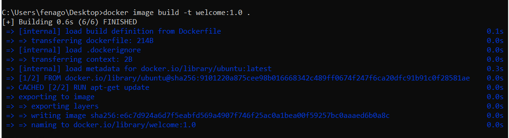
    

    Figure 2.3: Building the welcome:1.0 Docker image

3.  Build this image again without changing the `Dockerfile`
    content:

    
    ```
    docker image build -t welcome:2.0 .
    ```
    

    Note that this build process completed much quicker than the
    previous process due to the cache being used:

    
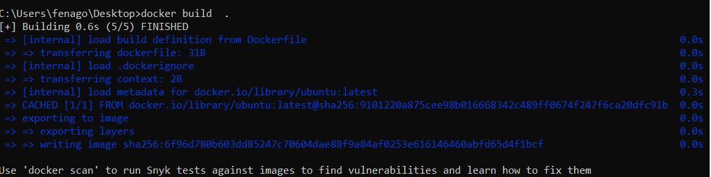
    

    Figure 2.4: Building the welcome:1.0 Docker image using the cache

4.  Use the `docker image list` command to list all the Docker
    images available on your computer:

    
    ```
    docker image list
    ```
    

    These images are available on your computer, either when you pull
    them from a Docker registry, or when you build on your computer:

    
    ```
    REPOSITORY   TAG      IMAGE ID        CREATED          SIZE
    welcome      1.0      98f571a42e5c    23 minutes ago   91.9MB
    welcome      2.0      98f571a42e5c    23 minutes ago   91.9MB
    ubuntu       latest   549b9b86cb8d    2 weeks ago      64.2MB
    ```
    

    As you can see from the preceding output, there are three Docker
    images available. The `ubuntu` image is pulled from the
    Docker Hub, and version (`tag`) `1.0` and
    `2.0` of the `welcome` images are built on your
    computer.

5.  Execute the `docker container run` command to start a new
    container from the Docker image that you built in `step 1`
    (`welcome:1.0`):

    
    ```
    docker container run welcome:1.0
    ```
    

    The output should be as follows:

    
    ```
    You are reading The Docker Workshop
    ```
    

    You receive the expected output of
    `You are reading The Docker Workshop`.
    `You are reading` is due to the parameter provided with
    the `ENTRYPOINT` directive, and
    `The Docker Workshop` comes from the parameter provided
    with the `CMD` directive.

6.  Finally, execute the `docker container run` command again,
    this time with command-line arguments:

    
    ```
    docker container run welcome:1.0 "Docker Beginner's Guide"
    ```
    

    You will get the output
    `You are reading Docker Beginner's Guide` because of the
    command-line argument, `Docker Beginner's Guide`, and the
    `You are reading` argument provided in the
    `ENTRYPOINT` directive:

    
    ```
    You are reading Docker Beginner's Guide
    ```
    

In this exercise, we learned how to build a custom Docker image using
the `Dockerfile` and run a Docker container from the image. In
the next section, we are going to learn other Docker directives that we
can use in the `Dockerfile`.


Exercise 2.03: Using ENV and ARG Directives in a Dockerfile
-----------------------------------------------------------

Your manager has asked you to create a `Dockerfile` that will
use ubuntu as the parent image, but you should be able to change the
ubuntu version at build time. You will also need to specify the
publisher\'s name and application directory as the environment variables
of the Docker image. You will use the `ENV` and
`ARG` directives in the `Dockerfile` to perform this
exercise:

1.  Create a new directory named `env-arg-exercise` using the
    `mkdir` command:
    
    ```
    mkdir env-arg-exercise
    ```
    

2.  Navigate to the newly created `env-arg-exercise` directory
    using the `cd` command:
    
    ```
    cd env-arg-exercise
    ```
    

3.  Within the `env-arg-exercise` directory, create a file
    named `Dockerfile`:
    
    ```
    touch Dockerfile
    ```
    

4.  Now, open the `Dockerfile` using your favorite text
    editor:
    
    ```
    vim Dockerfile
    ```
    

5.  Add the following content to the `Dockerfile`. Then, save
    and exit from the `Dockerfile`:

    
    ```
    # ENV and ARG example
    ARG TAG=latest
    FROM ubuntu:$TAG
    LABEL maintainer=sathsara@mydomain.com 
    ENV PUBLISHER=fenago APP_DIR=/usr/local/app/bin
    CMD ["env"]
    ```
    

    This `Dockerfile` first defined an argument named
    `TAG` with the default value of the latest. The next line
    is the `FROM` directive, which will use the ubuntu parent
    image with the `TAG` variable value sent with the
    `build` command (or the default value if no value is sent
    with the build command). Then, the `LABEL` directive sets
    the value for the maintainer. Next is the `ENV` directive,
    which defines the environment variable of `PUBLISHER` with
    the value `fenago`, and `APP_DIR` with the value
    of `/usr/local/app/bin`. Finally, use the `CMD`
    directive to execute the `env` command, which will print
    all the environment variables.

6.  Now, build the Docker image:

    
    ```
    docker image build -t env-arg --build-arg TAG=19.04 .
    ```
    

    Note the `env-arg --build-arg TAG=19.04` flag used to send
    the `TAG` argument to the build process. The output should
    be as follows:

    
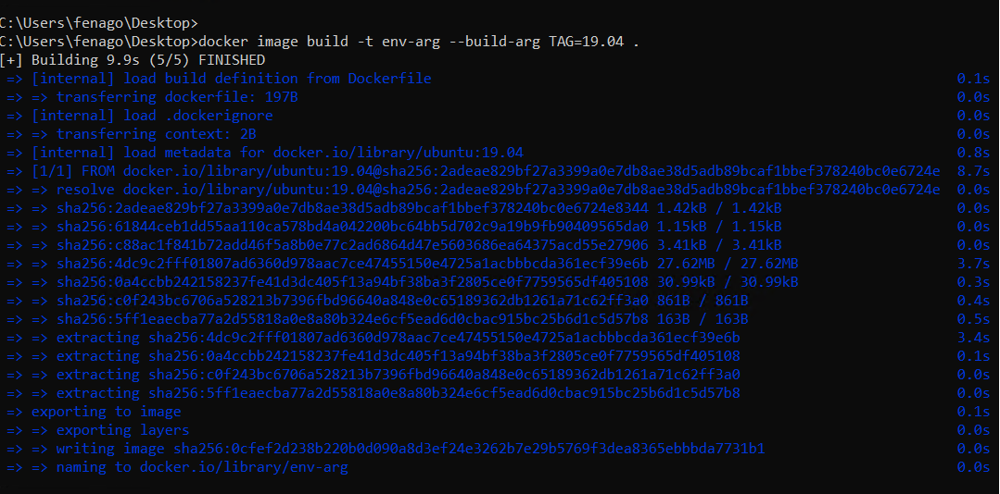
    

    Note that the `19.04` tag of the ubuntu image was used as
    the parent image. This is because you sent the
    `--build-arg flag` with the value of `TAG=19.04`
    during the build process.

7.  Now, execute the `docker container run` command to start a
    new container from the Docker image that you built in the last step:

    
    ```
    docker container run env-arg
    ```
    

    As we can see from the output, the `PUBLISHER` environment
    variable is available with the value of `fenago`, and the
    `APP_DIR` environment variable is available with the value
    of `/usr/local/app/bin`:

    
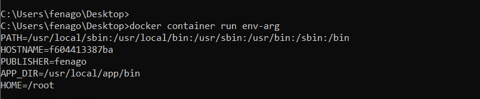
    

In this exercise, we defined environment variables for a Docker image
using the `ENV` directive. We also experienced how to use
`ARG` directives to pass values during the Docker image build
time. In the next section, we will be covering the `WORKDIR`
directive, which can be used to define the current working directory of
the Docker container.


Exercise 2.04: Using the WORKDIR, COPY, and ADD Directives in the Dockerfile
----------------------------------------------------------------------------

In this exercise, you will deploy your custom HTML file to the Apache
web server. You will use Ubuntu as the base image and install Apache on
top of it. Then, you will copy your custom index.html file to the Docker
image and download the Docker logo (from the https://www.docker.com
website) to be used with the custom index.html file:

1.  Create a new directory named `workdir-copy-add-exercise`
    using the `mkdir` command:
    
    ```
    mkdir workdir-copy-add-exercise
    ```
    

2.  Navigate to the newly created `workdir-copy-add-exercise`
    directory:
    
    ```
    cd workdir-copy-add-exercise
    ```
    

3.  Within the `workdir-copy-add-exercise` directory, create a
    file named `index.html`. This file will be copied to the
    Docker image during build time:
    
    ```
    touch index.html 
    ```
    

4.  Now, open `index.html` using your favorite text editor:
    
    ```
    vim index.html 
    ```
    

5.  Add the following content to the `index.html` file, save
    it, and exit from `index.html`:

    
    ```
    <html>
      <body>
        <h1>Welcome to The Docker Workshop</h1>
        
      </body>
    </html>
    ```
    

    This HTML file will output
    `Welcome to The Docker Workshop` as the header of the page
    and `logo.png` (which we will download during the Docker
    image build process) as an image. You have defined the size of the
    `logo.png` image as a height of `350` and a
    width of `500`.

6.  Within the `workdir-copy-add-exercise` directory, create a
    file named `Dockerfile`:
    
    ```
    touch Dockerfile
    ```
    

7.  Now, open the `Dockerfile` using your favorite text
    editor:
    
    ```
    vim Dockerfile
    ```
    

8.  Add the following content to the `Dockerfile`, save it,
    and exit from the `Dockerfile`:

    
```
# WORKDIR, COPY and ADD example
FROM ubuntu:latest 
WORKDIR /var/www/html/
COPY index.html .
ADD https://raw.githubusercontent.com/fenago/docker-course/master/md/logo.png ./logo.png
CMD ["ls"]
```
    
    This `Dockerfile` first defines the ubuntu image as the
    parent image. The next line is the `RUN` directive, which
    will execute `apt-get update` to update the package list,
    and `apt-get install apache2 -y` to install the Apache
    HTTP server. Then, you will set `/var/www/html/` as the
    working directory. Next, copy the `index.html` file that
    we created in *step 3* to the Docker image. Then, use the
    `ADD` directive to download the logo from
    <https://raw.githubusercontent.com/fenago/docker-course/master/md/logo.png>
    to the Docker image. The final step is to use the `ls`
    command to print the content of the `/var/www/html/`
    directory.

9.  Now, build the Docker image with the tag of
    `workdir-copy-add`:

    
    ```
    docker image build -t workdir-copy-add .
    ```
    

    You will observe that the image is successfully built and tagged as
    `latest` since we did not explicitly tag our image:

    
    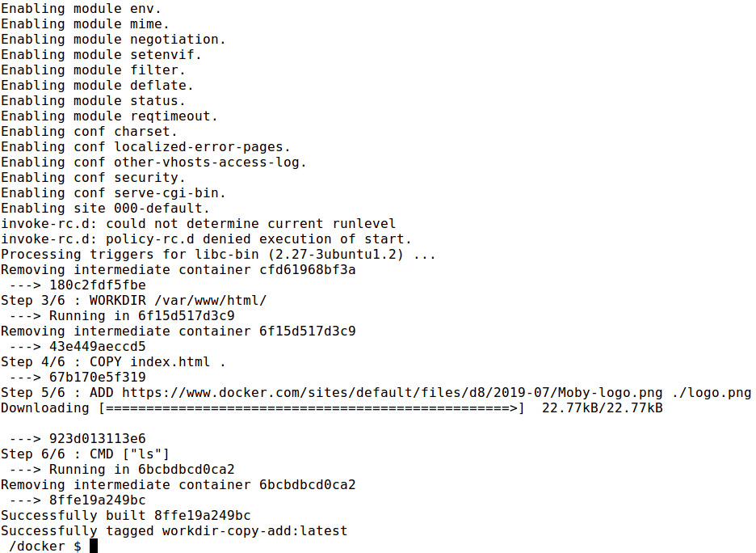
    

10. Execute the `docker container run` command to start a new
    container from the Docker image that you built in the previous step:

    
    ```
    docker container run workdir-copy-add
    ```
    

    As we can see from the output, both the `index.html` and
    `logo.png` files are available in the
    `/var/www/html/` directory:

    
    ```
    index.html
    logo.png
    ```
    

In this exercise, we observed how the `WORKDIR`,
`ADD`, and `COPY` directives work with Docker. In
the next section, we are going to discuss the `USER`
directive.


Now, let\'s try our hands at using the `USER` directive in the
next exercise.


Exercise 2.05: Using USER Directive in the Dockerfile
-----------------------------------------------------

Your manager has asked you to create a Docker image to run the Apache
web server. He has specifically requested that you use a non-root user
while running the Docker container due to security reasons. In this
exercise, you will use the `USER` directive in the
`Dockerfile` to set the default user. You will be installing
the Apache web server and changing the user to `www-data`.
Finally, you will execute the `whoami` command to verify the
current user by printing the username:

Note

The `www-data` user is the default user for the Apache web
server on Ubuntu.

1.  Create a new directory named `user-exercise` for this
    exercise:
    
    ```
    mkdir user-exercise
    ```
    

2.  Navigate to the newly created `user-exercise` directory:
    
    ```
    cd user-exercise
    ```
    

3.  Within the `user-exercise` directory, create a file named
    `Dockerfile`:
    
    ```
    touch Dockerfile
    ```
    

4.  Now, open the `Dockerfile` using your favorite text
    editor:
    
    ```
    vim Dockerfile
    ```
    

5.  Add the following content to the `Dockerfile`, save it,
    and exit from the `Dockerfile`:

    
    ```
    # USER example
    FROM ubuntu
    ARG DEBIAN_FRONTEND=noninteractive
    RUN apt-get update && apt-get install apache2 -y 
    USER www-data
    CMD ["whoami"]
    ```
    

    This `Dockerfile` first defines the Ubuntu image as the
    parent image. The next line is the `RUN` directive, which
    will execute `apt-get update` to update the package list,
    and `apt-get install apache2 -y` to install the Apache
    HTTP server. Next, you use the `USER` directive to change
    the current user to the `www-data` user. Finally, you have
    the `CMD` directive, which executes the `whoami`
    command, which will print the username of the current user.

6.  Build the Docker image:

    
    ```
    docker image build -t user .
    ```
    

    The output should be as follows:

    
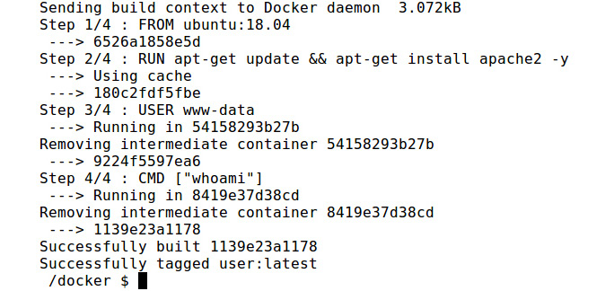
    

    Figure 2.8: Building the user Docker image

7.  Now, execute the `docker container` run command to start a
    new container from the Docker image that we built in the previous
    step:

    
    ```
    docker container run user
    ```
    

    As you can see from the following output, `www-data` is
    the current user associated with the Docker container:

    
    ```
    www-data
    ```
    

In this exercise, we implemented the `USER` directive in the
`Dockerfile` to set the `www-data` user as the
default user of the Docker image.


In the next exercise, we will learn how to use the `VOLUME`
directive in a `Dockerfile`.


Exercise 2.06: Using VOLUME Directive in the Dockerfile
-------------------------------------------------------

In this exercise, you will be setting a Docker container to run the
Apache web server. However, you do not want to lose the Apache log files
in case of a Docker container failure. As a solution, you have decided
to persist in the log files by mounting the Apache log path to the
underlying Docker host:

1.  Create a new directory named `volume-exercise`:
    
    ```
    mkdir volume-exercise
    ```
    

2.  Navigate to the newly created `volume-exercise` directory:
    
    ```
    cd volume-exercise
    ```
    

3.  Within the `volume-exercise` directory, create a file
    named `Dockerfile`:
    
    ```
    touch Dockerfile
    ```
    

4.  Now, open the `Dockerfile` using your favorite text
    editor:
    
    ```
    vim Dockerfile
    ```
    

5.  Add the following content to the `Dockerfile`, save it,
    and exit from the `Dockerfile`:

    
    ```
    # VOLUME example
    FROM ubuntu
    ARG DEBIAN_FRONTEND=noninteractive
    RUN apt-get update && apt-get install apache2 -y
    VOLUME ["/var/log/apache2"]
    ```
    

    This `Dockerfile` started by defining the Ubuntu image as
    the parent image. Next, you will execute the
    `apt-get update` command to update the package list, and
    the `apt-get install apache2 -y` command to install the
    Apache web server. Finally, use the `VOLUME` directive to
    set up a mount point to the `/var/log/apache2` directory.

6.  Now, build the Docker image:

    
    ```
    docker image build -t volume .
    ```
    

    The output should be as follows:

    
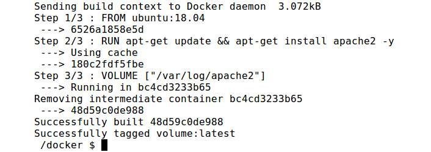
    

7.  Execute the docker container run command to start a new container
    from the Docker image that you built in the previous step. Note that
    you are using the `--interactive` and `--tty`
    flags to open an interactive bash session so that you can execute
    commands from the bash shell of the Docker container. You have also
    used the `--name` flag to define the container name as
    `volume-container`:

    
    ```
    docker container run --interactive --tty --name volume-container volume /bin/bash
    ```
    

    Your bash shell will be opened as follows:

    
    ```
    root@bc61d46de960: /#
    ```
    

8.  From the Docker container command line, change directory to the
    `/var/log/apache2/` directory:

    
    ```
    # cd /var/log/apache2/
    ```
    

    This will produce the following output:

    
    ```
    root@bc61d46de960: /var/log/apache2#
    ```
    

9.  Now, list the available files in the directory:

    
    ```
    # ls -l
    ```
    

    The output should be as follows:

    
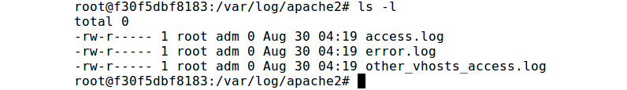


    These are the log files created by Apache while running the process.
    The same files should be available once you check the host mount of
    this volume.

10. Now, exit the container to check the host filesystem:
    
    ```
    # exit
    ```
    

11. Inspect `volume-container` to view the mount information:

    
    ```
    docker container inspect volume-container
    ```
    

    Under the \"`Mounts`\" key, you can see the information
    relating to the mount:

    
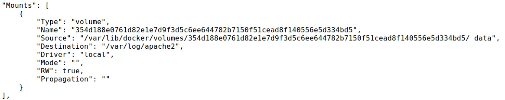
    

    Figure 2.11: Inspecting the Docker container

12. Inspect the volume with the
    `docker volume inspect <volume_name>` command.
    `<volume_name>` can be identified by the `Name`
    field of the preceding output:

    
    ```
    docker volume inspect UPDATE_ME
    ```
    

    You should get the output similar to the following:

    
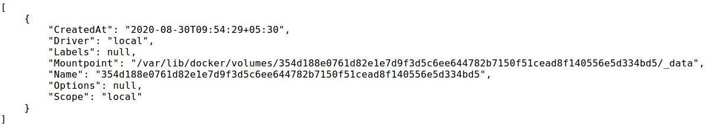
    


    

In this exercise, we observed how to mount the log path of the Apache
web server to the host filesystem using the `VOLUME`
directive. In the next section, we will learn about the
`EXPOSE` directive.


Exercise 2.07: Using EXPOSE and HEALTHCHECK Directives in the Dockerfile
------------------------------------------------------------------------

Your manager has asked you to dockerize the Apache web server to access
the Apache home page from the web browser. Additionally, he has asked
you to configure health checks to determine the health status of the
Apache web server. In this exercise, you will use the `EXPOSE`
and `HEALTHCHECK` directives to achieve this goal:

1.  Create a new directory named `expose-healthcheck`:
    
    ```
    mkdir expose-healthcheck
    ```
    

2.  Navigate to the newly created `expose-healthcheck`
    directory:
    
    ```
    cd expose-healthcheck
    ```
    

3.  Within the `expose-healthcheck` directory, create a file
    named `Dockerfile`:
    
    ```
    touch Dockerfile
    ```
    

4.  Now, open the `Dockerfile` using your favorite text
    editor:
    
    ```
    vim Dockerfile
    ```
    

5.  Add the following content to the `Dockerfile`, save it,
    and exit from the `Dockerfile`:

    
    ```
    # EXPOSE & HEALTHCHECK example
    FROM ubuntu
    ARG DEBIAN_FRONTEND=noninteractive
    RUN apt-get update && apt-get install apache2 curl -y 
    HEALTHCHECK CMD curl -f http://localhost/ || exit 1
    EXPOSE 80
    ENTRYPOINT ["apache2ctl", "-D", "FOREGROUND"]
    ```
    

    This `Dockerfile` first defines the ubuntu image as the
    parent image. Next, we execute the `apt-get update`
    command to update the package list, and the
    `apt-get install apache2 curl -y` command to install the
    Apache web server and curl tool. `Curl` is required to
    execute the `HEALTHCHECK` command. Next, we define the
    `HEALTHCHECK` directive with curl to the
    `http://localhost/` endpoint. Then, we exposed port
    `80` of the Apache web server so that we can access the
    home page from our web browser. Finally, we start the Apache web
    server with the `ENTRYPOINT` directive.

6.  Now, build the Docker image:

    
    ```
    docker image build -t expose-healthcheck.
    ```
    

    You should get the following output:

    
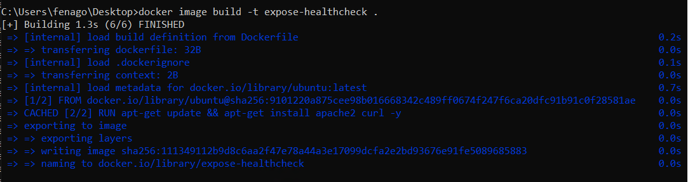
    

7.  Execute the docker container run command to start a new container
    from the Docker image that you built in the previous step. Note that
    you are using the `-p` flag to redirect port
    `80` of the host to port `80` of the container.
    Additionally, you have used the `--name` flag to specify
    the container name as `expose-healthcheck-container`, and
    the `-d` flag to run the container in detached mode (this
    runs the container in the background):
    
    ```
    docker container run -p 80:80 --name expose-healthcheck-container -d expose-healthcheck
    ```
    

8.  List the running containers with the
    `docker container list` command:

    
    ```
    docker container list
    ```
    

    In the following output, you can see that the `STATUS` of
    the `expose-healthcheck-container` is healthy:

    
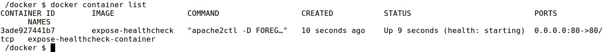
    

9.  Now, you should be able to view the Apache home page. Go to the
    `http://127.0.0.1` endpoint from your favorite web
    browser:

    
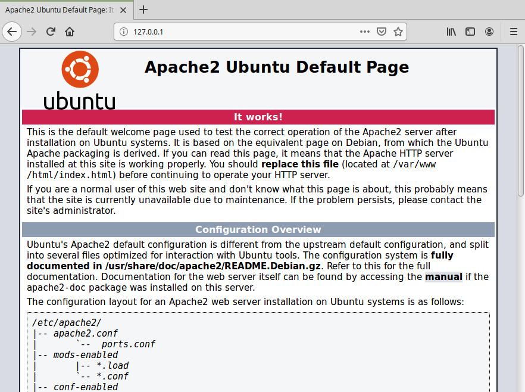
    

    Figure 2.16: Apache home page

10. Now, clean up the container. First, stop the Docker container by
    using the `docker container stop` command:
    
    ```
    docker container stop expose-healthcheck-container
    ```
    

11. Finally, remove the Docker container with the
    `docker container rm` command:
    
    ```
    docker container rm expose-healthcheck-container
    ```
    

In this exercise, you utilized the `EXPOSE` directive to
expose an Apache web server as a Docker container and used the
`HEALTHCHECK` directive to define a health check to verify the
healthy status of the Docker container.

In the next section, we will learn about the `ONBUILD`
directive.


In the next exercise, we will be using the `ONBUILD` directive.


Exercise 2.08: Using ONBUILD Directive in the Dockerfile
--------------------------------------------------------

You have been asked by your manager to create a Docker image that is
capable of running any HTML files provided by the software development
team. In this exercise, you will build a parent image with the Apache
web server and use the `ONBUILD` directive to copy the HTML
files. The software development team can use this Docker image as the
parent image to deploy and test any HTML files created by them:

1.  Create a new directory named `onbuild-parent`:
    
    ```
    mkdir onbuild-parent
    ```
    

2.  Navigate to the newly created `onbuild-parent` directory:
    
    ```
    cd onbuild-parent
    ```
    

3.  Within the `onbuild-parent` directory, create a file named
    `Dockerfile`:
    
    ```
    touch Dockerfile
    ```
    

4.  Now, open the `Dockerfile` using your favorite text
    editor:
    
    ```
    vim Dockerfile
    ```
    

5.  Add the following content to the `Dockerfile`, save it,
    and exit from the `Dockerfile`:

    
    ```
    # ONBUILD example
    FROM ubuntu
    ARG DEBIAN_FRONTEND=noninteractive
    RUN apt-get update && apt-get install apache2 -y 
    ONBUILD COPY *.html /var/www/html
    EXPOSE 80
    ENTRYPOINT ["apache2ctl", "-D", "FOREGROUND"]
    ```
    

    This `Dockerfile` first defines the ubuntu image as the
    parent image. It then executes the `apt-get update`
    command to update the package list, and the
    `apt-get install apache2 -y` command to install the Apache
    web server. The `ONBUILD` directive is used to provide a
    trigger to copy all HTML files to the `/var/www/html`
    directory. The `EXPOSE` directive is used to expose port
    `80` of the container and `ENTRYPOINT` to start
    the Apache web server using the `apache2ctl` command.

6.  Now, build the Docker image:

    
    ```
    docker image build -t onbuild-parent .
    ```


7.  Execute the `docker container run` command to start a new
    container from the Docker image built in the previous step:

    
    ```
    docker container run -p 80:80 --name onbuild-parent-container -d onbuild-parent
    ```
    

    In the preceding command, you have started the Docker container in
    detached mode while exposing port `80` of the container.

8.  Now, you should be able to view the Apache home page. Go to the
    `http://127.0.0.1` endpoint from your favorite web
    browser. Note that the default Apache home page is visible:

    

    

9.  Now, clean up the container. Stop the Docker container by using the
    `docker container stop` command:
    
    ```
    docker container stop onbuild-parent-container
    ```
    

10. Remove the Docker container with the `docker container rm`
    command:
    
    ```
    docker container rm onbuild-parent-container
    ```
    


Now, let\'s test our knowledge that we have acquired in this lab by
dockerizing the given PHP application using the Apache web server in the
following activity.


Activity 2.01: Running a PHP Application on a Docker Container
--------------------------------------------------------------

Imagine that you want to deploy a PHP welcome page that will greet
visitors based on the date and time using the following logic. Your task
is to dockerize the PHP application given here, using the Apache web
server installed on an Ubuntu base image:


```
<?php
$hourOfDay = date('H');
if($hourOfDay < 12) {
    $message = "Good Morning";
} elseif($hourOfDay > 11 && $hourOfDay < 18) {
    $message = "Good Afternoon";
} elseif($hourOfDay > 17){
    $message = "Good Evening";
}
echo $message;
?>
```


This is a simple PHP file that will greet the user based on the
following logic:


Execute the following steps to complete this activity:

1.  Create a folder to store the activity files.

2.  Create a `index.php` file with the code provided
    previously.

3.  Create a `Dockerfile` and set up the application with PHP
    and Apache2 on an Ubuntu base image.

4.  Build and run the Docker image.

5.  Once completed, stop and remove the Docker container.


**Activity 2.01 Solution**

Activity solution is present in `docker-course\lab02\Activity2.01` folder.

```
docker image build -t activity:2.01 .

docker container run -p 80:80 --name activity2.01 -d activity:2.01
```

**Output**:

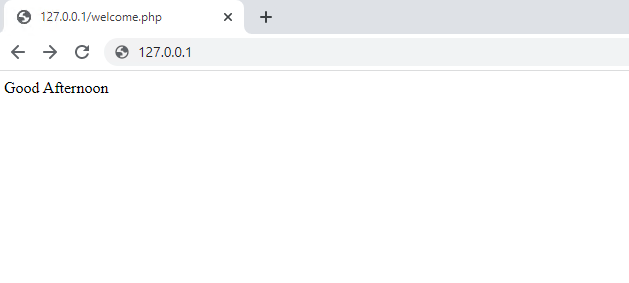


You can stop and delete the container by running following commands:

```
docker container stop activity2.01

docker container rm activity2.01
```

Summary
=======


In this lab, we discussed how we can use a `Dockerfile` to
create our own custom Docker images. First, we discussed what is a
`Dockerfile` and the syntax of a `Dockerfile`. We
then discussed some common Docker directives, including the
`FROM`, `LABEL`, `RUN`, `CMD`,
and `ENTRYPOINT` directives. Then, we created our first
`Dockerfile` with the common directives that we learned.

In the next section, we focused on building Docker images. We discussed
multiple areas in depth regarding Docker images, including the layered
filesystem of Docker images, the context in Docker builds, and the use
of the cache during the Docker build process. Then, we discussed more
advanced `Dockerfile` directives, including the
`ENV`, `ARG`, `WORKDIR`, `COPY`,
`ADD`, `USER`, `VOLUME`,
`EXPOSE`, `HEALTHCHECK`, and `ONBUILD`
directives.
