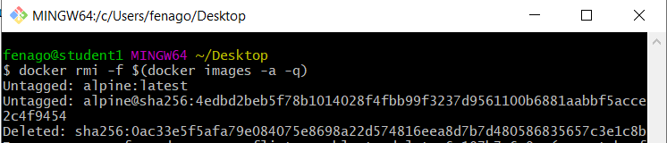

Lab 3: Managing Your Docker Images
==================================

**Overview**

In this lab, we will look into Docker layers and analyze how caching
can help to speed up an image build. We will also deep dive into Docker
images and set up Docker registries to increase the reusability of the
images.


The next exercise will give you hands-on experience on how to work with Docker image layers.


Exercise 3.01: Working with Docker Image Layers
-----------------------------------------------

In this exercise, you will work with some basic `Dockerfiles`
to see how Docker uses layers to build images. You will start by
creating a `Dockerfile` and building a new image. You will
then rebuild the image to see the advantage of using caching and how the
build time is reduced due to its use:

1.  Create a new file called `Dockerfile` with your favorite
    text editor and add in the following details:
    
    ```
    FROM alpine
    RUN apk update
    RUN apk add wget
    ```
    

2.  Save the `Dockerfile` and then, from the command line,
    make sure you are in the same directory as the
    `Dockerfile` you have created. Use the
    `docker build` command to create the new image using the
    `–t` option to name it `basic-app`:

    
    ```
    docker build -t basic-app .
    ```
    

3.  Use the `docker history` command along with the image name
    of `basic-app` to see the different layers of the image:

    
    ```
    docker history basic-app
    ```
    

    The history gives you creation details, including the size of each
    layer:

    
    ```
    IMAGE         CREATED            CREATED BY 
                          SIZE
    a6d7e99283d9  About a minute ago /bin/sh -c apk add wget
                          476kB
    bcecd2429ac0  About a minute ago /bin/sh -c apk update
                          1.4MB
    961769676411  5 weeks ago        /bin/sh -c #(nop)
    CMD ["/bin/sh"]       0B
    <missing>     5 weeks ago        /bin/sh -c #(nop) 
    ADD file:fe6407fb…    5.6MB
    ```
    

    Note

    The `docker history` command shows the layer of the
    original image used as part of the `Dockerfile`
    `FROM` command as `<missing>`. It is showing as
    `missing` in our output as it was created on a different
    system and then pulled onto your system.

4.  Run the build again without making any changes:

    
    ```
    docker build -t basic-app .
    ```
    

    This will show you the build is done using the layers stored in the
    Docker image cache, thereby speeding up our build. Although this is
    only a small image, a much larger image would show a significant
    increase:

    
    ```
    Sending build context to Docker daemon  4.096kB
    Step 1/3 : FROM alpine
      ---> 961769676411
    Step 2/3 : RUN apk update
      ---> Using cache
      ---> bcecd2429ac0
    Step 3/3 : RUN apk add wget
      ---> Using cache
      ---> a6d7e99283d9
    Successfully built a6d7e99283d9
    Successfully tagged basic-app:latest
    ```
    

5.  Say you forgot to install the `curl` package as part of
    your image creation. Add the following line to the
    `Dockerfile` from *Step 1*:
    
    ```
    FROM alpine
    RUN apk update
    RUN apk add wget curl
    ```
    

6.  Build the image again, and you\'ll now see the image created with a
    mix of cached layers and new layers that need to be created:

    
    ```
    docker build -t basic-app .
    ```
    

7.  Run the `docker images` command again:

    
    ```
    docker images
    ```
    

    You will now notice the image named and tagged as `<none>`
    to show we have now created a dangling image:

    
    ```
    REPOSITORY   TAG      IMAGE ID        CREATED           SIZE
    basic-app    latest   c7918f4f95b9    25 seconds ago    8.8MB
    <none>       <none>   0e86ae52098d    2 minutes ago     7.48MB
    Alpine       latest   961769676411    5 weeks ago       5.58MB
    ```
    

    Note

    Dangling images, represented by `<none>` in our image
    list, are caused when a layer has no relationship to any image on
    our system. These dangling images no longer serve a purpose and will
    consume disk space on your system. Our example dangling image is
    only 7.48 MB, which is small, but this could add up over time.

8.  Run the `docker image inspect` command using the image ID
    to see the location of where the dangling images are located on our
    system:

    
    ```
    docker image inspect UPDATE_ME
    ```
    

    The following output has been reduced from the actual output to only
    show the directories of the image:

    
    ```
    ... 
      "Data": {
        "LowerDir": "/var/lib/docker/overlay2/
          41230f31bb6e89b6c3d619cafc309ff3d4ca169f9576fb003cd60fd4ff
          4c2f1f/diff:/var/lib/docker/overlay2/
          b8b90262d0a039db8d63c003d96347efcfcf57117081730b17585e163f
          04518a/diff",
        "MergedDir": "/var/lib/docker/overlay2/
          c7ea9cb56c5bf515a1b329ca9fcb2614f4b7f1caff30624e9f6a219049
          32f585/
          merged",
        "UpperDir": "/var/lib/docker/overlay2/
          c7ea9cb56c5bf515a1b329ca9fcb2614f4b7f1caff30624e9f6a21904
          932f585/diff",
        "WorkDir": "/var/lib/docker/overlay2/
          c7ea9cb56c5bf515a1b329ca9fcb2614f4b7f1caff30624e9f6a21904
          932f585/work"
      },
    ...
    ```
    

    All of our images are located in the same location as the dangling
    image. As they are sharing the same directory, any dangling images
    would waste space on our system.


9. Run the `docker images` command again using the `-a` option:

    
    ```
    docker images -a
    ```
    

    It will also show the intermediate layers used when our image is
    being built:

    
    ```
    REPOSITORY   TAG      IMAGE ID      CREATED          SIZE
    basic-app    latest   c7918f4f95b9  25 seconds ago   8.8MB
    <none>       <none>   0e86ae52098d  2 minutes ago    7.48MB
    <none>       <none>   112a4b041305  11 minutes ago   7MB
    Alpine       latest   961769676411  5 weeks ago      5.58MB
    ```
    

10. Run the `docker image prune` command to remove all the
    dangling images. You could remove all the dangling images one at a
    time using the `docker rmi` command using the image ID,
    but the `docker image prune` command is an easier way to
    do that:

    
    ```
    docker image prune
    ```
    

    You should get output like the following:

    
    ```
    WARNING! This will remove all dangling images.
    Are you sure you want to continue? [y/N] y
    Deleted Images:
    deleted: sha256:0dae3460f751d16f41954e0672b0c41295d46ee99d71
             d63e7c0c8521bd9e6493
    deleted: sha256:d74fa92b37b74820ccccea601de61d45ccb3770255b9
             c7dd22edf16caabafc1c
    Total reclaimed space: 476.4kB
    ```
    

11. Run the `docker images` command again:

    
    ```
    docker images
    ```
    

    You will see we no longer have the dangling image in our list of
    images:

    
    ```
    REPOSITORY   TAG      IMAGE ID        CREATED           SIZE
    basic-app    latest   c7918f4f95b9    25 seconds ago    8.8MB
    Alpine       latest   961769676411    5 weeks ago       5.58MB
    ```
    

For our next exercise, we will look further at our layers and caching to
see how they can be used to speed up the image build process.


Exercise 3.02: Increasing Build Speed and Reducing Layers
---------------------------------------------------------

You have been working with smaller builds so far. However, as your
applications increase in size and functionality, you\'ll start to
consider both the size and number of layers of the Docker images you\'re
creating and the speed at which you\'re creating them. The goal of this
exercise is to speed up the build times and reduce the size of your
images, as well as use the `--cache-from` option when building
your Docker images:

1.  Create a new `Dockerfile` to demonstrate the change you
    are going to make, but first, clear up all the images on your
    system. Run the `docker rmi` command with the
    `-f` option to force any removals needed, and the command
    in brackets will provide a list of all image IDs on your system. Use
    the `-a` option to show all running and stopped containers
    and the `-q` option to only show the container image hash
    value and nothing else:

    
    ```
    docker rmi -f $(docker images -a -q)
    ```
    

    The command should return output like the following:

    
    ```
    Untagged: hello-world:latest
    ...
    deleted: sha256:d74fa92b37b74820ccccea601de61d45ccb3770255
             b9c7dd22edf16caabafc1c
    ```
    

    It can be observed that the `hello-world: latest` image is
    untagged and the image with ID
    `sha256:d74fa92b37b74820ccccea601 de61d45ccb3770255b9c7dd22edf16caabafc1c`
    is removed.


2.  Add the following code to your `Dockerfile` (which you
    created in *Exercise 3.01*). It will simulate a simple web server,
    as well as print the output of our `Dockerfile` during the
    build process:

    
    ```
    FROM alpine

    RUN apk update
    RUN apk add wget curl

    RUN wget -O test.txt https://github.com/fenago/docker-course/blob/master/lab03/Exercise3.02/100MB.bin

    CMD mkdir /var/www/
    CMD mkdir /var/www/html/

    WORKDIR /var/www/html/

    COPY Dockerfile.tar.gz /tmp/
    RUN tar -zxvf /tmp/Dockerfile.tar.gz -C /var/www/html/
    RUN rm /tmp/Dockerfile.tar.gz

    RUN cat Dockerfile
    ```
    

    You\'ll notice *line 6* of the `Dockerfile` is doing a
    fairly menial task (downloading a 100 MB file, named
    `100MB.bin`), which would not normally be performed in a
    `Dockerfile`. We have added it in to represent a build
    task or something similar that may be added during your build
    process, for example, downloading content or building software from
    a file.

3.  Download your base image using the `docker pull` command
    so that you can start with the same image for each test we do:
    
    ```
    docker pull alpine
    ```
    

4.  Create a TAR file to be added to our image as we have instructed in
    *line 13* of our `Dockerfile`:
    
    ```
    tar zcvf Dockerfile.tar.gz Dockerfile
    ```
    

5.  Build a new image using the same name as `basic-app.` You
    will use the `time` command at the start of the code to
    allow us to gauge the time it takes to build our image:

    
    ```
    time docker build -t basic-app .
    ```
    

    The output will return the time taken to build the image:

    
    ```
    ...
    real 4m36.810s
    user 0m0.354s
    sys 0m0.286s
    ```
    

6.  Run the `docker history` command over the new
    `basic-app` image:

    
    ```
    docker history basic-app
    ```
    

    We have a few extra commands in our `Dockerfile` compared
    to the previous exercise. So, there should be no surprise that we
    will see 12 layers in our new image:

    
    ```
    IMAGE         CREATED      CREATED BY                           SIZE
    5b2e3b253899 2 minutes ago /bin/sh -c cat Dockerfile            0B
    c4895671a177 2 minutes ago /bin/sh -c rm /tmp/Dockerfile.tar.gz 0B
    aaf18a11ba25 2 minutes ago /bin/sh -c tar -zxvf /tmp/Dockfil…   283B
    507161de132c 2 minutes ago /bin/sh -c #(nop) COPY file:e39f2a0… 283B
    856689ad2bb6 2 minutes ago /bin/sh -c #(nop) WORKDIR /var/…     0B
    206675d145d4 2 minutes ago /bin/sh -c #(nop)  CMD ["/bin/sh"…   0B
    c947946a36b2 2 minutes ago /bin/sh -c #(nop)  CMD ["/bin/sh"…   0B
    32b0abdaa0a9 2 minutes ago /bin/sh -c curl https://github.com…  105MB
    e261358addb2 2 minutes ago /bin/sh -c apk add wget curl         1.8MB
    b6f77a768f90 2 minutes ago /bin/sh -c apk update                1.4MB
    961769676411 6 weeks ago   /bin/sh -c #(nop)  CMD ["/bin/sh"]   0B
    <missing>    6 weeks ago   /bin/sh -c #(nop) ADD file:fe3dc…    5.6MB
    ```
    

    We can see that the `RUN`, `COPY`, and
    `ADD` commands in our `Dockerfile` are creating
    layers of a particular size relevant to the commands being run or
    files being added, and all the other commands in the
    `Dockerfile` are of size 0 B.

7.  Reduce the number of layers in the image by combining the
    `RUN` commands in *lines 3 and 4* and combining the
    `CMD` commands in *lines 8 and 9* of the
    `Dockerfile` created in *step 1* of this exercise. With
    these changes, our `Dockerfile` should now look like the
    following:

    
    ```
    FROM alpine

    RUN apk update && apk add wget curl

    RUN wget -O test.txt https://github.com/fenago/docker-course/blob/master/lab03/Exercise3.02/100MB.bin
    
    CMD mkdir -p /var/www/html/

    WORKDIR /var/www/html/
    
    COPY Dockerfile.tar.gz /tmp/
    RUN tar -zxvf /tmp/Dockerfile.tar.gz -C /var/www/html/
    RUN rm /tmp/Dockerfile.tar.gz

    RUN cat Dockerfile
    ```
    

    Running `docker build` again will reduce the number of
    layers for our new image from 12 to 9 layers, as even though there
    is the same number of commands being run, they are chained together
    in *lines 3* and *7*.

8.  *Lines 11*, *12*, and *13* of our `Dockerfile` are using
    the `COPY` and `RUN` commands to
    `copy` and `unzip` our archived file, and then
    remove the original unzipped file. Replace these lines with the
    `ADD` command without needing to run the lines that unzip
    and remove the `.tar` file:
    
    ```
    FROM alpine
    
    RUN apk update && apk add wget curl
    
    RUN wget -O test.txt https://github.com/fenago/docker-course/blob/master/lab03/Exercise3.02/100MB.bin
     
    CMD mkdir -p /var/www/html/
    
    WORKDIR /var/www/html/
    
    ADD Dockerfile.tar.gz /var/www/html/
    RUN cat Dockerfile
    ```
    

9.  Build the image again to reduce the number of layers in your new
    image from 9 to 8. If you have been watching the builds run, you
    will probably notice a lot of the time the build run as part of
    *lines 3* and *5* of our `Dockerfile`, where we run
    `apk update`, then install `wget` and
    `curl`, and then grab content from a website. Doing this
    once or twice will not be an issue, but if we create our base image,
    which the `Dockerfile` can then run on, you will be able
    to remove these lines completely from your `Dockerfile`.

10. Move into a new directory and create a new `Dockerfile`
    that will only pull the base image and run the `apk`
    commands, as listed here:
    
    ```
    FROM alpine
    
    RUN apk update && apk add wget curl
    
    RUN wget -O test.txt https://github.com/fenago/docker-course/blob/master/lab03/Exercise3.02/100MB.bin
    ```
    

11. Build the new base image from the preceding `Dockerfile`
    and name it `basic-base`:
    
    ```
    docker build -t basic-base .
    ```
    

12. Remove *line 3* from the original `Dockerfile` as it will
    no longer be needed. Move into the project directory and update the
    image that is being used in the `FROM` command to
    `basic-base` and remove the `apk` commands in
    *line 3*. Our `Dockerfile` should now look like the
    following code:
    
    ```
    FROM basic-base
    
    CMD mkdir -p /var/www/html/
    
    WORKDIR /var/www/html/
    
    ADD Dockerfile.tar.gz /var/www/html/
    RUN cat Dockerfile
    ```
    

13. Run the build again for our new `Dockerfile`. Using the
    `time` command again with our build, we now see the build
    complete in just over 1 second:

    
    ```
    time docker build -t basic-app .
    ```
    

    If you\'ve been watching the build, you\'ll notice that compared to
    our previous builds, it runs a lot quicker:

    
    ```
    ...
    real 0m1.810s
    user 0m0.117s
    sys  0m0.070s
    ```

14. There is a different way we can use the `basic-base` image
    we used earlier. Use the `docker build` command with the
    `–cache-from` option to specify the cache layers that will
    be used when the image is built. Set out the `FROM`
    command to still use the `alpine` image and use the
    `–cache-from` option that follows to make sure the layers
    used to build `basic-base` are being used for our current
    image:

    
    ```
    docker build --cache-from basic-base -t basic-app .
    ```
    

    We still have some more tasks before we complete this exercise. In
    the following steps, we will look at committing changes to our image
    to see how it affects our layers. This is not something we would use
    often but there are times when we need to copy production data over
    to a development or test environment, and one way to do this is by
    using a Docker image with the `commit` command, which will
    make changes to the top writable layer of our running container.

15. Run `basic-app` in interactive shell mode to create some
    production data. To do this, run the following
    `docker run` command with the `-it` option to
    run in interactive mode and use the `sh` shell to access
    the running container:
    
    ```
    docker run -it basic-app sh
    /var/www/html #
    ```
    

16. Use the vi text editor to create a new text file called
    `prod_test_data.txt`:
    
    ```
    vi prod_test_data.txt
    ```
    

17. Add the following line of text as some test data. The data in the
    text is not important; it is just a sample to show we can then copy
    these changes to another image:

18. This is a sample production piece of data. Exit out of the running
    container and then check the container ID using the
    `docker ps` command with the `-a` option:

    
    ```
    docker ps -a
    ```
    

    You will get output like the following:

    
    ```
    CONTAINER ID    IMAGE        COMMAND    CREATED
    ede3d51bba9e    basic-app    "sh"       4 minutes ago
    ```
    

19. Run the `docker commit` command with the container ID to
    create a new image that will include all those changes. Make sure to
    add the name of the new image. In this example, use
    `basic-app-test`:

    
    ```
    docker commit ede3d51bba9e basic-app-test
    ```
    

    You will get output like the following:

    
    ```
    sha256:0717c29d29f877a7dafd6cb0555ff6131179b457
           e8b8c25d9d13c2a08aa1e3f4
    ```
    

20. Run the `docker history` command on the newly created
    image:

    
    ```
    docker history basic-app-test
    ```
    

    This should now show us an extra layer where we added the sample
    production data, showing in our output as 72B in size:

    
    ```
    IMAGE        CREATED       CREATED BY                         SIZE
    0717c29d29f8 2 minutes ago sh                                 72B
    302e01f9ba6a 2 minutes ago /bin/sh -c cat Dockerfile          0B
    10b405ceda34 2 minutes ago /bin/sh -c #(nop) ADD file:e39f…   283B
    397f533f4019 2 minutes ago /bin/sh -c #(nop) WORKDIR /var/…   0B
    c8782986b276 2 minutes ago /bin/sh -c #(nop)  CMD ["/bin/sh"… 0B
    6dee05f36f95 2 minutes ago /bin/sh -c apk update && apk ad    3.2MB
    961769676411 6 weeks ago   /bin/sh -c #(nop)  CMD ["/bin/sh"] 0B
    <missing>    6 weeks ago   /bin/sh -c #(nop) ADD file:fe3dc…  5.6MB
    ```
    

21. Now, run the newly created `basic-app-test` image and
    `cat`, the new file we added:

    
    ```
    docker run basic-app-test cat prod_test_data.txt
    ```
    

    This should show us the output we added, showing we can reuse
    existing images if needed:

    
    ```
    This is a sample production piece of data
    ```

This exercise demonstrated how the build cache and image layers work to
improve the build time. We have started all our builds so far using an
image we have pulled down from Docker Hub, but there are options to
start with an image you have created yourself if you wish to control
things even further. The next section will help you to create your base
Docker images.


Creating Base Docker Images
===========================


Creating your base Docker image is actually straightforward. Just as we
used the `docker commit` command previously to create an image
from a running container, we can also create an image from a system or
server we have originally been running our applications on. We need to
remember that creating a base image still needs to remain small and
lightweight. It is not simply a matter of moving existing applications
running on existing servers over to Docker.

We could use the system we are specifically working on, but if you are
using a production server, the image could actually be pretty big. If
you have a small virtual machine you would think is perfect for a base
image, you could use the following steps to create a base image from it.
Similar to the `docker commit` command, this can be used for
any system you can access.


Exercise 3.03: Docker cp Command
---------------------------------

The following exercise will use the `basic-app` image we are
currently running and show how easy it is to create a base image. These
same steps would be used for larger, more complex environments as well:

1.  Execute the `docker run` command to run the container and
    log in at the same time:
    
    ```
    docker run -it basic-app sh
    ```
    

2.  Run the `tar` command on the running container to create a
    backup of the system. To limit the information you have in the new
    image, exclude the `.proc`, `.tmp`,
    `.mnt`, `.dev`, and `.sys`
    directories, and create everything under the
    `basebackup.tar.gz` file:
    
    ```
    tar -czf *
    ```
    

3.  To ensure that you have data in your `basebackup.tar.gz`
    file, run the `du` command to make sure it is of
    substantial size:

    
    ```
    du -sh basebackup.tar.gz 
    ```
    

    The output returns the size of the `basebackup.tar.gz`
    file:

    
    ```
    4.8M   basebackup.tar.gz
    ```
    

4.  Run the `docker ps` command to find the container ID that
    is currently holding your new backup file, the `.tar`
    file:

    
    ```
    docker ps
    ```
    

    The command will return the container ID of the image:

    
    ```
    CONTAINER ID        IMAGE        COMMAND      CREATED
    6da7a8c1371a        basic-app    "sh"         About a minute ago
    ```
    

5.  Copy the `.tar` file onto your development system with the
    `docker cp` command, using the container ID of our running
    container and the location and file you want to copy. The following
    command will do this with your container ID and move it into your
    `/tmp` directory:
    
    ```
    docker cp UPDATE_ME:/var/www/html/basebackup.tar.gz D:\\
    ```
    


Exercise 3.05: Tagging Docker Images
------------------------------------

In the following exercise, you will work with a different image, using
the lightweight `busybox` image to demonstrate the process of
tagging and start to implement tags in your project. BusyBox is used to
combine tiny versions of many common UNIX utilities into a single small
executable:

1.  Run the `docker rmi` command to clear up the images you
    currently have on your system, so you don\'t get confused with a
    large number of images around:
    
    ```
    docker rmi -f $(docker images -a -q)
    ```

**Note:** Above command should be run in `git bash` only. It will not work in cmd/powershell



2.  On the command line, run the `docker pull` command to
    download the latest `busybox` container:
    
    ```
    docker pull busybox
    ```
    

3.  Run the `docker images` command:

    
    ```
    docker images
    ```
    

    This will give us the information we need to start putting some tag
    commands together:

    
    ```
    REPOSITORY    TAG       IMAGE ID        CREATED      SIZE
    Busybox       latest    19485c79a9bb    2 weeks ago  1.22MB
    ```
    

4.  Name and tag the image using the `tag` command. You can
    either use the image ID or repository name to tag the images. Start
    by using the image ID, but note that on your system you\'ll have a
    different image ID. Name the repository `new_busybox` and
    include the tag `ver_1`:
    
    ```
    docker tag UPDATE_ME new_busybox:ver_1
    ```
    

5.  Use the repository name and image tag. Create a new repository using
    your name and tag with a new version of `ver_1.1` as
    follows:

    
    ```
    docker tag new_busybox:ver_1 vince/busybox:ver_1.1
    ```
    

    Note

    We have used the author\'s name (`vince`) in this example.

6.  Run the `docker images` command:

    
    ```
    docker images
    ```
    

    You should see a similar output to the one that follows. Of course,
    your image IDs will be different, but the repository names and tags
    should be similar:

    
    ```
    REPOSITORY     TAG      ID             CREATED        SIZE
    Busybox        latest   19485c79a9bb   2 weeks ago    1.22MB
    new_busybox    ver_1    19485c79a9bb   2 weeks ago    1.22MB
    vince/busybox  ver_1.1  19485c79a9bb   2 weeks ago    1.22MB
    ```
    

7.  Create a basic image using a `Dockerfile` and the
    `-t` option of the `docker build` command to
    name and tag the image. You\'ve done this a few times already in
    this lab, so from the command line, run the following command to
    create a basic `Dockerfile`, using the
    `new_busybox` image you named earlier. Also include the
    tag for the image name, as Docker will try to use the
    `latest` tag and, as this does not exist, it will fail:
    
    ```
    echo "FROM new_busybox:ver_1" > Dockerfile
    ```
    

8.  Run the `docker build` command to create the image while
    naming and tagging it at the same time:
    
    ```
    docker build -t built_image:ver_1.1.1 .
    ```
    

9.  Run the `docker images` command:

    
    ```
    docker images
    ```
    

    You should now have four images available on your system. All have
    the same container ID but will have different repository names and
    tagged versions:

    
    ```
    REPOSITORY     TAG        ID            CREATED      SIZE
    built_image    ver_1.1.1  19485c79a9bb  2 weeks ago  1.22MB
    Busybox        latest     19485c79a9bb  2 weeks ago  1.22MB
    new_busybox    ver_1      19485c79a9bb  2 weeks ago  1.22MB
    vince/busybox  ver_1.1    19485c79a9bb  2 weeks ago  1.22MB
    ```
    

Tagging images with a proper version that is relevant to your
organization or team does not take too much time, especially with a
little practice. This section of the lab has shown you how to tag
your images so they are no longer tagged with the default tag of the
`latest`. You will see in the next section that using the
`latest` tag and hoping it will work correctly could actually
cause you some extra issues.


Exercise 3.06: Issues When Using latest
---------------------------------------

You may still be new to both using Docker and using tags, so you may not
have experienced any issues using the `latest` tag as yet.
This exercise will give you some clear ideas on how using the
`latest` tag could cause problems with your development
process and provide you with reasons as to why you should avoid it. You
created a simple `Dockerfile` in the previous exercise using
the `new_busybox:ver_1` image. In this exercise, you will
extend this file further:

1.  Open the `Dockerfile` and amend the file to now look like
    the following file. It is a simple script that will create the
    `version.sh` script with simple code to output the latest
    version of our service. The new file will be called
    `Dockerfile_ver1`.
    
    ```
    FROM new_busybox:ver_1

    RUN echo "#!/bin/sh\n" > /version.sh
    RUN echo "echo \"This is Version 1 of our service\""   >> /version.sh

    ENTRYPOINT ["sh", "/version.sh"]
    ```
    

2.  Build the image and name it with your name and show the image is
    just a test:

    
    ```
    docker build -t vince/test .
    ```
    

3.  Run the image using the `docker run` command:

    
    ```
    docker run vince/test
    ```
    

    You should now see the output of the `versions.sh` script:

    
    ```
    This is Version 1 of our service
    ```
    

4.  Use the `docker tag` command to tag this image as
    `version1`:
    
    ```
    docker tag vince/test vince/test:version1
    ```
    

5.  Open the `Dockerfile` and make the following change to
    *line 4*:
    
    ```
    FROM new_busybox:ver_1

    RUN echo "#!/bin/sh\n" > /version.sh
    RUN echo "echo \"This is Version 2 of our service\""   >> /version.sh

    ENTRYPOINT ["sh", "/version.sh"]
    ```
    

6.  Build your amended `Dockerfile` and tag it with
    `version2`:
    
    ```
    docker build -t vince/test:version2 .
    ```
    

7.  Run the amended image using the `docker run` command:

    
    ```
    docker run vince/test
    ```
    

    You should see your latest code changes as well:

    
    ```
    This is Version 1 of our service
    ```
    

    This isn\'t the version we were looking for, was it? Without using
    the correct tag, Docker will run what is the most recent version of
    the image that was tagged with the `latest`. This image
    was created in *step 3*.

8.  Now, run both images with the `latest` and
    `version2` tags:

    
    ```
    docker run vince/test:latest
    This is Version 1 of our service
    ```
    

    We can now see the difference in the output:

    
    ```
    docker run vince/test:version2
    This is Version 2 of our service
    ```
    

    As you may have already thought, you need to specify the
    `version2` tag to run the amended version of the code. You
    may have seen this coming but remember this is going to make things
    more difficult to keep track of if you have multiple developers
    pushing images to a shared registry. If your team is using
    orchestration and using the `latest` version, you may end
    up with mixed versions of your services running across your
    production environment.

These exercises have given you examples on how to use tags as well as
showing you what the consequences could be if you decide to only use the
`latest` tag. The following section will introduce tagging
policies and how to implement automated processes.


Exercise 3.07: Automating Your Image Tagging
--------------------------------------------

In this exercise, you are going to look at automating your image tagging
to limit the amount of individual intervention needed in tagging your
Docker images. This exercise uses the `basic-base` image
again:

1.  Create the `basic-base` image again by creating the
    following `Dockerfile`:
    
    ```
    FROM alpine
    
    RUN apk update && apk add wget curl
    ```
    

2.  Build the new base image from the preceding `Dockerfile`
    and name it `basic-base`:
    
    ```
    docker build -t basic-base .
    ```
    

3.  With the `basic-base` image created, set up the
    `Dockerfile` named `Dockerfile_ver1` to build a
    `basic-app` again. In this instance, return to the
    previous `Dockerfile` as listed here:
    
    ```
    FROM basic-base
    
    CMD mkdir -p /var/www/html/
    
    WORKDIR /var/www/html/
    
    ADD Dockerfile.tar.gz /var/www/html/
    RUN cat Dockerfile
    ```


8.  Alongside your `Dockerfile`, create a version file simply
    named `VERSION`. Set the new version as `1.0.0`
    for this build of `basic-app`:
    
    ```
    echo "1.0.0" > VERSION
    ```
    

9.  Make changes to the `Dockerfile` to remove the
    `GIT_COMMIT` details added previously and add the
    `VERSION` file as part of your build. Adding it into the
    image itself means users can always refer to the `VERSION`
    file if ever they need to verify the image version number:
    
    ```
    FROM basic-base
    
    CMD mkdir -p /var/www/html/
    
    WORKDIR /var/www/html/
    
    ADD VERSION /var/www/html/
    ADD Dockerfile.tar.gz /var/www/html/
    RUN cat Dockerfile
    ```
    

10. Create a build script to both build and tag your image. Call this
    `build.sh` and it will reside in the same directory as
    your `Dockerfile` and `VERSION` file.
    

11. Add the following details to `build.sh`. *Line 3* will be
    your Docker Hub username, and *line 4* is the name of the image or
    service you are building (in the following example,
    `basic-app`). The script then grabs the version number
    from your `VERSION` file and brings all your variables
    together to build your image with a nice name and tag relevant to
    your new semantic version:
    
    ```
    set -ex
    
    USER=<your_user_name>
    SERVICENAME=basic-app
    
    version=`cat VERSION`
    echo "version: $version"
    
    docker build -t $USER/$SERVICENAME:$version .
    ```
    

12. Make sure the build script is set to run as an executable script
    using the `chmod` command on the command line:
    
    ```
    chmod +x build.sh 
    ```
    

13. Run the build script from the command line. `set -xe` in
    *line 1* of the script will make sure all commands are output to the
    console and ensure that if any of the commands cause an error, the
    script will stop. Run the build script now, as follows:

    
    ```
    ./build.sh 
    ```
    

    Only the output of the build script is shown here as the rest of the
    build process happens as normal:

    
    ```
    ++ USERNAME=vincesestodocker
    ++ IMAGE=basic-app
    +++ cat VERSION
    ++ version=1.0.0
    ++ echo 'version: 1.0.0'
    version: 1.0.0
    ++ docker build -t vincesestodocker/basic-app:1.0.0 .
    ```
    

14. View the image using the `docker images` command:

    
    ```
    docker images vincesestodocker/basic-app
    ```
    

    It should reflect the name and tags created as part of the build
    script:

    
    ```
    REPOSITORY                   TAG    IMAGE ID
      CREATED            SIZE
    vincesestodocker/basic-app   1.0.0  94d0d337a28c
      29 minutes ago     8.8MB
    ```
    

This exercise goes a long way in automating our tagging process, and it
allows the `build` script to be added to source control and
run easily as part of a build pipeline. It is just a start though, and
you will see in the activities at the end of the lab that we will
extend this build script further. For now, we have completed this
section on the tagging and naming of our images, and it fits in nicely
with the next section, which covers storing and publishing your Docker
images.


Exercise 3.08: Transporting Docker Images Manually
--------------------------------------------------

Sometimes, whether there are issues with firewalls or other security
measures on your network, you may need to copy an image directly from
one system to another. Fortunately, Docker has a way of achieving this
and, in this exercise, you will move an image from one system to another
without using a registry:

1.  Run the `docker save` command with the `-o`
    option to save the image you created in the last part of this
    lab. The command needs the user to specify both the filename and
    the directory. In the following example, it is
    `/tmp/basic-app.tar`. Also specify the user, image name,
    and tag of the image:

    
    ```
    docker save -o D:\\hello-world.tar hello-world
    ```
    

    You should now see the packaged-up image in the `/tmp`
    directory. You are using `.tar` as the extension of your
    filename as the `save` command creates a TAR file of the
    image. You could actually use any name for the extension of the
    file.

2.  Use the `du` command to verify that the
    `basic-app.tar` file has data in it:
    
    ```
    du -sh /tmp/basic-app.tar 
    8.9M    /tmp/basic-app.tar
    ```
    

3.  You can now move the image as you need to, whether it be via
    `rsync`, `scp`, or `cp`. As it is a
    TAR file, you could also compress the file as a ZIP file if you need
    to save some space during the transfer. In this example, you will
    simply delete the image from your current system. Run the
    `docker rmi` command with the ID of the image you have
    just saved:
    
    ```
    docker rmi -f 94d0d337a28c
    ```
    

4.  Load the new image back as a Docker image using the
    `docker load` command with the `-i` option,
    pointing to where the packaged image is located. In this case, it is
    the `/tmp` directory:

    
    ```
    docker load -i D:\\hello-world.tar
    ```
    

    You should get output like the following:

    
    ```
    Loaded image: hello-world
    ```
    

5.  Use the `docker image` command to bring up the image you
    have just loaded into your local environment:

    
    ```
    docker images hello-world
    ```
    

    You should get output like the following:

    
    ```
    REPOSITORY                    TAG      IMAGE ID
      CREATED             SIZE
    vincesestodocker/basic-app    1.0.0    2056b6e48b1a
      29 minutes ago      8.8MB
    ```
    

This was just a simple exercise, but it hopefully served to show you
that if there is ever a situation where you are unable to connect to a
registry, you are still able to transport your Docker images. The next
exercises are more focused on the usual methods of storing, publishing,
and distributing your Docker images.


The Docker Registry
===================

Docker simplifies things for us as they have a registry image available
on Docker Hub to download and use for your projects. For more
information on the image we will be using, you can find it at the
following location:

<https://hub.docker.com/_/registry>.


Exercise 3.10: Creating a Local Docker Registry
-----------------------------------------------

In this exercise, you will set up a Docker registry for your images and
run them on your system. You are not going to set up a registry
available to your team, or the outside world. You will set up a nice
domain to use on your systems that reflect the work you are doing. This
will help you decide whether to then have this registry available to
your team or other users:

1.  To set up your domain, add a domain for your local registry to your
    system hosts file. On a Windows system, you will need to access the
    hosts file at `C:\Windows\System32\drivers\etc\hosts`,
    while on a Linux or Max, it will be `/etc/hosts`. Open the
    `hosts` file and add the following line to the file:

    
    ```
    127.0.0.1       dev.docker.local
    ```
    

    This will allow you to use the `dev.docker.local` domain
    instead of using localhost for your local registry.

2.  Pull the latest `registry` image down from Docker Hub:
    
    ```
    docker pull registry
    ```
    

3.  Use the following command to run the registry container. Provide the
    ports you can access the registry with; in this case, use port
    `5000`. You also need to use the
    `--restart=always` option, which will make sure the
    container restarts if Docker or your system needs to restart:

    
    ```
    docker run -d -p 5000:5000 --restart=always --name registry registry
    ```

4.  Run the `docker ps` command to show the
    `registry` container running on your system, which is
    ready to accept and store new images:

    
    ```
    docker ps
    ```
    

    The command will return the output like the following:

    
    ```
    CONTAINER ID  IMAGE     COMMAND                 CREATED
    41664c379bec  registry  "/entrypoint.sh /etc…"  58 seconds ago
    ```
    

5.  Run the `docker tag` command to tag your existing images
    with the registry hostname and port
    `dev.docker.local:5000`.

    
    ```
    docker tag busybox dev.docker.local:5000/busybox
    ```
    

    This will ensure that your `busybox` image will be
    automatically pushed to the local registry:

    
    ```
    docker push dev.docker.local:5000/busybox
    ```
    

6.  Delete the original images from the system you are currently working
    on using the `docker image remove` command:
    
    ```
    docker image remove dev.docker.local:5000/busybox
    ```
    

7.  Now, pull down the image from your local registry by including the
    registry hostname and port `dev.docker.local:5000` as part
    of the `pull` command:
    
    ```
    docker pull dev.docker.local:5000/busybox
    ```
    

This brings us to the end of this section where we have created our
registry to store our Docker images on our local system. The registry
itself is simple and is not really supported but does go a long way to
help you understand how a registry will work and how it can work with
your team. If you are looking for a more robust and supported image,
Docker also provides Docker Trusted Registry, which is a commercial
offering by Docker.


Summary
=======


This lab demonstrated how Docker allows users to work with images to
package their applications together with a working environment to be
moved across different working environments. You\'ve seen how Docker
uses layers and caching to improve build speed and ensure you can also
work with these layers to reserve resources or disk space.

We also spent some time creating a base image with only one layer of our
image. We\'ve explored tagging and tagging practices you can adopt in
order to counter issues associated with deploying and publishing your
images. We also took a look at different ways we can publish our images
and share them with other users and developers. We are only just getting
started and still have a long way to go.

In the next lab, we\'ll be working further with our
`Dockerfiles` to learn how multistage `Dockerfiles`
work. We\'ll also find more ways in which we can optimize our Docker
images for better performance when they\'re released into a production
environment.
