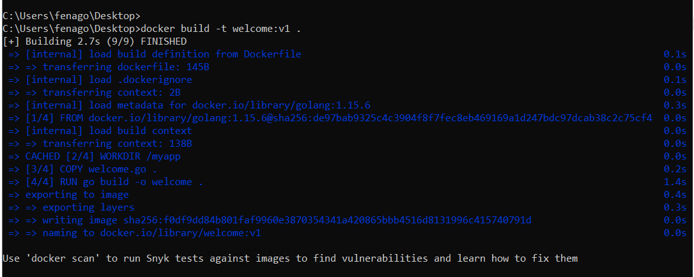
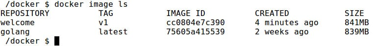
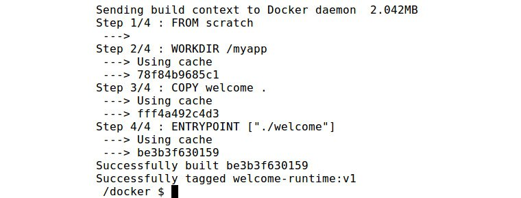
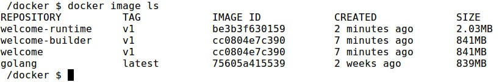
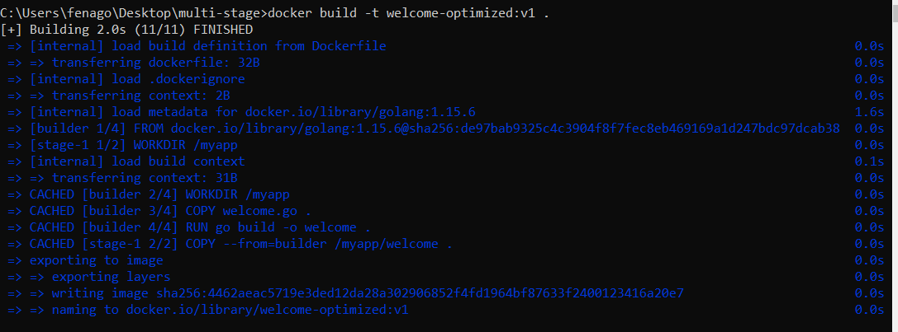
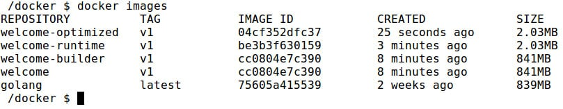
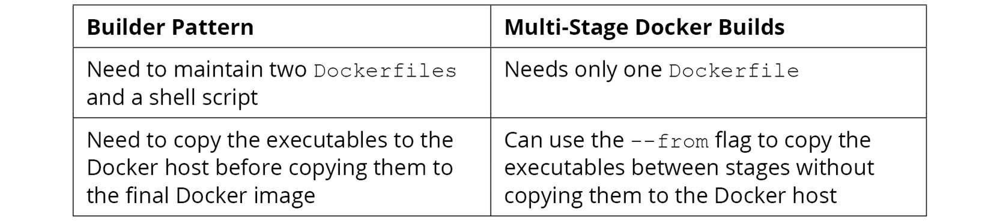
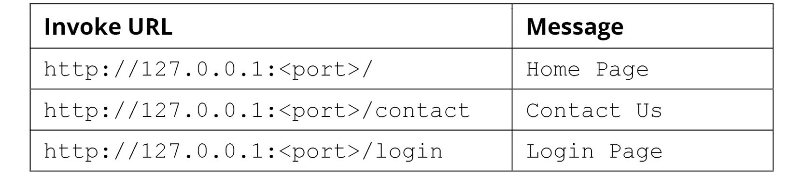
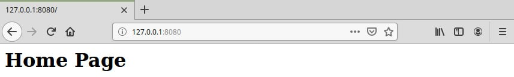

Lab 4: Multi-Stage Dockerfiles
==============================

Overview

In this lab, we will discuss a normal Docker build. You will review
and practice `Dockerfile` best practices and learn to create
and optimize the size of the Docker images using a builder pattern and
multi-stage `Dockerfile`.


Exercise 4.01: Building a Docker Image with the Normal Build Process
--------------------------------------------------------------------

Your manager has asked you to dockerize a simple Golang application. You
are provided with the Golang source code file, and your task is to
compile and run this file. In this exercise, you will build a Docker
image using the normal build process. You will then observe the image
size of the final Docker image:

1.  Create a new directory named `normal-build` for this
    exercise:
    
    ```
    $ mkdir normal-build
    ```
    

2.  Navigate to the newly created `normal-build` directory:
    
    ```
    $ cd normal-build
    ```
    

3.  Within the `normal-build` directory, create a file named
    `welcome.go`. This file will be copied to the Docker image
    during the build time:
    
    ```
    $ touch welcome.go
    ```
    

4.  Now, open the `welcome.go` file using your favorite text
    editor:
    
    ```
    $ vim welcome.go
    ```
    

5.  Add the following content to the `welcome.go` file, save
    it, and exit from the `welcome.go` file:

    
    ```
    package main
    import "fmt"
    func main() {
        fmt.Println("Welcome to multi-stage Docker builds")
    }
    ```
    

    This is a simple `hello world` application written in
    Golang. This will output
    `"Welcome to multi-stage Docker builds"` on execution.

6.  Within the `normal-build` directory, create a file named
    `Dockerfile`:
    
    ```
    $ touch Dockerfile
    ```
    

7.  Now, open the `Dockerfile` using your favorite text
    editor:
    
    ```
    $ vim Dockerfile 
    ```
    

8.  Add the following content to the `Dockerfile` and save the
    file:

    
    ```
    FROM golang:1.15.6
    WORKDIR /myapp
    COPY welcome.go .
    RUN go build -o welcome .
    ENTRYPOINT ["./welcome"]
    ```
    

    The `Dockerfile` starts with the `FROM`
    directive that specifies the latest Golang image as the parent
    image. This will set the `/myapp` directory as the current
    working directory of the Docker image. Then, the `COPY`
    directive will copy the `welcome.go` source file that you
    created in *step 3* to the Docker filesystem. Next is the
    `go build` command, which will build the Golang code that
    you created. Finally, the welcome code will be executed.

9.  Now, build the Docker image:

    
    ```
    docker build -t welcome:v1 .
    ```
    

    You will see that the image is successfully built and tagged as `welcome:v1`:

    

    

10. Use the `docker image ls` command to list all the Docker
    images available on your computer:

    
    ```
    docker image ls
    ```
    

    The command should return the following output:

    

    

It can be observed in the preceding output that the image size of the
`welcome:v1` image is `805MB`.

In this section, we discussed how to use the normal Docker build process
to build a Docker image and observed its size. The result was a huge
Docker image, over 800 MB in size. The main disadvantage of these large
Docker images is that they will take significant time to build, deploy,
push, and pull over the networks. So, it is recommended to create
minimal-sized Docker images whenever possible. In the next section, we
will discuss how we can use the builder pattern to optimize the
image size.


Exercise 4.02: Building a Docker Image with the Builder Pattern
---------------------------------------------------------------

In *Exercise 4.01*, *Building a Docker Image with the Normal Build
Process*, you created a Docker image to compile and run the Golang
application. Now the application is ready to go live, but the manager is
not happy with the size of the Docker image. You have been asked to
create a minimal-sized Docker image to run the application. In this
exercise, you will optimize the Docker image using the builder pattern:

1.  Create a new directory named `builder-pattern` for this
    exercise:
    
    ```
    $ mkdir builder-pattern
    ```
    

2.  Navigate to the newly created `builder-pattern` directory:
    
    ```
    $ cd builder-pattern
    ```
    

3.  Within the `builder-pattern` directory, create a file
    named `welcome.go`. This file will be copied to the Docker
    image at build time:
    
    ```
    $ touch welcome.go
    ```
    

4.  Now, open the `welcome.go` file using your favorite text
    editor:
    
    ```
    $ vim welcome.go
    ```
    

5.  Add the following content to the `welcome.go` file, and
    then save and exit this file:

    
    ```
    package main
    import "fmt"
    func main() {
        fmt.Println("Welcome to multi-stage Docker builds")
    }
    ```
    

    This is a simple `hello world` application written in
    Golang. This will output
    `"Welcome to multi-stage Docker builds"` once executed.

6.  Within the `builder-pattern` directory, create a file
    named `Dockerfile.build`. This file will contain all the
    instructions that you are going to use to create the
    `build` Docker image:
    
    ```
    $ touch Dockerfile.build
    ```
    

7.  Now, open the `Dockerfile.build` using your favorite text
    editor:
    
    ```
    $ vim Dockerfile.build
    ```
    

8.  Add the following content to the `Dockerfile.build` file
    and save the file:

    
    ```
    FROM golang:1.15.6
    WORKDIR /myapp
    COPY welcome.go .
    RUN go build -o welcome .
    ENTRYPOINT ["./welcome"]
    ```
    

    This has the same content that you created for the
    `Dockerfile` in *Exercise 4.01*, *Building a Docker Image
    with the Normal Build Process*.

9.  Next, create the `Dockerfile` for the runtime container.
    Within the `builder-pattern` directory, create a file
    named `Dockerfile`. This file will contain all the
    instructions that you are going to use to create the runtime Docker
    image:
    
    ```
    $ touch Dockerfile
    ```
    

10. Now, open the `Dockerfile` using your favorite text
    editor:
    
    ```
    $ vim Dockerfile
    ```
    

11. Add the following content to the `Dockerfile` and save the
    file:

    
    ```
    FROM scratch
    WORKDIR /myapp
    COPY welcome .
    ENTRYPOINT ["./welcome"]
    ```
    

    This `Dockerfile` uses the scratch image, which is the
    most minimal image in Docker, as the parent. Then, it will configure
    the `/myapp` directory as the working directory. Next, the
    welcome executable is copied from the Docker host to the runtime
    Docker image. Finally, the `ENTRYPOINT` directive is used
    to execute the welcome executable.

12. Create the shell script to copy the executables between Docker
    containers. Within the `builder-pattern` directory, create
    a file named `build.sh`. This file will contain the steps
    to coordinate the build process between the two Docker containers:
    
    ```
    $ touch build.sh
    ```
    

13. Now, open the `build.sh` file using your favorite text
    editor:
    
    ```
    $ vim build.sh
    ```
    

14. Add the following content to the shell script and save the file:

    
    ```
    #!/bin/sh
    echo "Creating welcome builder image"
    docker image build -t welcome-builder:v1 -f Dockerfile.build .
    docker container create --name welcome-builder-container   welcome-builder:v1
    docker container cp welcome-builder-container:/myapp/welcome .
    docker container rm -f welcome-builder-container
    echo "Creating welcome runtime image"
    docker image build -t welcome-runtime:v1 .
    rm welcome
    ```
    

    This shell script will first build the `welcome-builder`
    Docker image and create a container from it. Then it will copy the
    compiled Golang executable from the container to the local
    filesystem. Next, the `welcome-builder-container`
    container is removed as it is an intermediate container. Finally,
    the `welcome-runtime` image is built.

15. Add execution permissions to the `build.sh` shell script:
    
    ```
    $ chmod +x build.sh
    ```
    

16. Now that you have the two `Dockerfiles` and the shell
    script, build the Docker image by executing the `build.sh`
    shell script:

    
    ```
    $ ./build.sh
    ```
    

    The image will be successfully built and tagged as
    `welcome-runtime:v1`:

    

    


17. Use the `docker image` ls command to list all the Docker
    images available on your computer:

    
    ```
    docker image ls
    ```
    

    You should get the list of all the available Docker images as shown
    in the following figure:

    

    

As you can see from the preceding output, there are two Docker images
available. welcome-builder has all the builds tools and is 805 MB, while
welcome-runtime has a significantly lower image size of 2.01 MB.
`golang:1.15.6` is the Docker image we used as the parent
image of `welcome-builder`.

In this exercise, you learned how to use the builder pattern to reduce
the size of the Docker image. However, using the builder pattern to
optimize the size of the Docker image means that we have to maintain two
`Dockerfiles` and one shell script. In the next section,
let\'s observe how we can eliminate them by using a
multi-stage `Dockerfile`.


Introduction to Multi-Stage Dockerfiles
=======================================


**Multi-stage Dockerfiles** are a feature that allows for a single
`Dockerfile` to contain multiple stages that can produce
optimized Docker images. As we observed with the builder pattern in the
previous section, the stages will usually include a builder state to
build the executables from source code, and a runtime stage to run the
executables. Multi-stage `Dockerfiles` will use multiple
`FROM` directives within the `Dockerfile` for each
stage, and each stage will start with a different base image. Only the
essential files will be copied selectively from one stage to the other.
Before multi-stage `Dockerfiles`, this was achieved with the
builder pattern, as we discussed in the previous section.

Multi-stage Docker builds allow us to create minimal-sized Docker images
that are similar to the builder pattern but eliminate the problems
associated with it. As we have seen in the previous example, the builder
pattern needs to maintain two `Dockerfiles` and a shell
script. In contrast, multi-stage Docker builds will need only one
`Dockerfile` and do not require any shell script to copy the
executables between Docker containers. Also, the builder pattern
requires that you copy the executables to the Docker host before copying
them to the final Docker image. This is not required with the
multi-stage Docker builds as we can use the `--from` flag to
copy the executables between Docker images without copying them to the
Docker host.

Now, let\'s observe the structure of a multi-stage
`Dockerfile`:


```
# Start from latest golang parent image
FROM golang:1.15.6
# Set the working directory
WORKDIR /myapp
# Copy source file from current directory to container
COPY helloworld.go .
# Build the application
RUN go build -o helloworld .
# Start from latest alpine parent image
FROM alpine:latest
# Set the working directory
WORKDIR /myapp
# Copy helloworld app from current directory to container
COPY --from=0 /myapp/helloworld .
# Run the application
ENTRYPOINT ["./helloworld"]
```


The main difference between a normal `Dockerfile` and a
multi-stage `Dockerfile` is that a multi-stage
`Dockerfile` will use multiple `FROM` directives to
build each phase. Each new phase will start with a new parent image and
does not contain anything from the previous image other than the
selectively copied executables. `COPY --from=0` is used to
copy the executable from the first stage to the second stage.

Build the Docker image and tag the image as `multi-stage:v1`:


```
docker image build -t multi-stage:v1 .
```


Now, you can list the available Docker images:


```
REPOSITORY    TAG      IMAGE ID       CREATED         SIZE
multi-stage   latest   75e1f4bcabd0   7 seconds ago   7.6MB
```


You can see that this has resulted in a Docker image of the same size
that we observed with the builder pattern.

Note

Multi-stage `Dockerfiles` reduce the number of
`Dockerfiles` required and eliminate the shell script without
making any difference to the size of the image.

By default, the stages in the multi-stage `Dockerfile` are
referred to by an integer number, starting with `0` from the
first stage. These stages can be named to increase readability and
maintainability by adding `AS <NAME>` to the `FROM`
directive. The following is the improved version of the multi-stage
`Dockerfile` that you observed in the preceding code block:


```
# Start from latest golang parent image
FROM golang:1.15.6 AS builder 
# Set the working directory
WORKDIR /myapp
# Copy source file from current directory to container
COPY helloworld.go .
# Build the application
RUN go build -o helloworld .
# Start from latest alpine parent image
FROM alpine:latest AS runtime
# Set the working directory
WORKDIR /myapp
# Copy helloworld app from current directory to container
COPY --from=builder /myapp/helloworld .
# Run the application
ENTRYPOINT ["./helloworld"]
```


In the preceding example, we named the first stage `builder`
and second stage `runtime`, as shown here:


```
FROM golang:1.15.6 AS builder
FROM alpine:latest AS runtime
```


Then, while copying the artifacts in the second stage, you used the name
`builder` for the `--from` flag:


```
COPY --from=builder /myapp/helloworld .
```


While building a multi-stage `Dockerfile`, there might be
instances where you want to build only up to a specific build stage.
Consider that your `Dockerfile` has two stages. The first one
is to build the development stage and contains all the build and debug
tools, and the second is to build the production image that will contain
only the runtime tools. During the code development phase of the
project, you might only need to build up to the development stage to
test and debug your code whenever necessary. In this scenario, you can
use the `--target` flag with the `docker build`
command to specify an intermediate stage as the final stage for the
resulting image:


```
docker image build --target builder -t multi-stage-dev:v1 .
```


In the preceding example, you used `--target builder` to stop
the build at the builder stage.

In the next exercise, you will learn to use a multi-stage
`Dockerfile` to create a size-optimized Docker image.


Exercise 4.03: Building a Docker Image with a Multi-Stage Docker Build
----------------------------------------------------------------------

In *Exercise 4.02*, *Building a Docker Image with the Builder Pattern*,
you used the builder pattern to optimize the size of the Docker image.
However, there is an operational burden, as you need to manage two
`Dockerfiles` and a shell script during the Docker image build
process. In this exercise, you are going to use a multi-stage
`Dockerfile` to eliminate this operational burden.

1.  Create a new directory named `multi-stage` for this
    exercise:
    
    ```
    mkdir multi-stage
    ```
    

2.  Navigate to the newly created `multi-stage` directory:
    
    ```
    cd multi-stage
    ```
    

3.  Within the `multi-stage` directory, create a file named
    `welcome.go`. This file will be copied to the Docker image
    during the build time:
    
    ```
    $ touch welcome.go
    ```
    

4.  Now, open the `welcome.go` file using your favorite text
    editor:
    
    ```
    $ vim welcome.go
    ```
    

5.  Add the following content to the `welcome.go` file, and
    then save and exit this file:

    
    ```
    package main
    import "fmt"
    func main() {
        fmt.Println("Welcome to multi-stage Docker builds")
    }
    ```
    

    This is a simple `hello world` application written in
    Golang. This will output
    `"Welcome to multi-stage Docker builds"` once executed.

    Within the multi-stage directory, create a file named
    `Dockerfile`. This file will be the multi-stage
    `Dockerfile`:

    
    ```
    touch Dockerfile
    ```
    

6.  Now, open the `Dockerfile` using your favorite text
    editor:
    
    ```
    vim Dockerfile
    ```
    

7.  Add the following content to the `Dockerfile` and save the
    file:

    
    ```
    FROM golang:1.15.6 AS builder
    WORKDIR /myapp
    COPY welcome.go .
    RUN go build -o welcome .
    FROM scratch
    WORKDIR /myapp
    COPY --from=builder /myapp/welcome .
    ENTRYPOINT ["./welcome"]
    ```
    

    This multi-stage `Dockerfile` uses the latest
    `golang` image as the parent image and this stage is named
    `builder`. Next, the `/myapp` directory is
    specified as the current working directory. Then, the
    `COPY` directive is used to copy the
    `welcome.go` source file and the `RUN` directive
    is used to build the Golang file.

    The next stage of the `Dockerfile` uses the
    `scratch` image as the parent image. This will set the
    `/myapp` directory as the current working directory of the
    Docker image. Then, the `COPY` directive is used to copy
    the `welcome` executable from the builder stage to this
    stage. Finally, `ENTRYPOINT` is used to run the
    `welcome` executable.

8.  Build the Docker image using the following command:

    
    ```
    docker build -t welcome-optimized:v1 .
    ```
    

    The image will be successfully built and tagged as
    `welcome-optimized:v1`:

    

    

9.  Use the `docker image ls` command to list all the Docker
    images available on your computer. These images are available on
    your computer, either when you pull them from Docker Registry or
    when you build them on your computer:

    
    ```
    docker images
    ```
    

    As you can see from the following output, the
    `welcome-optimized` image has the same size as the
    `welcome-runtime` image that you built in *Exercise 4.02,
    Building a Docker Image with the Builder Pattern*:

    

    

In this exercise, you learned how to use multi-stage
`Dockerfiles` to build optimized Docker images. The following
table presents a summary of the key differences between the builder
pattern and multi-stage `Docker Builds`:





Activity 4.01: Deploying a Golang HTTP Server with a Multi-Stage Docker Build
-----------------------------------------------------------------------------

Imagine that you have been tasked with deploying a Golang HTTP server to
a Docker container. Your manager has asked you to build a minimal-sized
Docker image and observe best practices while building the
`Dockerfile`.

This Golang HTTP server will return different responses based on the
invoke URL:





Your task is to dockerize the Golang application given in the following
code block using a multi-stage `Dockerfile`:


```
package main
import (
    "net/http"
    "fmt"
    "log"
    "os"
)
func main() {
    http.HandleFunc("/", defaultHandler)
    http.HandleFunc("/contact", contactHandler)
    http.HandleFunc("/login", loginHandler)
    port := os.Getenv("PORT")
    if port == "" {
        port = "8080"
    }
    log.Println("Service started on port " + port)
    err := http.ListenAndServe(":"+port, nil)
    if err != nil {
        log.Fatal("ListenAndServe: ", err)
        return
    }
}
func defaultHandler(w http.ResponseWriter, r *http.Request) {
    fmt.Fprintf(w, "<h1>Home Page</h1>")
}
func contactHandler(w http.ResponseWriter, r *http.Request) {
    fmt.Fprintf(w, "<h1>Contact Us</h1>")
}
func loginHandler(w http.ResponseWriter, r *http.Request) {
    fmt.Fprintf(w, "<h1>Login Page</h1>")
}
```


Execute the following steps to complete this activity:

1.  Create a folder to store the activity files.
2.  Create a `main.go` file with the code provided in the
    preceding code block.
3.  Create a multi-stage `Dockerfile` with two stages. The
    first stage will use the `golang` image. This stage will
    build the Golang application using the `go build` command.
    The second stage will use an `alpine` image. This stage
    will copy the executable from the first stage and execute it.
4.  Build and run the Docker image.
5.  Once completed, stop and remove the Docker container.

You should get the following output when you navigate to the URL
`http://127.0.0.1:8080/`:





Summary
=======


We started this lab by defining a normal Docker build and creating a
simple Golang Docker image using the normal Docker build process. Then
we observed the size of the resulting Docker image and discussed how a
minimal-sized Docker image can speed up the build and deployment times
for Docker containers and enhance security by reducing the attack
surface.

We then used the builder pattern to create minimal-sized Docker images,
utilizing two `Dockerfiles` and a shell script in this process
to create the image. We explored multi-stage Docker builds---a new
feature introduced to Docker in version 17.05 that can help to eliminate
the operational burden of having to maintain two `Dockerfiles`
and a shell script. Finally, we discussed the best practices for writing
`Dockerfiles` and how these best practices can ensure reduced
build time, reduced image size, and increased security, while increasing
the maintainability of the Docker image.

In the next lab, we will cover `docker-compose` and how it
can be used to define and run multi-container Docker applications.
