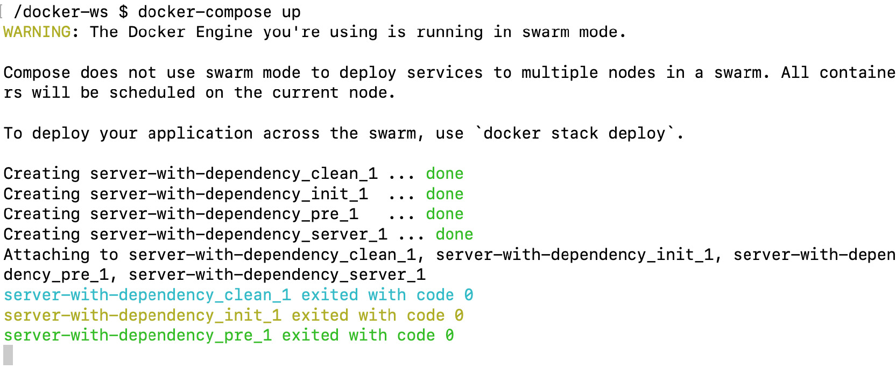

Composing Environments with Docker Compose
=============================================


Overview

This lab covers the creation and management of multi-container
applications using Docker Compose. You will learn how to create Docker
Compose files to define complex containerized applications and how to
run the Docker Compose CLI to manage the life cycle of multi-container
applications. This lab will enable you to configure Docker Compose
applications with different methods and design applications with
dependencies on other applications.


Introduction
============


In the previous chapters, we discussed how to use Docker containers and
`Dockerfiles` to create containerized applications. As apps
get more complicated, the management of the containers and their
configurations becomes more involved.

For example, imagine you are developing an online shop with frontend,
backend, payment, and ordering microservices. Each microservice is
implemented with the most appropriate programming language before being
built, packaged, and configured. Thus, complex applications are designed
to run in separate containers in the Docker ecosystem. Different
containers require multiple `Dockerfiles` to define Docker
images.

They also need complex commands to configure, run, and troubleshoot
applications. All this can be achieved using **Docker Compose**, a tool
for defining and managing applications in multiple containers. Complex
applications such as YAML files can be configured and run with a single
command in Docker Compose. It is suitable for various environments,
including development, testing, **Continuous Integration** (**CI**)
pipelines, and production.

The essential features of Docker Compose can be grouped into three
categories:

-   **Isolation**: Docker Compose allows you to run multiple instances
    of your complex application in complete isolation. Although it seems
    like a trivial feature, it makes it possible to run multiple copies
    of the same application stack on developer machines, CI servers, or
    shared hosts. Therefore, sharing resources increases utilization
    while decreasing operational complexity.
-   **Stateful data management**: Docker Compose manages the volumes of
    your containers so that they do not lose their data from previous
    runs. This feature makes it easier to create and operate
    applications that store their state on disks, such as databases.
-   **Iterative design**: Docker Compose works with an explicitly
    defined configuration that consists of multiple containers. The
    containers in the configuration can be extended with new containers.
    For instance, imagine you have two containers in your application.
    If you add a third container and run Docker Compose commands, the
    first two containers will not be restarted or recreated. Docker
    Compose will only create and join the newly added third container.

These features make Compose an essential tool for creating and managing
applications as multiple containers in various platforms. In this
lab, you will see how Docker Compose helps you to manage the
complete life cycle of complicated applications.

You will start by diving deep into Compose CLI and file anatomy.
Following this, you will learn how to configure applications with
multiple techniques and how to define service dependencies. Since Docker
Compose is an essential tool for the Docker environment, both technical
and hands-on experience are vital to have in your toolbox.


Docker Compose CLI
==================


Docker Compose works with **Docker Engine** to create and manage
multi-container applications. To interact with Docker Engine, Compose
uses a CLI tool named `docker-compose`. On Mac and Windows
systems, `docker-compose` is already a part of Docker Desktop.
However, on Linux systems, you need to install the
`docker-compose` CLI tool after installing Docker Engine. It
is packaged into a single executable, and you can install it with the
following commands on Linux systems.


Installing Docker Compose CLI in Linux
--------------------------------------

1.  Download the binary to `/usr/local/bin` with the following
    command in your Terminal:
    
    ```
    sudo curl -L "https://github.com/docker/compose/releases/download/1.25.0/docker-compose-$(uname -s)-$(uname -m)" -o /usr/local/bin/docker-compose
    ```
    

2.  Make the downloaded binary executable with the following command:
    
    ```
    sudo chmod +x /usr/local/bin/docker-compose
    ```
    

3.  Test the CLI and installation with the following command in the
    Terminal on all operating systems:

    
    ```
    docker-compose version
    ```
    

    If it is installed correctly, you will see the versions of the CLI
    and its dependencies as follows. For instance, in the following
    output, the `docker-compose` CLI has version
    `1.25.1-rc1` and its dependencies, `docker-py`,
    `CPython`, and `OpenSSL`, are also listed with
    their versions:

    

    

Figure 5.1: docker-compose version output

Up until now, we have learned how to install the Docker Compose CLI in
Linux. Now we will look into the commands and subcommands that manage
the complete life cycle of multi-container applications.


Docker Compose CLI Commands
---------------------------

The `docker-compose` command is capable of managing the
complete life cycle of multi-containers applications. With the
subcommands, it is possible to start, stop, and recreate services. Also,
it is possible to check the status of the running stacks and get the
logs. You will get hands-on experience with the essential commands
throughout this lab. Likewise, a preview of all capabilities can be
listed with the following command:


```
docker-compose --help
```


The output of the command should look like the following:


Figure 5.2: docker-compose commands

There are three essential `docker-compose` commands that are
used to manage the life cycle of applications. The life cycle and
commands can be illustrated as follows:


Figure 5.3: docker-compose life cycle

-   `docker-compose up`: This command creates and starts the
    containers defined in the configuration. It is possible to build
    container images or use pre-built images from the registry. In
    addition, it is possible to run the containers in the background in
    `detached` mode with the `-d` or
    `--detach` flags. It is convenient to use
    `detached` mode for long-running containers, such as web
    servers, that we do not expect to stop in the short term. Additional
    options and flags can be checked with the
    `docker-compose up --help` command.
-   `docker-compose ps`: This command lists the containers and
    their status information. It is helpful for troubleshooting and
    container health checks. For instance, if you create a two-container
    application with a backend and a frontend, you can check the status
    of each container with the `docker-compose ps` command. It
    helps to find out whether your backend or frontend is down, is not
    responding to their health checks, or has failed to start due to
    misconfiguration.
-   `docker-compose down`: This command stops and removes all
    the resources, including containers, networks, images, and volumes.


Docker Compose File
-------------------

Multi-container applications are run and defined using the
`docker-compose` CLI. By convention, the default name of these
files is `docker-compose.yaml`. Docker Compose is a powerful
tool; however, its power depends on the configuration. Therefore,
knowing how to create `docker-compose.yaml` files is essential
and requires great attention.

Note

Docker Compose works with the `docker-compose.yaml` and
`docker-compose.yml` file extensions by default. 

`docker-compose.yaml` files consist of four main sections, as
illustrated in *Figure 5.4*:


Figure 5.4: The docker-compose file structure

-   `version`: This section defines the syntax version for the
    `docker-compose` file, and currently, the latest syntax
    version is `3`.
-   `services`: This section describes the Docker containers
    that will be built if needed and will be started by
    `docker-compose`.
-   `networks`: This section describes the networks that will
    be used by the services.
-   `volumes`: This section describes the data volumes that
    will be mounted to the containers in services.

For the `services` section, there are two essential options to
create containers. The first option is to build the container, and the
second is to use Docker images from the registry. When you are creating
and testing containers locally, it is advisable to build the images. On
the other hand, it is faster and easier to use Docker images from the
registry for production and CI/CD systems.

Imagine you want to build your server container by using a
`Dockerfile` named `Dockerfile-server`. Then, you
need to put the file in the `server` folder with the following
folder structure:


Figure 5.5: Folder structure

The output of the `tree` command shows that there is a
`server` folder containing `Dockerfile-server`.

When the following content is defined in the
`docker-compose.yaml` file in the root directory, the
`server` container will be built before running the service:


```
version: "3"
services:
  server:
    build:
      context: ./server
      dockerfile: Dockerfile-server
```


Similarly, if you want to use an image from the Docker registry, you can
define a service with only the `image` field:


```
version: "3"
services:
  server:
    image: nginx
```


Docker Compose creates a single network by default, and each container
connects to this network. In addition, containers can connect to other
containers using hostnames. For instance, let\'s assume you have the
following `docker-compose.yaml` file in the `webapp`
folder:


```
version: "3"
services:
  server:
    image: nginx
  db:
    image: postgres
    ports:
      - "8032:5432"
```


When you start `docker-compose` with this configuration, it
first creates the network with the name `webapp_default`.
Following that, `docker-compose` creates the
`server` and `db` containers and joins the
`webapp_default` network with the names `server` and
`db`, respectively. 

In addition, the `server` container can connect to the
database using its `container` port and hostname as follows:
`postgres://db:5432`. Similarly, the database is reachable
from the host machine by host port `8032` as follows:
`postgres://localhost:8032`. The network structure is
presented in the following diagram:


Figure 5.6: Networking structure

Within the `docker-compose.yaml` file, you can define custom
networks instead of using the default network. The `network`
configuration enables you to create sophisticated network technologies
based on your custom network drivers. Networking for Docker containers
is comprehensively covered in *Lab 6*, *Introduction to Docker
Networking*. Extending Docker Engine with custom network drivers will be
covered in the following chapters. 

Docker Compose also creates and manages volumes as a part of the
`docker-compose.yaml` file. Volumes provide persistency among
containers and are managed by Docker Engine. All service containers can
reuse volumes. In other words, data can be shared between the containers
for synchronization, data preparation, and backup operations. In
*Lab 7*, *Docker Storage*, volumes for Docker will be presented in
full detail.

With the following `docker-compose.yaml` file,
`docker-compose` will create a volume named `data`
using the default volume plugin in Docker Engine. This volume will be
mounted to the `/database` path of the `database`
container and the `/backup` path of the `backup`
container. This YAML file and its content create a service stack that
runs a database and continuously backs up without downtime:


```
version: "3"
services:
  database:
    image: my-db-service
    volumes:
      - data:/database
  backup:
    image: my-backup-service
    volumes:
      - data:/backup
volumes:
  data:
```


Note

The official reference documentation for Docker Compose files is
available at <https://docs.docker.com/compose/compose-file/>.

In the following exercise, a multi-container application with networking
and volume usage will be created with Docker Compose.

Note

Please use `touch` command to create files and `vim`
command to work on the file using vim editor.


Exercise 5.01: Getting Started with Docker Compose
--------------------------------------------------

Web servers in containers require operational tasks before starting,
such as configuration, file downloads, or dependency installations. With
`docker-compose`, it is possible to define those operations as
multi-container applications and run them with a single command. In this
exercise, you will create a preparation container to generate static
files, such as `index.html` files. Then, the server container
will serve the static files, and it will be reachable from the host
machine by the network configuration. You will also manage the life
cycle of the application using various `docker-compose`
commands.

To complete the exercise, execute the following steps:

1.  Create a folder named `server-with-compose` and navigate
    into it using the `cd` command:
    
    ```
    mkdir server-with-compose
    cd server-with-compose
    ```
    

2.  Create a folder with the name `init` and navigate into it
    using the `cd` command:
    
    ```
    mkdir init
    cd init
    ```
    

3.  Create a Bash script file with the following content and save it as
    `prepare.sh`:

    
    ```
    #!/usr/bin/env sh
    rm /data/index.html
    echo "<h1>Welcome from Docker Compose!</h1>" >> /data/index.html
    echo "" >> /data/index.html
    ```
    

    This script generates a sample HTML page with the `echo`
    commands.

4.  Create a `Dockerfile` with the name `Dockerfile`
    and the following content:

    
    ```
    FROM busybox
    ADD prepare.sh /usr/bin/prepare.sh
    RUN chmod +x /usr/bin/prepare.sh
    ENTRYPOINT ["sh", "/usr/bin/prepare.sh"] 
    ```
    

    This `Dockerfile` is based on `busybox`, which
    is a tiny operating system for space-efficient containers, and it
    adds the `prepare.sh` script into the filesystem. In
    addition, it makes the file executable and set it as the
    `ENTRYPOINT` command. The `ENTRYPOINT` command,
    in our case, the `prepare.sh` script is initialized with
    the start of the Docker container.

5.  Change the directory to the parent folder with the `cd ..`
    command and create a `docker-compose.yaml` file with the
    following content:

    
    ```
    version: "3"
    services:
      init:
        build:
          context: ./init
        volumes:
          - static:/data
          
      server:
        image: nginx
        volumes:
          - static:/usr/share/nginx/html  
        ports:
          - "8080:80"
    volumes:
      static:
    ```
    

    This `docker-compose` file creates one volume named
    `static`, and two services with the names `init`
    and `server`. The volume is mounted to both containers. In
    addition, the server has published port `8080`, connecting
    to container port `80`.

6.  Start the application with the following command in
    `detach` mode to continue using the Terminal:

    
    ```
    docker-compose up --detach 
    ```
    

    The following image shows what happens when the preceding command
    is executed:

    

    

    Figure 5.7: Starting the application

    The preceding command creates and starts the containers in
    `detached` mode. It starts by creating the
    `server-with-compose_default` network and the
    `server-with-compose_static` volume. Then, it builds the
    `init` container using the `Dockerfile` from
    *step 4*, downloads the `nginx` Docker image for the
    server, and starts the containers. Finally, it prints the names of
    the containers and makes them run in the background.

    Note

    You can disregard the warning about Swarm mode since we want to
    deploy all containers to the same node.

7.  Check the status of the application with the
    `docker-compose ps` command:

    

    

    Figure 5.8: Application status

    This output lists two containers. The `init` container
    exited successfully with code `0`, while the
    `server` container is `Up` and its port is
    available. This is the expected output since the `init`
    container is designed to prepare the `index.html` file and
    complete its operations, whereas the `server` container
    should always be up and running.

8.  Open `http://localhost:8080` in the browser. The following
    figure shows the output:

    

    

    Figure 5.9: Server output

    *Figure 5.9* shows the `index.html` page created by the
    `init` container. In other words, it shows that
    `docker-compose` created the volume, mounted it to the
    containers, and started them successfully.

9.  Stop and remove all the resources with the following command if you
    do not need the application up and running:

    
    ```
    docker-compose down
    ```
    

    The command will return output like the following:

    

    

Figure 5.10: Stopping the application

In this exercise, a multi-container application was created and
configured by `docker-compose`. Networking and volume options
were stored in the `docker-compose.yaml` file. In addition,
CLI commands were shown in action for creating applications, checking
the status, and removing the applications.

In the following section, configuration options for applications in the
Docker Compose environment will be presented.


Configuration of Services
=========================


Cloud-native applications are expected to store their configuration in
environment variables. Environment variables are easy to change between
different platforms without source code changes. Environment variables
are dynamic values that are stored in Linux-based systems and used by
applications. In other words, the variables can be used to configure
applications by changing their values.

For instance, assume your application uses a `LOG_LEVEL`
environment variable to configure what is logged. If you change the
`LOG_LEVEL` environment variable from `INFO` to
`DEBUG` and restart your application, you would see more logs
and be able to troubleshoot problems more easily. In addition, you can
deploy the same application with different sets of environment variables
to staging, testing, and production. Likewise, the method of configuring
services in Docker Compose is to set environment variables for the
containers.

There are three methods of defining environment variables in Docker
Compose, with the following priority:

1.  Using the Compose file
2.  Using shell environment variables
3.  Using the environment file

If the environment variables do not change very often but are required
by the containers, it is better to store them in
`docker-compose.yaml` files. If there are sensitive
environment variables, such as passwords, it is recommended to pass them
via shell environment variables before calling the
`docker-compose` CLI. However, if the number of the variables
is high and varies between the testing, staging, or production systems,
it is easier to collect them in `.env` files and pass them
into `docker-compose.yaml` files.

In the `services` part of the `docker-compose.yaml`
file, environment variables can be defined for each service. For
example, the `LOG_LEVEL` and `METRICS_PORT`
environment variables are set in the Docker Compose file as follows for
the `server` service:


```
server:
  environment:
    - LOG_LEVEL=DEBUG
    - METRICS_PORT=8444
```


When the values are not set for the environment variables in the
`docker-compose.yaml` file, it is possible to get the values
from the shell by running a `docker-compose` command. For
instance, the `HOSTNAME` environment variable for the
`server` service will be set straight from the shell:


```
server:
  environment:
    - HOSTNAME
```


When the shell running the `docker-compose` command has no
value for the `HOSTNAME` environment variable, the container
will start with an empty environment variable.

In addition, it is possible to store the environment variables in
`.env` files and configure them in
`docker-compose.yaml` files. An example
`database.env` file can be structured with key-value lists as
follows:


```
DATABASE_ADDRESS=mysql://mysql:3535
DATABASE_NAME=db
```


In the `docker-compose.yaml` file, the environment variable
file field is configured under the corresponding service as follows:


```
server:
  env_file:
    - database.env
```


When Docker Compose creates the `server` service, it will set
all the environment variables listed in the `database.env`
file to the container.

In the following exercise, you will configure an application using all
three configuration methods in Docker Compose.


Exercise 5.02: Configuring Services with Docker Compose
-------------------------------------------------------

Services in Docker Compose are configured by environment variables. In
this exercise, you will create a Docker Compose application that is
configured by different methods of setting variables. In a file called
`print.env`, you will define two environment variables. In
addition, you will create and configure one environment variable in the
`docker-compose.yaml` file and pass one environment variable
from the Terminal on the fly. You will see how four environment
variables from different sources come together in your container.

To complete the exercise, execute the following steps:

1.  Create a folder named `server-with-configuration` and
    navigate into it using the `cd` command:
    
    ```
    mkdir server-with-configuration
    cd server-with-configuration
    ```
    

2.  Create an `.env` file with the name `print.env`
    and the following content:

    
    ```
    ENV_FROM_ENV_FILE_1=HELLO
    ENV_FROM_ENV_FILE_2=WORLD
    ```
    

    In this file, two environment variables,
    `ENV_FROM_ENV_FILE_1` and `ENV_FROM_ENV_FILE_2`,
    are defined with their values.

3.  Create a file with the name `docker-compose.yaml` and the
    following content:

    
    ```
    version: "3"
    services:
      print:
        image: busybox
        command: sh -c 'sleep 5 && env'
        env_file:
        - print.env
        environment:
        - ENV_FROM_COMPOSE_FILE=HELLO
        - ENV_FROM_SHELL
    ```
    

    In this file, a single-container application is defined, and the
    container runs the `env` command to print the environment
    variables. It also uses the environment file named
    `print.env`, and two additional environment variables,
    `ENV_FROM_COMPOSE_FILE` and `ENV_FROM_SHELL`.

4.  Export `ENV_FROM_SHELL` to the shell with the following
    command:
    
    ```
    export ENV_FROM_SHELL=WORLD
    ```
    

5.  Start the application with the `docker-compose up`
    command. The output should look like the following:
    

    

Figure 5.11: Starting the application

The output is the result of the `print` container defined in
the `docker-compose` file. The container has one command to
run, `env`, and it prints the available environment variables.
As expected, there are two environment variables,
`ENV_FROM_ENV_FILE_1` and `ENV_FROM_ENV_FILE_2`,
with the corresponding values of `HELLO` and
`WORLD`. In addition, the environment variable defined in the
`docker-compose.yaml` file in *step 3* is available with the
name `ENV_FROM_COMPOSE_FILE` and the value `HELLO`.
Finally, the environment variable exported in *step 4* is available with
the name `ENV_FROM_SHELL` and the value `WORLD`.

In this exercise, a Docker Compose application was created and
configured with different methods. Using Docker Compose files,
environment definition files and exported values can be used to deploy
the same application to different platforms.

Since Docker Compose manages multi-container applications, there is a
need to define the interdependencies between them. The interdependencies
of the containers in the Docker Compose applications will be presented
in the following section.


Service Dependency
==================


Docker Compose runs and manages multi-container applications defined in
`docker-compose.yaml` files. Although the containers are
designed as independent microservices, creating services that depend on
each other is highly expected. For instance, let\'s assume you have a
two-tier application with database and backend components, such as a
PostgreSQL database and a Java backend. The Java backend component
requires PostgreSQL to be up and running since it should connect to the
database to run the business logic. Therefore, you could need to define
the dependency between the services of the multi-container applications.
With Docker Compose, it is possible to control the order of the startup
and shutdown of the services.

Say you have a three-container application with the following
`docker-compose.yaml` file:


```
version: "3"
services:
  init:
    image: busybox
  pre:
    image: busybox
    depends_on:
    - "init"
  main:
    image: busybox
    depends_on:
    - "pre"
```


In this file, the `main` container depends on the
`pre` container, whereas the `pre` container depends
on the `init` container. Docker Compose starts the containers
in the order of `init`, `pre`, and `main`,
as illustrated in *Figure 5.12*. In addition, the containers will be
stopped in reverse order: `main`, `pre`, and then
`init`:


Figure 5.12: Service startup order

In the following exercise, the order of containers will be used to fill
the contents of a file and then serve it with a web server.


Exercise 5.03: Service Dependency with Docker Compose
-----------------------------------------------------

Services in Docker Compose can be configured to depend on other
services. In this exercise, you will create an application with four
containers. The first three containers will run consecutively to create
a static file that will be served by the fourth container.

To complete the exercise, execute the following steps:

1.  Create a folder named `server-with-dependency` and
    navigate into it using the `cd` command:
    
    ```
    mkdir server-with-dependency
    cd server-with-dependency
    ```
    

2.  Create a file with the name `docker-compose.yaml` and the
    following content:

    
    ```
    version: "3"
    services:
      clean:
        image: busybox
        command: "rm -rf /static/index.html"
        volumes:
          - static:/static 
      init:
        image: busybox
        command: "sh -c 'echo This is from init container >>       /static/index.html'"
        volumes:
          - static:/static 
        depends_on:
        - "clean"
      pre:
        image: busybox
        command: "sh -c 'echo This is from pre container >>       /static/index.html'"
        volumes:
          - static:/static 
        depends_on:
        - "init"
      server:
        image: nginx
        volumes:
          - static:/usr/share/nginx/html  
        ports:
          - "8080:80"
        depends_on:
        - "pre"
    volumes:
      static:
    ```
    

    This file consists of four services and one volume. The volume is
    named `static`, and it is mounted to all services. The
    first three services take individual actions on the static volume.
    The `clean` container removes the `index.html`
    file, and then the `init` container starts filling
    `index.html`. Following that, the `pre`
    container writes an additional line to the `index.html`
    file. Finally, the `server` container serves the content
    in the `static` folder.

3.  Start the application with the `docker-compose up`
    command. The output should look like the following:

    

    

    Figure 5.13: Starting the application

    The output shows that Docker Compose creates the containers in the
    order of `clean`, `init`, and then
    `pre`.

4.  Open `http://localhost:8080` in the browser:

    

    

    Figure 5.14: Server output

    The output from the server shows that the `clean`,
    `init`, and `pre` containers work in the
    expected order.

5.  Return to the Terminal in *step 3* and use *Ctrl* + *C* to close the
    application gracefully. You will see some HTTP request logs and, in
    the end, the `Stopping server-with-dependency_server_1`
    line:
    

    

Figure 5.15: Stopping the application

In this exercise, a Docker Compose application was created with
interdependent services. How Docker Compose starts and manages
containers in a defined order was shown. This is an essential feature of
Docker Compose with which you can create complex multi-container
applications.

Now, let\'s test the knowledge we have gained so far in this lab by
implementing the following activity. In the next activity, you will
learn how to install WordPress using Docker Compose.


Activity 5.01: Installing WordPress Using Docker Compose
--------------------------------------------------------

You are assigned to design and deploy a blog with its database as
microservices in Docker. You will be using **WordPress** since it is the
most popular **Content Management System** (**CMS**), used by more than
one-third of all the websites on the internet. Also, the development and
testing teams require the installation of both WordPress and the
database multiple times on different platforms with isolation.
Therefore, you are required to design it as a Docker Compose application
and manage it with the `docker-compose` CLI.

Perform the following steps to complete this activity:

1.  Start by creating a directory for your
    `docker-compose.yaml` file.
2.  Create a service for the database using MySQL and a volume defined
    in the `docker-compose.yaml` file. Ensure that the
    `MYSQL_ROOT_PASSWORD`, `MYSQL_DATABASE`,
    `MYSQL_USER`, and `MYSQL_PASSWORD` environment
    variables are set.
3.  Create a service for WordPress defined in the
    `docker-compose.yaml` file. Ensure that the WordPress
    containers start after the database. For the configuration of
    WordPress, do not forget to set the `WORDPRESS_DB_HOST`,
    `WORDPRESS_DB_USER`, `WORDPRESS_DB_PASSWORD`,
    and `WORDPRESS_DB_NAME` environment variables in
    accordance with *step 2*. In addition, you need to publish its port
    to be able to reach it from the browser.
4.  Start the Docker Compose application in `detached` mode.
    Upon successful deployment, you will have two containers running:
    

    

Figure 5.16: WordPress and database containers

You will then be able to reach the setup screen of WordPress in the
browser:


In the next activity, you will get hands-on experience installing the
Panoramic Trekking App using Docker Compose by creating a
three-container Docker application and managing it with the
`docker-compose` CLI.


Activity 5.02: Installing the Panoramic Trekking App Using Docker Compose
-------------------------------------------------------------------------

You are tasked with creating a deployment of the Panoramic Trekking App
using Docker Compose. You will take advantage of the three-tier
architecture of the Panoramic Trekking App and create a three-container
Docker application, with containers for the database, the web backend,
and `nginx`. Therefore, you will design it as a Docker Compose
application and manage it with the `docker-compose` CLI.

Perform the following steps to complete this activity:

1.  Create a directory for your `docker-compose.yaml` file.

2.  Create a service for the database using PostgreSQL and a volume
    defined in the `docker-compose.yaml` file. Ensure that the
    `POSTGRES_PASSWORD` environment variable is set to
    `docker`. In addition, you need to create a
    `db_data` volume in `docker-compose.yaml` and
    mount it to the `/var/lib/postgresql/data/` to store the
    database files.

3.  Create a service for the Panoramic Trekking App defined in the
    `docker-compose.yaml` file. Ensure that you are using the
    `packtworkshops/the-docker-workshop:chapter5-pta-web`
    Docker image, which is prebuilt and ready to use from the registry.
    In addition, since the application is dependent on the database, you
    should configure the container to start after the database. To store
    the static files, create a `static_data` volume in
    `docker-compose.yaml` and mount it to
    `/service/static/`.

    Finally, create a service for `nginx` and ensure that you
    are using the
    `packtworkshops/the-docker-workshop:chapter5-pta-nginx`
    Docker image from the registry. Ensure that the `nginx`
    container starts after the Panoramic Trekking App container. You
    also need to mount the same `static_data` volume to the
    `/service/static/` location. Do not forget to publish
    `nginx` port `80` to `8000` to reach
    from the browser.

4.  Start the Docker Compose application in `detached` mode.
    Upon successful deployment, you will have three containers running:

    

    

    Figure 5.18: The application, database, and nginx containers

5.  Go to the administration section of the Panoramic Trekking App in
    the browser with the address `http://0.0.0.0:8000/admin`:

    

    

    Figure 5.19: Admin setup logon

    You can log in with the username `admin` and password
    `changeme` and add new photos and countries:

    

    

    Figure 5.20: Admin setup view

6.  Access the Panoramic Trekking App at the address
    `http://0.0.0.0:8000/photo_viewer` in the browser:
    

    


Summary
=======


This lab focused on using Docker Compose to design, create, and
manage multi-container applications. The complexity of containerized
applications has increased with the rise of the microservice
architecture. Thus, it has become difficult to create, manage, and
troubleshoot multi-container applications without the appropriate
tooling. Docker Compose is the official tool in the Docker toolbox for
this purpose.

In this lab, the main focus was to learn `docker-compose`
comprehensively. With this aim, the lab started with the
capabilities of the `docker-compose` CLI with its commands and
flags. Then, the anatomy of `docker-compose.yaml` files was
presented. The power of Docker Compose actually comes from the
configuration capabilities defined in the
`docker-compose.yaml` files. Therefore, it is essential to
learn how to use these files to manage multi-container applications.

Following that, the configuration of services in Docker Compose was
illustrated. You have learned how to configure services for different
environments and adapt to changes in the future. We then moved on to
service dependencies to learn how to create more complex containerized
applications.

Every exercise in this lab aimed to show the capabilities of Docker,
including different CLI commands and YAML file sections. It is essential
to get hands-on experience of the CLI and the files needed to create
multi-container applications for use in testing and production
environments.

In the next lab, you will learn about networking in Docker.
Networking in containerized and scalable applications is one of the
critical parts of the infrastructure, as it glues together the
distributed parts. That\'s why networking in Docker consists of
pluggable drivers and options to enhance the containerized application
development and management experience.
