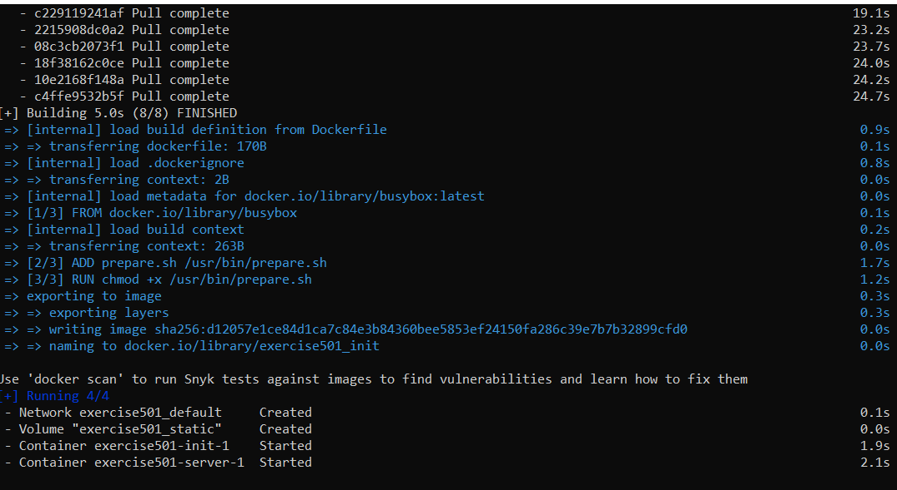
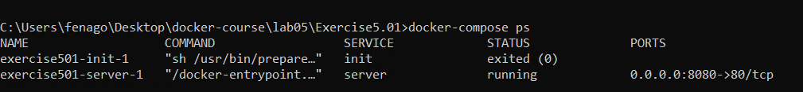

Lab 5: Composing Environments with Docker Compose
=================================================

This lab covers the creation and management of multi-container
applications using Docker Compose. You will learn how to create Docker
Compose files to define complex containerized applications and how to
run the Docker Compose CLI to manage the life cycle of multi-container
applications. This lab will enable you to configure Docker Compose
applications with different methods and design applications with
dependencies on other applications.


Docker Compose CLI
==================


Test the CLI and installation with the following command in the terminal on all operating systems:

    
    ```
    docker-compose version
    ```
    

    If it is installed correctly, you will see the versions of the CLI
    and its dependencies as follows. For instance, in the following
    output, the `docker-compose` CLI has version
    and its dependencies, `docker-py`,
    `CPython`, and `OpenSSL`, are also listed with
    their versions:

    


Docker Compose CLI Commands
---------------------------

The `docker-compose` command is capable of managing the
complete life cycle of multi-containers applications. With the
subcommands, it is possible to start, stop, and recreate services. Also,
it is possible to check the status of the running stacks and get the
logs. You will get hands-on experience with the essential commands
throughout this lab. Likewise, a preview of all capabilities can be
listed with the following command:


```
docker-compose --help
```


The output of the command should look like the following:


There are three essential `docker-compose` commands that are
used to manage the life cycle of applications. The life cycle and
commands can be illustrated as follows:


Exercise 5.01: Getting Started with Docker Compose
--------------------------------------------------

Web servers in containers require operational tasks before starting,
such as configuration, file downloads, or dependency installations. With
`docker-compose`, it is possible to define those operations as
multi-container applications and run them with a single command. In this
exercise, you will create a preparation container to generate static
files, such as `index.html` files. Then, the server container
will serve the static files, and it will be reachable from the host
machine by the network configuration. You will also manage the life
cycle of the application using various `docker-compose`
commands.

To complete the exercise, execute the following steps:

1.  Create a folder named `server-with-compose` and navigate
    into it using the `cd` command:
    
    ```
    mkdir server-with-compose
    cd server-with-compose
    ```
    

2.  Create a folder with the name `init` and navigate into it
    using the `cd` command:
    
    ```
    mkdir init
    cd init
    ```
    

3.  Create a Bash script file with the following content and save it as
    `prepare.sh`:

    
    ```
    #!/usr/bin/env sh
    rm /data/index.html
    echo "<h1>Welcome from Docker Compose!</h1>" >> /data/index.html
    echo "" >> /data/index.html
    ```
    

    This script generates a sample HTML page with the `echo`
    commands.

4.  Create a `Dockerfile` with the name `Dockerfile`
    and the following content:

    
    ```
    FROM busybox
    ADD prepare.sh /usr/bin/prepare.sh
    RUN chmod +x /usr/bin/prepare.sh
    ENTRYPOINT ["sh", "/usr/bin/prepare.sh"] 
    ```
    

    This `Dockerfile` is based on `busybox`, which
    is a tiny operating system for space-efficient containers, and it
    adds the `prepare.sh` script into the filesystem. In
    addition, it makes the file executable and set it as the
    `ENTRYPOINT` command. The `ENTRYPOINT` command,
    in our case, the `prepare.sh` script is initialized with
    the start of the Docker container.

5.  Change the directory to the parent folder with the `cd ..`
    command and create a `docker-compose.yaml` file with the
    following content:

    
    ```
    version: "3"
    services:
      init:
        build:
          context: ./init
        volumes:
          - static:/data
          
      server:
        image: nginx
        volumes:
          - static:/usr/share/nginx/html  
        ports:
          - "8080:80"
    volumes:
      static:
    ```
    

    This `docker-compose` file creates one volume named
    `static`, and two services with the names `init`
    and `server`. The volume is mounted to both containers. In
    addition, the server has published port `8080`, connecting
    to container port `80`.

6.  Start the application with the following command in
    `detach` mode to continue using the Terminal:

    
    ```
    docker-compose up --detach 
    ```
    

    The following image shows what happens when the preceding command
    is executed:

    

    


    The preceding command creates and starts the containers in
    `detached` mode. It starts by creating the
    `server-with-compose_default` network and the
    `server-with-compose_static` volume. Then, it builds the
    `init` container using the `Dockerfile` from
    *step 4*, downloads the `nginx` Docker image for the
    server, and starts the containers. Finally, it prints the names of
    the containers and makes them run in the background.

    Note

    You can disregard the warning about Swarm mode since we want to
    deploy all containers to the same node.

7.  Check the status of the application with the
    `docker-compose ps` command:

    

    


    This output lists two containers. The `init` container
    exited successfully with code `0`, while the
    `server` container is `Up` and its port is
    available. This is the expected output since the `init`
    container is designed to prepare the `index.html` file and
    complete its operations, whereas the `server` container
    should always be up and running.

8.  Open `http://localhost:8080` in the browser. The following
    figure shows the output:

    

    


    *Figure 5.9* shows the `index.html` page created by the
    `init` container. In other words, it shows that
    `docker-compose` created the volume, mounted it to the
    containers, and started them successfully.

9.  Stop and remove all the resources with the following command if you
    do not need the application up and running:

    
    ```
    docker-compose down
    ```
    

    The command will return output like the following:

    

    


In this exercise, a multi-container application was created and
configured by `docker-compose`. Networking and volume options
were stored in the `docker-compose.yaml` file. In addition,
CLI commands were shown in action for creating applications, checking
the status, and removing the applications.

In the following section, configuration options for applications in the
Docker Compose environment will be presented.


Exercise 5.02: Configuring Services with Docker Compose
-------------------------------------------------------

Services in Docker Compose are configured by environment variables. In
this exercise, you will create a Docker Compose application that is
configured by different methods of setting variables. In a file called
`print.env`, you will define two environment variables. In
addition, you will create and configure one environment variable in the
`docker-compose.yaml` file and pass one environment variable
from the Terminal on the fly. You will see how four environment
variables from different sources come together in your container.

To complete the exercise, execute the following steps:

1.  Create a folder named `server-with-configuration` and
    navigate into it using the `cd` command:
    
    ```
    mkdir server-with-configuration
    cd server-with-configuration
    ```
    

2.  Create an `.env` file with the name `print.env`
    and the following content:

    
    ```
    ENV_FROM_ENV_FILE_1=HELLO
    ENV_FROM_ENV_FILE_2=WORLD
    ```
    

    In this file, two environment variables,
    `ENV_FROM_ENV_FILE_1` and `ENV_FROM_ENV_FILE_2`,
    are defined with their values.

3.  Create a file with the name `docker-compose.yaml` and the
    following content:

    
    ```
    version: "3"
    services:
      print:
        image: busybox
        command: sh -c 'sleep 5 && env'
        env_file:
        - print.env
        environment:
        - ENV_FROM_COMPOSE_FILE=HELLO
        - ENV_FROM_SHELL
    ```
    

    In this file, a single-container application is defined, and the
    container runs the `env` command to print the environment
    variables. It also uses the environment file named
    `print.env`, and two additional environment variables,
    `ENV_FROM_COMPOSE_FILE` and `ENV_FROM_SHELL`.

4.  Export `ENV_FROM_SHELL` to the shell with the following
    command:
    
    ```
    export ENV_FROM_SHELL=WORLD
    ```
    

5.  Start the application with the `docker-compose up`
    command. The output should look like the following:
    

    


The output is the result of the `print` container defined in
the `docker-compose` file. The container has one command to
run, `env`, and it prints the available environment variables.
As expected, there are two environment variables,
`ENV_FROM_ENV_FILE_1` and `ENV_FROM_ENV_FILE_2`,
with the corresponding values of `HELLO` and
`WORLD`. In addition, the environment variable defined in the
`docker-compose.yaml` file in *step 3* is available with the
name `ENV_FROM_COMPOSE_FILE` and the value `HELLO`.
Finally, the environment variable exported in *step 4* is available with
the name `ENV_FROM_SHELL` and the value `WORLD`.

In this exercise, a Docker Compose application was created and
configured with different methods. Using Docker Compose files,
environment definition files and exported values can be used to deploy
the same application to different platforms.

Since Docker Compose manages multi-container applications, there is a
need to define the interdependencies between them. The interdependencies
of the containers in the Docker Compose applications will be presented
in the following section.


In the following exercise, the order of containers will be used to fill
the contents of a file and then serve it with a web server.


Exercise 5.03: Service Dependency with Docker Compose
-----------------------------------------------------

Services in Docker Compose can be configured to depend on other
services. In this exercise, you will create an application with four
containers. The first three containers will run consecutively to create
a static file that will be served by the fourth container.

To complete the exercise, execute the following steps:

1.  Create a folder named `server-with-dependency` and
    navigate into it using the `cd` command:
    
    ```
    mkdir server-with-dependency
    cd server-with-dependency
    ```
    

2.  Create a file with the name `docker-compose.yaml` and the
    following content:

    
    ```
    version: "3"
    services:
      clean:
        image: busybox
        command: "rm -rf /static/index.html"
        volumes:
          - static:/static 
      init:
        image: busybox
        command: "sh -c 'echo This is from init container >>       /static/index.html'"
        volumes:
          - static:/static 
        depends_on:
        - "clean"
      pre:
        image: busybox
        command: "sh -c 'echo This is from pre container >>       /static/index.html'"
        volumes:
          - static:/static 
        depends_on:
        - "init"
      server:
        image: nginx
        volumes:
          - static:/usr/share/nginx/html  
        ports:
          - "8080:80"
        depends_on:
        - "pre"
    volumes:
      static:
    ```
    

    This file consists of four services and one volume. The volume is
    named `static`, and it is mounted to all services. The
    first three services take individual actions on the static volume.
    The `clean` container removes the `index.html`
    file, and then the `init` container starts filling
    `index.html`. Following that, the `pre`
    container writes an additional line to the `index.html`
    file. Finally, the `server` container serves the content
    in the `static` folder.

3.  Start the application with the `docker-compose up`
    command. The output should look like the following:

    

    


    The output shows that Docker Compose creates the containers in the
    order of `clean`, `init`, and then
    `pre`.

4.  Open `http://localhost:8080` in the browser:

    

    


    The output from the server shows that the `clean`,
    `init`, and `pre` containers work in the
    expected order.

5.  Return to the Terminal in *step 3* and use *Ctrl* + *C* to close the
    application gracefully. You will see some HTTP request logs and, in
    the end, the `Stopping server-with-dependency_server_1`
    line:
    

    


In this exercise, a Docker Compose application was created with
interdependent services. How Docker Compose starts and manages
containers in a defined order was shown. This is an essential feature of
Docker Compose with which you can create complex multi-container
applications.

Now, let\'s test the knowledge we have gained so far in this lab by
implementing the following activity. In the next activity, you will
learn how to install WordPress using Docker Compose.


Activity 5.01: Installing WordPress Using Docker Compose
--------------------------------------------------------

You are assigned to design and deploy a blog with its database as
microservices in Docker. You will be using **WordPress** since it is the
most popular **Content Management System** (**CMS**), used by more than
one-third of all the websites on the internet. Also, the development and
testing teams require the installation of both WordPress and the
database multiple times on different platforms with isolation.
Therefore, you are required to design it as a Docker Compose application
and manage it with the `docker-compose` CLI.

Perform the following steps to complete this activity:

1.  Start by creating a directory for your
    `docker-compose.yaml` file.
2.  Create a service for the database using MySQL and a volume defined
    in the `docker-compose.yaml` file. Ensure that the
    `MYSQL_ROOT_PASSWORD`, `MYSQL_DATABASE`,
    `MYSQL_USER`, and `MYSQL_PASSWORD` environment
    variables are set.
3.  Create a service for WordPress defined in the
    `docker-compose.yaml` file. Ensure that the WordPress
    containers start after the database. For the configuration of
    WordPress, do not forget to set the `WORDPRESS_DB_HOST`,
    `WORDPRESS_DB_USER`, `WORDPRESS_DB_PASSWORD`,
    and `WORDPRESS_DB_NAME` environment variables in
    accordance with *step 2*. In addition, you need to publish its port
    to be able to reach it from the browser.
4.  Start the Docker Compose application in `detached` mode.
    Upon successful deployment, you will have two containers running:
    

    


You will then be able to reach the setup screen of WordPress in the
browser:


In the next activity, you will get hands-on experience installing the
Panoramic Trekking App using Docker Compose by creating a
three-container Docker application and managing it with the
`docker-compose` CLI.


Activity 5.02: Installing the Panoramic Trekking App Using Docker Compose
-------------------------------------------------------------------------

You are tasked with creating a deployment of the Panoramic Trekking App
using Docker Compose. You will take advantage of the three-tier
architecture of the Panoramic Trekking App and create a three-container
Docker application, with containers for the database, the web backend,
and `nginx`. Therefore, you will design it as a Docker Compose
application and manage it with the `docker-compose` CLI.

Perform the following steps to complete this activity:

1.  Create a directory for your `docker-compose.yaml` file.

2.  Create a service for the database using PostgreSQL and a volume
    defined in the `docker-compose.yaml` file. Ensure that the
    `POSTGRES_PASSWORD` environment variable is set to
    `docker`. In addition, you need to create a
    `db_data` volume in `docker-compose.yaml` and
    mount it to the `/var/lib/postgresql/data/` to store the
    database files.

3.  Create a service for the Panoramic Trekking App defined in the
    `docker-compose.yaml` file. Ensure that you are using the
    `fenago/docker-course:lab5-pta-web`
    Docker image, which is prebuilt and ready to use from the registry.
    In addition, since the application is dependent on the database, you
    should configure the container to start after the database. To store
    the static files, create a `static_data` volume in
    `docker-compose.yaml` and mount it to
    `/service/static/`.

    Finally, create a service for `nginx` and ensure that you
    are using the
    `fenago/docker-course:lab5-pta-nginx`
    Docker image from the registry. Ensure that the `nginx`
    container starts after the Panoramic Trekking App container. You
    also need to mount the same `static_data` volume to the
    `/service/static/` location. Do not forget to publish
    `nginx` port `80` to `8000` to reach
    from the browser.

4.  Start the Docker Compose application in `detached` mode.
    Upon successful deployment, you will have three containers running:

    

    


5.  Go to the administration section of the Panoramic Trekking App in
    the browser with the address `http://0.0.0.0:8000/admin`:

    

    


    You can log in with the username `admin` and password
    `changeme` and add new photos and countries:

    

    


6.  Access the Panoramic Trekking App at the address
    `http://0.0.0.0:8000/photo_viewer` in the browser:
    

    


Summary
=======

In this lab, the main focus was to learn `docker-compose`
comprehensively. With this aim, the lab started with the
capabilities of the `docker-compose` CLI with its commands and
flags. Then, the anatomy of `docker-compose.yaml` files was
presented. The power of Docker Compose actually comes from the
configuration capabilities defined in the
`docker-compose.yaml` files. Therefore, it is essential to
learn how to use these files to manage multi-container applications.

Following that, the configuration of services in Docker Compose was
illustrated. You have learned how to configure services for different
environments and adapt to changes in the future. We then moved on to
service dependencies to learn how to create more complex containerized
applications.

In the next lab, you will learn about networking in Docker.