Introduction to Docker Networking
====================================


Overview

The goal of this lab is to provide you with a concise overview of
how container networking works, how it differs from networking at the
level of the Docker host, and how containers can leverage Docker
networking to provide direct network connectivity to other containerized
services. By the end of this lab, you will know how to deploy
containers using networking configurations such as `bridge`,
`overlay`, `macvlan`, and `host`. You will
learn the benefits of different networking drivers and under which
circumstances you should choose certain network drivers. Finally, we
will look at containerized networking between hosts deployed in a Docker
swarm cluster.


Introduction
============


Throughout this workshop, we have looked at many aspects of
containerization and microservices architecture in relation to Docker.
We have learned about how encapsulating applications into microservices
that perform discrete functions creates an incredibly flexible
architecture that enables rapid deployments and powerful horizontal
scaling. Perhaps one of the more interesting and complex topics as it
relates to containerization is networking. After all, in order to
develop a flexible and agile microservices architecture, proper
networking considerations need to be made to ensure reliable
connectivity between container instances.

When referring to **container networking**, always try to keep in mind
the difference between networking on the container host (underlay
networking) and networking between containers on the same host or within
different clusters (`overlay` networking). Docker supports
many different types of network configurations out of the box that can
be customized to suit the needs of your infrastructure and deployment
strategy.

For example, a container may have an IP address, unique to that
container instance, that exists on a virtual subnet between the
container hosts. This type of networking is typical of a Docker swarm
clustered configuration in which network traffic gets encrypted and
passed over the host machine\'s network interfaces, only to be decrypted
on a different host and then passed to the receiving microservice. This
type of network configuration usually involves Docker maintaining a
mapping of container and service names to container IP addresses. This
provides powerful service discovery mechanisms that allow container
networking even when containers terminate and restart on different
cluster hosts.

Alternatively, containers may run in a more simplistic host networking
mode. In this scenario, containers running in a cluster or a standalone
host expose ports on the host machine\'s network interfaces to send and
receive network traffic. The containers themselves may still have their
IP addresses, which get mapped to physical network interfaces on the
hosts by Docker. This type of network configuration is useful when your
microservices need to communicate primarily with services that exist
outside your containerized infrastructure.

By default, Docker operates in a **bridge network mode**. A
`bridge` network creates a single network interface on the
host that acts as a bridge to another subnet configured on the host. All
incoming (ingress) and outgoing (egress) network traffic travel between
the container subnet and the host using the `bridge` network
interface.

After installing Docker Engine in a Linux environment, if you run the
`ifconfig` command, Docker will create a new virtual bridged
network interface called `docker0`. This interface bridges a
Docker private subnet that gets created by default (usually
`172.16.0.0/16`) to the host machine\'s networking stack. If a
container is running in the default Docker network with an IP address of
`172.17.8.1` and you attempt to contact that IP address, the
internal route tables will direct that traffic through the
`docker0` `bridge` interface and pass the traffic to
the IP address of the container on the private subnet. Unless ports are
published through Docker, this container\'s IP address cannot be
accessed by the outside world. Throughout this lab, we will dive
deep into various network drivers and configuration options provided by
Docker.

In the next exercise, we will look at creating Docker containers in the
default Docker `bridge` network and how to expose container
ports to the outside world.


Exercise 6.01: Hands-On with Docker Networking
----------------------------------------------

By default, when you run a container in Docker, the container instance
you create will exist in a Docker network. Docker networks are
collections of subnets, rules, and metadata that Docker uses to allocate
network resources to containers running in the immediate Docker server
or across servers in a Docker swarm cluster. The network will provide
the container with access to other containers in the same subnet, and
even outbound (egress) access to other external networks, including the
internet. Each Docker network is associated with a network driver that
determines how the network will function within the context of the
system the containers are running on.

In this exercise, you will run Docker containers and use basic
networking to run two simple web servers (Apache2 and NGINX) that will
expose ports in a few different basic networking scenarios. You will
then access the exposed ports of the container to learn more about how
Docker networking works at the most basic level. Launching containers
and exposing the service ports to make them available is one of the most
common networking scenarios when first starting with containerized
infrastructure:

1.  List the networks that are currently configured in your Docker
    environment using the `docker network ls` command:

    
    ```
    docker network ls
    ```
    

    The output displayed will show all the configured Docker networks
    available on your system. It should resemble the following:

    
    ```
    NETWORK ID      NAME      DRIVER     SCOPE
    0774bdf6228d    bridge    bridge     local
    f52b4a5440ad    host      host       local
    9bed60b88784    none      null       local
    ```
    

2.  When creating a container using Docker without specifying a network
    or networking driver, Docker will create the container using a
    `bridge` network. This network exists behind a
    `bridge` network interface configured in your host OS. Use
    `ifconfig` in a Linux or macOS Bash shell, or
    `ipconfig` in Windows PowerShell, to see which interface
    the Docker bridge is configured as. It is generally called
    `docker0`:

    
    ```
    $ ifconfig 
    ```
    

    The output of this command will list all the network interfaces
    available in your environment, as shown in the following figure:

    
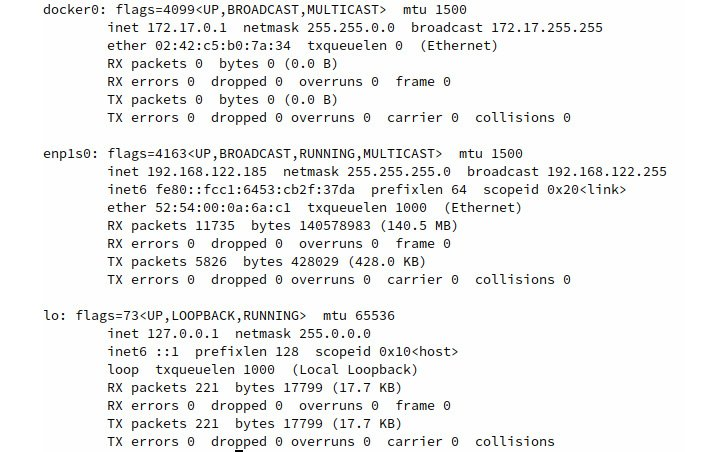
    

    Figure 6.1: Listing the available network interfaces

    It can be observed in the preceding figure that the Docker
    `bridge` interface is called `docker0` and has
    an IP address of `172.17.0.1`.

3.  Use the `docker run` command to create a simple NGINX web
    server container, using the `latest` image tag. Set the
    container to start in the background using the `-d` flag
    and give it a human-readable name of `webserver1` using
    the `--name` flag:

    
    ```
    docker run -d –-name webserver1 nginx:latest 
    ```
    

    If the command is successful, no output will be returned in the
    terminal session.

4.  Execute the `docker ps` command to check whether the
    container is up and running:

    
    ```
    docker ps
    ```
    

    As you can see, the `webserver1` container is up and
    running as expected:

    
    ```
    CONTAINER ID  IMAGE         COMMAND                 CREATED
      STATUS                   PORTS               NAMES
    0774bdf6228d  nginx:latest  "nginx -g 'daemon of…"  4 seconds ago
      Up 3 seconds             80/tcp              webserver1
    ```
    

5.  Execute the `docker inspect` command to check what
    networking configuration this container has by default:

    
    ```
    docker inspect webserver1
    ```
    

    Docker will return the verbose details about the running container
    in JSON format. For this exercise, focus on the
    `NetworkSettings` block. Pay special attention to the
    `Gateway`, `IPAddress`, `Ports`, and
    `NetworkID` parameters underneath the `networks`
    sub-block:

    

    

    Figure 6.2: Output of the docker inspect command

    From this output, it can be concluded that this container lives in
    the default Docker `bridge` network. Looking at the first
    12 characters of `NetworkID`, you will observe that it is
    the same identifier used in the output of the
    `docker network ls` command, which was executed in *step
    1*. It should also be noted that the `Gateway` this
    container is configured to use is the IP address of the
    `docker0` `bridge` interface. Docker will use
    this interface as an egress point to access networks in other
    subnets outside itself, as well as forwarding traffic from our
    environment to the containers in the subnet. It can also be observed
    that this container has a unique IP address within the Docker bridge
    network, `172.17.0.2` in this example. Our local machine
    has the ability to route to this subnet since we have the
    `docker0` `bridge` interface available to
    forward traffic. Finally, it can be observed that the NGINX
    container is by default exposing TCP port `80` for
    incoming traffic.

6.  In a web browser, access the `webserver1` container by IP
    address over port `80`. Enter the IP address of the
    `webserver1` container in your favorite web browser:

    
    
    

    Figure 6.3: Accessing an NGINX web server container by IP address
    through the default Docker bridge network

7.  Alternatively, use the `curl` command to see similar
    output, albeit in text format:

    
    ```
    $ curl 172.17.0.2:80
    ```
    

    The following HTML response indicates that you have received a
    response from the running NGINX container:

    
    ```
    <!DOCTYPE html>
    <html>
    <head>
    <title>Welcome to nginx!</title>
    <style>
        body {
            width: 35em;
            margin: 0 auto;
            font-family: Tahoma, Verdana, Arial, sans-serif;
        }
    </style>
    </head>
    <body>
    <h1>Welcome to nginx!</h1>
    <p>If you see this page, the nginx web server is successfully 
    installed and working. Further configuration is required.</p>
    <p>For online documentation and support please refer to
    <a href="http://nginx.org/">nginx.org</a>.<br/>
    Commercial support is available at
    <a href="http://nginx.com/">nginx.com</a>.</p>
    <p><em>Thank you for using nginx.</em></p>
    </body>
    </html>
    ```
    

8.  Accessing the IP address of a container in the local
    `bridge` subnet works well for testing containers locally.
    To expose your service on the network to other users or servers, use
    the `-p` flag in the `docker run` command. This
    will allow you to map a port on the host to an exposed port on the
    container. This is similar to port forwarding on a router or other
    network device. To expose a container by the port to the outside
    world, use the `docker run` command followed by the
    `-d` flag to start the container in the background. The
    `-p` flag will enable you to specify a port on the host,
    separated by a colon and the port on the container that you wish to
    expose. Also, give this container a unique name,
    `webserver2`:

    
    ```
    docker run -d -p 8080:80 –-name webserver2 nginx:latest
    ```
    

    Upon successful container startup, your shell will not return
    anything. However, certain versions of Docker may show the full
    container ID.

9.  Run the `docker ps` command to check whether you have two
    NGINX containers up and running:

    
    ```
    docker ps
    ```
    

    The two running containers, `webserver1` and
    `webserver2`, will be displayed:

    
    ```
    CONTAINER ID IMAGE         COMMAND                 CREATED
      STATUS              PORTS                  NAMES
    b945fa75b59a nginx:latest  "nginx -g 'daemon of…"  1 minute ago
      Up About a minute   0.0.0.0:8080->80/tcp   webserver2
    3267bf4322ed nginx:latest  "nginx -g 'daemon of…"  2 minutes ago
      Up 2 minutes        80/tcp                 webserver1
    ```
    

    In the `PORTS` column, you will see that Docker is now
    forwarding port `80` on the `webserver`
    container to port `8080` on the host machine. That is
    deduced from the `0.0.0.0:8080->80/tcp` part of the
    output.

    Note

    It is important to remember that the host machine port is always to
    the left of the colon, while the container port is to the right when
    specifying ports with the `-p` flag.

10. In your web browser, navigate to `http://localhost:8080`
    to see the running container instance you just spawned:

    
    
    

    Figure 6.4: NGINX default page indicating that you have successfully
    forwarded a port to your web server container

11. Now, you have two NGINX instances running in the same Docker
    environment with slightly different networking configurations. The
    `webserver1` instance is running solely on the Docker
    network without any ports exposed. Inspect the configuration of the
    `webserver2` instance using the `docker inspect`
    command followed by the container name or ID:

    
    ```
    docker inspect webserver2
    ```
    

    The `NetworkSettings` section at the bottom of the JSON
    output will resemble the following. Pay close attention to the
    parameters (`Gateway`, `IPAddress`,
    `Ports`, and `NetworkID`) underneath the
    `networks` sub-block:

    
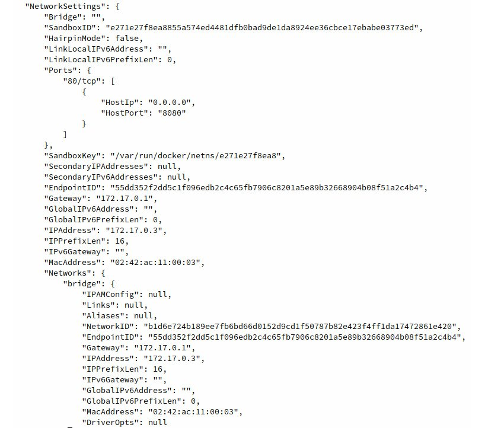
    

    Figure 6.5: Output from the docker inspect command

    As the `docker inspect` output displays, the
    `webserver2` container has an IP address of
    `172.17.0.3`, whereas your `webserver1`
    container has an IP address of `172.17.0.1`. The IP
    addresses in your local environment may be slightly different
    depending on how Docker assigns the IP addresses to the containers.
    Both the containers live on the same Docker network
    (`bridge`) and have the same default gateway, which is the
    `docker0` `bridge` interface on the host
    machine.

12. Since both of these containers live on the same subnet, you can test
    communication between the containers within the Docker
    `bridge` network. Run the `docker exec` command
    to gain access to a shell on the `webserver1` container:

    
    ```
    docker exec -it webserver1 /bin/bash
    ```
    

    The prompt should noticeably change to a root prompt, indicating you
    are now in a Bash shell on the `webserver1` container:

    
    ```
    root@3267bf4322ed:/#
    ```
    

13. At the root shell prompt, use the `apt` package manager to
    install the `ping` utility in this container:

    
    ```
    root@3267bf4322ed:/# apt-get update && apt-get install -y inetutils-ping
    ```
    

    The aptitude package manager will then install the `ping`
    utility in the `webserver1` container. Please note that
    the `apt` package manager will install `ping` as
    well as other dependencies that are required to run the
    `ping` command:

    
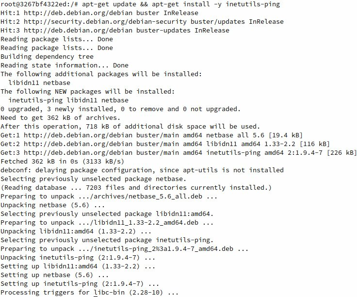
    

    Figure 6.6: Installing the ping command inside a Docker container

14. Once the `ping` utility has successfully installed, use it
    to ping the IP address of the other container:

    
    ```
    root@3267bf4322ed:/# ping 172.17.0.3
    ```
    

    The output should display ICMP response packets, indicating that the
    containers can successfully ping each other through the Docker
    `bridge` network:

    
    ```
    PING 172.17.0.1 (172.17.0.3): 56 data bytes
    64 bytes from 172.17.0.3: icmp_seq=0 ttl=64 time=0.221 ms
    64 bytes from 172.17.0.3: icmp_seq=1 ttl=64 time=0.207 ms
    ```
    

15. You can also access the NGINX default web interface using the
    `curl` command. Install `curl` using the
    `apt` package manager:

    
    ```
    root@3267bf4322ed:/# apt-get install -y curl
    ```
    

    The following output should display, indicating that the
    `curl` utility and all required dependencies are being
    installed:

    
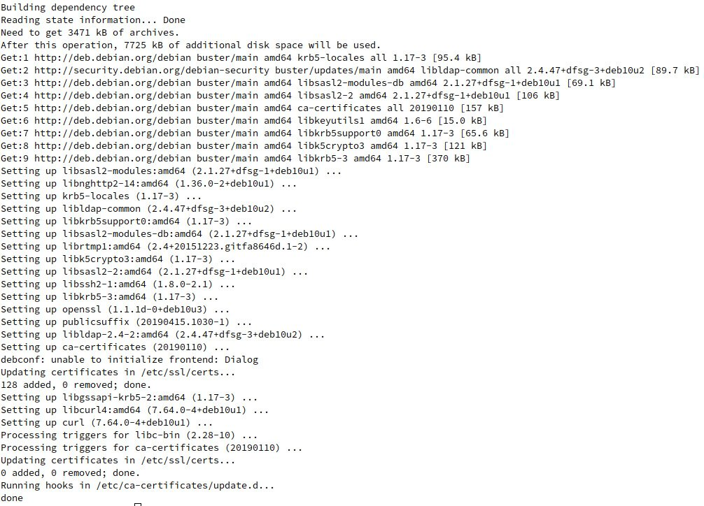
    

    Figure 6.7: Installing the curl utility

16. After installing `curl`, use it to curl the IP address of
    `webserver2`:

    
    ```
    root@3267bf4322ed:/# curl 172.17.0.3
    ```
    

    You should see the `Welcome to nginx!` page displayed in
    HTML format, indicating that you were able to successfully contact
    the IP address of the `webserver2` container through the
    Docker `bridge` network:

    
    ```
    <!DOCTYPE html>
    <html>
    <head>
    <title>Welcome to nginx!</title>
    <style>
        body {
            width: 35em;
            margin: 0 auto;
            font-family: Tahoma, Verdana, Arial, sans-serif;
        }
    </style>
    </head>
    <body>
    <h1>Welcome to nginx!</h1>
    <p>If you see this page, the nginx web server is successfully 
    installed and working. Further configuration is required.</p>
    <p>For online documentation and support please refer to
    <a href="http://nginx.org/">nginx.org</a>.<br/>
    Commercial support is available at
    <a href="http://nginx.com/">nginx.com</a>.</p>
    <p><em>Thank you for using nginx.</em></p>
    </body>
    </html>
    ```
    

    Since you are using `curl` to navigate to the NGINX
    welcome page, it will render on your terminal display in raw HTML
    format.

In this section, we have successfully spawned two NGINX web server
instances in the same Docker environment. We configured one instance to
not expose any ports outside the default Docker network, while we
configured the second NGINX instance to run on the same network but to
expose port `80` to the host system on port `8080`.
We saw how these containers could be accessed using a standard internet
web browser as well as by the `curl` utility in Linux.

During this exercise, we also saw how containers can use Docker networks
to talk to other containers directly. We used the `webserver1`
container to call the IP address of the `webserver2` container
and display the output of the web page the container was hosting.

In this exercise, we were also able to demonstrate network connectivity
between container instances using the native Docker `bridge`
network. However, when we deploy containers at scale, there is no easy
way to know which IP address in the Docker network belongs to which
container.

In the next section, we will look at native Docker DNS and learn how to
use human-readable DNS names to reliably send network traffic to other
container instances.


Native Docker DNS
=================


One of the biggest benefits of running a containerized infrastructure is
the ability to quickly and effortlessly scale your workloads
horizontally. Having more than one machine in a cluster with a shared
`overlay` network between them means that you can have many
containers running across fleets of servers.

As we saw in the previous exercise, Docker gives us the power to allow
containers to directly talk to other containers in a cluster through the
various network drivers that Docker provides, such as
`bridge`, `macvlan`, and `overlay`
drivers. In the previous example, we leveraged Docker `bridge`
networking to allow containers to talk to each other by their respective
IP addresses. However, when your containers are deployed on real
servers, you can\'t normally rely on containers having consistent IP
addresses that they can use to talk to each other. Every time a new
container instance terminates or respawns, Docker will give that
container a new IP address.

Similar to a traditional infrastructure scenario, we can leverage DNS
within container networks to give containers a reliable way to
communicate with each other. By assigning human-readable names to
containers within Docker networks, users no longer have to look up the
IP address each time they want to initiate communication between
containers on a Docker network. Docker itself will keep track of the IP
addresses of the containers as they spawn and respawn.

In older legacy versions of Docker, simple DNS resolution was possible
by establishing links between containers using the `--link`
flag in the `docker run` command. Using linking, Docker would
create an entry in the linked container\'s `hosts` file, which
would enable simple name resolution. However, as you will see in the
upcoming exercise, using links between containers can be slow, not
scalable, and prone to errors. Recent versions of Docker support a
native DNS service between containers running on the same Docker
network. This allows containers to look up the names of other containers
running in the same Docker network. The only caveat with this approach
is that native Docker DNS doesn\'t work on the default Docker
`bridge` network; thus, other networks must first be created
to build your containers in.

For native Docker DNS to work, we must first create a new network using
the `docker network create` command. We can then create new
containers in that network using `docker run` with the
`--network-alias` flag. In the following exercise, we are
going to use these commands to learn how native Docker DNS works to
enable scalable communication between container instances.


Exercise 6.02: Working with Docker DNS
--------------------------------------

In the following exercise, you will learn about name resolution between
Docker containers running on the same network. You will first enable
simple name resolution using the legacy link method. You will contrast
this approach by using the newer and more reliable native Docker DNS
service:

1.  First, create two Alpine Linux containers on the default Docker
    `bridge` network that will communicate with each other
    using the `--link` flag. Alpine is a very good base image
    for this exercise because it contains the `ping` utility
    by default. This will enable you to quickly test the connectivity
    between containers in the various scenarios. To get started, create
    a container called `containerlink1` to indicate that you
    have created this container using the legacy link method:

    
    ```
    docker run -itd --name containerlink1 alpine:latest
    ```
    

    This will start a container in the default Docker network called
    `containerlink1`.

2.  Start another container in the default Docker bridge network, called
    `containerlink2`, which will create a link to
    `containerlink1` to enable rudimentary DNS:

    
    ```
    docker run -itd --name containerlink2 --link containerlink1 alpine:latest
    ```
    

    This will start a container in the default Docker network called
    `containerlink2`.

3.  Run the `docker exec` command to access a shell inside the
    `containerlink2` container. This will allow you to
    investigate how the link functionality is working. Since this
    container is running Alpine Linux, you do not have access to the
    Bash shell by default. Instead, access it using an `sh`
    shell:

    
    ```
    docker exec -it containerlink2 /bin/sh
    ```
    

    This should drop you into a root `sh` shell in the
    `containerlink2` container.

4.  From the shell of the `containerlink2` container, ping
    `containerlink1`:

    
    ```
    / # ping containerlink1
    ```
    

    You will get a reply to the `ping` request:

    
    ```
    PING container1 (172.17.0.2): 56 data bytes
    64 bytes from 172.17.0.2: seq=0 ttl=64 time=0.307 ms
    64 bytes from 172.17.0.2: seq=1 ttl=64 time=0.162 ms
    64 bytes from 172.17.0.2: seq=2 ttl=64 time=0.177 ms
    ```
    

5.  Use the `cat` utility to have a look at the
    `/etc/hosts` file of the `containerlink2`
    container. The `hosts` file is a list of routable names to
    IP addresses that Docker can maintain and override:

    
    ```
    / # cat /etc/hosts
    ```
    

    The output of the `hosts` file should display and resemble
    the following:

    
    ```
    127.0.0.1  localhost
    ::1  localhost ip6-localhost ip6-loopback
    fe00::0    ip6-localnet
    ff00::0    ip6-mcastprefix
    ff02::1    ip6-allnodes
    ff02::2    ip6-allrouters
    172.17.0.2    containerlink1 032f038abfba
    172.17.0.3    9b62c4a57ce3
    ```
    

    From the output of the `hosts` file of the
    `containerlink2` container, observe that Docker is adding
    an entry for the `containerlink1` container name as well
    as its container ID. This enables the `containerlink2`
    container to know the name, and the container ID is mapped to the IP
    address `172.17.0.2`. Typing the `exit` command
    will terminate the `sh` shell session and bring you back
    to your environment\'s main terminal.

6.  Run `docker exec` to access an `sh` shell inside
    the `containerlink1` container:

    
    ```
    docker exec -it containerlink1 /bin/sh
    ```
    

    This should drop you into the shell of the
    `containerlink1` container.

7.  Ping the `containerlink2` container using the
    `ping` utility:

    
    ```
    / # ping containerlink2
    ```
    

    You should see the following output:

    
    ```
    ping: bad address 'containerlink2'
    ```
    

    It is not possible to ping the `containerlink2` container
    since linking containers only works unidirectionally. The
    `containerlink1` container has no idea that the
    `containerlink2` container exists since no
    `hosts` file entry has been created in the
    `containerlink1` container instance.

    Note

    You can only link to running containers using the legacy link method
    between containers. This means that the first container cannot link
    to containers that get started later. This is one of the many
    reasons why using links between containers is no longer a
    recommended approach. We are covering the concept in this lab to
    show you how the functionality works.

8.  Due to the limitations using the legacy link method, Docker also
    supports native DNS using user-created Docker networks. To leverage
    this functionality, create a Docker network called
    `dnsnet` and deploy two Alpine containers within that
    network. First, use the `docker network create` command to
    create a new Docker network using a `192.168.56.0/24`
    subnet and using the IP address `192.168.54.1` as the
    default gateway:

    
    ```
    docker network create dnsnet --subnet 192.168.54.0/24 --gateway 192.168.54.1
    ```
    

    Depending on the version of Docker you are using, the successful
    execution of this command may return the ID of the network you have
    created.

    Note

    Simply using the `docker network create dnsnet` command
    will create a network with a Docker-allocated subnet and gateway.
    This exercise demonstrates how to specify the subnet and gateway for
    your Docker network. It should also be noted that if your computer
    is attached to a subnet in the `192.168.54.0/24` subnet or
    a subnet that overlaps that space, it may cause network connectivity
    issues. Please use a different subnet for this exercise.

9.  Use the `docker network ls` command to list the Docker
    networks available in this environment:

    
    ```
    docker network ls
    ```
    

    The list of Docker networks should be returned, including the
    `dnsnet` network you just created:

    
    ```
    NETWORK ID      NAME       DRIVER     SCOPE
    ec5b91e88a6f    bridge     bridge     local
    c804e768413d    dnsnet     bridge     local
    f52b4a5440ad    host       host       local
    9bed60b88784    none       null       local
    ```
    

10. Run the `docker network inspect` command to view the
    configuration for this network:

    
    ```
    docker network inspect dnsnet
    ```
    

    The details of the `dnsnet` network should be displayed.
    Pay close attention to the `Subnet` and
    `Gateway` parameters. These are the same parameters that
    you used to create a Docker network in *Step 8*:

    
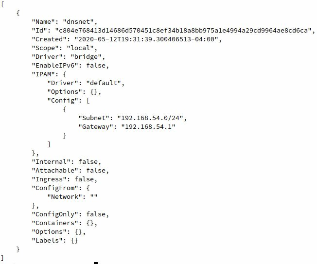
    

    Figure 6.8: Output from the docker network inspect command

11. Since this is a Docker `bridge` network, Docker will also
    create a corresponding bridge network interface for this network.
    The IP address of the `bridge` network interface will be
    the same IP address as the default gateway address you specified
    when creating this network. Use the `ifconfig` command to
    view the configured network interfaces on Linux or macOS. If you are
    using Windows, use the `ipconfig` command:

    
    ```
    $ ifconfig
    ```
    

    This should display the output of all available network interfaces,
    including the newly created `bridge` interface:

    
    
    

    Figure 6.9: Analyzing the bridge network interface for the newly
    created Docker network

12. Now that a new Docker network has been created, use the
    `docker run` command to start a new container
    (`alpinedns1`) within this network. Use the
    `docker run` command with the `--network` flag
    to specify the `dnsnet` network that was just created, and
    the `--network-alias` flag to give your container a custom
    DNS name:

    
    ```
    docker run -itd --network dnsnet --network-alias alpinedns1 --name alpinedns1 alpine:latest
    ```
    

    Upon successful execution of the command, the full container ID
    should be displayed before returning to a normal terminal prompt.

13. Start a second container (`alpinedns2`) using the same
    `--network` and `--network-alias` settings:

    
    ```
    docker run -itd --network dnsnet --network-alias alpinedns2 --name alpinedns2 alpine:latest
    ```
    

    Note

    It is important to understand the difference between the
    `–network-alias` flag and the `--name` flag. The
    `--name` flag is used to give the container a
    human-readable name within the Docker API. This makes it easy to
    start, stop, restart, and manage containers by name. The
    `--network-alias` flag, however, is used to create a
    custom DNS entry for the container.

14. Use the `docker ps` command to verify that the containers
    are running as expected:

    
    ```
    docker ps 
    ```
    

    The output will display the running container instances:

    
    ```
    CONTAINER ID    IMAGE           COMMAND      CREATED 
      STATUS              PORTS             NAMES
    69ecb9ad45e1    alpine:latest   "/bin/sh"    4 seconds ago
      Up 2 seconds                          alpinedns2
    9b57038fb9c8    alpine:latest   "/bin/sh"    6 minutes ago
      Up 6 minutes                          alpinedns1
    ```
    

15. Use the `docker inspect` command to verify that the IP
    addresses of the container instances are from within the subnet
    (`192.168.54.0/24`) that was specified:

    
    ```
    docker inspect alpinedns1
    ```
    

    The following output is truncated to show the relevant details:

    
    
    

    Figure: 6.10: Output from the Networks section of the alpinedns1
    container instance

    It can be observed from the output that the `alpinedns1`
    container was deployed with an IP address of
    `192.168.54.2`, which is a part of the subnet that was
    defined during the creation of the Docker network.

16. Execute the `docker network inspect` command in a similar
    fashion for the `alpinedns2` container:

    
    ```
    docker inspect alpinedns2
    ```
    

    The output is again truncated to display the relevant networking
    details:

    
    
    

    Figure 6.11: Output of the Networks section of the alpinedns2
    container instance

    It can be observed in the preceding output that the
    `alpinedns2` container has an IP address of
    `192.168.54.3`, which is a different IP address within the
    `dnsnet` subnet.

17. Run the `docker exec` command to access a shell in the
    `alpinedns1` container:

    
    ```
    docker exec -it alpinedns1 /bin/sh
    ```
    

    This should drop you into a root shell inside of the containers.

18. Once inside the `alpinedns1` container, use the
    `ping` utility to ping the `alpinedns2`
    container:

    
    ```
    / # ping alpinedns2
    ```
    

    The `ping` output should display successful network
    connectivity to the `alpinedns2` container instance:

    
    ```
    PING alpinedns2 (192.168.54.3): 56 data bytes
    64 bytes from 192.168.54.3: seq=0 ttl=64 time=0.278 ms
    64 bytes from 192.168.54.3: seq=1 ttl=64 time=0.233 ms
    ```
    

19. Use the `exit` command to return to your primary terminal.
    Use the `docker exec` command to gain access to a shell
    inside the `alpinedns2` container:

    
    ```
    docker exec -it alpinedns2 /bin/sh
    ```
    

    This should drop you to a shell within the `alpinedns2`
    container.

20. Use the `ping` utility to ping the `alpinedns1`
    container by name:

    
    ```
    $ ping alpinedns1
    ```
    

    The output should display successful responses from the
    `alpinedns1` container:

    
    ```
    PING alpinedns1 (192.168.54.2): 56 data bytes
    64 bytes from 192.168.54.2: seq=0 ttl=64 time=0.115 ms
    64 bytes from 192.168.54.2: seq=1 ttl=64 time=0.231 ms
    ```
    

    Note

    Docker DNS, as opposed to the legacy link method, allows
    bidirectional communication between containers in the same Docker
    network.

21. Use the `cat` utility inside any of the
    `alpinedns` containers to reveal that Docker is using true
    DNS as opposed to `/etc/hosts` file entries inside the
    container:

    
    ```
    # cat /etc/hosts
    ```
    

    This will reveal the contents of the `/etc/hosts` file
    inside the respective container:

    
    ```
    127.0.0.1  localhost
    ::1  localhost ip6-localhost ip6-loopback
    fe00::0    ip6-localnet
    ff00::0    ip6-mcastprefix
    ff02::1    ip6-allnodes
    ff02::2    ip6-allrouters
    192.168.54.2    9b57038fb9c8
    ```
    

    Use the `exit` command to terminate the shell session
    inside of the `alpinedns2` container.

22. Clean up your environment by stopping all running containers using
    the `docker stop` command:
    
    ```
    docker stop  containerlink1
    docker stop  containerlink2
    docker stop  alpinedns1
    docker stop  alpinedns2
    ```
    

23. Use the `docker system prune -fa` command to clean the
    remaining stopped containers and networks:

    
    ```
    docker system prune -fa
    ```
    

    Successfully executing this command should clean up the
    `dnsnet` network as well as the container instances and
    images:

    
    ```
    Deleted Containers:
    69ecb9ad45e16ef158539761edc95fc83b54bd2c0d2ef55abfba1a300f141c7c
    9b57038fb9c8cf30aaebe6485e9d223041a9db4e94eb1be9392132bdef632067
    Deleted Networks:
    dnsnet
    Deleted Images:
    untagged: alpine:latest
    untagged: alpine@sha256:9a839e63dad54c3a6d1834e29692c8492d93f90c
        59c978c1ed79109ea4fb9a54
    deleted: sha256:f70734b6a266dcb5f44c383274821207885b549b75c8e119
        404917a61335981a
    deleted: sha256:3e207b409db364b595ba862cdc12be96dcdad8e36c59a03b
        b3b61c946a5741a
    Total reclaimed space: 42.12M
    ```
    

    Each section of the system prune output will identify and remove
    Docker resources that are no longer in use. In this case, it will
    remove the `dnsnet` network since no container instances
    are currently deployed in this network.

In this exercise, you looked at the benefits of using name resolution to
enable communication between the containers over Docker networks. Using
name resolution is efficient since applications don\'t have to worry
about the IP addresses of the other running containers. Instead,
communication can be initiated by simply calling the other containers by
name.

We first explored the legacy link method of name resolution, by which
running containers can establish a relationship, leveraging a
unidirectional relationship using entries in the container\'s
`hosts` file. The second and more modern way to use DNS
between containers is by creating user-defined Docker networks that
allow DNS resolution bidirectionally. This will enable all containers on
the network to resolve all other containers by name or container ID
without any additional configuration.

As we have seen in this section, Docker provides many unique ways to
provide reliable networking resources to container instances, such as
enabling routing between containers on the same Docker network and
native DNS services between containers. This is only scratching the
surface of the network options that are provided by Docker.

In the next section, we will learn about deploying containers using
other types of networking drivers to truly provide maximum flexibility
when deploying containerized infrastructure.


Native Docker Network Drivers
=============================


Since Docker is one of the most broadly supported container platforms in
recent times, the Docker platform has been vetted across numerous
production-level networking scenarios. To support various types of
applications, Docker provides various network drivers that enable
flexibility in how containers are created and deployed. These network
drivers allow containerized applications to run in almost any networking
configuration that is supported directly on bare metal or virtualized
servers.

For example, containers can be deployed that share the host server\'s
networking stack, or in a configuration that allows them to be assigned
unique IP addresses from the underlay network infrastructure. In this
section, we are going to learn about the basic Docker network drivers
and how to leverage them to provide the maximum compatibility for
various types of network infrastructures:

-   `bridge`: A `bridge` is the default network that
    Docker will run containers in. If nothing is defined when launching
    a container instance, Docker will use the subnet behind the
    `docker0` interface, in which containers will be assigned
    an IP address in the `172.17.0.0/16` subnet. In a
    `bridge` network, containers have network connectivity to
    other containers in the `bridge` subnet as well as
    outbound connectivity to the internet. So far, all containers we
    have created in this lab have been in `bridge`
    networks. Docker `bridge` networks are generally used for
    simple TCP services that only expose simple ports or require
    communication with other containers that exist on the same host.
-   `host`: Containers running in the `host`
    networking mode have direct access to the host machine\'s network
    stack. This means that any ports that are exposed to the container
    are also exposed to the same ports on the host machine running the
    containers. The container also has visibility of all physical and
    virtual network interfaces running on the host. `host`
    networking is generally preferred when running container instances
    that consume lots of bandwidth or leverage multiple protocols.
-   `none`: The `none` network provides no network
    connectivity to containers deployed in this network. Container
    instances that are deployed in the `none` network only
    have a loopback interface and no access to other network resources
    at all. No driver operates this network. Containers deployed using
    the `none` networking mode are usually applications that
    operate on storage or disk workloads and don\'t require network
    connectivity. Containers that are segregated from network
    connectivity for security purposes may also be deployed using this
    network driver.
-   `macvlan`: `macvlan` networks created in Docker
    are used in scenarios in which your containerized application
    requires a MAC address and direct network connectivity to the
    underlay network. Using a `macvlan` network, Docker will
    allocate a MAC address to your container instance via a physical
    interface on the host machine. This makes your container appear as a
    physical host on the deployed network segment. It should be noted
    that many cloud environments, such as AWS, Azure, and many
    virtualization hypervisors, do not allow `macvlan`
    networking to be configured on container instances.
    `macvlan` networks allow Docker to assign containers IP
    addresses and MAC addresses from the underlay networks based on a
    physical network interface attached to the host machine. Using
    `macvlan` networking can easily lead to IP address
    exhaustion or IP address conflicts if not configured correctly.
    `macvlan` container networks are generally used in very
    specific network use cases, such as applications that monitor
    network traffic modes or other network-intensive workloads.

No conversation on Docker networking would be complete without a brief
overview of **Docker overlay networking**. `Overlay`
networking is how Docker handles networking with a swarm cluster. When a
Docker cluster is defined between nodes, Docker will use the physical
network linking the nodes together to define a logical network between
containers running on the nodes. This allows containers to talk directly
to each other between cluster nodes. In *Exercise 6.03, Exploring Docker
Networks*, we will look at the various types of Docker network drivers
that are supported in Docker by default, such as `host`,
`none`, and `macvlan`. In *Exercise 6.04*, *Defining
Overlay Networks*, we will then define a simple Docker swarm cluster to
discover how `overlay` networking works between Docker hosts
configured in a cluster mode.


Exercise 6.03: Exploring Docker Networks
----------------------------------------

In this exercise, we will look into the various types of Docker network
drivers that are supported in Docker by default, such as
`host`, `none`, and `macvlan`. We will
start with the `bridge` network and then look into the
`none`, `host`, and `macvlan` networks:

1.  First, you need to get an idea of how networking is set up in your
    Docker environment. From a Bash or PowerShell terminal, use the
    `ifconfig` or `ipconfig` command on Windows.
    This will display all the network interfaces in your Docker
    environment:

    
    ```
    $ ifconfig
    ```
    

    This will display all the network interfaces you have available. You
    should see a `bridge` interface called
    `docker0`. This is the Docker `bridge` interface
    that serves as the entrance (or ingress point) into the default
    Docker network:

    
    
    

    Figure 6.12: Example ifconfig output from your Docker development
    environment

2.  Use the `docker network ls` command to view the networks
    available in your Docker environment:

    
    ```
    docker network ls
    ```
    

    This should list the three basic network types defined previously,
    displaying the network ID, the name of the Docker network, and the
    driver associated with the network type:

    
    ```
    NETWORK ID       NAME      DRIVER     SCOPE
    50de4997649a     bridge    bridge     local
    f52b4a5440ad     host      host       local
    9bed60b88784     none      null       local
    ```
    

3.  View the verbose details of these networks using the
    `docker network inspect` command, followed by the ID or
    the name of the network you want to inspect. In this step, you will
    view the verbose details of the `bridge` network:

    
    ```
    docker network inspect bridge
    ```
    

    Docker will display the verbose output of the `bridge`
    network in JSON format:

    
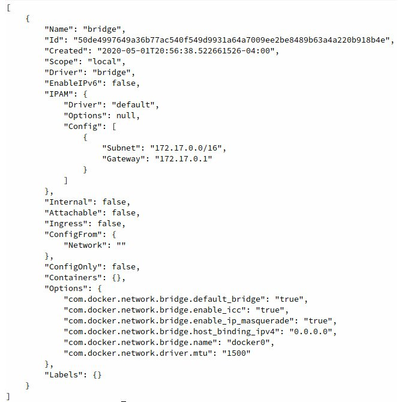
    

    Figure 6.13: Inspecting the default bridge network

    Some key parameters to note in this output are the
    `Scope`, `Subnet`, and `Gateway`
    keywords. Based on this output, it can be observed that the scope of
    this network is only the local host machine
    (`Scope: Local`). This indicates the network is not shared
    between hosts in a Docker swarm cluster. The `Subnet`
    value of this network under the `Config` section is
    `172.17.0.0/16`, and the `Gateway` address for
    the subnet is an IP address within the defined subnet
    (`172.17.0.1`). It is critical that the
    `Gateway` value of a subnet is an IP address within that
    subnet to enable containers deployed in that subnet to access other
    networks outside the scope of that network. Finally, this network is
    tied to the host interface, `docker0`, which will serve as
    the `bridge` interface for the network. The output of the
    `docker network inspect` command can be very helpful in
    getting a full understanding of how containers deployed in that
    network are expected to behave.

4.  View the verbose details of the `host` network using the
    `docker network inspect` command:

    
    ```
    docker network inspect host
    ```
    

    This will display the details of the `host` network in
    JSON format:

    
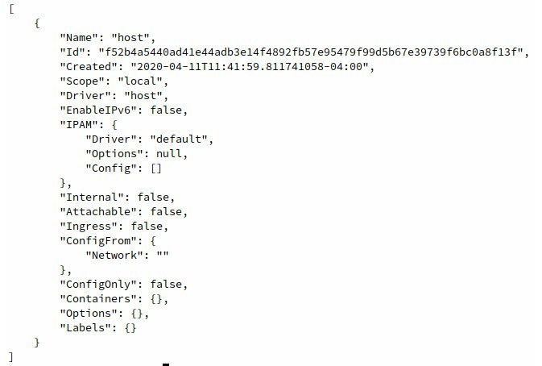
    

    Figure 6.14: docker network inspect output for the host network

    As you can see, there is not very much configuration present in the
    `host` network. Since it uses the `host`
    networking driver, all the container\'s networking will be shared
    with the host. Hence, this network configuration does not need to
    define specific subnets, interfaces, or other metadata, as we have
    seen in the default `bridge` network from before.

5.  Investigate the `none` network next. Use the
    `docker network inspect` command to view the details of
    the `none` network:

    
    ```
    docker network inspect none
    ```
    

    The details will be displayed in JSON format:

    
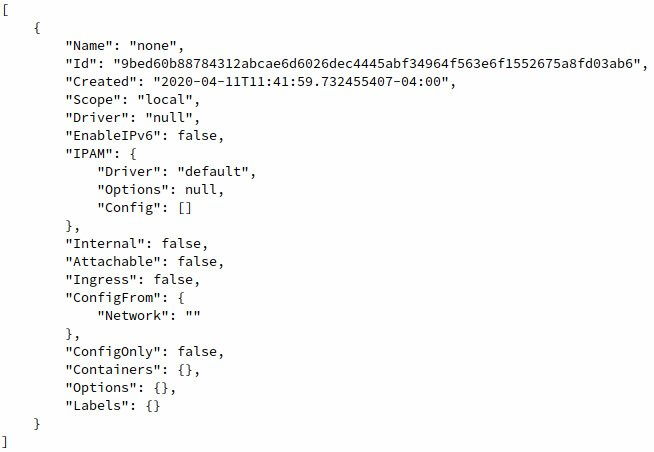
    

    Figure 6.15: docker network inspect output for the none network

    Similar to the `host` network, the `none`
    network is mostly empty. Since containers deployed in this network
    will have no network connectivity by leveraging the `null`
    driver, there isn\'t much need for configuration.

    Note

    Be aware that the difference between the `none` and
    `host` networks lies in the driver they use, despite the
    fact that the configurations are almost identical. Containers
    launched in the `none` network have no network
    connectivity at all, and no network interfaces are assigned to the
    container instance. However, containers launched in the
    `host` network will share the networking stack with the
    host system.

6.  Now create a container in the `none` network to observe
    its operation. In your terminal or PowerShell session, use the
    `docker run` command to start an Alpine Linux container in
    the `none` network using the `--network` flag.
    Name this container `nonenet` so we know that it is
    deployed in the `none` network:

    
    ```
    docker run -itd --network none --name nonenet alpine:latest 
    ```
    

    This will pull and start an Alpine Linux Docker container in the
    `none` network.

7.  Use the `docker ps` command to verify whether the
    container is up and running as expected:

    
    ```
    docker ps 
    ```
    

    The output should display the `nonenet` container as up
    and running:

    
    ```
    CONTAINER ID    IMAGE            COMMAND      CREATED 
      STATUS              PORTS              NAMES
    972a80984703    alpine:latest    "/bin/sh"    9 seconds ago
      Up 7 seconds                           nonenet
    ```
    

8.  Execute the `docker inspect` command, along with the
    container name, `nonenet`, to get a deeper understanding
    of how this container is configured:

    
    ```
    docker inspect nonenet
    ```
    

    The output of `docker inspect` will display the full
    container configuration in JSON format. A truncated version
    highlighting the `NetworkSettings` section is provided
    here. Pay close attention to the `IPAddress` and
    `Gateway` settings:

    
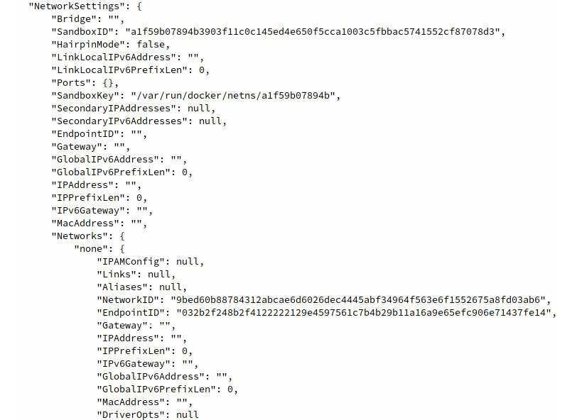
    

    Figure 6.16: docker inspect output for the nonenet container

    The `docker inspect` output will reveal that this
    container does not have an IP address, nor does it have a gateway or
    any other networking settings.

9.  Use the `docker exec` command to access an `sh`
    shell inside this container:

    
    ```
    docker exec -it nonenet /bin/sh
    ```
    

    Upon successful execution of this command, you will be dropped into
    a root shell in the container instance:

    
    ```
    / #
    ```
    

10. Execute the `ip a` command to view the network interfaces
    available in the container:

    
    ```
    / $ ip a 
    ```
    

    This will display all network interfaces configured in this
    container:

    
    ```
    1: lo: <LOOPBACK,UP,LOWER_UP> mtu 65536 qdisc noqueue state 
    UNKNOWN qlen 1000
        link/loopback 00:00:00:00:00:00 brd 00:00:00:00:00:00
        inet 127.0.0.1/8 scope host lo
        valid_lft forever preferred_lft forever
    ```
    

    The only network interface available to this container is its
    `LOOPBACK` interface. As this container is not configured
    with an IP address or default gateway, common networking commands
    will not work.

11. Test the lack of network connectivity using the `ping`
    utility provided by default in the Alpine Linux Docker image. Try to
    ping the Google DNS servers located at IP address
    `8.8.8.8`:

    
    ```
    / # ping 8.8.8.8
    ```
    

    The output of the `ping` command should reveal that it has
    no network connectivity:

    
    ```
    PING 8.8.8.8 (8.8.8.8): 56 data bytes
    ping: sendto: Network unreachable
    ```
    

    Use the `exit` command to return to your main terminal
    session.

    Now that you have taken a closer look at the `none`
    network, consider the `host` networking driver. The
    `host` networking driver in Docker is unique since it
    doesn\'t have any intermediate interfaces or create any extra
    subnets. Instead, the `host` networking driver shares the
    networking stack with the host operating system such that any
    network interfaces that are available to the host are also available
    to containers running in `host` mode.

12. To get started with running a container in `host` mode,
    execute `ifconfig` if you are running macOS or Linux, or
    use `ipconfig` if you are running on Windows, to take
    inventory of the network interfaces that are available on the host
    machine:

    
    ```
    $ ifconfig
    ```
    

    This should output a list of network interfaces available on your
    host machine:

    
    
    

    Figure 6.17: List of network interfaces configured on the host
    machine

    In this example, the primary network interface of your host machine
    is `enp1s0` with an IP address of
    `192.168.122.185`.

    Note

    Some versions of Docker Desktop on macOS or Windows may not properly
    be able to start and run containers in `host` network mode
    or using `macvlan `network drivers, due to the
    dependencies on the Linux kernel to provide many of these
    functionalities. When running these examples on macOS or Windows,
    you may see the network details of the underlying Linux virtual
    machine running Docker, as opposed to the network interfaces
    available on your macOS or Windows host machine.

13. Use the `docker run` command to start an Alpine Linux
    container in the `host` network. Name it
    `hostnet1` to tell it apart from the other containers:

    
    ```
    docker run -itd --network host --name hostnet1 alpine:latest
    ```
    

    Docker will start this container in the background using the
    `host` network.

14. Use the `docker inspect` command to look at the network
    configuration of the `hostnet1` container you just
    created:

    
    ```
    docker inspect hostnet1
    ```
    

    This will reveal the verbose configuration of the running container,
    including the networking details, in JSON format:

    
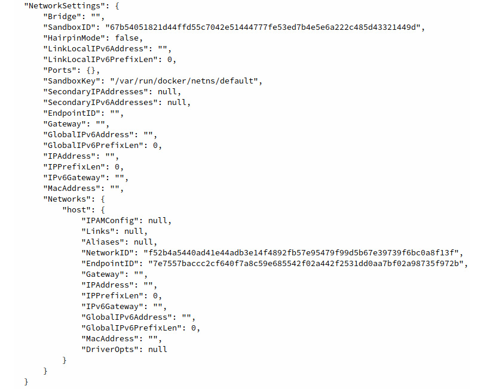
    

    Figure 6.18: docker inspect output for the hostnet1 container

    It should be noted that the output of the
    `NetworkSettings` block will look a lot like the
    containers you deployed in the `none` network. In the
    `host` networking mode, Docker will not assign an IP
    address or gateway to the container instance since it shares all
    network interfaces with the host machine directly.

15. Use `docker exec` to access an `sh` shell inside
    this container, providing the name `hostnet1`:

    
    ```
    docker exec -it hostnet1 /bin/sh
    ```
    

    This should drop you into a root shell inside the
    `hostnet1` container.

16. Inside the `hostnet1` container, execute the
    `ifconfig` command to list which network interfaces are
    available to it:

    
    ```
    / # ifconfig
    ```
    

    The full list of network interfaces available inside of this
    container should be displayed:

    
    
    

    Figure 6.19: Displaying the available network interfaces inside the
    hostnet1 container

    Note that this list of network interfaces is identical to that which
    you encountered when querying the host machine directly. This is
    because this container and the host machine are sharing the network
    directly. Anything available to the host machine will also be
    available to containers running in `host` network mode.

17. Use the `exit` command to end the shell session and return
    to the terminal of the host machine.

18. To understand more fully how the shared networking model works in
    Docker, start an NGINX container in `host` network mode.
    The NGINX container automatically exposes port `80`, which
    we previously had to forward to a port on the host machine. Use the
    `docker run` command to start an NGINX container on the
    host machine:

    
    ```
    docker run -itd --network host --name hostnet2 nginx:latest
    ```
    

    This command will start an NGINX container in the `host`
    networking mode.

19. Navigate to `http://localhost:80` using a web browser on
    the host machine:

    
    
    

    Figure 6.20: Accessing the NGINX default web page of a container
    running in host networking mode

    You should be able to see the NGINX default web page displayed in
    your web browser. It should be noted that the `docker run`
    command did not explicitly forward or expose any ports to the host
    machine. Since the container is running in `host`
    networking mode, any ports that containers expose by default will be
    available directly on the host machine.

20. Use the `docker run` command to create another NGINX
    instance in the `host` network mode. Call this container
    `hostnet3` to differentiate it from the other two
    container instances:
    
    ```
    docker run -itd --network host --name hostnet3 nginx:latest
    ```
    

21. Now use the `docker ps -a` command to list all the
    containers, both in running and stopped status:

    
    ```
    docker ps -a
    ```
    

    The list of running containers will be displayed:

    
    ```
    CONTAINER ID  IMAGE         COMMAND                CREATED
      STATUS                        PORTS           NAMES
    da56fcf81d02  nginx:latest  "nginx -g 'daemon of…" 4 minutes ago
      Exited (1) 4 minutes ago                      hostnet3
    5786dac6fd27  nginx:latest  "nginx -g 'daemon of…" 37 minutes ago
      Up 37 minutes                                 hostnet2
    648b291846e7  alpine:latest "/bin/sh"              38 minutes ago
      Up 38 minutes                                 hostnet
    ```
    

22. Based on the preceding output, you can see that the
    `hostnet3` container exited and is currently in a stopped
    state. To understand more fully why this is the case, use the
    `docker logs` command to view the container logs:

    
    ```
    docker logs hostnet3
    ```
    

    The log output should be displayed as follows:

    
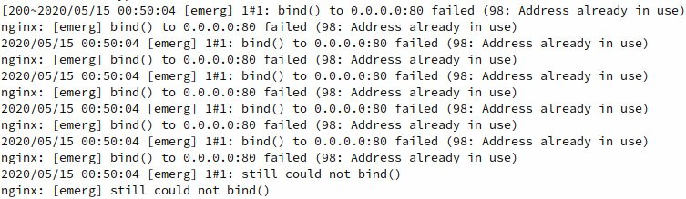
    

    Figure 6.21: NGINX errors in the hostnet3 container

    Essentially, this second instance of an NGINX container was unable
    to start properly because it was unable to bind to port
    `80` on the host machine. The reason for this is that the
    `hostnet2` container is already listening on that port.

    Note

    Note that containers running in `host` networking mode
    need to be deployed with care and consideration. Without proper
    planning and architecture, container sprawl can lead to a variety of
    port conflicts across container instances that are running on the
    same machine.

23. The next type of native Docker network you will investigate is
    `macvlan`. In a `macvlan` network, Docker will
    allocate a MAC address to a container instance to make it appear as
    a physical host on a particular network segment. It can run either
    in `bridge` mode, which uses a parent `host`
    network interface to gain physical access to the underlay network,
    or in `802.1Q trunk` mode, which leverages a sub-interface
    that Docker creates on the fly.

24. To begin, create a new network utilizing the `macvlan`
    Docker network driver by specifying a physical interface on your
    host machine as the parent interface using the
    `docker network create` command.

25. Earlier in the `ifconfig` or `ipconfig` output,
    you saw that the `enp1s0` interface is the primary network
    interface on the machine. Substitute the name of the primary network
    interface of your machine. Since you are using the primary network
    interface of the host machine as the parent, specify the same subnet
    (or a smaller subnet within that space) for the network connectivity
    of our containers. Use a `192.168.122.0/24` subnet here,
    since it is the same subnet of the primary network interface.
    Likewise, you want to specify the same default gateway as the parent
    interface. Use the same subnet and gateway of your host machine:

    
    ```
    docker network create -d macvlan --subnet=192.168.122.0/24 --gateway=192.168.122.1 -o parent=enp1s0 macvlan-net1
    ```
    

    This command should create a network called
    `macvlan-net1`.

26. Use the `docker network ls` command to confirm that the
    network has been created and is using the `macvlan`
    network driver:

    
    ```
    docker network ls
    ```
    

    This command will output all the currently configured networks that
    are defined in your environment. You should see the
    `macvlan-net1` network:

    
    ```
    NETWORK ID       NAME            DRIVER     SCOPE
    f4c9408f22e2     bridge          bridge     local
    f52b4a5440ad     host            host       local
    b895c821b35f     macvlan-net1    macvlan    local
    9bed60b88784     none            null       local
    ```
    

27. Now that the `macvlan` network has been defined in Docker,
    create a container in this network and investigate the network
    connectivity from the host\'s perspective. Use the
    `docker run` command to create another Alpine Linux
    container named `macvlan1` using the `macvlan`
    network `macvlan-net1`:

    
    ```
    docker run -itd --name macvlan1 --network macvlan-net1 alpine:latest
    ```
    

    This should start an Alpine Linux container instance called
    `macvlan1` in the background.

28. Use the `docker ps -a` command to check and make sure this
    container instance is running:

    
    ```
    docker ps -a
    ```
    

    This should reveal that the container named `macvlan1` is
    up and running as expected:

    
    ```
    CONTAINER ID   IMAGE           COMMAND      CREATED
      STATUS              PORTS              NAMES
    cd3c61276759   alpine:latest   "/bin/sh"    3 seconds ago
      Up 1 second                            macvlan1
    ```
    

29. Use the `docker inspect` command to investigate the
    networking configuration of this container instance:

    
    ```
    docker inspect macvlan1
    ```
    

    The verbose output of the container configuration should be
    displayed. The following output has been truncated to show only the
    network settings section in JSON format:

    
    
    

    Figure 6.22: The docker network inspect output of the macvlan1
    network

    From this output, you can see that this container instance (similar
    to containers in other networking modes) has both an IP address and
    a default gateway. It can also be concluded that this container also
    has an OSI Model Layer 2 MAC address within the
    `192.168.122.0/24` network, based on the
    `MacAddress` parameter under the `Networks`
    subsection. Other hosts within this network segment would believe
    this machine is another physical node living in this subnet, not a
    container hosted inside a node on the subnet.

30. Use `docker run` to create a second container instance
    named `macvlan2` inside the `macvlan-net1`
    network:

    
    ```
    docker run -itd --name macvlan2 --network macvlan-net1 alpine:latest
    ```
    

    This should start another container instance within the
    `macvlan-net1` network.

31. Run the `docker inspect` command to see the MAC address of
    the `macvlan-net2` container instance:

    
    ```
    docker inspect macvlan2
    ```
    

    This will output the verbose configuration of the
    `macvlan2` container instance in JSON format, truncated
    here to only show the relevant networking settings:

    
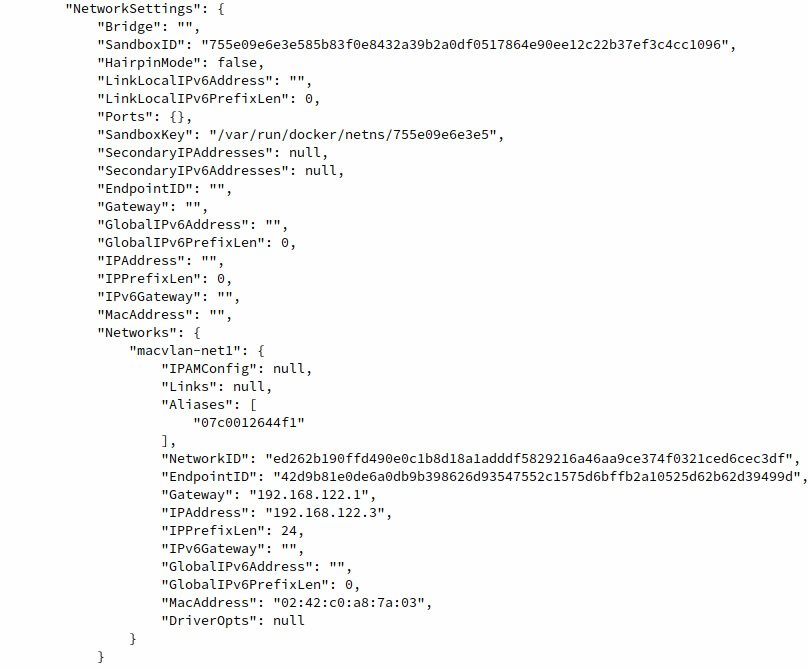
    

    Figure 6.23: docker inspect output for the macvlan2 container

    It can be seen in this output that the `macvlan2`
    container has both a different IP address and MAC address from the
    `macvlan1` container instance. Docker assigns different
    MAC addresses to ensure that Layer 2 conflicts do not arise when
    many containers are using `macvlan` networks.

32. Run the `docker exec` command to access an `sh`
    shell inside this container:

    
    ```
    docker exec -it macvlan1 /bin/sh
    ```
    

    This should drop you into a root session inside the container.

33. Use the `ifconfig` command inside the container to observe
    that the MAC address you saw in the `docker inspect`
    output on the `macvlan1` container is present as the MAC
    address of the container\'s primary network interface:

    
    ```
    / # ifconfig
    ```
    

    In the details for the `eth0` interface, look at the
    `HWaddr` parameter. You may also note the IP address
    listed under the `inet addr` parameter, as well as the
    number of bytes transmitted and received by this network interface
    -- `RX bytes` (bytes received) and `TX bytes`
    (bytes transmitted):

    
    ```
    eth0      Link encap:Ethernet  HWaddr 02:42:C0:A8:7A:02
              inet addr:192.168.122.2  Bcast:192.168.122.255
                                       Mask:255.255.255.0
              UP BROADCAST RUNNING MULTICAST  MTU:1500  Metric:1
              RX packets:353 errors:0 dropped:0 overruns:0 frame:0
              TX packets:188 errors:0 dropped:0 overruns:0 carrier:0
              collisions:0 txqueuelen:0 
              RX bytes:1789983 (1.7 MiB)  TX bytes:12688 (12.3 KiB)
    ```
    

34. Install the `arping` utility using the `apk`
    package manager available in the Alpine Linux container. This is a
    tool used to send `arp` messages to a MAC address to check
    Layer 2 connectivity:

    
    ```
    / # apk add arping
    ```
    

    The `arping` utility should install inside the
    `macvlan1` container:

    
    ```
    fetch http://dl-cdn.alpinelinux.org/alpine/v3.11/main
    /x86_64/APKINDEX.tar.gz
    fetch http://dl-cdn.alpinelinux.org/alpine/v3.11/community
    /x86_64/APKINDEX.tar.gz
    (1/3) Installing libnet (1.1.6-r3)
    (2/3) Installing libpcap (1.9.1-r0)
    (3/3) Installing arping (2.20-r0)
    Executing busybox-1.31.1-r9.trigger
    OK: 6 MiB in 17 packages
    ```
    

35. Specify the Layer 3 IP address of the `macvlan2` container
    instance as the primary argument to `arping`. Now,
    `arping` will automatically look up the MAC address and
    check the Layer 2 connectivity to it:

    
    ```
    / # arping 192.168.122.3
    ```
    

    The `arping` utility should report back the correct MAC
    address for the `macvlan2` container instance, indicating
    successful Layer 2 network connectivity:

    
    ```
    ARPING 192.168.122.3
    42 bytes from 02:42:c0:a8:7a:03 (192.168.122.3): index=0 
    time=8.563 usec
    42 bytes from 02:42:c0:a8:7a:03 (192.168.122.3): index=1 
    time=18.889 usec
    42 bytes from 02:42:c0:a8:7a:03 (192.168.122.3): index=2 
    time=15.917 use
    type exit to return to the shell of your primary terminal. 
    ```
    

36. Check the status of the containers using the
    `docker ps -a` command:

    
    ```
    docker ps -a 
    ```
    

    The output of this command should show all the running and stopped
    container instances in your environment.

37. Next, stop all running containers using `docker stop`,
    followed by the container name or ID:

    
    ```
    docker stop hostnet1
    ```
    

    Repeat this step for all running containers in your environment.

38. Clean up the container images and unused networks using the
    `docker system prune` command:

    
    ```
    docker system prune -fa 
    ```
    

    This command will clean up all unused container images, networks,
    and volumes remaining on your machine.

In this exercise, we looked at the four default networking drivers
available by default in Docker: `bridge`, `host`,
`macvlan`, and `none`. For each example, we explored
how the network functions, how containers deployed using these network
drivers function with the host machine, and how they function with other
containers on the network.

The networking capability that Docker exposes by default can be
leveraged to deploy containers in very advanced networking
configurations, as we have seen so far. Docker also offers the ability
to manage and coordinate container networking between hosts in a
clustered swarm configuration.

In the next section, we will look at creating networks that will create
overlay networks between Docker hosts to ensure direct connectivity
between container instances.


Docker Overlay Networking
=========================


`Overlay` networks are logical networks that are created on
top of a physical (underlay) network for specific purposes. A **Virtual
Private Network** (**VPN**), for example, is a common type of
`overlay` network that uses the internet to create a link to
another private network. Docker can create and manage
`overlay` networks between containers, which can be used for
containerized applications to directly talk to one another. When
containers are deployed into an `overlay` network, it does not
matter which host in the cluster they are deployed on; they will have
direct connectivity to other containerized services that exist in the
same `overlay` network in the same way that they would if they
existed on the same physical host.


Exercise 6.04: Defining Overlay Networks
----------------------------------------

Docker `overlay` networking is used to create mesh networks
between machines in a Docker swarm cluster. In this exercise, you will
use two machines to create a basic Docker swarm cluster. Ideally, these
machines will exist on the same networking segment to ensure direct
network connectivity and fast network connectivity between them.
Furthermore, they should be running the same version of Docker in a
supported distribution of Linux, such as RedHat, CentOS, or Ubuntu.

You will define `overlay` networks that will span hosts in a
Docker swarm cluster. You will then ensure that containers deployed on
separate hosts can talk to one another via the `overlay`
network:

Note

This exercise requires access to a secondary machine with Docker
installed on it. Usually, cloud-based virtual machines or machines
deployed in another hypervisor work best. Deploying a Docker swarm
cluster on your system using Docker Desktop could lead to networking
issues or serious performance degradation.

1.  On the first machine, `Machine1`, run
    `docker --version` to find out which version of Docker is
    currently running on it.

    
    ```
    Machine1 ~docker --version
    ```
    

    `The version details of the Docker installation of Machine1 will be displayed: `

    
    ```
    Docker version 19.03.6, build 369ce74a3c
    ```
    

    Then, you can do the same for `Machine2:`

    
    ```
    Machine2 ~docker --version
    ```
    

    `The version details of the Docker installation of Machine2 will be displayed`:

    
    ```
    Docker version 19.03.6, build 369ce74a3c
    ```
    

    Verify that the installed version of Docker is the same before
    moving forward.

    Note

    The Docker version may vary depending on your system.

2.  On `Machine1`, run the `docker swarm init`
    command to initialize a Docker swarm cluster:

    
    ```
    Machine1 ~docker swarm init
    ```
    

    This should print the command you can use on other nodes to join the
    Docker swarm cluster, including the IP address and `join`
    token:

    
    ```
    docker swarm join --token SWMTKN-1-57n212qtvfnpu0ab28tewiorf3j9fxzo9vaa7drpare0ic6ohg-5epus8clyzd9xq7e7ze1y0p0n 
    192.168.122.185:2377
    ```
    

3.  On `Machine2`, run the `docker swarm join`
    command, which was provided by `Machine1`, to join the
    Docker swarm cluster:

    
    ```
    Machine2 ~$  docker swarm join --token SWMTKN-1-57n212qtvfnpu0ab28tewiorf3j9fxzo9vaa7drpare0ic6ohg-5epus8clyzd9xq7e7ze1y0p0n 192.168.122.185:2377
    ```
    

    `Machine2` should successfully join the Docker swarm
    cluster:

    
    ```
    This node joined a swarm as a worker.
    ```
    

4.  Execute the `docker info` command on both nodes to ensure
    they have successfully joined the swarm cluster:

    `Machine1`:

    
    ```
    Machine1 ~docker info
    ```
    

    `Machine2`:` `

    
    ```
    Machine2 ~docker info
    ```
    

    The following output is a truncation of the `swarm`
    portion of the `docker info` output. From these details,
    you will see that these Docker nodes are configured in a swarm
    cluster and there are two nodes in the cluster with a single manager
    node (`Machine1`). These parameters should be identical on
    both nodes, except for the `Is Manager` parameter, for
    which `Machine1` will be the manager. By default, Docker
    will allocate a default subnet of `10.0.0.0/8` for the
    default Docker swarm `overlay` network:

    
    ```
     swarm: active
      NodeID: oub9g5383ifyg7i52yq4zsu5a
      Is Manager: true
      ClusterID: x7chp0w3two04ltmkqjm32g1f
      Managers: 1
      Nodes: 2
      Default Address Pool: 10.0.0.0/8  
      SubnetSize: 24
      Data Path Port: 4789
      Orchestration:
        Task History Retention Limit: 5
    ```
    

5.  From the `Machine1` box, create an `overlay`
    network using the `docker network create` command. Since
    this is a network that will span more than one node in a simple
    swarm cluster, specify the `overlay` driver as the network
    driver. Call this network `overlaynet1`. Use a subnet and
    gateway that are not yet in use by any networks on your Docker hosts
    to avoid subnet collisions. Use `172.45.0.0/16` and
    `172.45.0.1` as the gateway:

    
    ```
    Machine1 ~docker network create overlaynet1 --driver overlay --subnet 172.45.0.0/16 --gateway 172.45.0.1
    ```
    

    The `overlay` network will be created.

6.  Use the `docker network ls` command to verify whether the
    network was created successfully and is using the correct
    `overlay` driver:

    
    ```
    Machine1 ~docker network ls
    ```
    

    A list of networks available on your Docker host will be displayed:

    
    ```
    NETWORK ID       NAME              DRIVER     SCOPE
    54f2af38e6a8     bridge            bridge     local
    df5ebd75303e     docker_gwbridge   bridge     local
    f52b4a5440ad     host              host       local
    8hm1ouvt4z7t     ingress           overlay    swarm
    9bed60b88784     none              null       local
    60wqq8ewt8zq     overlaynet1       overlay    swarm
    ```
    

7.  Use the `docker service create` command to create a
    service that will span multiple nodes in the swarm cluster.
    Deploying containers as services allow you to specify more than one
    replica of a container instance for horizontal scaling or scaling
    container instances across nodes in a cluster for high availability.
    To keep this example simple, create a single container service of
    Alpine Linux. Name this service `alpine-overlay1`:

    
    ```
    Machine1 ~docker service create -t --replicas 1 --network overlaynet1 --name alpine-overlay1 alpine:latest
    ```
    

    A text-based progress bar will display the progress of the
    `alpine-overlay1` service deployment:

    
    ```
    overall progress: 1 out of 1 tasks 
    1/1: running   [===========================================>]
    verify: Service converged 
    ```
    

8.  Repeat the same `docker service create` command, but now
    specify `alpine-overlay2` as the service name:

    
    ```
    Machine1 ~docker service create -t --replicas 1 --network overlaynet1 --name alpine-overlay2 alpine:latest
    ```
    

    A text-based progress bar will again display the progress of the
    service deployment:

    
    ```
    overall progress: 1 out of 1 tasks 
    1/1: running   [===========================================>]
    verify: Service converged
    ```
    

    Note

    More details on creating services in Docker swarm can be found in
    *Lab 9, Docker Swarm*. As the scope of this exercise is
    networking, we will focus for now on the networking component.

9.  From the `Machine1` node, execute the
    `docker ps` command to see which service is running on
    this node:

    
    ```
    Machine1 ~docker ps 
    ```
    

    The running containers will be displayed. Docker will intelligently
    scale containers between nodes in a Docker swarm cluster. In this
    example, the container from the `alpine-overlay1` service
    landed on `Machine1`. Your environment may vary depending
    on how Docker deploys the services:

    
    ```
    CONTAINER ID    IMAGE           COMMAND     CREATED
      STATUS              PORTS             NAMES
    4d0f5fa82add    alpine:latest   "/bin/sh"   59 seconds ago
      Up 57 seconds                         alpine-overlay1.1.
    r0tlm8w0dtdfbjaqyhobza94p
    ```
    

10. Run the `docker inspect` command to view the verbose
    details of the running container:

    
    ```
    Machine1 ~docker inspect alpine-overlay1.1.r0tlm8w0dtdfbjaqyhobza94p
    ```
    

    The verbose details of the running container instance will be
    displayed. The following output has been truncated to display the
    `NetworkSettings` portion of the
    `docker inspect` output:

    
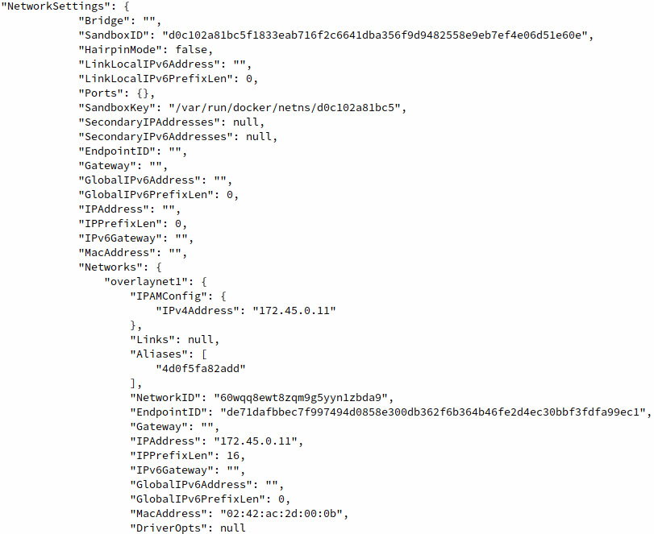
    

    Figure 6.24: Inspecting the alpine-overlay1 container instance

    Notice that the IP address of this container is as expected within
    the subnet you have specified on `Machine1`.

11. On the `Machine2` instance, execute the
    `docker network ls` command to view the Docker networks
    available on the host:

    
    ```
    Machine2 ~docker network ls
    ```
    

    A list of all available Docker networks will be displayed on the
    Docker host:

    
    ```
    NETWORK ID       NAME              DRIVER     SCOPE
    8c7755be162f     bridge            bridge     local
    28055e8c63a0     docker_gwbridge   bridge     local
    c62fb7ac090f     host              host       local
    8hm1ouvt4z7t     ingress           overlay    swarm
    6182d77a8f62     none              null       local
    60wqq8ewt8zq     overlaynet1       overlay    swarm
    ```
    

    Notice the `overlaynet1` network defined on
    `Machine1` is also available on `Machine2`. This
    is because networks created using the `overlay` driver are
    available to all hosts in the Docker swarm cluster. This enables
    containers to be deployed using this network to run across all hosts
    in the cluster.

12. Use the `docker ps` command to list the running containers
    on this Docker instance:

    
    ```
    Machine2 ~docker ps
    ```
    

    A list of all running containers will be displayed. In this example,
    the container in the `alpine-overlay2` service landed on
    the `Machine2` cluster node:

    
    ```
    CONTAINER ID   IMAGE           COMMAND      CREATED
      STATUS              PORTS               NAMES
    53747ca9af09   alpine:latest   "/bin/sh"    33 minutes ago
      Up 33 minutes                           alpine-overlay2.1.ui9vh6zn18i48sxjbr8k23t71
    ```
    

    Note

    Which node the services land on in your example may differ from what
    is displayed here. Docker makes decisions on how to deploy
    containers based on various criteria, such as available CPU
    bandwidth, memory, and scheduling restrictions placed on the
    deployed containers.

13. Use `docker inspect` to investigate the network
    configuration of this container as well:

    
    ```
    Machine2 ~docker inspect alpine-overlay2.1.ui9vh6zn18i48sxjbr8k23t71
    ```
    

    The verbose container configuration will be displayed. This output
    has been truncated to display the `NetworkSettings`
    portion of the output in JSON format:

    
    
    

    Figure 6.25: docker inspect output of the alpine-overlay2 container
    instance

    Note that this container also has an IP address within the
    `overlaynet1` `overlay` network.

14. Since both services are deployed within the same `overlay`
    network but exist in two separate hosts, you can see that Docker is
    using the `underlay` network to proxy the traffic for the
    `overlay` network. Check the network connectivity between
    the services by attempting a ping from one service to the other. It
    should be noted here that, similar to static containers deployed in
    the same network, services deployed on the same network can resolve
    each other by name using Docker DNS. Use the `docker exec`
    command on the `Machine2` host to access an `sh`
    shell inside the `alpine-overlay2` container:

    
    ```
    Machine2 ~docker exec -it alpine-overlay2.1.ui9vh6zn18i48sxjbr8k23t71 /bin/sh
    ```
    

    This should drop you into a root shell on the
    `alpine-overlay2` container instance. Use the
    `ping` command to initiate network communication to the
    `alpine-overlay1` container:

    
    ```
    / # ping alpine-overlay1
    PING alpine-overlay1 (172.45.0.10): 56 data bytes
    64 bytes from 172.45.0.10: seq=0 ttl=64 time=0.314 ms
    64 bytes from 172.45.0.10: seq=1 ttl=64 time=0.274 ms
    64 bytes from 172.45.0.10: seq=2 ttl=64 time=0.138 ms
    ```
    

    Notice that even though these containers are deployed across two
    separate hosts, the containers can communicate with each other by
    name, using the shared `overlay` network.

15. From the `Machine1` box, you can attempt the same
    communication to the `alpine-overlay2` service container.
    Use the `docker exec` command to access an `sh`
    shell on the `Machine1` box:

    
    ```
    Machine1 ~docker exec -it alpine-overlay1.1.r0tlm8w0dtdfbjaqyhobza94p /bin/sh
    ```
    

    This should drop you into a root shell inside the container. Use the
    `ping` command to initiate communication to the
    `alpine-overlay2` container instance:

    
    ```
    / # ping alpine-overlay2
    PING alpine-overlay2 (172.45.0.13): 56 data bytes
    64 bytes from 172.45.0.13: seq=0 ttl=64 time=0.441 ms
    64 bytes from 172.45.0.13: seq=1 ttl=64 time=0.227 ms
    64 bytes from 172.45.0.13: seq=2 ttl=64 time=0.282 ms
    ```
    

    Notice again that, by using Docker DNS, the IP address of the
    `alpine-overlay2` container can be resolved between hosts
    using the `overlay` networking driver.

16. Use the `docker service rm` command to delete both
    services from the `Machine1` node:

    
    ```
    Machine1 ~docker service rm alpine-overlay1
    Machine1 ~docker service rm alpine-overlay2
    ```
    

    For each of these commands, the service name will appear briefly
    indicating the command execution was successful. On both nodes,
    `docker ps` will display that no containers are currently
    running.

17. Delete the `overlaynet1` Docker network by using the
    `docker rm` command and specifying the name
    `overlaynet1`:

    
    ```
    Machine1 ~docker network rm overlaynet1
    ```
    

    The `overlaynet1` network will be deleted.

In this exercise, we looked at Docker `overlay` networking
between two hosts in a Docker swarm cluster. `Overlay`
networking is enormously beneficial in a Docker container cluster
because it allows the horizontal scaling of containers between nodes in
a cluster. From a network perspective, these containers can directly
talk to one another by using a service mesh proxied over the physical
network interfaces of the host machines. This not only reduces latency
but simplifies deployments by taking advantage of many of Docker\'s
features, such as DNS.

Now that we have looked at all the native Docker network types and
examples of how they function, we can look at another aspect of Docker
networking that has recently been gaining popularity. Since Docker
networking is very modular, as we have seen, Docker supports a plugin
system that allows users to deploy and manage custom network drivers.

In the next section, we will learn about how non-native Docker networks
work by installing a third-party network driver from Docker Hub.


Non-Native Docker Networks
==========================


In the final section of this lab, we will discuss non-native Docker
networks. Aside from the native Docker network drivers that are
available, Docker also supports custom networking drivers that can be
written by users or downloaded from third parties via Docker Hub. Custom
third-party network drivers are useful in circumstances that require
very particular network configurations, or where container networking is
expected to behave in a certain way. For example, some network drivers
provide the ability for users to set custom policies regarding access to
internet resources, or other defining whitelists for communication
between containerized applications. This can be helpful from a security,
policy, and auditing perspective.

In the following exercise, we will download and install the Weave Net
driver and create a network on a Docker host. Weave Net is a highly
supported third-party network driver that provides excellent visibility
into container mesh networks, allowing users to create complex service
mesh infrastructures that can span multi-cloud scenarios. We will
install the Weave Net driver from Docker Hub and configure a basic
network in the simple swarm cluster we defined in the previous exercise.


Exercise 6.05: Installing and Configuring the Weave Net Docker Network Driver
-----------------------------------------------------------------------------

In this exercise, you will download and install the Weave Net Docker
network driver and deploy it within the Docker swarm cluster you created
in the previous exercise. Weave Net is one of the most common and
flexible third-party Docker network drivers available. Using Weave Net,
very complex networking configurations can be defined to enable maximum
flexibility in your infrastructure:

1.  Install the Weave Net driver from Docker Hub using the
    `docker plugin install` command on the
    `Machine1` node:

    
    ```
    Machine1 ~docker plugin install store/weaveworks/net-plugin:2.5.2
    ```
    

    This will prompt you to grant Weave Net permissions on the machine
    you are installing it on. It is safe to grant the requested
    permissions as Weave Net requires them to set up the network driver
    on the host operating system properly:

    
    ```
    Plugin "store/weaveworks/net-plugin:2.5.2" is requesting 
    the following privileges:
     - network: [host]
     - mount: [/proc/]
     - mount: [/var/run/docker.sock]
     - mount: [/var/lib/]
     - mount: [/etc/]
     - mount: [/lib/modules/]
     - capabilities: [CAP_SYS_ADMIN CAP_NET_ADMIN CAP_SYS_MODULE]
    Do you grant the above permissions? [y/N]
    ```
    

    Answer the prompt by pressing the *y* key. The Weave Net plugin
    should be installed successfully.

2.  On the `Machine2` node, run the same
    `docker plugin install` command. All nodes in the Docker
    swarm cluster should have the plugin installed since all nodes will
    be participating in the swarm mesh networking:

    
    ```
    Machine2 ~docker plugin install store/weaveworks/net-plugin:2.5.2
    ```
    

    The permissions prompt will be displayed. Respond with *y* when
    prompted to continue the installation:

    
    ```
    Plugin "store/weaveworks/net-plugin:2.5.2" is requesting 
    the following privileges:
     - network: [host]
     - mount: [/proc/]
     - mount: [/var/run/docker.sock]
     - mount: [/var/lib/]
     - mount: [/etc/]
     - mount: [/lib/modules/]
     - capabilities: [CAP_SYS_ADMIN CAP_NET_ADMIN CAP_SYS_MODULE]
    Do you grant the above permissions? [y/N]
    ```
    

3.  Create a network using the `docker network create` command
    on the `Machine1` node. Specify the Weave Net driver as
    the primary driver and the network name as `weavenet1`.
    For the subnet and gateway parameters, use a unique subnet that has
    not yet been used in the previous exercises:

    
    ```
    Machine1 ~$  docker network create --driver=store/weaveworks/net-plugin:2.5.2 --subnet 10.1.1.0/24 --gateway 10.1.1.1 weavenet1
    ```
    

    This should create a network called `weavenet1` in the
    Docker swarm cluster.

4.  List the available networks in the Docker swarm cluster using the
    `docker network ls` command:

    
    ```
    Machine1 ~docker network ls 
    ```
    

    The `weavenet1` network should be displayed in the list:

    
    ```
    NETWORK ID     NAME             DRIVER
      SCOPE
    b3f000eb4699   bridge           bridge
      local
    df5ebd75303e   docker_gwbridge  bridge
      local
    f52b4a5440ad   host             host
      local
    8hm1ouvt4z7t   ingress          overlay
      swarm
    9bed60b88784   none             null
      local
    q354wyn6yvh4   weavenet1        store/weaveworks/net-plugin:2.5.2
      swarm
    ```
    

5.  Execute the `docker network ls` command on the
    `Machine2` node to ensure that the `weavenet1`
    network is present on that machine as well:

    
    ```
    Machine2 ~docker network ls 
    ```
    

    The `weavenet1` network should be listed:

    
    ```
    NETWORK ID    NAME              DRIVER
      SCOPE
    b3f000eb4699  bridge            bridge
      local
    df5ebd75303e  docker_gwbridge   bridge
      local
    f52b4a5440ad  host              host
      local
    8hm1ouvt4z7t  ingress           overlay
      swarm
    9bed60b88784  none              null
      local
    q354wyn6yvh4  weavenet1         store/weaveworks/net-plugin:2.5.2
      swarm
    ```
    

6.  On the `Machine1` node, create a service called
    `alpine-weavenet1` that uses the `weavenet1`
    network using the `docker service create` command:

    
    ```
    Machine1 ~docker service create -t --replicas 1 --network weavenet1 --name alpine-weavenet1 alpine:latest
    ```
    

    A text-based progress bar will display the deployment status of the
    service. It should complete without any issues:

    
    ```
    overall progress: 1 out of 1 tasks 
    1/1: running   [===========================================>]
    verify: Service converged 
    ```
    

7.  Use the `docker service create` command again to create
    another service in the `weavenet1` network called
    `alpine-weavenet2`:

    
    ```
    Machine1 ~docker service create -t --replicas 1 --network weavenet1 --name alpine-weavenet2 alpine:latest
    ```
    

    A text-based progress bar will again display indicating the status
    of the service creation:

    
    ```
    overall progress: 1 out of 1 tasks 
    1/1: running   [===========================================>]
    verify: Service converged 
    ```
    

8.  Run the `docker ps` command to validate that an Alpine
    container is successfully running on each node in the cluster:

    `Machine1`:` `

    
    ```
    Machine1 ~docker ps
    ```
    

    `Machine2`:` `

    
    ```
    Machine2 ~docker ps
    ```
    

    One of the service containers should be up and running on both
    machines:

    `Machine1`:` `

    
    ```
    CONTAINER ID    IMAGE           COMMAND      CREATED
      STATUS              PORTS               NAMES
    acc47f58d8b1    alpine:latest   "/bin/sh"    7 minutes ago
      Up 7 minutes                            alpine-weavenet1.1.zo5folr5yvu6v7cwqn23d2h97
    ```
    

    `Machine2`:

    
    ```
    CONTAINER ID    IMAGE           COMMAND     CREATED
      STATUS              PORTS        NAMES
    da2a45d8c895    alpine:latest   "/bin/sh"   4 minutes ago
      Up 4 minutes                     alpine-weavenet2.1.z8jpiup8yetj
    rqca62ub0yz9k
    ```
    

9.  Use the `docker exec` command to access an `sh`
    shell inside the `weavenet1.1` container instance. Make
    sure to run this command on the node in the swarm cluster that is
    running this container:

    
    ```
    Machine1 ~docker exec -it alpine-weavenet1.1.zo5folr5yvu6v7cwqn23d2h97 /bin/sh
    ```
    

    This should drop you into a root shell inside the container:

    
    ```
    / #
    ```
    

10. Use the `ifconfig` command to view the network interfaces
    present inside this container:

    
    ```
    / # ifconfig
    ```
    

    This will display a newly named network interface called
    `ethwe0`. A core part of Weave Net\'s core networking
    policy is to create custom-named interfaces within the container for
    easy identification and troubleshooting. It should be noted this
    interface is assigned an IP address from the subnet that we provided
    as a configuration parameter:

    
    ```
    ethwe0  Link encap:Ethernet  HWaddr AA:11:F2:2B:6D:BA  
            inet addr:10.1.1.3  Bcast:10.1.1.255  Mask:255.255.255.0
            UP BROADCAST RUNNING MULTICAST  MTU:1376  Metric:1
            RX packets:37 errors:0 dropped:0 overruns:0 frame:0
            TX packets:0 errors:0 dropped:0 overruns:0 carrier:0
            collisions:0 txqueuelen:0 
            RX bytes:4067 (3.9 KiB)  TX bytes:0 (0.0 B)
    ```
    

11. From inside this container, ping the `alpine-weavenet2`
    service by name, using the `ping` utility:

    
    ```
    ping alpine-weavenet2
    ```
    

    You should see responses coming from the resolved IP address of the
    `alpine-weavenet2` service:

    
    ```
    64 bytes from 10.1.1.4: seq=0 ttl=64 time=3.430 ms
    64 bytes from 10.1.1.4: seq=1 ttl=64 time=1.541 ms
    64 bytes from 10.1.1.4: seq=2 ttl=64 time=1.363 ms
    64 bytes from 10.1.1.4: seq=3 ttl=64 time=1.850 ms
    ```
    

    Note

    Due to recent updates in the Docker libnetwork stack in recent
    versions of Docker and Docker Swarm, pinging the service by name:
    `alpine-weavenet2` may not work. To demonstrate the
    network is working as intended, try pinging the name of the
    container directly instead:
    `alpine-weavenet2.1.z8jpiup8yetjrqca62ub0yz9k` -- Keep in
    mind, the name of this container will be different in your lab
    environment.

12. Try pinging Google DNS servers (`8.8.8.8`) on the open
    internet from these containers as well to ensure that these
    containers have internet access:

    
    ```
    ping 8.8.8.8
    ```
    

    You should see responses returning, indicating these containers have
    internet access:

    
    ```
    / # ping 8.8.8.8
    PING 8.8.8.8 (8.8.8.8): 56 data bytes
    64 bytes from 8.8.8.8: seq=0 ttl=51 time=13.224 ms
    64 bytes from 8.8.8.8: seq=1 ttl=51 time=11.840 ms
    type exit to quit the shell session in this container.
    ```
    

13. Use the `docker service rm` command to remove both
    services from the `Machine1` node:

    
    ```
    Machine1 ~docker service rm alpine-weavenet1
    Machine1 ~docker service rm alpine-weavenet2
    ```
    

    This will delete both the services, stopping and removing the
    container instances.

14. Delete the Weave Net network that was created by running the
    following command:

    
    ```
    Machine1 ~docker network rm weavenet1
    ```
    

    The Weave Net network should be deleted and removed.

In the robust system of containerized networking concepts, Docker has a
vast array of networking drivers to cover almost any circumstance that
your workloads demand. However, for all the use cases that lie outside
the default Docker networking drivers, Docker supports third-party
custom drivers for almost any networking conditions that may arise.
Third-party network drivers allow Docker to have flexible integrations
with various platforms and even across multiple cloud providers. In this
exercise, we looked at installing and configuring the Weave Net
networking plugin and creating simple services in a Docker swarm cluster
to leverage this network.

In the following activity, you will apply what you have learned in this
lab, using the various Docker network drivers, to deploy a
multi-container infrastructure solution. These containers will
communicate using different Docker networking drivers on the same hosts
and even across multiple hosts in a Docker swarm configuration.


Activity 6.01: Leveraging Docker Network Drivers
------------------------------------------------

Earlier in the lab, we looked at the various types of Docker network
drivers and how they all function in different ways to bring various
degrees of networking capability to deliver functionality in your
container environment. In this activity, you are going to deploy an
example container from the Panoramic Trekking application in a Docker
`bridge` network. You will then deploy a secondary container
in `host` networking mode that will serve as a monitoring
server and will be able to use `curl` to verify that the
application is running as expected.

Perform the following steps to complete this activity:

1.  Create a custom Docker `bridge` network with a custom
    subnet and gateway IP.
2.  Deploy an NGINX web server called `webserver1` in that
    `bridge` network, exposing forwarding port `80`
    on the container to port `8080` on the host.
3.  Deploy an Alpine Linux container in `host` networking
    mode, which will serve as a monitoring container.
4.  Use the Alpine Linux container to `curl` the NGINX web
    server and get a response.

**Expected output:**

When you connect to both the forwarded port `8080` and the IP
address of the `webserver1` container directly on port
`80` upon completion of the activity, you should get the
following output:


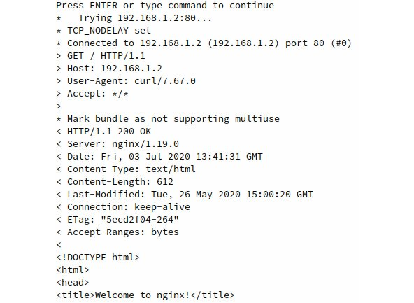


In the next activity, we will
look at how Docker `overlay` networking can be leveraged to
provide horizontal scalability for our Panoramic Trekking application.
By deploying Panoramic Trekking across multiple hosts, we can ensure
reliability and durability, and make use of system resources from more
than one node in our environment.


Activity 6.02: Overlay Networking in Action
-------------------------------------------

In this lab, you have seen how powerful `overlay`
networking is when deploying multiple containers between cluster hosts
with direct network connectivity between them. In this activity, you
will revisit the two-node Docker swarm cluster and create services from
the Panoramic Trekking application that will connect using Docker DNS
between two hosts. In this scenario, different microservices will be
running on different Docker swarm hosts but will still be able to
leverage the Docker `overlay` network to directly communicate
with each other.

To complete this activity successfully, perform the following steps:

1.  A Docker `overlay` network using a custom subnet and
    gateway
2.  One application Docker swarm service called `trekking-app`
    using an Alpine Linux container
3.  One database Docker swarm service called `database-app`
    using a PostgreSQL 12 container (extra credit to supply default
    credentials)
4.  Prove that the `trekking-app` service can communicate with
    the `database-app` service using `overlay`
    networking

**Expected Output:**

The `trekking-app` service should be able to communicate with
the `database-app` service, which can be verified by ICMP
replies such as the following:


```
PING database-app (10.2.0.5): 56 data bytes
64 bytes from 10.2.0.5: seq=0 ttl=64 time=0.261 ms
64 bytes from 10.2.0.5: seq=1 ttl=64 time=0.352 ms
64 bytes from 10.2.0.5: seq=2 ttl=64 time=0.198 ms
```


Summary
=======


In this lab, we looked at the many facets of networking in relation
to microservices and Docker containers. Docker comes equipped with
numerous drivers and configuration options that users can use to tune
the way their container networking works in almost any environment. By
deploying the correct networks and the correct drivers, powerful service
mesh networks can quickly be spun up to enable container-to-container
access without egressing any physical Docker hosts. Containers can even
be created that will bind to the host networking fabric to take
advantage of the underlying network infrastructure.

Quite arguably the most powerful network feature that can be enabled in
Docker is the ability to create networks across clusters of Docker
hosts. This can allow us to quickly create and deploy horizontal scaling
applications between hosts for high availability and redundancy. By
leveraging the underlay network, `overlay` networks within
swarm clusters allow containers to directly contact containers running
on other cluster hosts by taking advantage of the powerful Docker DNS
system.

In the next lab, we will look at the next pillar of a powerful
containerized infrastructure: storage. By understanding how container
storage can be utilized for stateful applications, extremely powerful
solutions can be architected that involve not only containerized
stateless applications, but containerized database services that can be
deployed, scaled, and optimized as easily as other containers across
your infrastructure.
