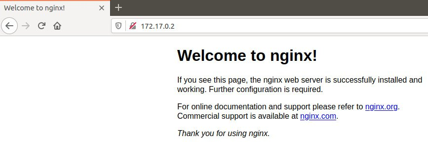
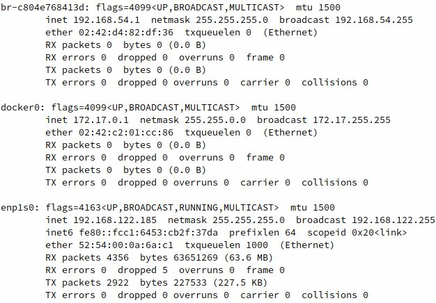
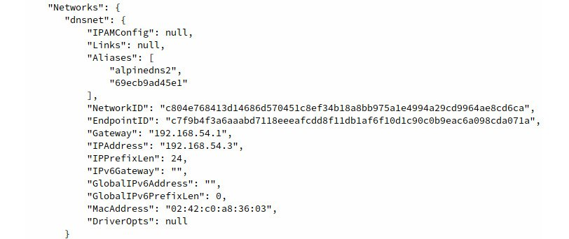
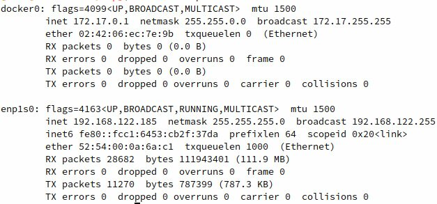
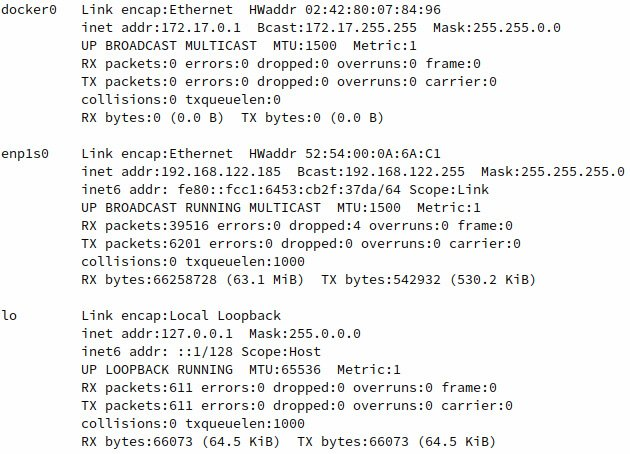
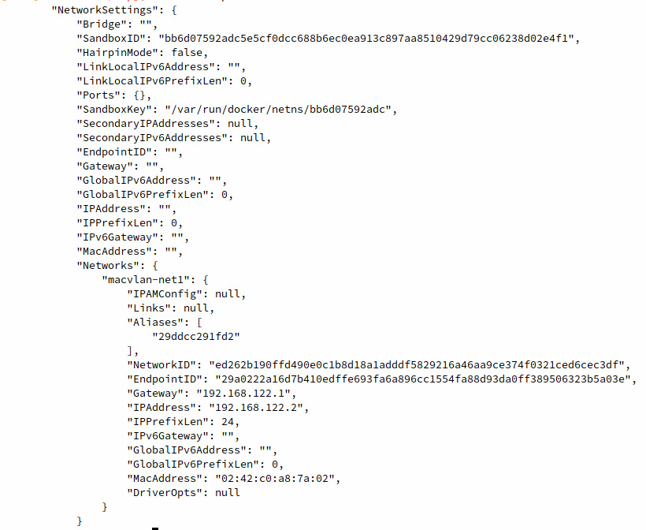

Lab 6: Introduction to Docker Networking
========================================

The goal of this lab is to provide you with a concise overview of
how container networking works, how it differs from networking at the
level of the Docker host, and how containers can leverage Docker
networking to provide direct network connectivity to other containerized
services. By the end of this lab, you will know how to deploy
containers using networking configurations such as `bridge`,
`overlay`, `macvlan`, and `host`. You will
learn the benefits of different networking drivers and under which
circumstances you should choose certain network drivers. Finally, we
will look at containerized networking between hosts deployed in a Docker
swarm cluster.


Exercise 6.01: Hands-On with Docker Networking
----------------------------------------------

In this exercise, you will run Docker containers and use basic
networking to run two simple web servers (Apache2 and NGINX) that will
expose ports in a few different basic networking scenarios. You will
then access the exposed ports of the container to learn more about how
Docker networking works at the most basic level. Launching containers
and exposing the service ports to make them available is one of the most
common networking scenarios when first starting with containerized
infrastructure:

1.  List the networks that are currently configured in your Docker
    environment using the `docker network ls` command:

    
    ```
    docker network ls
    ```
    

    The output displayed will show all the configured Docker networks
    available on your system. It should resemble the following:

    
    ```
    NETWORK ID      NAME      DRIVER     SCOPE
    0774bdf6228d    bridge    bridge     local
    f52b4a5440ad    host      host       local
    9bed60b88784    none      null       local
    ```
    

2.  When creating a container using Docker without specifying a network
    or networking driver, Docker will create the container using a
    `bridge` network. This network exists behind a
    `bridge` network interface configured in your host OS. Use
    `ifconfig` in a Linux or macOS Bash shell, or
    `ipconfig` in Windows PowerShell, to see which interface
    the Docker bridge is configured as. It is generally called
    `docker0`:

    
    ```
    ifconfig 
    ```
    

    The output of this command will list all the network interfaces
    available in your environment, as shown in the following figure:

    

    


    It can be observed in the preceding figure that the Docker
    `bridge` interface is called `docker0` and has
    an IP address of `172.17.0.1`.

3.  Use the `docker run` command to create a simple NGINX web
    server container, using the `latest` image tag. Set the
    container to start in the background using the `-d` flag
    and give it a human-readable name of `webserver1` using
    the `--name` flag:

    
    ```
    docker run -d –-name webserver1 nginx:latest 
    ```
    

    If the command is successful, no output will be returned in the
    terminal session.

4.  Execute the `docker ps` command to check whether the
    container is up and running:

    
    ```
    docker ps
    ```
    

    As you can see, the `webserver1` container is up and
    running as expected:

    
    ```
    CONTAINER ID  IMAGE         COMMAND                 CREATED
      STATUS                   PORTS               NAMES
    0774bdf6228d  nginx:latest  "nginx -g 'daemon of…"  4 seconds ago
      Up 3 seconds             80/tcp              webserver1
    ```
    

5.  Execute the `docker inspect` command to check what
    networking configuration this container has by default:

    
    ```
    docker inspect webserver1
    ```
    

    Docker will return the verbose details about the running container
    in JSON format. For this exercise, focus on the
    `NetworkSettings` block. Pay special attention to the
    `Gateway`, `IPAddress`, `Ports`, and
    `NetworkID` parameters underneath the `networks`
    sub-block:

    

    


    From this output, it can be concluded that this container lives in
    the default Docker `bridge` network. Looking at the first
    12 characters of `NetworkID`, you will observe that it is
    the same identifier used in the output of the
    `docker network ls` command, which was executed in *step
    1*. It should also be noted that the `Gateway` this
    container is configured to use is the IP address of the
    `docker0` `bridge` interface. Docker will use
    this interface as an egress point to access networks in other
    subnets outside itself, as well as forwarding traffic from our
    environment to the containers in the subnet. It can also be observed
    that this container has a unique IP address within the Docker bridge
    network, `172.17.0.2` in this example. Our local machine
    has the ability to route to this subnet since we have the
    `docker0` `bridge` interface available to
    forward traffic. Finally, it can be observed that the NGINX
    container is by default exposing TCP port `80` for
    incoming traffic.

6.  In a web browser, access the `webserver1` container by IP
    address over port `80`. Enter the IP address of the
    `webserver1` container in your favorite web browser:

    
    


7.  Alternatively, use the `curl` command to see similar
    output, albeit in text format:

    
    ```
    curl 172.17.0.2:80
    ```
    

    The following HTML response indicates that you have received a
    response from the running NGINX container:

    
    ```
    <!DOCTYPE html>
    <html>
    <head>
    <title>Welcome to nginx!</title>
    <style>
        body {
            width: 35em;
            margin: 0 auto;
            font-family: Tahoma, Verdana, Arial, sans-serif;
        }
    </style>
    </head>
    <body>
    <h1>Welcome to nginx!</h1>
    <p>If you see this page, the nginx web server is successfully 
    installed and working. Further configuration is required.</p>
    <p>For online documentation and support please refer to
    <a href="http://nginx.org/">nginx.org</a>.<br/>
    Commercial support is available at
    <a href="http://nginx.com/">nginx.com</a>.</p>
    <p><em>Thank you for using nginx.</em></p>
    </body>
    </html>
    ```
    

8.  Accessing the IP address of a container in the local
    `bridge` subnet works well for testing containers locally.
    To expose your service on the network to other users or servers, use
    the `-p` flag in the `docker run` command. This
    will allow you to map a port on the host to an exposed port on the
    container. This is similar to port forwarding on a router or other
    network device. To expose a container by the port to the outside
    world, use the `docker run` command followed by the
    `-d` flag to start the container in the background. The
    `-p` flag will enable you to specify a port on the host,
    separated by a colon and the port on the container that you wish to
    expose. Also, give this container a unique name,
    `webserver2`:

    
    ```
    docker run -d -p 8080:80 –-name webserver2 nginx:latest
    ```
    

    Upon successful container startup, your shell will not return
    anything. However, certain versions of Docker may show the full
    container ID.

9.  Run the `docker ps` command to check whether you have two
    NGINX containers up and running:

    
    ```
    docker ps
    ```
    

    The two running containers, `webserver1` and
    `webserver2`, will be displayed:

    
    ```
    CONTAINER ID IMAGE         COMMAND                 CREATED
      STATUS              PORTS                  NAMES
    b945fa75b59a nginx:latest  "nginx -g 'daemon of…"  1 minute ago
      Up About a minute   0.0.0.0:8080->80/tcp   webserver2
    3267bf4322ed nginx:latest  "nginx -g 'daemon of…"  2 minutes ago
      Up 2 minutes        80/tcp                 webserver1
    ```
    

    In the `PORTS` column, you will see that Docker is now
    forwarding port `80` on the `webserver`
    container to port `8080` on the host machine. That is
    deduced from the `0.0.0.0:8080->80/tcp` part of the
    output.

    Note

    It is important to remember that the host machine port is always to
    the left of the colon, while the container port is to the right when
    specifying ports with the `-p` flag.

10. In your web browser, navigate to `http://localhost:8080`
    to see the running container instance you just spawned:

    
    
    


    forwarded a port to your web server container

11. Now, you have two NGINX instances running in the same Docker
    environment with slightly different networking configurations. The
    `webserver1` instance is running solely on the Docker
    network without any ports exposed. Inspect the configuration of the
    `webserver2` instance using the `docker inspect`
    command followed by the container name or ID:

    
    ```
    docker inspect webserver2
    ```
    

    The `NetworkSettings` section at the bottom of the JSON
    output will resemble the following. Pay close attention to the
    parameters (`Gateway`, `IPAddress`,
    `Ports`, and `NetworkID`) underneath the
    `networks` sub-block:

    

    


    As the `docker inspect` output displays, the
    `webserver2` container has an IP address of
    `172.17.0.3`, whereas your `webserver1`
    container has an IP address of `172.17.0.1`. The IP
    addresses in your local environment may be slightly different
    depending on how Docker assigns the IP addresses to the containers.
    Both the containers live on the same Docker network
    (`bridge`) and have the same default gateway, which is the
    `docker0` `bridge` interface on the host
    machine.

12. Since both of these containers live on the same subnet, you can test
    communication between the containers within the Docker
    `bridge` network. Run the `docker exec` command
    to gain access to a shell on the `webserver1` container:

    
    ```
    docker exec -it webserver1 /bin/bash
    ```
    

    The prompt should noticeably change to a root prompt, indicating you
    are now in a Bash shell on the `webserver1` container:

    
    ```
    root@3267bf4322ed:/#
    ```
    

13. At the root shell prompt, use the `apt` package manager to
    install the `ping` utility in this container:

    
    ```
    root@3267bf4322ed:/# apt-get update && apt-get install -y inetutils-ping
    ```
    

    The aptitude package manager will then install the `ping`
    utility in the `webserver1` container. Please note that
    the `apt` package manager will install `ping` as
    well as other dependencies that are required to run the
    `ping` command:

    

    


14. Once the `ping` utility has successfully installed, use it
    to ping the IP address of the other container:

    
    ```
    root@3267bf4322ed:/# ping 172.17.0.3
    ```
    

    The output should display ICMP response packets, indicating that the
    containers can successfully ping each other through the Docker
    `bridge` network:

    
    ```
    PING 172.17.0.1 (172.17.0.3): 56 data bytes
    64 bytes from 172.17.0.3: icmp_seq=0 ttl=64 time=0.221 ms
    64 bytes from 172.17.0.3: icmp_seq=1 ttl=64 time=0.207 ms
    ```
    

15. You can also access the NGINX default web interface using the
    `curl` command. Install `curl` using the
    `apt` package manager:

    
    ```
    root@3267bf4322ed:/# apt-get install -y curl
    ```
    

    The following output should display, indicating that the
    `curl` utility and all required dependencies are being
    installed:

    

    


16. After installing `curl`, use it to curl the IP address of
    `webserver2`:

    
    ```
    root@3267bf4322ed:/# curl 172.17.0.3
    ```
    

    You should see the `Welcome to nginx!` page displayed in
    HTML format, indicating that you were able to successfully contact
    the IP address of the `webserver2` container through the
    Docker `bridge` network:

    
    ```
    <!DOCTYPE html>
    <html>
    <head>
    <title>Welcome to nginx!</title>
    <style>
        body {
            width: 35em;
            margin: 0 auto;
            font-family: Tahoma, Verdana, Arial, sans-serif;
        }
    </style>
    </head>
    <body>
    <h1>Welcome to nginx!</h1>
    <p>If you see this page, the nginx web server is successfully 
    installed and working. Further configuration is required.</p>
    <p>For online documentation and support please refer to
    <a href="http://nginx.org/">nginx.org</a>.<br/>
    Commercial support is available at
    <a href="http://nginx.com/">nginx.com</a>.</p>
    <p><em>Thank you for using nginx.</em></p>
    </body>
    </html>
    ```
    

    Since you are using `curl` to navigate to the NGINX
    welcome page, it will render on your terminal display in raw HTML
    format.

In this section, we have successfully spawned two NGINX web server
instances in the same Docker environment. We configured one instance to
not expose any ports outside the default Docker network, while we
configured the second NGINX instance to run on the same network but to
expose port `80` to the host system on port `8080`.
We saw how these containers could be accessed using a standard internet
web browser as well as by the `curl` utility in Linux.

During this exercise, we also saw how containers can use Docker networks
to talk to other containers directly. We used the `webserver1`
container to call the IP address of the `webserver2` container
and display the output of the web page the container was hosting.

In this exercise, we were also able to demonstrate network connectivity
between container instances using the native Docker `bridge`
network. However, when we deploy containers at scale, there is no easy
way to know which IP address in the Docker network belongs to which
container.

In the next section, we will look at native Docker DNS and learn how to
use human-readable DNS names to reliably send network traffic to other
container instances.


Exercise 6.02: Working with Docker DNS
--------------------------------------

In the following exercise, you will learn about name resolution between
Docker containers running on the same network. You will first enable
simple name resolution using the legacy link method. You will contrast
this approach by using the newer and more reliable native Docker DNS
service:

1.  First, create two Alpine Linux containers on the default Docker
    `bridge` network that will communicate with each other
    using the `--link` flag. Alpine is a very good base image
    for this exercise because it contains the `ping` utility
    by default. This will enable you to quickly test the connectivity
    between containers in the various scenarios. To get started, create
    a container called `containerlink1` to indicate that you
    have created this container using the legacy link method:

    
    ```
    docker run -itd --name containerlink1 alpine:latest
    ```
    

    This will start a container in the default Docker network called
    `containerlink1`.

2.  Start another container in the default Docker bridge network, called
    `containerlink2`, which will create a link to
    `containerlink1` to enable rudimentary DNS:

    
    ```
    docker run -itd --name containerlink2 --link containerlink1 alpine:latest
    ```
    

    This will start a container in the default Docker network called
    `containerlink2`.

3.  Run the `docker exec` command to access a shell inside the
    `containerlink2` container. This will allow you to
    investigate how the link functionality is working. Since this
    container is running Alpine Linux, you do not have access to the
    Bash shell by default. Instead, access it using an `sh`
    shell:

    
    ```
    docker exec -it containerlink2 /bin/sh
    ```
    

    This should drop you into a root `sh` shell in the
    `containerlink2` container.

4.  From the shell of the `containerlink2` container, ping
    `containerlink1`:

    
    ```
    / # ping containerlink1
    ```
    

    You will get a reply to the `ping` request:

    
    ```
    PING container1 (172.17.0.2): 56 data bytes
    64 bytes from 172.17.0.2: seq=0 ttl=64 time=0.307 ms
    64 bytes from 172.17.0.2: seq=1 ttl=64 time=0.162 ms
    64 bytes from 172.17.0.2: seq=2 ttl=64 time=0.177 ms
    ```
    

5.  Use the `cat` utility to have a look at the
    `/etc/hosts` file of the `containerlink2`
    container. The `hosts` file is a list of routable names to
    IP addresses that Docker can maintain and override:

    
    ```
    / # cat /etc/hosts
    ```
    

    The output of the `hosts` file should display and resemble
    the following:

    
    ```
    127.0.0.1  localhost
    ::1  localhost ip6-localhost ip6-loopback
    fe00::0    ip6-localnet
    ff00::0    ip6-mcastprefix
    ff02::1    ip6-allnodes
    ff02::2    ip6-allrouters
    172.17.0.2    containerlink1 032f038abfba
    172.17.0.3    9b62c4a57ce3
    ```
    

    From the output of the `hosts` file of the
    `containerlink2` container, observe that Docker is adding
    an entry for the `containerlink1` container name as well
    as its container ID. This enables the `containerlink2`
    container to know the name, and the container ID is mapped to the IP
    address `172.17.0.2`. Typing the `exit` command
    will terminate the `sh` shell session and bring you back
    to your environment\'s main terminal.

6.  Run `docker exec` to access an `sh` shell inside
    the `containerlink1` container:

    
    ```
    docker exec -it containerlink1 /bin/sh
    ```
    

    This should drop you into the shell of the
    `containerlink1` container.

7.  Ping the `containerlink2` container using the
    `ping` utility:

    
    ```
    / # ping containerlink2
    ```
    

    You should see the following output:

    
    ```
    ping: bad address 'containerlink2'
    ```
    

    It is not possible to ping the `containerlink2` container
    since linking containers only works unidirectionally. The
    `containerlink1` container has no idea that the
    `containerlink2` container exists since no
    `hosts` file entry has been created in the
    `containerlink1` container instance.

    Note

    You can only link to running containers using the legacy link method
    between containers. This means that the first container cannot link
    to containers that get started later. This is one of the many
    reasons why using links between containers is no longer a
    recommended approach. We are covering the concept in this lab to
    show you how the functionality works.

8.  Due to the limitations using the legacy link method, Docker also
    supports native DNS using user-created Docker networks. To leverage
    this functionality, create a Docker network called
    `dnsnet` and deploy two Alpine containers within that
    network. First, use the `docker network create` command to
    create a new Docker network using a `192.168.56.0/24`
    subnet and using the IP address `192.168.54.1` as the
    default gateway:

    
    ```
    docker network create dnsnet --subnet 192.168.54.0/24 --gateway 192.168.54.1
    ```
    

    Depending on the version of Docker you are using, the successful
    execution of this command may return the ID of the network you have
    created.

    Note

    Simply using the `docker network create dnsnet` command
    will create a network with a Docker-allocated subnet and gateway.
    This exercise demonstrates how to specify the subnet and gateway for
    your Docker network. It should also be noted that if your computer
    is attached to a subnet in the `192.168.54.0/24` subnet or
    a subnet that overlaps that space, it may cause network connectivity
    issues. Please use a different subnet for this exercise.

9.  Use the `docker network ls` command to list the Docker
    networks available in this environment:

    
    ```
    docker network ls
    ```
    

    The list of Docker networks should be returned, including the
    `dnsnet` network you just created:

    
    ```
    NETWORK ID      NAME       DRIVER     SCOPE
    ec5b91e88a6f    bridge     bridge     local
    c804e768413d    dnsnet     bridge     local
    f52b4a5440ad    host       host       local
    9bed60b88784    none       null       local
    ```
    

10. Run the `docker network inspect` command to view the
    configuration for this network:

    
    ```
    docker network inspect dnsnet
    ```
    

    The details of the `dnsnet` network should be displayed.
    Pay close attention to the `Subnet` and
    `Gateway` parameters. These are the same parameters that
    you used to create a Docker network in *Step 8*:

    

    


11. Since this is a Docker `bridge` network, Docker will also
    create a corresponding bridge network interface for this network.
    The IP address of the `bridge` network interface will be
    the same IP address as the default gateway address you specified
    when creating this network. Use the `ifconfig` command to
    view the configured network interfaces on Linux or macOS. If you are
    using Windows, use the `ipconfig` command:

    
    ```
    ifconfig
    ```
    

    This should display the output of all available network interfaces,
    including the newly created `bridge` interface:

    
    


12. Now that a new Docker network has been created, use the
    `docker run` command to start a new container
    (`alpinedns1`) within this network. Use the
    `docker run` command with the `--network` flag
    to specify the `dnsnet` network that was just created, and
    the `--network-alias` flag to give your container a custom
    DNS name:

    
    ```
    docker run -itd --network dnsnet --network-alias alpinedns1 --name alpinedns1 alpine:latest
    ```
    

    Upon successful execution of the command, the full container ID
    should be displayed before returning to a normal terminal prompt.

13. Start a second container (`alpinedns2`) using the same
    `--network` and `--network-alias` settings:

    
    ```
    docker run -itd --network dnsnet --network-alias alpinedns2 --name alpinedns2 alpine:latest
    ```
    

    Note

    It is important to understand the difference between the
    `–network-alias` flag and the `--name` flag. The
    `--name` flag is used to give the container a
    human-readable name within the Docker API. This makes it easy to
    start, stop, restart, and manage containers by name. The
    `--network-alias` flag, however, is used to create a
    custom DNS entry for the container.

14. Use the `docker ps` command to verify that the containers
    are running as expected:

    
    ```
    docker ps 
    ```
    

    The output will display the running container instances:

    
    ```
    CONTAINER ID    IMAGE           COMMAND      CREATED 
      STATUS              PORTS             NAMES
    69ecb9ad45e1    alpine:latest   "/bin/sh"    4 seconds ago
      Up 2 seconds                          alpinedns2
    9b57038fb9c8    alpine:latest   "/bin/sh"    6 minutes ago
      Up 6 minutes                          alpinedns1
    ```
    

15. Use the `docker inspect` command to verify that the IP
    addresses of the container instances are from within the subnet
    (`192.168.54.0/24`) that was specified:

    
    ```
    docker inspect alpinedns1
    ```
    

    The following output is truncated to show the relevant details:

    
    
    

    Figure: 6.10: Output from the Networks section of the alpinedns1
    container instance

    It can be observed from the output that the `alpinedns1`
    container was deployed with an IP address of
    `192.168.54.2`, which is a part of the subnet that was
    defined during the creation of the Docker network.

16. Execute the `docker network inspect` command in a similar
    fashion for the `alpinedns2` container:

    
    ```
    docker inspect alpinedns2
    ```
    

    The output is again truncated to display the relevant networking
    details:

    
    

    It can be observed in the preceding output that the
    `alpinedns2` container has an IP address of
    `192.168.54.3`, which is a different IP address within the
    `dnsnet` subnet.

17. Run the `docker exec` command to access a shell in the
    `alpinedns1` container:

    
    ```
    docker exec -it alpinedns1 /bin/sh
    ```
    

    This should drop you into a root shell inside of the containers.

18. Once inside the `alpinedns1` container, use the
    `ping` utility to ping the `alpinedns2`
    container:

    
    ```
    / # ping alpinedns2
    ```
    

    The `ping` output should display successful network
    connectivity to the `alpinedns2` container instance:

    
    ```
    PING alpinedns2 (192.168.54.3): 56 data bytes
    64 bytes from 192.168.54.3: seq=0 ttl=64 time=0.278 ms
    64 bytes from 192.168.54.3: seq=1 ttl=64 time=0.233 ms
    ```
    

19. Use the `exit` command to return to your primary terminal.
    Use the `docker exec` command to gain access to a shell
    inside the `alpinedns2` container:

    
    ```
    docker exec -it alpinedns2 /bin/sh
    ```
    

    This should drop you to a shell within the `alpinedns2`
    container.

20. Use the `ping` utility to ping the `alpinedns1`
    container by name:

    
    ```
    $ ping alpinedns1
    ```
    

    The output should display successful responses from the
    `alpinedns1` container:

    
    ```
    PING alpinedns1 (192.168.54.2): 56 data bytes
    64 bytes from 192.168.54.2: seq=0 ttl=64 time=0.115 ms
    64 bytes from 192.168.54.2: seq=1 ttl=64 time=0.231 ms
    ```
    

    Note

    Docker DNS, as opposed to the legacy link method, allows
    bidirectional communication between containers in the same Docker
    network.

21. Use the `cat` utility inside any of the
    `alpinedns` containers to reveal that Docker is using true
    DNS as opposed to `/etc/hosts` file entries inside the
    container:

    
    ```
    # cat /etc/hosts
    ```
    

    This will reveal the contents of the `/etc/hosts` file
    inside the respective container:

    
    ```
    127.0.0.1  localhost
    ::1  localhost ip6-localhost ip6-loopback
    fe00::0    ip6-localnet
    ff00::0    ip6-mcastprefix
    ff02::1    ip6-allnodes
    ff02::2    ip6-allrouters
    192.168.54.2    9b57038fb9c8
    ```
    

    Use the `exit` command to terminate the shell session
    inside of the `alpinedns2` container.

22. Clean up your environment by stopping all running containers using
    the `docker stop` command:
    
    ```
    docker stop  containerlink1
    docker stop  containerlink2
    docker stop  alpinedns1
    docker stop  alpinedns2
    ```
    

23. Use the `docker system prune -fa` command to clean the
    remaining stopped containers and networks:

    
    ```
    docker system prune -fa
    ```
    

    Successfully executing this command should clean up the
    `dnsnet` network as well as the container instances and
    images:

    
    ```
    Deleted Containers:
    69ecb9ad45e16ef158539761edc95fc83b54bd2c0d2ef55abfba1a300f141c7c
    9b57038fb9c8cf30aaebe6485e9d223041a9db4e94eb1be9392132bdef632067
    Deleted Networks:
    dnsnet
    Deleted Images:
    untagged: alpine:latest
    untagged: alpine@sha256:9a839e63dad54c3a6d1834e29692c8492d93f90c
        59c978c1ed79109ea4fb9a54
    deleted: sha256:f70734b6a266dcb5f44c383274821207885b549b75c8e119
        404917a61335981a
    deleted: sha256:3e207b409db364b595ba862cdc12be96dcdad8e36c59a03b
        b3b61c946a5741a
    Total reclaimed space: 42.12M
    ```
    

    Each section of the system prune output will identify and remove
    Docker resources that are no longer in use. In this case, it will
    remove the `dnsnet` network since no container instances
    are currently deployed in this network.

In this exercise, you looked at the benefits of using name resolution to
enable communication between the containers over Docker networks. Using
name resolution is efficient since applications don\'t have to worry
about the IP addresses of the other running containers. Instead,
communication can be initiated by simply calling the other containers by
name.

We first explored the legacy link method of name resolution, by which
running containers can establish a relationship, leveraging a
unidirectional relationship using entries in the container\'s
`hosts` file. The second and more modern way to use DNS
between containers is by creating user-defined Docker networks that
allow DNS resolution bidirectionally. This will enable all containers on
the network to resolve all other containers by name or container ID
without any additional configuration.

As we have seen in this section, Docker provides many unique ways to
provide reliable networking resources to container instances, such as
enabling routing between containers on the same Docker network and
native DNS services between containers. This is only scratching the
surface of the network options that are provided by Docker.

In the next section, we will learn about deploying containers using
other types of networking drivers to truly provide maximum flexibility
when deploying containerized infrastructure.


Exercise 6.03: Exploring Docker Networks
----------------------------------------

In this exercise, we will look into the various types of Docker network
drivers that are supported in Docker by default, such as
`host`, `none`, and `macvlan`. We will
start with the `bridge` network and then look into the
`none`, `host`, and `macvlan` networks:

1.  First, you need to get an idea of how networking is set up in your
    Docker environment. From a Bash or PowerShell terminal, use the
    `ifconfig` or `ipconfig` command on Windows.
    This will display all the network interfaces in your Docker
    environment:

    
    ```
    ifconfig
    ```
    

    This will display all the network interfaces you have available. You
    should see a `bridge` interface called
    `docker0`. This is the Docker `bridge` interface
    that serves as the entrance (or ingress point) into the default
    Docker network:

    
    

2.  Use the `docker network ls` command to view the networks
    available in your Docker environment:

    
    ```
    docker network ls
    ```
    

    This should list the three basic network types defined previously,
    displaying the network ID, the name of the Docker network, and the
    driver associated with the network type:

    
    ```
    NETWORK ID       NAME      DRIVER     SCOPE
    50de4997649a     bridge    bridge     local
    f52b4a5440ad     host      host       local
    9bed60b88784     none      null       local
    ```
    

3.  View the verbose details of these networks using the
    `docker network inspect` command, followed by the ID or
    the name of the network you want to inspect. In this step, you will
    view the verbose details of the `bridge` network:

    
    ```
    docker network inspect bridge
    ```
    

    Docker will display the verbose output of the `bridge`
    network in JSON format:

    

    


    Some key parameters to note in this output are the
    `Scope`, `Subnet`, and `Gateway`
    keywords. Based on this output, it can be observed that the scope of
    this network is only the local host machine
    (`Scope: Local`). This indicates the network is not shared
    between hosts in a Docker swarm cluster. The `Subnet`
    value of this network under the `Config` section is
    `172.17.0.0/16`, and the `Gateway` address for
    the subnet is an IP address within the defined subnet
    (`172.17.0.1`). It is critical that the
    `Gateway` value of a subnet is an IP address within that
    subnet to enable containers deployed in that subnet to access other
    networks outside the scope of that network. Finally, this network is
    tied to the host interface, `docker0`, which will serve as
    the `bridge` interface for the network. The output of the
    `docker network inspect` command can be very helpful in
    getting a full understanding of how containers deployed in that
    network are expected to behave.

4.  View the verbose details of the `host` network using the
    `docker network inspect` command:

    
    ```
    docker network inspect host
    ```
    

    This will display the details of the `host` network in
    JSON format:

    

    


    As you can see, there is not very much configuration present in the
    `host` network. Since it uses the `host`
    networking driver, all the container\'s networking will be shared
    with the host. Hence, this network configuration does not need to
    define specific subnets, interfaces, or other metadata, as we have
    seen in the default `bridge` network from before.

5.  Investigate the `none` network next. Use the
    `docker network inspect` command to view the details of
    the `none` network:

    
    ```
    docker network inspect none
    ```
    

    The details will be displayed in JSON format:

    

    


    Similar to the `host` network, the `none`
    network is mostly empty. Since containers deployed in this network
    will have no network connectivity by leveraging the `null`
    driver, there isn\'t much need for configuration.

    Note

    Be aware that the difference between the `none` and
    `host` networks lies in the driver they use, despite the
    fact that the configurations are almost identical. Containers
    launched in the `none` network have no network
    connectivity at all, and no network interfaces are assigned to the
    container instance. However, containers launched in the
    `host` network will share the networking stack with the
    host system.

6.  Now create a container in the `none` network to observe
    its operation. In your terminal or PowerShell session, use the
    `docker run` command to start an Alpine Linux container in
    the `none` network using the `--network` flag.
    Name this container `nonenet` so we know that it is
    deployed in the `none` network:

    
    ```
    docker run -itd --network none --name nonenet alpine:latest 
    ```
    

    This will pull and start an Alpine Linux Docker container in the
    `none` network.

7.  Use the `docker ps` command to verify whether the
    container is up and running as expected:

    
    ```
    docker ps 
    ```
    

    The output should display the `nonenet` container as up
    and running:

    
    ```
    CONTAINER ID    IMAGE            COMMAND      CREATED 
      STATUS              PORTS              NAMES
    972a80984703    alpine:latest    "/bin/sh"    9 seconds ago
      Up 7 seconds                           nonenet
    ```
    

8.  Execute the `docker inspect` command, along with the
    container name, `nonenet`, to get a deeper understanding
    of how this container is configured:

    
    ```
    docker inspect nonenet
    ```
    

    The output of `docker inspect` will display the full
    container configuration in JSON format. A truncated version
    highlighting the `NetworkSettings` section is provided
    here. Pay close attention to the `IPAddress` and
    `Gateway` settings:

    

    


    The `docker inspect` output will reveal that this
    container does not have an IP address, nor does it have a gateway or
    any other networking settings.

9.  Use the `docker exec` command to access an `sh`
    shell inside this container:

    
    ```
    docker exec -it nonenet /bin/sh
    ```
    

    Upon successful execution of this command, you will be dropped into
    a root shell in the container instance:

    
    ```
    / #
    ```
    

10. Execute the `ip a` command to view the network interfaces
    available in the container:

    
    ```
    ip a 
    ```
    

    This will display all network interfaces configured in this
    container:

    
    ```
    1: lo: <LOOPBACK,UP,LOWER_UP> mtu 65536 qdisc noqueue state 
    UNKNOWN qlen 1000
        link/loopback 00:00:00:00:00:00 brd 00:00:00:00:00:00
        inet 127.0.0.1/8 scope host lo
        valid_lft forever preferred_lft forever
    ```
    

    The only network interface available to this container is its
    `LOOPBACK` interface. As this container is not configured
    with an IP address or default gateway, common networking commands
    will not work.

11. Test the lack of network connectivity using the `ping`
    utility provided by default in the Alpine Linux Docker image. Try to
    ping the Google DNS servers located at IP address
    `8.8.8.8`:

    
    ```
    / # ping 8.8.8.8
    ```
    

    The output of the `ping` command should reveal that it has
    no network connectivity:

    
    ```
    PING 8.8.8.8 (8.8.8.8): 56 data bytes
    ping: sendto: Network unreachable
    ```
    

    Use the `exit` command to return to your main terminal
    session.

    Now that you have taken a closer look at the `none`
    network, consider the `host` networking driver. The
    `host` networking driver in Docker is unique since it
    doesn\'t have any intermediate interfaces or create any extra
    subnets. Instead, the `host` networking driver shares the
    networking stack with the host operating system such that any
    network interfaces that are available to the host are also available
    to containers running in `host` mode.

12. To get started with running a container in `host` mode,
    execute `ifconfig` if you are running macOS or Linux, or
    use `ipconfig` if you are running on Windows, to take
    inventory of the network interfaces that are available on the host
    machine:

    
    ```
    ifconfig
    ```
    

    This should output a list of network interfaces available on your
    host machine:

    
    

    In this example, the primary network interface of your host machine
    is `enp1s0` with an IP address of
    `192.168.122.185`.

    Note

    Some versions of Docker Desktop on macOS or Windows may not properly
    be able to start and run containers in `host` network mode
    or using `macvlan `network drivers, due to the
    dependencies on the Linux kernel to provide many of these
    functionalities. When running these examples on macOS or Windows,
    you may see the network details of the underlying Linux virtual
    machine running Docker, as opposed to the network interfaces
    available on your macOS or Windows host machine.

13. Use the `docker run` command to start an Alpine Linux
    container in the `host` network. Name it
    `hostnet1` to tell it apart from the other containers:

    
    ```
    docker run -itd --network host --name hostnet1 alpine:latest
    ```
    

    Docker will start this container in the background using the
    `host` network.

14. Use the `docker inspect` command to look at the network
    configuration of the `hostnet1` container you just
    created:

    
    ```
    docker inspect hostnet1
    ```
    

    This will reveal the verbose configuration of the running container,
    including the networking details, in JSON format:

    

    


    It should be noted that the output of the
    `NetworkSettings` block will look a lot like the
    containers you deployed in the `none` network. In the
    `host` networking mode, Docker will not assign an IP
    address or gateway to the container instance since it shares all
    network interfaces with the host machine directly.

15. Use `docker exec` to access an `sh` shell inside
    this container, providing the name `hostnet1`:

    
    ```
    docker exec -it hostnet1 /bin/sh
    ```
    

    This should drop you into a root shell inside the
    `hostnet1` container.

16. Inside the `hostnet1` container, execute the
    `ifconfig` command to list which network interfaces are
    available to it:

    
    ```
    / # ifconfig
    ```
    

    The full list of network interfaces available inside of this
    container should be displayed:

    
    


    Note that this list of network interfaces is identical to that which
    you encountered when querying the host machine directly. This is
    because this container and the host machine are sharing the network
    directly. Anything available to the host machine will also be
    available to containers running in `host` network mode.

17. Use the `exit` command to end the shell session and return
    to the terminal of the host machine.

18. To understand more fully how the shared networking model works in
    Docker, start an NGINX container in `host` network mode.
    The NGINX container automatically exposes port `80`, which
    we previously had to forward to a port on the host machine. Use the
    `docker run` command to start an NGINX container on the
    host machine:

    
    ```
    docker run -itd --network host --name hostnet2 nginx:latest
    ```
    

    This command will start an NGINX container in the `host`
    networking mode.

19. Navigate to `http://localhost:80` using a web browser on
    the host machine:

    
    

    You should be able to see the NGINX default web page displayed in
    your web browser. It should be noted that the `docker run`
    command did not explicitly forward or expose any ports to the host
    machine. Since the container is running in `host`
    networking mode, any ports that containers expose by default will be
    available directly on the host machine.

20. Use the `docker run` command to create another NGINX
    instance in the `host` network mode. Call this container
    `hostnet3` to differentiate it from the other two
    container instances:
    
    ```
    docker run -itd --network host --name hostnet3 nginx:latest
    ```
    

21. Now use the `docker ps -a` command to list all the
    containers, both in running and stopped status:

    
    ```
    docker ps -a
    ```
    

    The list of running containers will be displayed:

    
    ```
    CONTAINER ID  IMAGE         COMMAND                CREATED
      STATUS                        PORTS           NAMES
    da56fcf81d02  nginx:latest  "nginx -g 'daemon of…" 4 minutes ago
      Exited (1) 4 minutes ago                      hostnet3
    5786dac6fd27  nginx:latest  "nginx -g 'daemon of…" 37 minutes ago
      Up 37 minutes                                 hostnet2
    648b291846e7  alpine:latest "/bin/sh"              38 minutes ago
      Up 38 minutes                                 hostnet
    ```
    

22. Based on the preceding output, you can see that the
    `hostnet3` container exited and is currently in a stopped
    state. To understand more fully why this is the case, use the
    `docker logs` command to view the container logs:

    
    ```
    docker logs hostnet3
    ```
    

    The log output should be displayed as follows:

    

    


    Essentially, this second instance of an NGINX container was unable
    to start properly because it was unable to bind to port
    `80` on the host machine. The reason for this is that the
    `hostnet2` container is already listening on that port.

    Note

    Note that containers running in `host` networking mode
    need to be deployed with care and consideration. Without proper
    planning and architecture, container sprawl can lead to a variety of
    port conflicts across container instances that are running on the
    same machine.

23. The next type of native Docker network you will investigate is
    `macvlan`. In a `macvlan` network, Docker will
    allocate a MAC address to a container instance to make it appear as
    a physical host on a particular network segment. It can run either
    in `bridge` mode, which uses a parent `host`
    network interface to gain physical access to the underlay network,
    or in `802.1Q trunk` mode, which leverages a sub-interface
    that Docker creates on the fly.

24. To begin, create a new network utilizing the `macvlan`
    Docker network driver by specifying a physical interface on your
    host machine as the parent interface using the
    `docker network create` command.

25. Earlier in the `ifconfig` or `ipconfig` output,
    you saw that the `enp1s0` interface is the primary network
    interface on the machine. Substitute the name of the primary network
    interface of your machine. Since you are using the primary network
    interface of the host machine as the parent, specify the same subnet
    (or a smaller subnet within that space) for the network connectivity
    of our containers. Use a `192.168.122.0/24` subnet here,
    since it is the same subnet of the primary network interface.
    Likewise, you want to specify the same default gateway as the parent
    interface. Use the same subnet and gateway of your host machine:

    
    ```
    docker network create -d macvlan --subnet=192.168.122.0/24 --gateway=192.168.122.1 -o parent=enp1s0 macvlan-net1
    ```
    

    This command should create a network called
    `macvlan-net1`.

26. Use the `docker network ls` command to confirm that the
    network has been created and is using the `macvlan`
    network driver:

    
    ```
    docker network ls
    ```
    

    This command will output all the currently configured networks that
    are defined in your environment. You should see the
    `macvlan-net1` network:

    
    ```
    NETWORK ID       NAME            DRIVER     SCOPE
    f4c9408f22e2     bridge          bridge     local
    f52b4a5440ad     host            host       local
    b895c821b35f     macvlan-net1    macvlan    local
    9bed60b88784     none            null       local
    ```
    

27. Now that the `macvlan` network has been defined in Docker,
    create a container in this network and investigate the network
    connectivity from the host\'s perspective. Use the
    `docker run` command to create another Alpine Linux
    container named `macvlan1` using the `macvlan`
    network `macvlan-net1`:

    
    ```
    docker run -itd --name macvlan1 --network macvlan-net1 alpine:latest
    ```
    

    This should start an Alpine Linux container instance called
    `macvlan1` in the background.

28. Use the `docker ps -a` command to check and make sure this
    container instance is running:

    
    ```
    docker ps -a
    ```
    

    This should reveal that the container named `macvlan1` is
    up and running as expected:

    
    ```
    CONTAINER ID   IMAGE           COMMAND      CREATED
      STATUS              PORTS              NAMES
    cd3c61276759   alpine:latest   "/bin/sh"    3 seconds ago
      Up 1 second                            macvlan1
    ```
    

29. Use the `docker inspect` command to investigate the
    networking configuration of this container instance:

    
    ```
    docker inspect macvlan1
    ```
    

    The verbose output of the container configuration should be
    displayed. The following output has been truncated to show only the
    network settings section in JSON format:

    
    

    From this output, you can see that this container instance (similar
    to containers in other networking modes) has both an IP address and
    a default gateway. It can also be concluded that this container also
    has an OSI Model Layer 2 MAC address within the
    `192.168.122.0/24` network, based on the
    `MacAddress` parameter under the `Networks`
    subsection. Other hosts within this network segment would believe
    this machine is another physical node living in this subnet, not a
    container hosted inside a node on the subnet.

30. Use `docker run` to create a second container instance
    named `macvlan2` inside the `macvlan-net1`
    network:

    
    ```
    docker run -itd --name macvlan2 --network macvlan-net1 alpine:latest
    ```
    

    This should start another container instance within the
    `macvlan-net1` network.

31. Run the `docker inspect` command to see the MAC address of
    the `macvlan-net2` container instance:

    
    ```
    docker inspect macvlan2
    ```
    

    This will output the verbose configuration of the
    `macvlan2` container instance in JSON format, truncated
    here to only show the relevant networking settings:

    

    


    It can be seen in this output that the `macvlan2`
    container has both a different IP address and MAC address from the
    `macvlan1` container instance. Docker assigns different
    MAC addresses to ensure that Layer 2 conflicts do not arise when
    many containers are using `macvlan` networks.

32. Run the `docker exec` command to access an `sh`
    shell inside this container:

    
    ```
    docker exec -it macvlan1 /bin/sh
    ```
    

    This should drop you into a root session inside the container.

33. Use the `ifconfig` command inside the container to observe
    that the MAC address you saw in the `docker inspect`
    output on the `macvlan1` container is present as the MAC
    address of the container\'s primary network interface:

    
    ```
    / # ifconfig
    ```
    

    In the details for the `eth0` interface, look at the
    `HWaddr` parameter. You may also note the IP address
    listed under the `inet addr` parameter, as well as the
    number of bytes transmitted and received by this network interface
    -- `RX bytes` (bytes received) and `TX bytes`
    (bytes transmitted):

    
    ```
    eth0      Link encap:Ethernet  HWaddr 02:42:C0:A8:7A:02
              inet addr:192.168.122.2  Bcast:192.168.122.255
                                       Mask:255.255.255.0
              UP BROADCAST RUNNING MULTICAST  MTU:1500  Metric:1
              RX packets:353 errors:0 dropped:0 overruns:0 frame:0
              TX packets:188 errors:0 dropped:0 overruns:0 carrier:0
              collisions:0 txqueuelen:0 
              RX bytes:1789983 (1.7 MiB)  TX bytes:12688 (12.3 KiB)
    ```
    

34. Install the `arping` utility using the `apk`
    package manager available in the Alpine Linux container. This is a
    tool used to send `arp` messages to a MAC address to check
    Layer 2 connectivity:

    
    ```
    / # apk add arping
    ```
    

    The `arping` utility should install inside the
    `macvlan1` container:

    
    ```
    fetch http://dl-cdn.alpinelinux.org/alpine/v3.11/main
    /x86_64/APKINDEX.tar.gz
    fetch http://dl-cdn.alpinelinux.org/alpine/v3.11/community
    /x86_64/APKINDEX.tar.gz
    (1/3) Installing libnet (1.1.6-r3)
    (2/3) Installing libpcap (1.9.1-r0)
    (3/3) Installing arping (2.20-r0)
    Executing busybox-1.31.1-r9.trigger
    OK: 6 MiB in 17 packages
    ```
    

35. Specify the Layer 3 IP address of the `macvlan2` container
    instance as the primary argument to `arping`. Now,
    `arping` will automatically look up the MAC address and
    check the Layer 2 connectivity to it:

    
    ```
    / # arping 192.168.122.3
    ```
    

    The `arping` utility should report back the correct MAC
    address for the `macvlan2` container instance, indicating
    successful Layer 2 network connectivity:

    
    ```
    ARPING 192.168.122.3
    42 bytes from 02:42:c0:a8:7a:03 (192.168.122.3): index=0 
    time=8.563 usec
    42 bytes from 02:42:c0:a8:7a:03 (192.168.122.3): index=1 
    time=18.889 usec
    42 bytes from 02:42:c0:a8:7a:03 (192.168.122.3): index=2 
    time=15.917 use
    type exit to return to the shell of your primary terminal. 
    ```
    

36. Check the status of the containers using the
    `docker ps -a` command:

    
    ```
    docker ps -a 
    ```
    

    The output of this command should show all the running and stopped
    container instances in your environment.

37. Next, stop all running containers using `docker stop`,
    followed by the container name or ID:

    
    ```
    docker stop hostnet1
    ```
    

    Repeat this step for all running containers in your environment.

38. Clean up the container images and unused networks using the
    `docker system prune` command:

    
    ```
    docker system prune -fa 
    ```
    

    This command will clean up all unused container images, networks,
    and volumes remaining on your machine.

In this exercise, we looked at the four default networking drivers
available by default in Docker: `bridge`, `host`,
`macvlan`, and `none`. For each example, we explored
how the network functions, how containers deployed using these network
drivers function with the host machine, and how they function with other
containers on the network.


Summary
=======

In this lab, we looked at the many facets of networking in relation
to microservices and Docker containers. Docker comes equipped with
numerous drivers and configuration options that users can use to tune
the way their container networking works in almost any environment.

In the next lab, we will look at the next pillar of a powerful
containerized infrastructure: storage.