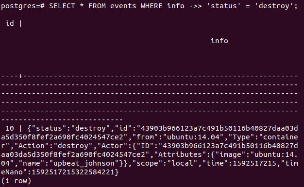

Docker Storage
=================


Overview

In this lab, you will learn how Docker manages data. It is crucial
to know where to store your data and how your services will access it.
This lab will explore running stateless versus stateful Docker
containers, and will delve into the configuration setup options for
storage for different applications. By the end of the lab, you will
be able to distinguish between the different storage types in Docker and
identify the container\'s life cycle and its various states. You will
also learn how to create and manage Docker volumes.


Introduction
============


In previous chapters, you learned how to run a container from an image
and how to configure its networking. You also learned that you can pass
various Docker commands while crafting containers from the images. In
this lab, you will learn how to control these containers after you
have created them.

Assume that you have been assigned to build a web application for an
e-store. You will need a database to store the products catalog,
clients\' information, and purchase transactions. To store these
details, you need to configure the application\'s storage settings.

There are two types of data storage in Docker. The first one is storage
that is tightly coupled to the container life cycle. If the container is
removed, the files on that storage type are also removed and cannot be
retrieved. These files are stored in the thin read/write layer inside
the container itself. This type of storage is also known by other terms,
such as the local storage, the `graphdriver` storage, and the
storage driver. The first section of this lab focuses on this type
of storage. These files could be of any type---for example, the files
Docker created after installing a new layer on top of the base image.

The second section of the lab explores stateless and stateful
services. Stateful applications are the ones that need persistent
storage, such as databases that persist and outlive the container. In
stateful services, the data can still be accessed even when the
container is removed.

The container stores the data on the host in two ways: through volumes
and bind mounts. Using a bind mount is not recommended because the bind
mount binds an existing file or directory on the host to a path inside
the container. This bind adds a burden in referencing by using the full
or relative path on the host machine. However, a new directory is
created within Docker\'s storage directory on the host machine when you
use a volume, and Docker manages the directory\'s contents. We will
focus on using volumes in the third section of this lab.

Before exploring different types of storage in Docker, let\'s first
explore the container life cycle.


The Container Life Cycle
========================


Containers are crafted from their base images. The container inherits
the filesystem of the image by creating a thin
read/write layer on top of the image layers\' stack. The base images
stay intact, and no changes are made to them. All your changes happen in
that top layer of the container. For example, say you create a container
of `ubuntu: 14.08`. This image does not have the
`wget` package in it. When you install the `wget`
package, you actually install it on the top layer. So, you have a layer
for the base image, and on top of it, another layer for
`wget`.

If you install the `Apache` server as well, it will be the
third layer on top of both of the previous layers. To save all your
changes, you need to commit all these changes to a new image because you
cannot write over the base image. If you do not commit the changes to a
new image, these changes will be deleted with the container\'s removal.

The container undergoes many other states during its life cycle, so it
is important to look into all the states that a container can have
during its life cycle. So, let\'s dive into understanding the different
container states:


Figure 7.1: Container life cycle

The different stages that a container undergoes are as follows:

-   The container enters the `CREATED` status using the
    `docker container run` subcommand, as shown in *Figure
    7.1*.

-   Inside every container, there is a main process running. When this
    process begins running, the container\'s status changes to the
    `UP` status.

-   The container\'s status changes to `UP(PAUSED)` by using
    the `docker container pause` subcommand. The container
    freezes or suspends but is still in the `UP` state and is
    not stopped or removed.

-   To resume running the container, use the
    `docker container unpause` subcommand. Here, the
    container\'s status will change to the `UP` status again.

-   Use the `docker container stop` subcommand to stop the
    container without removing it. The container\'s status changes to
    the `EXITED` status.

-   The container will exit if you execute the
    `docker container kill` or
    `docker container stop` subcommands. To kill the
    container, use the `docker container kill` subcommand. The
    container status changes to `EXITED`. However, to make the
    container exit, you should use `docker container stop`
    subcommand and not `docker container kill` subcommand. Do
    not kill your containers; always remove them because removing the
    container triggers a grace shutdown to the container, giving time,
    for example, to save the data to a database, which is a slower
    process. However, killing does not do that and might cause data
    inconsistency.

-   After stopping or killing the container, you can also resume running
    the container. To start the container and return it to the
    `UP` status, use the `docker container start` or
    `docker container start -a` subcommands.
    `docker container start -a` is equal to running
    `docker container start` and then
    `docker container attach`. You cannot attach local
    standard input, output, and error streams to an exited container;
    the container must be in the `UP` state first to attach
    local standard input, output, and error streams.

-   To restart a container, use the `docker container restart`
    subcommand. The restart subcommand acts like executing
    `docker container stop` followed by
    `docker container start`.

-   Stopping or killing the container does not remove the container from
    the system. To remove the container entirely, use the
    `docker container rm` subcommand.

    Note

    You can concatenate several Docker commands to each other -- for
    example,
    `docker container rm -f $(docker container ls -aq)`. The
    one that you want to execute first should be included in the
    brackets.

    In this case, `docker container ls -aq` tells Docker to
    list all the containers, even the exited one, in quiet mode. The
    `-a` option denotes displaying all the containers,
    whatever their states are. The `-q` option is used for
    quiet mode, which means displaying the numeric IDs only and not all
    the containers\' details. The output of this command,
    `docker container ls -aq`, will be the input of the
    `docker container rm -f` command.

Understanding the Docker container life cycle events provides a good
background as to why some applications may or may not need persistent
storage. Before moving on to the different storage types present in
Docker, let\'s execute the aforementioned commands and explore the
different container states in the following exercise.

Note

Please use `touch` command to create files and `vim`
command to work on the file using vim editor.


Exercise 7.01: Transitioning through the Common States for a Docker Container
-----------------------------------------------------------------------------

Pinging www.google.com is a common practice to verify that the server or
your cluster\'s node is connected to the internet. In this exercise, you
will transit through all the states for a Docker container while
checking whether the server or your cluster\'s node is connected to the
internet.

You will use two terminals in this exercise. One terminal will be used
to run a container to ping www.google.com, and the other one will be
used to control this running container by executing the previously
mentioned commands.

To ping www.google.com, you will craft a container called
`testevents` from the `ubuntu:14.04` image:

1.  Open the first terminal and execute the
    `docker container run` command to run a container. Use the
    `--name` option to give the container a specific
    nickname---for example, `testevents`. Don\'t let the
    Docker host generate a random name for your container. Use the
    `ubuntu:14.04` image and the `ping google.com`
    command to verify that the server is running on the container:

    
    ```
    $docker container run --name testevents ubuntu:14.04 ping google.com
    ```
    

    The output will be as follows:

    
    ```
    PING google.com (172.217.165.142) 56(84) bytes of data.
    64 bytes from lax30s03-in-f14.1e100.net (172.217.165.142):
    icmp_seq=1 ttl=115 time=68.9 ms
    64 bytes from lax30s03-in-f14.1e100.net (172.217.165.142):
    icmp_seq=2 ttl=115 time=349 ms
    64 bytes from lax30s03-in-f14.1e100.net (172.217.165.142):
    icmp_seq=3 ttl=115 time=170 ms
    ```
    

    As you can see in the preceding output, the pinging has started. You
    will find the packets being transmitted to `google.com`.

2.  Dedicate the first terminal to the pinging output. Now, control this
    container by executing the commands in another terminal. In the
    second terminal, execute `docker container ls` to list all
    the running containers:

    
    ```
    $docker container ls
    ```
    

    Look for the container with the name `testevents`. The
    status should be `Up`:

    
    ```
    CONTAINER ID    IMAGE           COMMAND            CREATED
       STATUS           PORTS          NAMES
    10e235033813     ubuntu:14.04   "ping google.com"  10 seconds ago
       Up 5 seconds                    testevents
    ```
    

3.  Now, run the `docker container pause` command in the
    second terminal to pause the running container in the first
    terminal:

    
    ```
    $docker container pause testevents
    ```
    

    You will see that the pinging has stopped, and no packets are being
    transmitted anymore.

4.  List the running containers again by using
    `docker container ls` in the second terminal:

    
    ```
    $docker container ls
    ```
    

    As you can see in the following output, the status of
    `testevents` is `Up(Paused)`. This is because
    you ran the `docker container pause` command previously:

    
    ```
    CONTAINER ID    IMAGE         COMMAND            CREATED
       STATUS            PORTS          NAMES
    10e235033813    ubuntu:14.04  "ping google.com"  26 seconds ago
       Up 20 seconds (Paused)           testevents
    ```
    

5.  Use `docker container unpause` in the second terminal to
    start the paused container and make it resume sending packets:

    
    ```
    $docker container unpause testevents
    ```
    

    You will find that the pinging resumes and new packets are
    transmitted in the first terminal.

6.  In the second terminal, run the `docker container ls`
    command again to see the container\'s current status:

    
    ```
    $docker container ls
    ```
    

    You will see that the status of the `testevents` container
    is `Up`:

    
    ```
    CONTAINER ID    IMAGE         COMMAND            CREATED
       STATUS            PORTS          NAMES
    10e235033813    ubuntu:14.04  "ping google.com"  43 seconds ago
       Up 37 seconds                    testevents
    ```
    

7.  Now, run the `docker container stop` command to stop the
    container:

    
    ```
    $docker container stop testevents
    ```
    

    You will observe that the container exits and the shell prompt
    returns in the first terminal:

    
    ```
    64 bytes from lax30s03-in-f14.1e100.net (142.250.64.110):
    icmp_seq = 42 ttl=115 time=19.8 ms
    64 bytes from lax30s03-in-f14.1e100.net (142.250.64.110):
    icmp_seq = 43 ttl=115 time=18.7 ms
    ```
    

8.  Now, run the `docker container ls` command in any
    terminal:

    
    ```
    $docker container ls
    ```
    

    You will see that the `testevents` container is not in the
    list anymore because the `docker container ls` subcommand
    displays the up-and-running containers only:

    
    ```
    CONTAINER ID      IMAGE      COMMAND     CREATED
            STATUS         PORTS                   NAMES
    ```
    

9.  Run the `docker container ls -a` command to display all
    the containers:

    
    ```
    $docker container ls -a
    ```
    

    You can see that the status of the `testevents` container
    is now `Exited`:

    
    ```
    CONTAINER ID    IMAGE         COMMAND            CREATED
       STATUS            PORTS          NAMES
    10e235033813    ubuntu:14.04  "ping google.com"  1 minute ago
       Exited (137) 13 seconds ago      testevents
    ```
    

10. Use the `docker container start` command to start the
    container. Also, add the `-a` option to attach local
    standard input, output, and error streams to the container and see
    its output:

    
    ```
    $docker container start -a testevents
    ```
    

    As you can see in the following snippet, the pinging resumes and is
    executed in the first terminal:

    
    ```
    64 bytes from lax30s03-in-f14.1e100.net (142.250.64.110):
    icmp_seq = 55 ttl=115 time=63.5 ms
    64 bytes from lax30s03-in-f14.1e100.net (142.250.64.110):
    icmp_seq = 56 ttl=115 time=22.2 ms
    ```
    

11. Run the `docker ls` command again in the second terminal:

    
    ```
    $docker container ls
    ```
    

    You will observe that `testevents` returns back to the
    list, its status is `Up`, and it is running:

    
    ```
    CONTAINER ID    IMAGE         COMMAND            CREATED
       STATUS            PORTS          NAMES
    10e235033813    ubuntu:14.04  "ping google.com"  43 seconds ago
       Up 37 seconds                    testevents
    ```
    

12. Now, remove the `testevents` container using the
    `rm` command with the `-f` option. The
    `-f` option is used to force-remove the container:

    
    ```
    $docker container rm -f testevents
    ```
    

    The first terminal stops executing the `ping` command and
    the second terminal will return the name of the container:

    
    ```
    testevents
    ```
    

13. Run the `ls -a` command to check whether the container is
    running or not:

    
    ```
    $docker container ls -a
    ```
    

    You will not find the `testevents` container in the list
    because we just removed it from our system.

    Now, you have seen all the various statuses of the container except
    `CREATED`. This is typical, as you usually will not see
    the `CREATED` status. Inside every container, there is a
    main process with a **Process ID (PID)** of 0 and **Parent Process
    ID (PPID)** of 1. This process has a different ID outside the
    container. When this process is killed or removed, the container is
    killed or removed as well. Normally, when the main process runs, the
    state of the container changes from `CREATED` to
    `UP`, and this indicates that the container has been
    created successfully. If the main process fails, the container state
    does not change from `CREATED`, and this is what you are
    going to set up:

14. Run the following command to see the `CREATED` status.
    Craft a container named `testcreate` from the
    `ubuntu:14.04` image using the
    `docker container run` command:

    
    ```
    $docker container run --name testcreate ubuntu:14.04 time
    ```
    

    The `time` command will generate an error because there is
    no such command inside `ubuntu:14.04`.

15. Now, list the running containers:

    
    ```
    $docker container ls
    ```
    

    You will see that the list is empty:

    
    ```
    CONTAINER ID    IMAGE         COMMAND            CREATED
       STATUS            PORTS          NAMES
    ```
    

16. Now, list all the containers by adding the `-a` option:

    
    ```
    $docker container ls -a
    ```
    

    Look in the list for the container named `testcreate`; you
    will observe that its status is `Created`:

    
    ```
    CONTAINER ID    IMAGE         COMMAND         CREATED
       STATUS            PORTS          NAMES
    C262e6718724    ubuntu:14.04  "time"          30 seconds ago
       Created                          testcreate
    ```
    

    If a container is stuck in the `CREATED` state, this is an
    indication that an error has been generated, and Docker was unable
    to get the container up and running.

In this exercise, you explored the container life cycle and its
different states. You also learned how to start with attachment by using
the `docker container start -a <container name or ID>` command
and how to stop the container using
`docker container rm <container name or ID>`. In the end, we
discussed how to force-remove running containers by using
`docker container rm -f <container name or ID>`. Then, we saw
the rare case of `CREATED`, which is shown only when the
command generates an error and the container fails to start.

So far, we have focused on the container\'s statuses and not its size.
In the next exercise, we will learn how to determine the size of the
memory occupied by the container.


Exercise 7.02: Checking the Container Size on Disk
--------------------------------------------------

When you first craft a container, it has the same size as the base image
with a top read/write layer. With every layer that is added to the
container, its size increases. In this exercise, you will create a
container that has `ubuntu:14.04` as its base image. Update
and install `wget` on top of it to highlight the effect of
state transition on data retention:

1.  Run the `docker container run` command with the
    `-it` option to create a container named
    `testsize`. The `-it` option is used to have an
    interactive terminal to run commands inside the running container:

    
    ```
    $docker container run -it --name testsize ubuntu:14.04
    ```
    

    The prompt will now look like `root@<container ID>:/#`,
    where the container ID is a number that the Docker Engine generates.
    Therefore, you will have a different number when you run this
    command on your machine. As mentioned before, being inside a
    container means that the container will be in the `UP`
    state.

2.  Dedicate the first terminal to the running container and execute the
    commands in the second terminal. Having two terminals saves us from
    detaching the container to run a command and then reattaching to the
    container to run another command inside it.

    Now, verify that the container initially has the size of the base
    image, which is `ubuntu:14.04`. List the images using the
    `docker image ls` command in the second terminal. Check
    the size of the `ubuntu:14.04` image:

    
    ```
    $docker image ls
    ```
    

    As you can see in the following output, the size of the image is
    `188MB`:

    
    ```
    REPOSITORY     TAG      IMAGE ID         CREATED
      SIZE
    ubuntu         14.04    971bb3841501     23 months ago
      188MB
    ```
    

3.  Now, check the size of the container by running the
    `docker container ls -s` command to get the container\'s
    size:

    
    ```
    $docker container ls -s
    ```
    

    Look for the `testsize` container. You will observe that
    the size is `0B (virtual 188MB)`:

    
    ```
    CONTAINER ID    IMAGE          COMMAND      CREATED
      STATUS     PORTS    NAMES      SIZE
    9f2d2d1ee3e0    ubuntu:14.04   "/bin/bash"  6 seconds ago
      Up 6 minutes        testsize   0B (virtual 188MB)
    ```
    

    The `SIZE` column indicates the size of the thin
    read/write layer of the container only, while the virtual size
    indicates the size of the thin read/write layer and all the previous
    layers encapsulated in the container. Thus, in this case, the thin
    layer equals `0B`, and the virtual size equals the image
    size.

4.  Now, install the `wget` package. Run the
    `apt-get update` command in the first terminal. A general
    recommendation, in Linux, is to run `apt-get update`
    before installing any packages to update the latest versions of the
    packages that are currently on your system:
    
    ```
    root@9f2d2d1ee3e0: apt-get update
    ```
    

5.  Run the following command when the container finishes updating to
    install the `wget` package on top of the base image. The
    `-y` option is used to answer yes automatically to all the
    installation questions:
    
    ```
    root@9f2d2d1ee3e: apt-get install -y wget
    ```
    

6.  When it finishes installing `wget` on top of
    `ubuntu:14.04`, recheck the container\'s size by running
    the `ls -s` command in the second terminal:

    
    ```
    $docker container ls -s
    ```
    

    As you can see from the following snippet, the size of the
    `testsize` container is
    `27.8 MB (virtual 216 MB)`:

    
    ```
    CONTAINER ID    IMAGE          COMMAND      CREATED
      STATUS     PORTS    NAMES      SIZE
    9f2d2d1ee3e0    ubuntu:14.04   "/bin/bash"  9 seconds ago
      Up 9 minutes        testsize   27.8MB (virtual 216MB)
    ```
    

    Now, the thin layer equals `27.8MB`, and the virtual size
    equals the size of all the layers. In this exercise, the layers are
    the base image, with a size of 188 MB; the update; and the
    `wget` layer, which has a size of 27.8 MB. Therefore, the
    total size will be 216 MB after approximation.

In this exercise, you learned about the function of the `-s`
option used with the `docker container ls` subcommand. This
option is used to display the size of the base image and the size of the
top writable layer. Knowing the size that every container consumes is
useful to avoid an out-of-disk-space exception. Moreover, it can help us
in troubleshooting and setting a maximum size for every container.

Note

Docker uses storage drivers to write in the writable layer. The storage
drivers differ depending on the operating system that you are using. To
find the updated list of storage drivers, check out
https://docs.docker.com/storage/storagedriver/select-storage-driver/.

To find out what driver your operating system is using, run the
`$docker info` command.

An understanding of Docker container life cycle events provides a good
background when studying why some applications may or may not need
persistent storage and outlines the default host storage area
(filesystem location) for Docker before a container is explicitly
removed.

Now, let\'s delve into the stateful and stateless modes to decide which
container needs persistent storage.


Stateful versus Stateless Containers/Services
=============================================


Containers and services can run in two modes: **stateful** and
**stateless**. A stateless service is the one that does not retain
persistent data. This type is much easier to scale and update than the
stateful one. A stateful service requires persistent storage (as in
databases). Therefore, it is harder to dockerize because stateful
services need synchronization with the other components of the
application.

Say you\'re dealing with an application that needs a certain file in
order to work correctly. If this file is saved inside a container, as in
the stateful mode, when this container is removed for whatever reason,
the whole application crashes. However, if this file is saved in a
volume or an external database, any container will be able to access it,
and the application will work fine. Say business is booming and we need
to scale up the number of containers running to fulfill the clients\'
needs. All the containers will be able to access the file, and scaling
will be easy and smooth.

Apache and NGINX are examples of stateless services, while databases are
examples of stateful containers. The *Docker Volumes and Stateful
Persistence* section will focus on volumes that are needed for database
images to operate properly.

In the following exercises, you will first create a stateless service
and then a stateful one. Both will use the Docker playground, which is a
website that offers Docker Engine in a matter of seconds. It is a free
virtual machine in a browser, where you can execute Docker commands and
create clusters in swarm mode.


Exercise 7.03: Creating and Scaling a Stateless Service, NGINX
--------------------------------------------------------------

Usually, in web-based applications, there is a frontend and a backend.
For example, in the Panoramic Trekking application, you use NGINX in the
frontend because it can handle a high volume of connections and
distribute the loads to the slower database in the backend. Therefore,
NGINX is used as the reverse proxy server and load balancer.

In this exercise, you will focus on creating a stateless service, NGINX,
solely, and see how easy it is to scale it. You will initialize a swarm
to create a cluster and scale NGINX on it. You will use the Docker
playground to work in swarm mode:

1.  Connect to the Docker playground at
    https://labs.play-with-docker.com/, as in *Figure 7.2*:

    

    

    Figure 7.2: The Docker playground

2.  Click on `ADD NEW INSTANCE` in the left menu to create a
    new node. Get the node IP from the top node information section.
    Now, create a swarm using the `docker swarm init` command
    with the `–advertise-addr` option to specify the node IP.
    As in *Figure 7.2*, the Docker Engine generates a long token to
    allow other nodes, whether managers or workers, to join the cluster:
    
    ```
    $docker swarm init --advertise-addr <IP>
    ```
    

3.  Use the `docker service create` command to create a
    service and specify port `80` using the `-p`
    option. Set the number of replicas as `2` for the
    `--replicas` option of the `nginx:1.14.2` image:

    
    ```
    docker service create -p 80 --replicas 2 nginx:1.14.2
    ```
    

    The `docker service create` command creates two replica
    services from the `nginx:1.14.2` image at port
    `80` inside the container. The Docker daemon chooses any
    available host port. In this case, it chooses port
    `30000`, as shown at the top of *Figure 7.2*.

4.  To verify that the service has been created, list all of the
    available services using the `docker service ls` command:

    
    ```
    $docker service ls
    ```
    

    As shown in the following output, the Docker daemon auto-generated a
    service ID and assigned a name, `amazing_hellman`, to the
    service because you did not specify one using the `--name`
    option:

    
    ```
    ID            NAME             MODE        REPLICAS  IMAGE
         PORTS
    xmnp23wc0m6c  amazing_hellman  replicated  2/2       nginx:1.14.2
         *:30000->80/tcp
    ```
    

    Note

    In a container, the Docker daemon assigns a random
    **adjective\_noun** name to the container.

5.  Use the `curl <IP:Port Number>` Linux command to see the
    output of the service and connect to it without using a browser:

    
    ```
    $curl 192.168.0.223:3000
    ```
    

    The output is an HTML version of the welcome page of
    `NGINX`. This indicates it has been installed correctly:

    
    ```
    <!DOCTYPE html>
    <html>
    <head>
    <title>Welcome to nginx!</title>
    <style>
        body {
            width: 35em;
            margin: 0 auto;
            font-family: Tahoma, Verdana, Arial, sans-serif;
        }
    </style>
    </head>
    </body>
    <h1>Welcome to nginx!<h1>
    <p>If you see this page, the nginx web server is successfully 
    installed and working. Further configuration is required. </p>
    <p>For online documentation and support please refer to
    <a href="http://nginx.org/">nginx.org</a>.<br/>
    Commercial support is available at
    <a href="http://nginx.com/">nginx.com</a>.</p>
    <p><em>Thank you for using nginx.</em></p>
    </body>
    <html>
    ```
    

6.  Assume that business is booming even more, and two replicas are not
    enough. You need to scale it to five replicas instead of two. Use
    the
    `docker service scale <service name>=<number of replicas>`
    subcommand:

    
    ```
    $docker service scale amazing_hellman=5
    ```
    

    You will get an output like the following:

    
    ```
    amazing_hellman scaled to 5
    overall progress: 5 out of 5 tasks
    1/5: running
    2/5: running
    3/5: running
    4/5: running
    5/5: running
    verify: Service converged
    ```
    

7.  To verify that the Docker swarm replicated the service, use the
    `docker service ls` subcommand one more time:

    
    ```
    $docker service ls
    ```
    

    The output shows that the number of replicas increased from
    `2` to `5` replicas:

    
    ```
    ID            NAME             MODE        REPLICAS  IMAGE
         PORTS
    xmnp23wc0m6c  amazing_hellman  replicated  5/5       nginx:1.14.2
         *:30000->80/tcp
    ```
    

8.  Delete the service using the `docker service rm`
    subcommand:

    
    ```
    $docker service rm amazing_hellman
    ```
    

    The command will return the name of the service:

    
    ```
    amazing_hellman
    ```
    

9.  To verify that the service has been deleted, list the service one
    more time using the `docker service ls` subcommand:

    
    ```
    $docker service ls
    ```
    

    The output will be an empty list:

    
    ```
    ID       NAME      MODE      REPLICAS      IMAGE      PORTS
    ```
    

In this exercise, you deployed a stateless service, NGINX, and scaled it
using the `docker service scale` command. You then used the
Docker playground (a free solution that you can use to create a cluster,
and Swarm to initialize a swarm).

Note

This exercise uses Docker Swarm. To do the same using Kubernetes, you
can follow the steps at
https://kubernetes.io/docs/tasks/run-application/run-stateless-application-deployment/.

Now, we are done with the frontend example of NGINX. In the next
exercise, you will see how to create a stateful service that requires
persistent data. We will use a database service, MySQL, to complete the
following exercise.


Exercise 7.04: Deploying a Stateful Service, MySQL
--------------------------------------------------

As mentioned previously, web-based applications have a frontend and a
backend. You have already seen an example of the frontend component in
the previous exercise. In this exercise, you will deploy a single
stateful MySQL container to be the database as a backend component.

To install MySQL, follow the steps at https://hub.docker.com/\_/mysql in
the `via stack deploy` section. Select and copy the
`stack.yml` file to memory:

1.  Use an editor to paste the `stack.yml` file. You can use
    the `vi` or `nano` Linux commands to open a text
    editor in Linux and paste the YAML file:

    
    ```
    $vi stack.yml
    ```
    

    Paste the following code:

    
    ```
    # Use root/example as user/password credentials
    version: '3.1'
    services:
      db:
        image: mysql
        command: --default-authentication-plugin=      mysql_native_password
        restart: always
        environment:
          MYSQL_ROOT_PASSWORD: example
      adminer:
        image: adminer
        restart: always
        ports:
          - 8080:8080
    ```
    

    In this YAML file, you have two services: `db` and
    `adminer`. The `db` service is based on the
    `mysql` image, while the `adminer` image is the
    base image of the `adminer` service. The
    `adminer` image is a database management tool. In the
    `db` service, you enter the command and set the
    environment variable, which has the database password with a policy
    to always restart if it fails for any reason. Also, in the
    `adminer` service, the policy is set to always restart if
    it fails for any reason.

2.  Press the *Esc* key on the keyboard. Then, run the following command
    to quit and save the code:
    
    ```
    :wq
    ```
    

3.  To verify that the file has saved correctly, use the `cat`
    Linux command to display the `stack.yml` contents:

    
    ```
    $cat stack.yml
    ```
    

    The file will be displayed. If there is an error, repeat the
    previous steps.

4.  If the code is correct, deploy the `YML` file by using the
    `docker stack deploy` subcommand:

    
    ```
    $docker stack deploy -c stack.yml mysql
    ```
    

    You should see an output like the following:

    
    ```
    Ignoring unsupported options: restart
    Creating network mysql_default
    Creating service mysql_db
    Creating service mysql_adminer
    ```
    

    To connect to the service, right-click on port `8080` at
    the top beside the node IP in the Docker playground window and open
    it in a new window:

    

    

    Figure 7.3: Connecting to the service

5.  Use the `docker stack ls` subcommand to list the stacks:

    
    ```
    $docker stack ls
    ```
    

    You should see an output like the following:

    
    ```
    NAME     SERVICES    ORCHESTRATOR
    mysql    2           Swarm
    ```
    

6.  Use the `docker stack rm` subcommand to remove the stack:

    
    ```
    $docker stack rm mysql
    ```
    

    When removing the stack, Docker will remove the two services:
    `db` and `adminer`. It will also remove the
    network that it created by default to connect all the services:

    
    ```
    Removing service mysql_adminer
    Removing service mysql_db
    Removing network mysql_default
    ```
    

In this exercise, you deployed a stateful service, MySQL, and were able
to access the database service from the browser. Again, we used the
Docker playground as our platform to execute the exercise.

Note

Replicating MySQL is not an easy task. You cannot run multiple replicas
on one data folder as we did in *Exercise 7.03*, *Creating and Scaling a
Stateless Service, NGINX*. This way does not work because data
consistency and database locking and caching must be applied to ensure
your data is correct. Hence, MySQL uses a master and subordinate
replication, where you write to the master, and the data gets
synchronized to the subordinates. To find out more about MySQL
replication, please visit
https://dev.mysql.com/doc/refman/8.0/en/replication.html.

We have learned that containers need persistent storage that outlives
the container life cycle but have not yet covered how to do that. In the
next section, we will learn about volumes to save persistent data.


Docker Volumes and Stateful Persistence
=======================================


We can use volumes to save persistent data without relying on the
containers. You can think of a volume as a shared folder. In any
instance, if you mount the volume to any number of containers, the
containers will be able to access the data in the volume. There are two
ways to create a volume:

-   Create a volume as an independent entity outside any container by
    using the `docker volume create` subcommand.

    Creating a volume as an independent object from the container adds
    flexibility to data management. These types of volumes are also
    called **named volumes** because you specify a name for it, rather
    than leaving the Docker Engine to generate an anonymous numeric one.
    Named volumes outlive all the containers that are in the system and
    preserve its data.

    Despite these volumes being mounted to containers, the volumes will
    not be deleted even when all the containers in the system are
    deleted.

-   Create a volume by using the `--mount` or `-v`
    or `--volume` options in the
    `docker container run` subcommand. Docker creates an
    anonymous volume for you. When the container is removed, the volume
    will not be removed as well unless indicated explicitly by using the
    `-v` option to the `docker container rm`
    subcommand or using a `docker volume rm` subcommand.

The following exercise will provide an example of each method.


Exercise 7.05: Managing a Volume outside the Container\'s Scope and Mounting It to the Container
------------------------------------------------------------------------------------------------

In this exercise, you will create a volume that is not confined to a
container. You will start by creating a volume, mounting it to a
container, and saving some data on it. You will then delete the
container and list the volume to check whether the volume persists even
when you do not have a container on your system:

1.  Create a volume named `vol1` using the
    `docker volume create` command:

    
    ```
    $docker volume create vol1
    ```
    

    The command will return the name of the volume, as shown:

    
    ```
    vol1
    ```
    

2.  List all the volumes using the `docker volume ls` command:

    
    ```
    $docker volume ls
    ```
    

    This will result in the following output:

    
    ```
    DRIVER            VOLUME NAME
    Local             vol1
    ```
    

3.  Inspect the volume to get its mount point using the following
    command:

    
    ```
    $docker volume inspect vol1
    ```
    

    You should get an output like the following:

    
    ```
    [
        {
            "CreatedAt": "2020-06-16T16:44:13-04:00",
            "Driver": "local",
            "Labels": {},
            "Mountpoint: "/var/lib/docker/volumes/vol1/_data",
            "Name": "vol1",
            "Options": {},
            "Scope": "local"
        }
    ]
    ```
    

    The volume inspection shows the date and time of its creation, its
    mount path, its name, and its scope.

4.  Mount the volume to a container and modify its contents. Any data
    that is added to `vol1` will be copied to the volume
    inside the container:

    
    ```
    docker container run -it -v vol1:/container_vol --name container1 ubuntu:14.04 bash
    ```
    

    In the preceding command, you have crafted a container from the
    `ubuntu:14.04` image with the `bash` command.
    The `bash` command allows you to enter the commands inside
    the container. The `-it` option is used to have an
    interactive terminal. The `-v` option is for synchronizing
    the data between `vol1` at the host and
    `container_vol` inside the container. Use the
    `--name` option to name the container
    `container1`.

5.  The prompt changes, indicating that you are now inside the
    container. Write the word `hello` in a file called
    `new_file.txt` onto the volume. The volume inside the
    container is called `container_vol`. In this case, this
    volume is shared between the host and the container. From the host,
    the volume is called `vol1`:
    
    ```
    root@acc8900e4cf1:/# echo hello > /container_vol/new_file.txt
    ```
    

6.  List the contents of the volume to verify that the file is saved:
    
    ```
    root@acc8900e4cf1:/# ls /container_vol
    ```
    

7.  Exit the container using the `exit` command:
    
    ```
    root@acc8900e4cf1:/# exit
    ```
    

8.  Check the contents of the new file from the host by running the
    following command:

    
    ```
    $ sudo ls /var/lib/docker/volumes/vol1/_data
    ```
    

    The command will return the name of the new file:

    
    ```
    new_file.txt
    ```
    

9.  Verify that the word `hello`, as the content of the file,
    is saved as well by running the following command:
    
    ```
    $ sudo cat /var/lib/docker/volumes/vol1/_data/new_file.txt
    ```
    

10. Remove the container with the `-v` option to remove any
    volumes that are created within the container\'s scope:

    
    ```
    $docker container rm -v container1
    ```
    

    The command will return the name of the container:

    
    ```
    container1
    ```
    

11. Verify that the volume still exists by listing all the volumes:

    
    ```
    $docker volume ls
    ```
    

    The volume, `vol1`, is listed, indicating that the volume
    was created outside the container, and even by using the
    `-v` option, it will not be removed when the container is
    removed:

    
    ```
    DRIVER        VOLUME NAME
    Local         vol1
    ```
    

12. Now, remove the volume using the `rm` command:

    
    ```
    $docker volume rm vol1
    ```
    

    The command should return the name of the volume:

    
    ```
    vol1
    ```
    

13. Verify that the volume is removed by listing the current list of
    volumes:

    
    ```
    $docker volume ls
    ```
    

    An empty list will be displayed, indicating that the volume has been
    removed:

    
    ```
    DRIVER        VOLUME NAME
    ```
    

In this exercise, you learned how to create volumes as independent
objects in Docker without being within the container\'s scope, and how
to mount this volume to a container. The volume was not removed when you
removed the container because the volume was created outside the
container\'s scope. In the end, you learned how to remove these types of
volumes.

In the next exercise, we will create, manage, and remove an unnamed or
anonymous volume that is within the container\'s scope.


Exercise 7.06: Managing a Volume within the Container\'s Scope
--------------------------------------------------------------

You do not need to create the volume before running the container as in
the previous example. Docker will create an unnamed volume for you
automatically. Again, the volume will not be removed when the container
is removed, unless you specify the `-v` option in the
`docker container rm` subcommand. In this exercise, you will
create an anonymous volume within the container\'s scope and then learn
how to remove it:

1.  Create a container with an anonymous volume using the following
    command:

    
    ```
    $docker container run -itd -v /newvol --name container2 ubuntu:14.04 bash
    ```
    

    The command should return a long hex digit number, which is the
    volume ID.

2.  List all the volumes:

    
    ```
    docker volume ls
    ```
    

    Observe that this time, `VOLUME NAME` is a long hex digit
    number and not a name. This type of volume is called an anonymous
    volume and can be removed by adding the `-v` option to the
    `docker container rm` subcommand:

    
    ```
    DRIVER     VOLUME NAME
    Local      8f4087212f6537aafde7eaca4d9e4a446fe99933c3af3884d
    0645b66b16fbfa4
    ```
    

3.  Remove the container with the volume, this time. Use the
    `-f` option to force remove the container since it is in
    detached mode and running in the background. Add the `v`
    option (making this `-fv`) to remove the volume as well.
    If this volume is not anonymous, and you named it, it will not be
    removed by this option and you must use
    `docker volume rm <volume name>` to remove it:

    
    ```
    $docker container rm -fv container2
    ```
    

    The command will return the name of the container.

4.  Verify that the volume has been removed. Use the
    `docker volume ls` subcommand, and you will observe that
    the list is empty:
    
    ```
    docker volume ls
    ```
    

Compared to the previous exercise, the volume was removed when the
container was removed by using the `-v` option in the
`rm` subcommand. Docker removed the volume this time because
the volume was initially created within the container\'s scope.

Note

1\. If you are mounting a volume to a service and not to a container,
you cannot use the `-v` or `--volume` options. You
must use the `--mount` option.

2\. To delete all the anonymous volumes that were not removed when their
containers were removed, you can use the `docker volume prune`
subcommand.

For further details, visit https://docs.docker.com/storage/volumes/.

Now, we are going to see some more examples of volumes being used with
stateful containers. Remember that using volumes with stateful
containers as databases is the best practice. Containers are ephemeral,
while data on databases should be saved as a persistent volume, where
any new container can pick up and use the saved data. Therefore, the
volume must be named, and you should not leave Docker to automatically
generate an anonymous volume with a hex digit number as its name.

In the next exercise, you will run a PostgreSQL database container with
a volume.


Exercise 7.07: Running a PostgreSQL Container with a Volume
-----------------------------------------------------------

Say you work in an organization where a PostgreSQL container with a
database volume is used and the container gets deleted due to some
mishap. However, the data persisted and outlived the container. In this
exercise, you will run a PostgreSQL container with a database volume:

1.  Run a PostgreSQL container with a volume. Name the container
    `db1`. If you do not have the image locally, Docker will
    pull the image for you. Create a container called `db1`
    from the `postgress` image. Use the `-v` option
    to share the `db` volume at the host with
    `/var/lib/postgresql/data` inside the container and the
    `-e` option to echo SQL to the standard output stream as
    well. Use the `POSTGRES_PASSWORD` option to set the
    database password and the `-d` option to run this
    container in detached mode:
    
    ```
    $docker container run --name db1 -v db:/var/lib/postgresql/data -e POSTGRES_PASSWORD=password -d postgres
    ```
    

2.  Use the `exec` command to interact with the container from
    `bash`. The `exec` command does not create a new
    process but rather replaces `bash` with the command to be
    executed. Here, the prompt will change to `posgres=#` to
    indicate that you are inside the `db1` container:

    
    ```
    docker container exec -it db1 psql -U postgres
    ```
    

    The `psql` command allows you to interactively enter,
    edit, and execute SQL commands. The `-U` option is used to
    enter the database\'s username, which is `postgres`.

3.  Create a table, `PEOPLE`, with two columns --
    `Name` and `age`:
    
    ```
    CREATE TABLE PEOPLE(NAME TEXT, AGE int);
    ```
    

4.  Insert some values into the `PEOPLE` table:
    
    ```
    INSERT INTO PEOPLE VALUES('ENGY','41');
    INSERT INTO PEOPLE VALUES('AREEJ','12');
    ```
    

5.  Verify that the values are inserted correctly in the table:

    
    ```
    SELECT * FROM PEOPLE;
    ```
    

    The command will return two rows, which verifies that the data has
    been inserted correctly:

    

    

    Figure 7.4: Output of the SELECT statement

6.  Exit the container to quit the database. The shell prompt will
    return:
    
    ```
    \q
    ```
    

7.  Verify that your volume is a named one and not anonymous using the
    `volume ls` command:

    
    ```
    docker volume ls
    ```
    

    You should get an output like the following:

    
    ```
    DRIVER            VOLUME NAME
    Local             db
    ```
    

8.  Remove the `db1` container with the `-v` option:

    
    ```
    docker container rm -fv db1
    ```
    

    The command will return the name of the container:

    
    ```
    db1
    ```
    

9.  List the volumes:

    
    ```
    docker volume ls
    ```
    

    The list shows that the volume is still there and is not removed
    with the container:

    
    ```
    DRIVER          VOLUME NAME
    Local           db
    ```
    

10. As in *step 1*, create a new container called `db2` and
    mount the volume, `db`:
    
    ```
    $docker container run --name db2 -v db:/var/lib/postgresql/data -e POSTGRES_PASSWORD=password -d postgres
    ```
    

11. Run the `exec` command to execute the commands from
    `bash` and verify that the data persists even when
    `db1` is removed:

    
    ```
    docker container exec -it db2 psql -U postgres
    postgres=# SELECT * FROM PEOPLE;
    ```
    

    The preceding commands will result in an output like the following:

    

    

    Figure 7.5: Output of the SELECT statement

12. Exit the container to quit the database:
    
    ```
    \q
    ```
    

13. Now, remove the `db2` container using the following
    command:

    
    ```
    docker container rm -f db2
    ```
    

    The command will return the name of the container:

    
    ```
    db2
    ```
    

14. Remove the `db` volume using the following command:

    
    ```
    docker volume rm db
    ```
    

    The command will return the name of the volume:

    
    ```
    db
    ```
    

In this exercise, you used a named volume to save your database to keep
the data persistent. You saw that the data persisted even after you
removed the container. The new container was able to catch up and access
the data that you saved in your database.

In the next exercise, you will run a PostgreSQL database without a
volume to compare its effect with that of the previous exercise.


Exercise 7.08: Running a PostgreSQL Container without a Volume
--------------------------------------------------------------

In this exercise, you will run a default PostgreSQL container without a
database volume. You will then remove the container and its anonymous
volume to check whether the data persisted after the removal of the
container:

1.  Run a PostgreSQL container without a volume. Name the container
    `db1`:
    
    ```
    docker container run --name db1 -e POSTGRES_PASSWORD=password -d postgres
    ```
    

2.  Run the `exec` command to execute the commands from
    `bash`. The prompt will change to `posgres=#` to
    indicate that you are inside the `db1` container:
    
    ```
    docker container exec -it db1 psql -U postgres
    ```
    

3.  Create a table, `PEOPLE`, with two columns --
    `NAME` and `AGE`:
    
    ```
    CREATE TABLE PEOPlE(NAME TEXT, AGE int);
    ```
    

4.  Insert some values in the `PEOPLE` table:
    
    ```
    INSERT INTO PEOPLE VALUES('ENGY','41');
    INSERT INTO PEOPLE VALUES('AREEJ','12');
    ```
    

5.  Verify that the values are inserted correctly in the table:

    
    ```
    SELECT * FROM PEOPLE;
    ```
    

    The command will return two rows, which verifies that the data is
    inserted correctly:

    

    

    Figure 7.6: Output of the SELECT statement

6.  Exit the container to quit the database. The shell prompt will
    return:
    
    ```
    \q
    ```
    

7.  List the volumes using the following command:

    
    ```
    docker volume ls
    ```
    

    Docker has created an anonymous volume for the `db1`
    container, as evident from the following output:

    
    ```
    DRIVER     VOLUME NAME
    Local      6fd85fbb83aa8e2169979c99d580daf2888477c654c
    62284cea15f2fc62a42c32
    ```
    

8.  Remove the container with its anonymous volume using the following
    command:

    
    ```
    docker container rm -fv db1
    ```
    

    The command will return the name of the container:

    
    ```
    db1
    ```
    

9.  List the volumes using the `docker volume ls` command to
    verify that the volume is removed:

    
    ```
    $docker volume ls
    ```
    

    You will observe that the list is empty:

    
    ```
    DRIVER     VOLUME NAME
    ```
    

As opposed to the previous exercise, this exercise used an anonymous
volume rather than a named one. Thus, the volume was within the
container\'s scope and was removed from the container.

We can therefore conclude that the best practice is to share the
database on a named volume to ensure that the data saved in the database
will persist and outlive the container\'s life.

Up to now, you have learned how to list the volumes and inspect them.
But there are other more powerful commands to get the information about
your system and Docker objects, including the volumes. These will be the
subject of the next section.


Miscellaneous Useful Docker Commands
------------------------------------

A lot of commands can be used to troubleshoot and inspect your system,
some of which are described as follows:

-   Use the `docker system df` command to find out the size of
    all the Docker objects in your system:

    
    ```
    $docker system df
    ```
    

    As shown in the following output, the number of images, containers,
    and volumes are listed with their sizes:

    
    ```
    TYPE            TOTAL     ACTIVE     SIZE      RECLAIMABLE
    Images          6         2          1.261GB   47.9MB (75%)
    Containers      11        2          27.78MB   27.78MB (99%)
    Local Volumes   2         2          83.26MB   OB (0%)
    Build Cache                          0B        0B
    ```
    

-   You can get more detailed information about the Docker objects by
    adding the `-v` option to the `docker system df`
    command:

    
    ```
    $docker system df -v
    ```
    

    It should return an output like the following:

    

    

Figure 7.7: Output of the docker system df -v command

-   Run the `docker volume ls` subcommand to list all the
    volumes that you have on your system:

    
    ```
    $docker volume ls
    ```
    

    Copy the name of the volume so that it can be used to get the name
    of the container that uses it:

    
    ```
    DRIVER    VOLUME NAME
    local     a7675380798d169d4d969e133f9c3c8ac17e733239330397ed
    ba9e0bc05e509fc
    local     db
    ```
    

    Then, run the `docker ps -a --filter volume=<Volume Name>`
    command to get the name of the container that is using the volume:

    
    ```
    $docker ps -a --filter volume=db
    ```
    

    You will get the details of the container, like the following:

    
    ```
    CONTAINER ID    IMAGE     COMMAND                 CREATED
      STATUS       PORTS         NAMES
    55c60ad38164    postgres  "docker-entrypoint.s…"  2 hours ago
      Up 2 hours   5432/tcp      db_with
    ```
    

So far, we have been sharing volumes between containers and the Docker
host. This sharing type is not the only type available in Docker. You
can also share volumes between containers. Let\'s see how to do that in
the next section.


Persistent and Ephemeral Volumes
================================


There are two types of volumes: persistent and ephemeral ones. What we
have seen so far is persistent volumes, which are between the host and
the container. To share the volume between containers, we use the
`--volumes-from` option. This volume exists only as long as it
is being used by a container. When the last container using the volume
exits, the volume disappears. This type of volume can be passed from one
container to the next but is not saved. These volumes are called
ephemeral volumes.

Volumes can be used to share log files between the host and the
container or between containers. It is much easier to share them on a
volume with the host so that even if the container was removed for an
error, we can still track the error by checking the log file on the host
after the container\'s removal.

Another common use of volumes in practical microservices applications is
sharing the code on a volume. The advantage of this practice is that you
can achieve zero downtime. The developer team can edit the code on the
fly. The team can work on adding new features or changing the interface.
Docker monitors the update in the code so that it executes the new code.

In the following exercise, we will explore the data container and learn
some new options to share volumes between containers.


Exercise 7.09: Sharing Volumes between Containers
-------------------------------------------------

Sometimes, you need a data container to share data between various
containers, each running a different operating system. It is useful to
test the same data across different platforms before sending the data to
production. In this exercise, you will use the data container, which
will share volumes between containers using `--volume-from`:

1.  Create a container, `c1`, with a volume,
    `newvol`, that is not shared with the host:
    
    ```
    $docker container run -v /newvol --name c1 -it ubuntu:14.04 bash
    ```
    

2.  Move to the `newvol` volume:
    
    ```
    cd newvol/
    ```
    

3.  Save a file inside this volume:
    
    ```
    echo hello > /newvol/file1.txt
    ```
    

4.  Press the escape sequences, *CTRL* + *P* and then *CTRL* + *Q*, so
    that the container runs in a detached mode in the background.

5.  Create a second container, `c2`, that mounts the
    `c1` container\'s volume using the
    `--volumes-from` option:
    
    ```
    $docker container run --name c2 --volumes-from c1 -it ubuntu:14.04 bash
    ```
    

6.  Verify that `c2` can access `file1.txt`, which
    you saved from `c1`, using the `ls` command:
    
    ```
    cd newvol/
    ls
    ```
    

7.  Add another file, `file2.txt`, inside `c2`:
    
    ```
    echo hello2 > /newvol/file2.txt
    ```
    

8.  Verify that `c2` can access `file1.txt` and
    `file2.txt`, which you saved from `c1`, using
    the `ls` command:

    
    ```
    ls
    ```
    

    You will see that both the files are listed:

    
    ```
    file1.txt   file2.txt
    ```
    

9.  Attach the local standard input, output, and error streams to
    `c1`:
    
    ```
    docker attach c1
    ```
    

10. Check that `c1` can access the two files using the
    `ls` command:

    
    ```
    ls
    ```
    

    You will see that both the files are listed:

    
    ```
    file1.txt  file2.txt
    ```
    

11. Exit `c1` using the following command:
    
    ```
    exit
    ```
    

12. List the volumes using the following command:

    
    ```
    docker volume ls
    ```
    

    You will observe that the volume still exists even when you have
    exited `c1`:

    
    ```
    DRIVER    VOLUME NAME
    local     2d438bd751d5b7ec078e9ff84a11dbc1f11d05ed0f82257c
    4e8004ecc5d93350
    ```
    

13. Remove `c1` with the `-v` option:
    
    ```
    docker container rm -v c1
    ```
    

14. List the volumes again:

    
    ```
    docker volume ls
    ```
    

    You will find that the volume has not been removed with
    `c1` because `c2` is still using it:

    
    ```
    DRIVER    VOLUME NAME
    local     2d438bd751d5b7ec078e9ff84a11dbc1f11d05ed0f82257c
    4e8004ecc5d93350
    ```
    

15. Now, remove `c2` with the `-v` option to remove
    its volumes as well. You must use the `-f` option as well
    to force-remove the container because it is up and running:
    
    ```
    docker container rm -fv c2
    ```
    

16. List the volumes again:

    
    ```
    docker volume ls
    ```
    

    You will find that the volume list is empty now:

    
    ```
    DRIVER           VOLUME NAME
    ```
    

    This verifies that the ephemeral volumes are removed when all the
    containers using the volumes are removed.

In this exercise, you used the `--volumes-from` option to
share volumes between containers. Also, this exercise demonstrated that
the best practice is to always remove the container with the
`-v` option. Docker will not remove the volume as long as
there is at least one container that is using that volume.

If we committed any of these two containers, `c1` or
`c2`, to a new image, the data saved on the shared volume
still will not be uploaded to that new image. The data on any volume,
even if the volume is shared between a container and host, will not be
uploaded to the new image.

In the next section, we will see how to engrave this data into the newly
committed image using the filesystem, rather than volumes.


Volumes versus Filesystem and Images
====================================


Note that volumes are not part of images, so the data saved on volumes
won\'t be uploaded or downloaded with images. The volumes will be
engraved in the image, but not its data. Therefore, if you want to save
certain data in an image, save it as a file, not as a volume.

The next exercise will demonstrate and clarify the different outputs
between saving data on volumes and when saving it on files.


Exercise 7.10: Saving a File on a Volume and Committing It to a New Image
-------------------------------------------------------------------------

In this exercise, you will run a container with a volume, save some data
on the volume, commit the container to a new image, and craft a new
container based on this new image. When you check the data from inside
the container, you will not find it. The data will be lost. This
exercise will demonstrate how the data will be lost when committing the
container to a new image. Remember that the data on the volumes will not
be engraved in the new image:

1.  Create a new container with a volume:
    
    ```
    $docker container run --name c1 -v /newvol -it ubuntu:14.04 bash
    ```
    

2.  Save a file inside this volume:
    
    ```
    echo hello > /newvol/file.txt
    cd newvol
    ```
    

3.  Navigate to the `newvol` volume:
    
    ```
    cd newvol
    ```
    

4.  Verify that `c1` can access `file.txt` using the
    `ls` command:

    
    ```
    ls
    ```
    

    You will see that the file is listed:

    
    ```
    file.txt
    ```
    

5.  View the content of the file using the `cat` command:

    
    ```
    cat file.txt
    ```
    

    This will result in the following output:

    
    ```
    hello
    ```
    

6.  Exit from the container using the following command:
    
    ```
    exit
    ```
    

7.  Commit this container to a new image called `newimage`:
    
    ```
    docker container commit c1 newimage
    ```
    

8.  Inspect the image to verify that the volume is engraved inside it:

    
    ```
    docker image inspect newimage --format={{.ContainerConfig.Volumes}}
    ```
    

    This will result in the following output:

    
    ```
    map[/newvol:{}]
    ```
    

9.  Craft a container based on the `newimage` image that you
    just created:
    
    ```
    docker container run -it newimage
    ```
    

10. Navigate to `newvol` and list the files in the volume and
    its data. You will find that the file and the word `hello`
    were not saved in the image:
    
    ```
    cd newvol
    ls
    ```
    

11. Exit the container using the following command:
    
    ```
    exit
    ```
    

From this exercise, you learned that the data on a volume is not
uploaded to the image. To solve this issue, use the filesystem instead
of a volume.

Assume that the word `hello` is important data we want to be
saved in `file.txt` inside the image so that we can access it
when we craft a container from this image. You will see how to do that
in the next exercise.


Exercise 7.11: Saving a File in the New Image Filesystem
--------------------------------------------------------

In this exercise, you will use the filesystem instead of a volume. You
will create a directory instead of a volume and save the data in this
new directory. Then, you will commit the container to a new image. When
you craft a new container using this image as its base image, you will
find the directory in the container and the data saved in it:

1.  Remove any container that you might have from previous labs. You can
    concatenate several Docker commands to each other:

    
    ```
    docker container rm -f $(docker container ls -aq)
    ```
    

    The command will return the IDs of the containers that will be
    removed.

2.  Create a new container without a volume:
    
    ```
    docker container run --name c1 -it ubuntu:14.04 bash
    ```
    

3.  Create a folder named `new` using the `mkdir`
    command and open it using the `cd` command:
    
    ```
    mkdir new 
    cd new
    ```
    

4.  Navigate to the `new` directory and save the word
    `hello` in a new file called `file.txt`:
    
    ```
    echo hello > file.txt
    ```
    

5.  View the content of the file using the following command:

    
    ```
    cat file.txt
    ```
    

    The command should return `hello`:

    
    ```
    hello
    ```
    

6.  Exit `c1` using the following command:
    
    ```
    exit
    ```
    

7.  Commit this container to a new image called `newimage`:
    
    ```
    docker container commit c1 newimage
    ```
    

8.  Craft a container based on the `newimage` image that you
    just created:
    
    ```
    docker container run -it newimage
    ```
    

9.  List the files using the `ls` command:

    
    ```
    ls
    ```
    

    You will find `file.txt` is saved this time:

    
    ```
    bin  boot  dev  etc  home  lib  lib64  media  mnt  new  opt
    proc  root  run sbin  srv  sys  tmp  usr  var
    ```
    

10. Navigate to the `new` directory and verify that the
    container can access `file.txt` using the `ls`
    command:

    
    ```
    cd new/
    ls
    ```
    

    You will see that the file is listed:

    
    ```
    file.txt
    ```
    

11. Use the `cat` command to display the contents of
    `file.txt`:

    
    ```
    cat file.txt
    ```
    

    It will show that the word `hello` is saved:

    
    ```
    hello
    ```
    

12. Exit from the container using the following command:
    
    ```
    exit
    ```
    

In this exercise, you saw that data is uploaded to the image when the
filesystem is used, compared to the situation we saw when data was saved
on volumes.

In the following activity, we will see how to save a container\'s
statuses in a PostgreSQL database. So, if the container crashes, we will
be able to retrace what happened. It will act as a black box. Moreover,
you will query these events using SQL statements in the following
activity.


Activity 7.01: Storing Container Event (State) Data on a PostgreSQL Database
----------------------------------------------------------------------------

Logging and monitoring can be done in several ways in Docker. One of
these methods is to use the `docker logs` command, which
fetches what happens inside the individual container. Another is to use
the `docker events` subcommand, which fetches everything that
happens inside the Docker daemon in real-time. This feature is very
powerful as it monitors all the objects\' events that are sent to the
Docker server---not just the containers. The objects include containers,
images, volumes, networks, nodes, and so on. Storing these events in a
database is useful because they can be queried and analyzed to debug and
troubleshoot any errors if generated.

In this activity, you will be required to store a sample of a
container\'s events\' output to a PostgreSQL database in
`JSON` format by using the
`docker events --format '{{json .}}'` command.

Perform the following steps to complete this activity:

1.  Clean your host by removing any Docker objects.

2.  Open two terminals: one to see
    `docker events --format '{{json .}}'` in effect and the
    other to control the running container.

3.  Click *Ctrl* + *C* in the `docker events` terminal to
    terminate it.

4.  Understand the JSON output structure.

5.  Run the PostgreSQL container.

6.  Create a table.

7.  Copy the `docker events` subcommand output from the first
    terminal.

8.  Insert this JSON output into the PostgreSQL database.

9.  Query the JSON data using the SQL `SELECT` statement with
    the following SQL queries.

    **Query 1**:

    
    ```
    SELECT * FROM events WHERE info ->> 'status' = 'pull';
    ```
    

    You should get the following output:

    

    

Figure 7.8: Output of Query 1

**Query 2**:


```
SELECT * FROM events WHERE info ->> 'status' = 'destroy';
```


You will get an output like the following:





Figure 7.9: Output of Query 2

**Query 3**:


```
SELECT info ->> 'id' as id FROM events WHERE info ->> status'     = 'destroy';
```


The final output should be similar to the following:


In the next activity, we will look at another example of sharing the
container\'s NGINX log files, not just its events. You will also learn
how to share log files between the container and the host.


Activity 7.02: Sharing NGINX Log Files with the Host
----------------------------------------------------

As we mentioned before, it is useful to share the log files of an
application to the host. That way, if the container crashes, you can
easily check its log files from outside the container since you will not
be able to extract them from the container. This practice is useful with
stateless and stateful containers.

In this activity, you will share the log files of a stateless container
crafted from the NGINX image with the host. Then, verify these files by
accessing the NGINX log files from the host.

**Steps**:

1.  Verify that you do not have the `/var/mylogs` folder on
    your host.

2.  Run a container based on the NGINX image. Specify the path of the
    shared volumes on the host and inside the container in the
    `run` command. Inside the container, NGINX uses the
    `/var/log/nginx` path for the log files. Specify the path
    on the host as `/var/mylogs`.

3.  Go to the path of `/var/mylogs`. List all the files in
    that directory. You should find two files there:

    
    ```
    access.log       error.log
    ```
    


Summary
=======


This lab covered the life cycle of Docker containers and various
events. It compared stateful and stateless applications and how each one
saves its data. If we need the data to be persistent, we should use
volumes. The lab covered the creation and management of a volume. It
further discussed the different types of volumes, as well as the
difference between the usage of volumes and the filesystem, and how the
data in both is affected when the container is committed to a new image.

In the next lab, you will learn about the concepts of continuous
integration and continuous delivery. You will learn how to integrate
GitHub, Jenkins, Docker Hub, and SonarQube to publish your images
automatically to the registry to be ready for production.