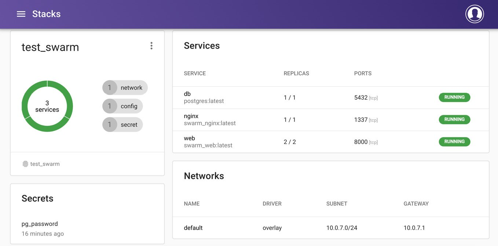

Lab 8: Docker Swarm
===================


In this lab, you will work with Docker Swarm from the command line
to manage running nodes, deploy services, and perform rolling updates on
your services when needed. You will learn how to troubleshoot your Swarm
nodes and deploy entire stacks using your existing Docker Compose files,
as well as learning how you can use Swarm to manage your service
configuration and secrets. The final part of this lab will provide
you with the knowledge you need to get started using Swarmpit, which is
a web-based interface for running and managing your Docker Swarm
services and clusters.


Exercise 9.01: Running Services with Docker Swarm
-------------------------------------------------

This exercise is designed to help you become familiar with using the
Docker Swarm commands to manage your services and containers. In the
exercise, you will activate a cluster, set up a new service, test
scaling up the service, and then remove the service from the cluster
using Docker Swarm:

1.  Although Swarm is included by default with your Docker installation,
    you still need to activate it on your system. Use the
    `docker swarm init` command to put your local system into
    Docker Swarm mode:

    
    ```
    docker swarm init
    ```
    

    Your output might be a little different from what you see here, but
    as you can see, once the swarm is created, the output provides
    details on how you can add extra nodes to your cluster with the
    `docker swarm join` command:

    
    ```
    Swarm initialized: current node (j2qxrpf0a1yhvcax6n2ajux69) is 
    now a manager.
    To add a worker to this swarm, run the following command:
        docker swarm join --token SWMTKN-1-2w0fk5g2e18118zygvmvdxartd43n0ky6cmywy0ucxj8j7net1-5v1xvrt7
    1ag6ss7trl480e1k7 192.168.65.3:2377
    To add a manager to this swarm, run 'docker swarm join-token 
    manager' and follow the instructions.
    ```
    

2.  Now list the nodes you have in your cluster, using the
    `node ls` command:

    
    ```
    docker node ls
    ```
    

    You should have one node you are currently working on and its status
    should be `Ready`:

    
    ```
    ID         HOSTNAME          STATUS    AVAILABILITY
      MANAGER STATUS
    j2qx.. *   docker-desktop    Ready     Active
      Leader 
    ```
    

    For clarity here, we have removed the `Engine Version`
    column from our output.

3.  From your node, check the status of your swarm using the
    `docker info` command, providing further details of your
    Swarm cluster and how the node is interacting with it. It will also
    give you extra information if you need to troubleshoot issues later:

    
    ```
    docker info
    ```
    

    As you can see from the output, you get all the specific details of
    your Docker Swarm cluster, including `NodeID` and
    `ClusterID`. If you don\'t have Swarm set up correctly on
    your system, all you will see is an output of
    `Swarm: inactive`:

    
    ```
    …
    Swarm: active
      NodeID: j2qxrpf0a1yhvcax6n2ajux69
      Is Manager: true
      ClusterID: pyejfsj9avjn595voauu9pqjv
      Managers: 1
      Nodes: 1
      Default Address Pool: 10.0.0.0/8  
      SubnetSize: 24
      Data Path Port: 4789
      Orchestration:
       Task History Retention Limit: 5
      Raft:
       Snapshot Interval: 10000
       Number of Old Snapshots to Retain: 0
       Heartbeat Tick: 1
       Election Tick: 10
      Dispatcher:
       Heartbeat Period: 5 seconds
      CA Configuration:
       Expiry Duration: 3 months
       Force Rotate: 0
    ```
    

4.  Start your first service on your newly created swarm. Create a
    service named `web` using the
    `docker service create` command and the
    `--replicas` option to set two instances of the container
    running:

    
    ```
    docker service create --replicas 2 -p 80:80 --name web nginx
    ```
    

    You will see that the two instances are successfully created:

    
    ```
    uws28u6yny7ltvutq38166alf
    overall progress: 2 out of 2 tasks 
    1/2: running   [==========================================>] 
    2/2: running   [==========================================>] 
    verify: Service converged
    ```
    

5.  Similar to the `docker ps` command, you can see a listing
    of the services running on your cluster with the
    `docker service ls` command. Execute the
    `docker service ls` command to view the details of the
    `web` service created in the *step 4*:

    
    ```
    docker service ls
    ```
    

    The command will return the details of the `web` service:

    
    ```
    ID              NAME  MODE          REPLICAS   IMAGE
      PORTS
    uws28u6yny7l    web   replicated    2/2        nginx:latest
      *:80->80/tcp
    ```
    

6.  To view the containers currently running on your swarm, use the
    `docker service ps` command with the name of your service,
    `web`:

    
    ```
    docker service ps web
    ```
    

    As you can see, you now have a list of the containers running our
    service:

    
    ```
    ID     NAME    IMAGE    NODE               DESIRED
      CURRENT STATE
    viyz   web.1   nginx    docker-desktop     Running
      Running about a minute ago
    mr4u   web.2   nginx    docker-desktop     Running
      Running about a minute ago
    ```
    

7.  The service will only run the default `Welcome to nginx!`
    page. Use the node IP address to view the page. In this instance, it
    will be your localhost IP, `0.0.0.0`:

    

    


8.  Scaling the number of containers running your service is easy with
    Docker Swarm. Simply provide the `scale` option with the
    number of total containers you want to have running, and the swarm
    will do the work for you. Perform the command shown here to scale
    your running web containers to `3`:

    
    ```
    docker service scale web=3
    ```
    

    The following output shows that the `web` service is now
    scaled to `3` containers:

    
    ```
    web scaled to 3
    overall progress: 3 out of 3 tasks 
    1/3: running   [==========================================>]
    2/3: running   [==========================================>]
    3/3: running   [==========================================>]
    verify: Service converged
    ```
    

9.  As in *step 5* of this exercise, run the `service ls`
    command:

    
    ```
    docker service ls
    ```
    

    You should now see three `web` services running on your
    cluster:

    
    ```
    ID              NAME    MODE          REPLICAS   IMAGE
        PORTS
    uws28u6yny7l    web     replicated    3/3        nginx:latest
        *:80->80/tcp
    ```
    

10. The following change is more suited to a cluster with more than one
    node, but you can run it anyway to see what happens. Run the
    following `node update` command to set the availability to
    `drain` and use your node ID number or name. This will
    remove all the containers running on this node as it is no longer
    available on your cluster. You will be provided with the node ID as
    an output:
    
    ```
    docker node update --availability drain j2qxrpf0a1yhvcax6n2ajux69
    ```
    

11. If you were to run the `docker service ps web` command,
    you would see each of your `web` services shut down while
    trying to start up new `web` services. As you only have
    one node running, the services would be sitting in a pending state
    with `no suitable node` error. Run the
    `docker service ps web` command:

    
    ```
    docker service ps web
    ```
    

    The output has been reduced to only show the second, third, fifth,
    and sixth columns, but you can see that the service is unable to
    start. The `CURRENT STATE` column has both
    `Pending` and `Shutdown` states:

    
    ```
    NAME         IMAGE            CURRENT STATE
      ERROR
    web.1        nginx:latest     Pending 2 minutes ago
      "no suitable node (1 node…"
    \_ web.1     nginx:latest     Shutdown 2 minutes ago
    web.2        nginx:latest     Pending 2 minutes ago
      "no suitable node (1 node…"
    \_ web.2     nginx:latest     Shutdown 2 minutes ago
    web.3        nginx:latest     Pending 2 minutes ago
      "no suitable node (1 node…"
    \_ web.3     nginx:latest     Shutdown 2 minutes ago
    ```
    

12. Run the `docker node ls` command:

    
    ```
    docker node ls
    ```
    

    This shows that your node is ready but in an
    `AVAILABILITY` state of `Drain`:

    
    ```
    ID         HOSTNAME          STATUS    AVAILABILITY
      MANAGER STATUS
    j2qx.. *   docker-desktop    Ready     Drain
      Leader 
    ```
    

13. Stop the service from running. Use the `service rm`
    command, followed by the service name (in this instance,
    `web`) to stop the service from running:

    
    ```
    docker service rm web
    ```
    

    The only output shown will be the name of the service you are
    removing:

    
    ```
    web
    ```
    

14. You don\'t want to leave your node in a `Drain` state as
    you want to keep using it through the rest of the exercises. To get
    the node out of a `Drain` state and prepare to start
    managing swarm, set the availability to `active` with the
    following command using your node ID:

    
    ```
    docker node update --availability active j2qxrpf0a1yhvcax6n2ajux69
    ```
    

    The command will return the hash value of the node, which will be
    different for every user.

15. Run the `node ls` command:

    
    ```
    docker node ls
    ```
    

    It will now show the availability of our node as `Active`
    and ready your services to run again:

    
    ```
    ID         HOSTNAME          STATUS    AVAILABILITY
      MANAGER STATUS
    j2qx.. *   docker-desktop    Ready     Active
      Leader 
    ```
    

16. Use the `docker node inspect` command with the
    `--format` option and search for the
    `ManagerStatus.Reachability` status to ensure that your
    node is reachable:

    
    ```
    docker node inspect j2qxrpf0a1yhvcax6n2ajux69 --format "{{ .ManagerStatus.Reachability }}"
    ```
    

    If the node is available and can be contacted, you should see a
    result of `reachable`:

    
    ```
    reachable
    ```
    

17. Search for `Status.State` to ensure that the node is
    ready:

    
    ```
    docker node inspect j2qxrpf0a1yhvcax6n2ajux69 --format "{{ .Status.State }}"
    ```
    

    This should produce `ready`:

    
    ```
    ready
    ```
    

This exercise should have given you a good indication of how Docker
Swarm is able to simplify your work, especially when you start to think
about deploying your work into a production environment. We used the
Docker Hub NGINX image, but we could easily use any service we have
created as a Docker image that is available to our Swarm node.


Deploying Swarm Deployments from Docker Compose
===============================================


In the following example, you will create a small test
application using Django and PostgreSQL. The web application you will be
setting up is very basic, so there is no real need to have a prior
understanding of the Django web framework. Simply follow along and we
will explain what is happening as we move through the exercise.


Exercise 9.02: Deploying Your Swarm from Docker Compose
-------------------------------------------------------

In the following exercise, you will use `docker-compose.yml`
to create a basic web application using a PostgreSQL database and the
Django web framework. You will then use this `compose` file to
deploy your services into your swarm without the need to run your
services manually:

1.  First, create a directory to run your application in. Call the
    directory `swarm` and move into the directory using the
    `cd` command:
    
    ```
    mkdir swarm; cd swarm
    ```
    

2.  Create a `Dockerfile` for your Django application in the
    new directory and, using your text editor, enter the details in the
    following code block. The `Dockerfile` will use the
    default `Python3` image, set environment variables
    relevant for Django, install relevant applications, and copy the
    code into the current directory of the container image:
    
    ```
    FROM python:3
    ENV PYTHONUNBUFFERED 1
    RUN mkdir /application
    WORKDIR /application
    COPY requirements.txt /application/
    RUN pip install -r requirements.txt
    COPY . /application/
    ```
    

3.  Create the `requirements.txt` file that your
    `Dockerfile` uses in the previous step to install all the
    relevant applications needed for it to run. Add in the following two
    lines with your text editor to install the version of
    `Django` and `Psycopg2` required by the Django
    application to communicate with the PostgreSQL database:
    
    ```
    1 Django>=2.0,<3.0
    2 psycopg2>=2.7,<3.0
    ```
    

4.  Create a `docker-compose.yml` file using your text editor.
    Add in the first service for your database, as shown in the
    following code. The `db` service will use the latest
    `postgres` image from Docker Hub, exposing port
    `5432`, and also set the environment variable for
    `POSTGRES_PASSWORD`:
    
    ```
    1 version: '3.3'
    2
    3 services:
    4   db:
    5     image: postgres
    6     ports:
    7       - 5432:5432
    8     environment:
    9       - POSTGRES_PASSWORD=docker
    ```
    

5.  The second half of the `docker-compose.yml` file builds
    and deploys your web application. Build your `Dockerfile`
    in *line 10*, expose port `8000` to access it from your
    web browser, and set the database password to match your
    `db` service. You will also notice a Python command in
    *line 13* that will start the development web server for the Django
    application:
    
    ```
    10   web:
    11     build: .
    12     image: swarm_web:latest
    13     command: python manage.py runserver 0.0.0.0:8000
    14     volumes:
    15       - .:/application
    16     ports:
    17       - 8000:8000
    18     environment:
    19       - PGPASSWORD=docker
    20     depends_on:
    21       - db
    ```
    

6.  Run the following command to pull and build the `db` and
    `web` services in your `docker-compose.yml`. The
    command will then run `django-admin startproject`, which
    will create your basic Django project, named
    `chapter_nine`:

    
    ```
    docker-compose run web django-admin startproject chapter_nine .
    ```
    

    The command should return the following output, in which you see the
    containers being pulled and built:

    
    ```
    …
    Status: Downloaded newer image for postgres:latest
    Creating swarm_db_1 ... done
    Building web
    …
    Successfully built 41ff06e17fe2
    Successfully tagged swarm_web:latest
    ```
    

7.  The `startproject` command you ran in the previous step
    should have created some extra files and directories in your swarm
    directory. Run the `ls` command to list all the files and
    directories in the swarm directory:

    
    ```
    ls -l
    ```
    

    You previously created the `Dockerfile`,
    `docker-compose.yml` file, and
    `requirements.txt` file, but now the build of the
    container has added the `chapter_nine` Django directory
    and the `manage.py` file:

    
    ```
    -rw-r--r--  1 user  staff  175  3 Mar 13:45 Dockerfile
    drwxr-xr-x  6 user  staff  192  3 Mar 13:48 chapter_nine
    -rw-r--r--  1 user  staff  304  3 Mar 13:46 docker-compose.yml
    -rwxr-xr-x  1 user  staff  634  3 Mar 13:48 manage.py
    -rw-r--r--  1 user  staff   36  3 Mar 13:46 requirements.txt
    ```
    

8.  To get your basic application running, you need to make some minor
    changes to the Django project settings. Open the
    `chapter_nine/settings.py` file with your text editor and
    locate the entry that starts with `DATABASES`. This
    controls how Django will connect to your database, and by default,
    Django is set up to work with an SQLite database. The
    `DATABASES` entry should look like the following:

    
    ```
    76 DATABASES = {
    77     'default': {
    78         'ENGINE': 'django.db.backends.sqlite3',
    79         'NAME': os.path.join(BASE_DIR, 'db.sqlite3'),
    80     }
    81 }
    ```
    

    You have a PostgreSQL database to deploy to Swarm as a part of our
    installation, so edit the `DATABASES` settings with the
    following eight lines so that Django will access this PostgreSQL
    database instead:

    settings.py

    
    ```
    76 DATABASES = {
    77     'default': {
    78         'ENGINE': 'django.db.backends.postgresql',
    79         'NAME': 'postgres',
    80         'USER': 'postgres',
    81         'PASSWORD': 'docker',
    82         'HOST': 'db',
    83         'PORT': 5432,
    84     }
    85 }
    ```

9.  At *line 28* of our `settings.py` file, we also need to
    add the IP address we are going to use as the
    `ALLOWED_HOSTS` configuration. We will configure our
    application to be accessible from the IP address
    `0.0.0.0`. Make the relevant changes to the settings file
    at *line 28* so that it now looks like the code below:
    
    ```
     27 
     28 ALLOWED_HOSTS = ["0.0.0.0"]
    ```
    

10. Now test to see whether your basic project is working as expected.
    From the command line, deploy your services to Swarm with the
    `stack deploy` command. In the following command, specify
    the `docker-compose.yml` file to use with the
    `--compose-file` option and name the stack
    `test_swarm`:

    
    ```
    docker stack deploy --compose-file docker-compose.yml test_swarm
    ```
    

    The command should set up the swarm network, the database, and the
    web services:

    
    ```
    Creating network test_swarm_default
    Creating service test_swarm_db
    Creating service test_swarm_web
    ```
    

11. Run the `docker service ls` command, and you should be
    able to see the status for both the `test_swarm_db` and
    `test_swarm_web` services:

    
    ```
    docker service ls
    ```
    

    As you can see in the following output, they are both showing a
    `REPLICAS` value of `1/1`:

    
    ```
    ID     NAME            MODE        REPLICAS  IMAGE
      PORTS
    dsr.   test_swarm_db   replicated  1/1       postgres
    kq3.   test_swarm_web  replicated  1/1       swarm_web:latest
      *:8000.
    ```
    

12. If your work has been successful, test it by opening a web browser
    and going to `http://0.0.0.0:8000`. If everything has
    worked, you should see the following Django test page displayed on
    your web browser:

    

    


13. To view the stacks currently running on your system, use the
    `stack ls` command:

    
    ```
    docker stack ls
    ```
    

    You should see the following output, which shows two services
    running under the name of `test_swarm`:

    
    ```
    NAME                SERVICES            ORCHESTRATOR
    test_swarm          2                   Swarm
    ```
    

14. Use the `stack ps` command with the name of your swarm to
    view the services running and check whether there are any issues:

    
    ```
    docker stack ps test_swarm
    ```
    

    The `ID`, `DESIRED STATE`, and `ERROR`
    columns are not included in the following reduced output. Also, it
    can be seen that the `test_swarm_web.1` and
    `test_swarm_db.1` services are running:

    
    ```
    NAME                IMAGE               NODE
      CURRENT STATE
    test_swarm_web.1    swarm_web:latest    docker-desktop
      Running
    test_swarm_db.1     postgres:latest     docker-desktop
      Running
    ```
    

15. Just as you were able to start up all your services at once with the
    `deploy` command, you can stop the services all at once,
    as well. Use the `stack rm` command with the name of your
    swarm to stop all of your services from running and remove the
    stack:

    
    ```
    docker stack rm test_swarm
    ```
    

    Note that all the services are stopped in the following output:

    
    ```
    Removing service test_swarm_db
    Removing service test_swarm_web
    Removing network test_swarm_default
    ```
    

16. You still want to perform some extra work on your swarm as part of
    this exercise, but first, make a minor change to the
    `compose` file. Open the `docker-compose.yml`
    file with your text editor and add the following lines to your web
    service to now have two replica web services created when deployed
    to the swarm:

    
    ```
    22     deploy:
    23       replicas: 2
    ```
    

    The complete `docker-compose.yml` file should look like
    the following:

    
    ```
    version: '3.3'
    services:
      db:
        image: postgres
        ports:
          - 5432:5432
        environment:
          - POSTGRES_PASSWORD=docker
      web:
        build: .
        image: swarm_web:latest
        command: python manage.py runserver 0.0.0.0:8000
        volumes:
          - .:/application
        ports:
          - 8000:8000
        environment:
          - PGPASSWORD=docker
        deploy:
          replicas: 2
        depends_on:
          - db
    ```
    

17. Deploy the swarm again with the changes you have made using the same
    command, as you did earlier in *step 8*. Even if the
    `test_swarm` stack was still running, it would note and
    make the relevant changes to the services:
    
    ```
    docker stack deploy --compose-file docker-compose.yml test_swarm
    ```
    

18. Run the `docker ps` command as follows:

    
    ```
    docker ps | awk '{print $1 "\t" $2 }'
    ```
    

    Only the first two columns are printed in the output shown here. You
    can now see that there are two `swarm_web` services
    running:

    
    ```
    CONTAINER         ID
    2f6eb92414e6      swarm_web:latest
    e9241c352e12      swarm_web:latest
    d5e6ece8a9bf      postgres:latest
    ```
    

19. To deploy a new version of the `swarm_web` service to your
    swarm without stopping the services, first, build a new Docker image
    of our web service. Don\'t make any changes to the image, but this
    time tag the image with the `patch1` tag to demonstrate a
    change while the service is running:
    
    ```
    docker build . -t swarm_web:patch1
    ```
    

20. To perform a rolling update, use the `service update`
    command, providing details of the image you wish to update to and
    the service name. Run the following command, which uses the image
    you have just created with the `patch1` tag, on the
    `test_swarm_web` service:

    
    ```
    docker service update --image swarm_web:patch1 test_swarm_web
    ```
    

    Swarm will manage the update to make sure one of the services is
    always running before the update is applied to the rest of the
    images:

    
    ```
    image swarm_web:patch1 could not be accessed on a registry 
    to record its digest. Each node will access 
    swarm_web:patch1 independently, possibly leading to different 
    nodes running different versions of the image.
    test_swarm_web
    overall progress: 2 out of 2 tasks 
    1/2: running   [=========================================>]
    2/2: running   [=========================================>]
    verify: Service converged
    ```
    

    Note

    You\'ll notice the output shows the image was not available on a
    repository. As we only have one node running our swarm, the update
    will use the image built on the node. In a real-world scenario, we
    would need to push this image to a central repository that all our
    nodes have access to so they can pull it.

21. Run the `docker ps` command given here, which pipes its
    output to an `awk` command to only print the first two
    columns of `CONTAINER` and `ID`:

    
    ```
    docker ps | awk '{print $1 "\t" $2 }'
    ```
    

    The command will return the output such as the following:

    
    ```
    CONTAINER         ID
    ef4107b35e09      swarm_web:patch1
    d3b03d8219dd      swarm_web:patch1
    d5e6ece8a9bf      postgres:latest
    ```
    

22. What if you wanted to control the way the rolling updates occur? Run
    the following command to perform a new rolling update to your
    `test_swarm_web` services. Revert the changes you made to
    deploy the image with the `latest` tag, but this time,
    make sure there is a `30`-second delay in performing the
    update as this will give your web service extra time to start up
    before the second update is run:
    
    ```
    docker service update --update-delay 30s --image swarm_web:latest test_swarm_web
    ```
    

23. Run the `docker ps` command again:

    
    ```
    docker ps | awk '{print $1 "\t" $2 }'
    ```
    

    Note that the containers are now running the
    `swarm_web:latest` image again after you have performed
    the rolling update:

    
    ```
    CONTAINER         ID
    414e62f6eb92      swarm_web:latest
    352e12e9241c      swarm_web:latest
    d5e6ece8a9bf      postgres:latest
    ```
    

By now, you should see the benefit of using a swarm, especially when we
start to scale out our applications using Docker Compose. In this
exercise, we have demonstrated how to easily deploy and manage a group
of services onto your swarm using Docker Compose and upgrade services
with rolling updates.

The next section of this lab will expand your knowledge further to
show how you can use Swarm to manage your configurations and secret
values used within your environment.


Managing Secrets and Configurations with Docker Swarm
=====================================================

The following exercise will demonstrate how to use both configurations
and secrets in your current Docker Swarm environment.


Exercise 9.03: Implementing Configurations and Secrets in Your Swarm
--------------------------------------------------------------------

In this exercise, you will expand your Docker Swarm environment further.
You will add a service to your environment that will help NGINX to route
the requests through the proxy, before moving into your web service. You
will set this up using traditional methods but then use the
`config` and `secret` functions as part of your
environment to observe their operations within Swarm and help users
deploy and configure services more efficiently:

1.  Currently, the web service is using the Django development web
    server via the `runserver` command to provide web
    requests. NGINX will not be able to route traffic requests through
    to this development server, and instead, you will need to install
    the `gunicorn` application onto our Django web service for
    traffic to be routed via NGINX. Start by opening your
    `requirements.txt` file with your text editor and add the
    application as in the highlighted third line:

    
    ```
    Django>=2.0,<3.0
    psycopg2>=2.7,<3.0
    gunicorn==19.9.0
    ```
    

    Note

    Gunicorn is short for **Green Unicorn** and is used as a **Web
    Service Gateway Interface** (**WSGI**) for Python applications.
    Gunicorn is widely used for production environments as it is seen to
    be one of the most stable WSGI applications available.

2.  To run Gunicorn as part of your web application, adjust your
    `docker-compose.yml` file. Open the
    `docker-compose.yml` file with your text editor and change
    *line 13* to run the `gunicorn` application, instead of
    the Django `manage.py runserver` command. The following
    `gunicorn` command runs the `chapter_nine`
    Django project via its WSGI service and binds to IP address and port
    `0.0.0.0:8000`:
    
    ```
    12     image: swarm_web:latest
    13     command: gunicorn chapter_nine.wsgi:application          --bind 0.0.0.0:8000
    14     volumes:
    ```
    

3.  Rebuild your web service to make sure the Gunicorn application is
    installed on the container and available to run. Run the
    `docker-compose build` command:
    
    ```
    docker-compose build
    ```
    

4.  Gunicorn can also run without the need of the NGINX proxy, so test
    the changes you have made by running the `stack deploy`
    command again. If you already have your services deployed, don\'t
    worry, you can still run this command again. It will simply make the
    relevant changes to your swarm and match the changes in your
    `docker-compose.yml`:

    
    ```
    docker stack deploy --compose-file docker-compose.yml test_swarm
    ```
    

    The command will return the following output:

    
    ```
    Ignoring unsupported options: build
    Creating network test_swarm_default
    Creating service test_swarm_web
    Creating service test_swarm_db
    ```
    

5.  To ensure the changes have taken effect, make sure you open your web
    browser and verify that the Django test page is still being provided
    by your web service before moving on to the next step. As per your
    changes, the page should still be displayed at
    `http://0.0.0.0:8000`.

6.  To start your implementation of NGINX, open the
    `docker-compose.yml` file again and change *lines 16 and
    17* to expose port `8000` from the original
    `ports` command:
    
    ```
    10   web:
    11     build: .
    12     image: swarm_web:latest
    13     command: gunicorn chapter_nine.wsgi:application          --bind 0.0.0.0:8000
    14     volumes:
    15       - .:/application
    16     ports:
    17       - 8000:8000
    18     environment:
    19       - PGPASSWORD=docker
    20     deploy:
    21       replicas: 2
    22     depends_on:
    23       - db
    ```
    

7.  Keeping the `docker-compose.yml` file open, add your
    `nginx` service at the end of the `compose`
    file. All of the information here should be familiar to you by now.
    *Line 25* provides the location of a new NGINX directory, the
    `Dockerfile` you will create shortly, and the name of the
    image to be used when the service is deployed. *Lines* *27* and *28*
    expose port `1337` to port `80` and *lines* *29*
    and *30* show that NGINX needs to depend on the `web`
    service to run:
    
    ```
    24   nginx:
    25     build: ./nginx
    26     image: swarm_nginx:latest
    27     ports:
    28       - 1337:80
    29     depends_on:
    30       - web
    ```
    

8.  Now, set up the NGINX `Dockerfile` and configurations for
    the service. Start by creating a directory called `nginx`,
    as in the following command:
    
    ```
    mkdir nginx
    ```
    

9.  Create a new `Dockerfile` in the `nginx`
    directory, open the file with your text editor, and add in the
    details shown here. The `Dockerfile` is created from the
    latest `nginx` image available on Docker Hub. It removes
    the default configuration `nginx` file in *line 3* and
    then adds a new configuration that you need to set up shortly:
    
    ```
    FROM nginx
    RUN rm /etc/nginx/conf.d/default.conf
    COPY nginx.conf /etc/nginx/conf.d
    ```
    

10. Create the `nginx.conf` file that the
    `Dockerfile` will use to create your new image. Create a
    new file called `nginx.conf` in the `nginx`
    directory and use your text editor to add the following
    configuration details:

    
    ```
    upstream chapter_nine {
        server web:8000;
    }
    server {
        listen 80;
        location / {
            proxy_pass http://chapter_nine;
            proxy_set_header X-Forwarded-For             $proxy_add_x_forwarded_for;
            proxy_set_header Host $host;
            proxy_redirect off;
        }
    }
    ```
    

    If you\'re unfamiliar with NGINX configurations, the preceding
    details are simply looking for requests to the web service and will
    route requests through to the `chapter_nine` Django
    application.

11. With all the details now in place, build your new image for the
    NGINX service now set up in your `docker-compose.yml`
    file. Run the following command to build the image:
    
    ```
    docker-compose build
    ```
    

12. Run the `stack deploy` command again:

    
    ```
    docker stack deploy --compose-file docker-compose.yml test_swarm
    ```
    

    This time, you will notice that your output shows that the
    `test_swarm_nginx` service has been created and should be
    running:

    
    ```
    Creating network test_swarm_default
    Creating service test_swarm_db
    Creating service test_swarm_web
    Creating service test_swarm_nginx
    ```
    

13. Verify that all the services are running as part of your swarm with
    the `stack ps` command:

    
    ```
    docker stack ps test_swarm
    ```
    

    The resulting output has been reduced to show only four of the eight
    columns. You can see that the `test_swarm_nginx` service
    is now running:

    
    ```
    NAME                  IMAGE                 NODE
      DESIRED STATE
    test_swarm_nginx.1    swarm_nginx:latest    docker-desktop
      Running
    test_swarm_web.1      swarm_web:latest      docker-desktop
      Running
    test_swarm_db.1       postgres:latest       docker-desktop
      Running
    test_swarm_web.2      swarm_web:latest      docker-desktop
      Running
    ```
    

14. To prove that requests are routing through the NGINX proxy, use port
    `1337` instead of port `8000`. Make sure that a
    web page is still being provided from your web browser by using the
    new URL of `http://0.0.0.0:1337`.

15. This has been a great addition to the services running on Swarm but
    is not using the correct configuration management features. You
    already have an NGINX configuration created previously in this
    exercise. Create a Swarm configuration by using the
    `config create` command with the name of the new
    configuration and the file you are going to create the configuration
    from. Run the following command to create the new configuration from
    your `nginx/nginx.conf` file:

    
    ```
    docker config create nginx_config nginx/nginx.conf 
    ```
    

    The output from the command will provide you with the created
    configuration ID:

    
    ```
    u125x6f6lhv1x6u0aemlt5w2i
    ```
    

16. Swarm also gives you a way to list all the configurations created as
    part of your Swarm, using the `config ls` command. Make
    sure the new `nginx_config` file has been created in the
    previous step and run the following command:

    
    ```
    docker config ls
    ```
    

    `nginx_config` has been created in the following output:

    
    ```
    ID           NAME           CREATED           UPDATED
    u125x6f6…    nginx_config   19 seconds ago    19 seconds ago
    ```
    

17. View the full details of the configuration you have created using
    the `docker config inspect` command. Run the following
    command with the `--pretty` option to make sure the
    configuration output is in a readable form:

    
    ```
    docker config inspect --pretty nginx_config
    ```
    

    The output should look similar to what you see here, showing details
    of the NGINX configuration you have just created:

    
    ```
    ID:             u125x6f6lhv1x6u0aemlt5w2i
    Name:           nginx_config
    Created at:          2020-03-04 19:55:52.168746807 +0000 utc
    Updated at:          2020-03-04 19:55:52.168746807 +0000 utc
    Data:
    upstream chapter_nine {
        server web:8000;
    }
    server {
        listen 80;
        location / {
            proxy_pass http://chapter_nine;
            proxy_set_header X-Forwarded-For             $proxy_add_x_forwarded_for;
            proxy_set_header Host $host;
            proxy_redirect off;
        }
    }
    ```
    

18. As you have now set up the configuration in Swarm, make sure the
    configuration is no longer built into the container image. Instead,
    it will be provided when the Swarm is deployed. Open the
    `Dockerfile` in the `nginx` directory and remove
    the fourth line of the `Dockerfile`. It should now look
    similar to the details given here:

    
    ```
    FROM nginx:1.17.4-alpine
    RUN rm /etc/nginx/conf.d/default.conf
    ```
    

    Note

    Remember that the change we are making here will make sure that we
    don\'t need to build a new NGINX image every time the configuration
    changes. This means we can use the same image and deploy it to a
    development swarm or a production swarm. All we would do is change
    the configuration to make the environment. We do need to create the
    image that can use the config we have created and stored in Swarm,
    though.

19. The previous step in this exercise made a change to the
    `nginx` `Dockerfile`, so now rebuild the image
    to make sure it is up to date:
    
    ```
    docker-compose build
    ```
    

20. Open the `docker-compose.yml` file with your text editor
    to update the `compose` file so that our `nginx`
    service will now use the newly created Swarm `config`. At
    the bottom of the `nginx` service, add in the
    configuration details with the source name of the
    `nginx_cof` configuration you created earlier. Be sure to
    add it to the running `nginx` service so it can be used by
    the container. Then, set up a separate configuration for the file.
    Even though you have created it manually in the previous steps, your
    swarm needs to know about it when it is deployed. Add the following
    into your `docker-compose.yml`:
    
    ```
    25   nginx:
    26     build: ./nginx
    27     image: swarm_nginx:latest
    28     ports:
    29       - 1337:80
    30     depends_on:
    31       - web
    32     configs:
    33       - source: nginx_conf
    34         target: /etc/nginx/conf.d/nginx.conf
    35 
    36 configs:
    37   nginx_conf:
    38     file: nginx/nginx.conf
    ```
    

21. Deploy your swarm again:

    
    ```
    docker stack deploy --compose-file docker-compose.yml test_swarm
    ```
    

    In the following output, you should now see an extra line showing
    `Creating config test_swarm_nginx_conf`:

    
    ```
    Creating network test_swarm_default
    Creating config test_swarm_nginx_conf
    Creating service test_swarm_db
    Creating service test_swarm_web
    Creating service test_swarm_nginx
    ```
    

22. There is still more you can do to take advantage of Swarm, and one
    extra feature not used yet is the secrets function. Just as you
    created a configuration earlier in this exercise, you can create a
    `secret` with a similar command. The command shown here
    first uses `echo` to output the password you want as your
    secret value, and then, using the `secret create` command,
    it uses this output to create the secret named
    `pg_password`. Run the following command to name your new
    secret `pg_password`:

    
    ```
    echo "docker" | docker secret create pg_password –
    ```
    

    The command will output the ID of the secret created:

    
    ```
    4i1cwxst1j9qoh2e6uq5fjb8c
    ```
    

23. View the secrets in your swarm using the `secret ls`
    command. Run this command now:

    
    ```
    docker secret ls
    ```
    

    You can see that your secret has been created successfully with the
    name of `pg_password`:

    
    ```
    ID                          NAME           CREATED
      UPDATED
    4i1cwxst1j9qoh2e6uq5fjb8c   pg_password    51 seconds ago
      51 seconds ago
    ```
    

24. Now, make the relevant changes to your
    `docker-compose.yml` file. Previously, you simply entered
    the password you wanted for your `postgres` user. As you
    can see in the following code, here, you will point the environment
    variable to the secret you created earlier as
    `/run/secrets/pg_password`. This means it will search
    through the available secrets in your swarm and assign the secret
    stored in `pg_password`. You also need to refer to the
    secret in the `db` service to allow it access. Open the
    file with your text editor and make the following changes to the
    file:
    
    ```
    4   db:
    5     image: postgres
    6     ports:
    7       - 5432:5432
    8     environment:
    9       - POSTGRES_PASSWORD=/run/secrets/pg_password
    10    secrets:
    11      - pg_password
    ```
    

25. The `web` service uses the same secret to access the
    PostgreSQL database. Move into the `web` service section
    of the `docker-compose.yml` and change *line 21* to
    resemble the following, as it will now use the secret you have
    created:
    
    ```
    20    environment:
    21       - PGPASSWORD=/run/secrets/pg_password
    22    deploy:
    ```
    

26. Finally, just as you have done with your configuration, define the
    secret at the end of `docker-compose.yml`. Add in the
    following lines at the end of your `compose` file:
    
    ```
    41 secrets:
    42  pg_password:
    43    external: true
    ```
    

27. Before deploying your changes, you have made a lot of changes to the
    `compose` file, so your `docker-compose.yml`
    file should look similar to what is shown in the following code
    block. You have three services running with the `db`,
    `web`, and `nginx` services set up, and we now
    have one `config` instance and one `secret`
    instance:

    docker-compose.yml

    
    ```
    version: '3.3'
    services:
      db:
        image: postgres
        ports:
          - 5432:5432
        environment:
          - POSTGRES_PASSWORD=/run/secrets/pg_password
        secrets:
          - pg_password
      web:
        build: .
        image: swarm_web:latest
        command: gunicorn chapter_nine.wsgi:application --bind 
      0.0.0.0:8000
        volumes:
          - .:/application
        ports:
          - 8000:8000
    ```
    

    Note

    There are a few changes to our service, and if there are any issues
    in deploying the changes to Swarm, it may be worth deleting the
    services and then re-deploying to make sure all the changes take
    effect correctly.

    This is the final run of your Swarm deployment for this exercise:

    
    ```
    docker stack deploy --compose-file docker-compose.yml test_swarm
    ```
    

28. Run the deployment and make sure the services are running and
    deployed successfully:
    
    ```
    Creating network test_swarm_default
    Creating config test_swarm_nginx_conf
    Creating service test_swarm_db
    Creating service test_swarm_web
    Creating service test_swarm_nginx
    ```
    

In this exercise, you have practiced using Swarm to deploy a complete
set of services using your `docker-compose.yml` file and have
them running in a matter of minutes. This part of the lab has also
demonstrated some extra functionality of Swarm using `config`
and `secret` instances to help us reduce the amount of work
needed to move services to different environments. Now that you know how
to manage Swarm from the command line, you can further explore Swarm
cluster management in the following section using a web interface with
Swarmpit.


Managing Swarm with Swarmpit
============================


The command line provides an efficient and useful way for users to
control their Swarm. This can get a little confusing for some users if
your services and nodes multiply as need increases. One way to help with
managing and monitoring your Swarm is by using a web interface such as
the one provided by Swarmpit to help you administer your different
environments.

As you\'ll see shortly, Swarmpit provides an easy-to-use web interface
that allows you to manage most aspects of your Docker Swarm instances,
including the stacks, secrets, services, volumes networks, and
configurations.

Note

This lab will only touch on the use of Swarmpit, but if you would
like more information on the application, the following site should
provide you with further details:
[https://swarmpit.io](https://swarmpit.io/).

Swarmpit is a simple-to-use installation Docker image that, when run on
your system, creates its swarm of services deployed in your environment
to run the management and web interface. Once installed, the web
interface is accessible from `http://0.0.0.0:888`.

To run the installer on your system to get Swarm running, execute the
following `docker run` command. With this, you name the
container `swampit-installer` and mount the container volume
on `/var/run/docker.sock` so it can manage other containers on
our system, using the `swarmpit/install:1.8` image:


```
docker run -it --rm   --name swarmpit-installer   --volume /var/run/docker.sock:/var/run/docker.sock   swarmpit/install:1.8
```


The installer will set up a swarm with a database, an agent, a web
application, and the network to link it all together. It will also guide
you through setting up an administrative user to log on to the interface
for the first time. Once you log in to the web application, the
interface is intuitive and easy to navigate.

The following exercise will show you how to install and run Swarmpit on
your running system and start to manage your installed services.


Exercise 9.04: Installing Swarmpit and Managing Your Stacks
-----------------------------------------------------------

In this exercise, you will install and run Swarmpit, briefly explore the
web interface, and begin managing your services from your web browser:

1.  It\'s not completely necessary to do so, but if you have stopped
    your `test_swarm` stack from running, start it up again.
    This will provide you with some extra services to monitor from
    Swarmpit:

    
    ```
    docker stack deploy --compose-file docker-compose.yml test_swarm
    ```
    

    Note

    If you are worried that there will be too many services running on
    your system at once, feel free to skip this `test_swarm`
    stack restart. The exercise can be performed as follows on the
    Swarmpit stack that is created as part of the installation process.

2.  Run the following `docker run` command:

    
    ```
    docker run -it --rm   --name swarmpit-installer   --volume /var/run/docker.sock:/var/run/docker.sock   swarmpit/install:1.8
    ```
    

    It pulls the `install:1.8` image from the
    `swarmpit` repository and then runs through the process of
    setting up your environment details, allowing the user to make
    changes to the stack name, ports, administrator username, and
    password. It then creates the relevant services needed to run the
    applications:

    
    ```
    _____      ____ _ _ __ _ __ ___  _ __ (_) |_ 
    / __\ \ /\ / / _` | '__| '_ ` _ \| '_ \| | __|
    \__ \\ V  V / (_| | |  | | | | | | |_) | | |_ 
    |___/ \_/\_/ \__,_|_|  |_| |_| |_| .__/|_|\__|
                                     |_|          
    Welcome to Swarmpit
    Version: 1.8
    Branch: 1.8
    …
    Application setup
    Enter stack name [swarmpit]: 
    Enter application port [888]: 
    Enter database volume driver [local]: 
    Enter admin username [admin]: 
    Enter admin password (min 8 characters long): ******
    DONE.
    Application deployment
    Creating network swarmpit_net
    Creating service swarmpit_influxdb
    Creating service swarmpit_agent
    Creating service swarmpit_app
    Creating service swarmpit_db
    DONE.
    ```
    

3.  On the command line, run the `stack ls` command to ensure
    that you have the Swarmpit swarm deployed to your node:

    
    ```
    docker stack ls
    ```
    

    The following output confirms that Swarmpit is deployed to our node:

    
    ```
    NAME               SERVICES         ORCHESTRATOR
    swarmpit           4                Swarm
    test_swarm         3                Swarm
    ```
    

4.  Use the `service ls` command to verify that the services
    needed by Swarmpit are running:

    
    ```
    docker service ls | grep swarmpit
    ```
    

    For clarity, the output shown here only displays the first four
    columns. The output also shows that the `REPLICAS` value
    for each service is `1/1`:

    
    ```
    ID              NAME                 MODE          REPLICAS
    vi2qbwq5y9c6    swarmpit_agent       global        1/1
    4tpomyfw93wy    swarmpit_app         replicated    1/1
    nuxi5egfa3my    swarmpit_db          replicated    1/1
    do77ey8wz49a    swarmpit_influxdb    replicated    1/1
    ```
    

    It\'s time to log in to the Swarmpit web interface. Open your web
    browser and use `http://0.0.0.0:888` to open the Swarmpit
    login page and enter the admin username and password you set during
    the installation process:

    

    


5.  Once you log in, you\'re presented with the Swarmpit welcome screen,
    showing your dashboard of all your services running on the node, as
    well as details of the resources being used on the node. The left of
    the screen provides a menu of all the different aspects of the Swarm
    stack you can monitor and manage, including the stacks themselves,
    `Services`, `Tasks`, `Networks`,
    `Nodes`, `Volumes`, `Secrets`,
    `Configs`, and `Users`. Click on the
    `Stacks` option in the left-hand menu and select the
    `test_swarm` stack:

    

    


6.  You should be presented with a screen similar to the following. The
    size of the screen has been reduced for clarity, but as you can see,
    it provides all the details of the interacting components of the
    stack---including the services available and the secrets and configs
    being used. If you click on the menu next to the stack name, as
    shown here, you can edit the stack. Click `Edit Stack`
    now:

    

    


7.  Editing the stack brings up a page where you can make changes
    directly to the stack as if you were making changes to
    `docker-compose.yml`. Move down to the file, find the
    replicas entry for the web service, and change it to `3`
    from `2`:

    

    


8.  Click on the `Deploy` button at the bottom of the screen.
    This will deploy the changes to your `test_swarm` stack
    into the environment and return you to the `test_swarm`
    stack screen, where you should now see `3/3` replicas of
    the web service running:

    

    


9.  Notice that most of the options in Swarmpit are linked. On the
    `test_swarm` stack page, if you click on the web service
    from the `services` panel, you will open the
    `Service` page for the `test_swarm_web` service.
    If you click the menu, you should see the following page:

    

    


10. Select `Rollback Service` from the menu, and you will see
    the number of replicas of the `test_swarm_web` service
    roll back to two replicas.

11. Finally, return to the `Stacks` menu and select the
    `test_swarm` again. With the `test_swarm` stack
    open, you have the option to delete the stack by clicking on the
    trash can icon toward the top of the screen. Confirm that you would
    like to delete the stack, and this will bring `test_swarm`
    down again and it will no longer be running on your node:
    

    


Note

Note that Swarmpit will allow you to delete the `swarmpit`
stack. You will see an error, but when you try to reload the page, it
will simply not come up again as all the services will have been stopped
from running.

Although this has been only a quick introduction to Swarmpit, using your
prior knowledge from this lab, the interface will allow you to
intuitively deploy and make changes to your services and stacks. Almost
anything that you can do from the command line, you can also do from the
Swarmpit web interface. This brings us to the end of this exercise and
the end of the lab. The activities in the next section of this
lab are designed to help expand your knowledge further.


Activity 9.01: Deploying the Panoramic Trekking App to a Single-Node Docker Swarm
---------------------------------------------------------------------------------

You are required to use Docker Swarm to deploy web and database services
in the Panoramic Trekking App. You will gather configurations to create
a compose file for the application and deploy them to a single node
Swarm using a `docker-compose.yml` file.

The steps you will need to take to complete this activity are as
follows:

1.  Gather all the applications and build the Docker images needed for
    the services of your swarm.
2.  Create a `docker-compose.yml` file that will allow the
    services to be deployed to Docker Swarm.
3.  Create any supporting images needed for the services to use once
    deployed.
4.  Deploy your services onto Swarm and verify that all services are
    able to run successfully.

Your running services should look similar to the output shown here:


```
ID       NAME                MODE         REPLICAS
  IMAGE
k6kh…    activity_swarm_db   replicated   1/1
  postgres:latest
copa…    activity_swarm_web  replicated   1/1
  activity_web:latest  
```


Continue with the next activity as this will work to solidify some of
the information you have already learned in this lab.


Activity 9.02: Performing an Update to the App While the Swarm Is Running
-------------------------------------------------------------------------

In this activity, you need to make a minor change to the Panoramic
Trekking App that will allow you to build a new image and deploy the
image to the running Swarm. In this activity, you will perform a rolling
update to deploy these changes to your Swarm cluster.

The steps you\'ll need to complete this activity are as follows:

1.  If you do not have the Swarm from *Activity 9.01, Deploying the
    Panoramic Trekking App to a Single Node Docker Swarm* still running,
    deploy the swarm again.

2.  Make a minor change to the code in the Panoramic Trekking
    App---something small that can be tested to verify that you have
    made a change in your environment. The change you are making is not
    important, so it can be something as basic as a configuration
    change. The main focus of this activity is on performing the rolling
    update to the service.

3.  Build a new image to be deployed into the running environment.

4.  Perform an update to the environment and verify that the changes
    were successful.


Summary
=======


This lab has done a lot of work in moving our Docker environments
from manually starting single-image services to a more production-ready
and complete environment with Docker Swarm. We started this lab with
an in-depth discussion of Docker Swarm and how you can manage your
services and nodes from the command line, providing a list of commands
and their use, and later implementing them as part of a new environment
running a test Django web application.

We then expanded this application further with an NGINX proxy and
utilized Swarm functionality to store configuration and secrets data so
they no longer need to be included as part of our Docker image and can
instead be included in the Swarm we are deploying. We then showed you
how to manage your swarm using your web browser with Swarmpit, providing
a rundown of the work we previously did on the command line and making a
lot of these changes from a web browser. Swarm is not the only way you
can orchestrate your environments when using Docker.

In the next lab, we will introduce Kubernetes, which is another
orchestration tool used to manage Docker environments and applications.
Here, you will see how you can use Kubernetes as part of your projects
to help reduce the time you are managing services and improve the
updating of your applications.
