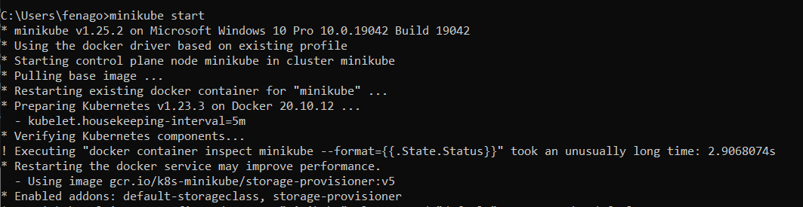
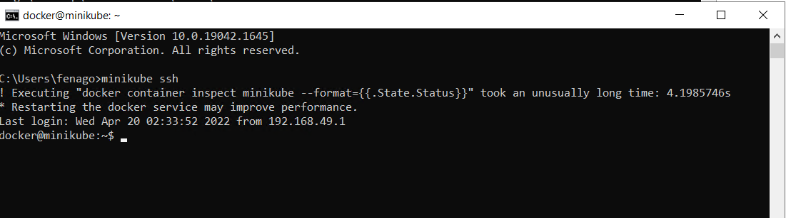
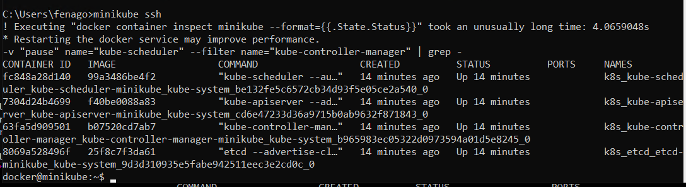
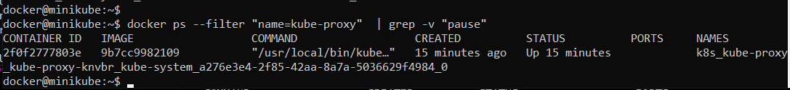
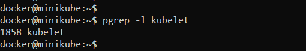
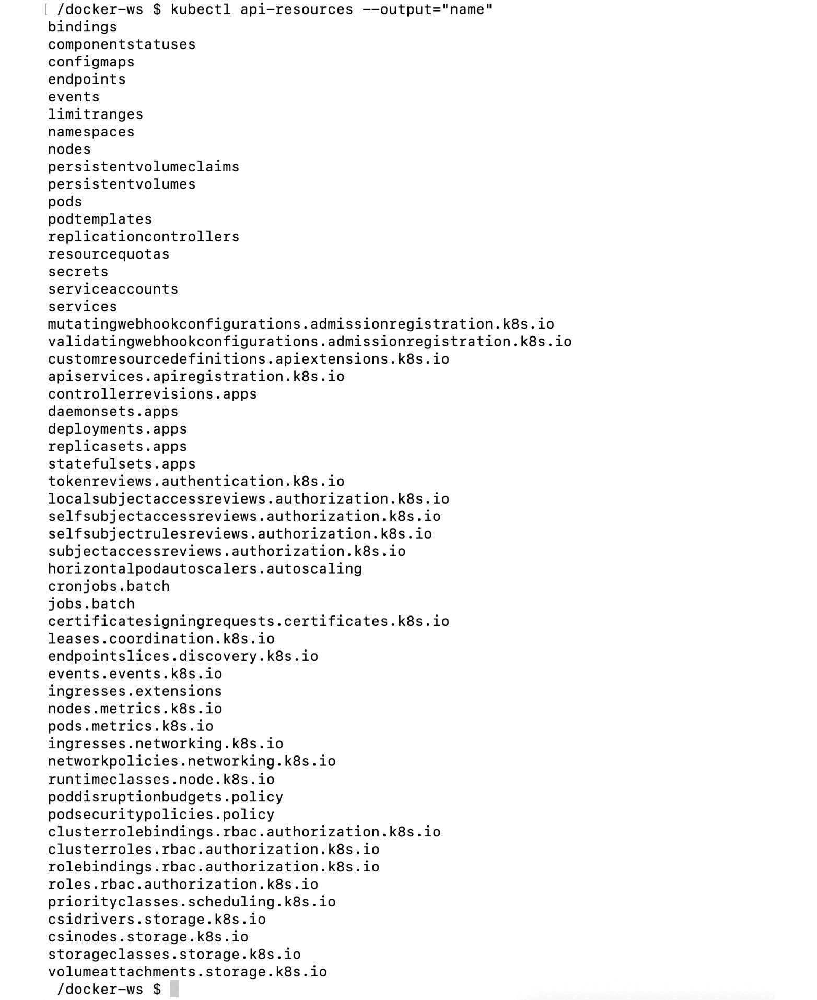
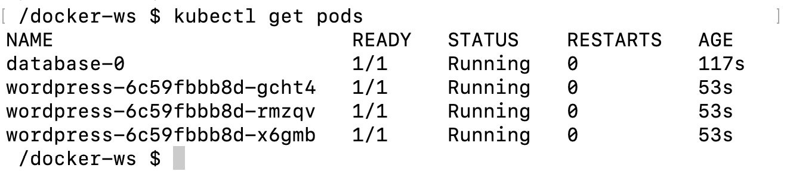

Lab 9: Kubernetes
=================


In this lab, we will learn about Kubernetes, the most popular
container management system in the market. Starting with the basics,
architecture, and resources, you will create Kubernetes clusters and
deploy real-life applications in them.

By the end of the lab, you will be able to identify the basics of
Kubernetes design and its relationship with Docker. You will create and
configure a local Kubernetes cluster, work with the Kubernetes API using
client tools, and use fundamental Kubernetes resources to run
containerized applications.


Exercise 9.01: Starting a Local Kubernetes Cluster
---------------------------------------------------

To complete this exercise, perform the following steps:


1.  Start a Kubernetes cluster with the following command in your
    terminal:

    
    ```
    minikube start
    ```
    

    The single preceding command executes multiple steps to create a
    cluster successfully. You can check each stage and its output as
    follows:

    

    


    The output starts with printing out the version and the environment.
    Then, the images for Kubernetes components are pulled and started.
    Finally, you have a locally running Kubernetes cluster after a
    couple of minutes.

2.  Connect to the cluster node started by `minikube` with the
    following command:

    
    ```
    minikube ssh
    ```
    

    With the `ssh` command, you can continue working on the
    node running in the cluster:

    

    

3.  Check for each control plane component with the following commands:

    
    ```
    docker ps --filter name="kube-apiserver" --filter name="etcd" --filter name="kube-scheduler" --filter name="kube-controller-manager" | grep -v "pause"
    ```
    

    This command checks for the Docker containers and filters with the
    control plane component names. The following output does not contain
    the pause container, which is responsible for the networking setup
    of the container groups in Kubernetes, so as to make analysis
    easier:

    

    


    The output shows that four control plane components are running in
    Docker containers in the `minikube` node.

5.  Check for the first node component, `kube-proxy`, with the
    following command:

    
    ```
    docker ps --filter "name=kube-proxy"  | grep -v "pause"
    ```
    

    Similar to *Step 4*, this command lists a `kube-proxy`
    component, which is running in a Docker container:

    

    


6.  Check for the second node component, `kubelet`, with the
    following command:

    
    ```
    pgrep -l kubelet
    ```
    

    This command lists the process with its ID running in
    `minikube`:

    

    

    Since `kubelet` communicates between the container runtime
    and API server, it is configured to run directly on the machine
    instead of inside a Docker container.

7.  Disconnect from the `minikube` node connected in *Step 3*
    with the following command:

    
    ```
    exit
    ```
    

    You should have returned to your terminal and get output similar to
    the following:

    
    ```
    logout
    ```
    

In this exercise, you have installed a Kubernetes cluster and checked
the architectural components. In the next section, the Kubernetes API
and access methods will be presented to connect and consume the cluster
created in this section.


Exercise 9.02: Accessing Kubernetes Clusters with kubectl
----------------------------------------------------------

Kubernetes clusters are installed in cloud systems and can be accessed
from various locations. To access the clusters securely and reliably,
you need a reliable client tool, which is the official client tool of
Kubernetes---namely, `kubectl`. In this exercise, you will
install, configure, and use `kubectl` to explore its
capabilities along with the Kubernetes API.

To complete this exercise, perform the following steps:


2.  In your terminal, run the following command to configure
    `kubectl` to connect to the `minikube` cluster
    and use it for further access:

    
    ```
    kubectl config use-context minikube
    ```
    

    The `use-context` command configures the
    `kubectl` context to use the `minikube` cluster.
    For the following steps, all commands will communicate with the
    Kubernetes cluster running inside `minikube`:

    
    ```
    Switched to context "minikube".
    ```
    

3.  Check for the cluster and client version with the following command:

    
    ```
    kubectl version --short
    ```
    

    This command returns the human-readable client and server version
    information:

    
    ```
    Client Version: v1.22.5
    Server Version: v1.23.3
    ```
    

4.  Check for further information about the cluster with the following
    command:

    
    ```
    kubectl cluster-info
    ```
    

    This command shows a summary of Kubernetes components, including the
    master and DNS:

    
    ```
    Kubernetes control plane is running at https://127.0.0.1:49900
    CoreDNS is running at https://127.0.0.1:49900/api/v1/namespaces/kube-system/services/kube-dns:dns/proxy

    To further debug and diagnose cluster problems, use 'kubectl cluster-info dump'.
    ```
    

5.  Get a list of the nodes in the cluster with the following command:

    
    ```
    kubectl get nodes
    ```
    

    Since the cluster is a `minikube` local cluster, there is
    only one node named `minikube` with the `master`
    role:

    
    ```
    NAME        STATUS        ROLES        AGE        VERSION
    Minikube    Ready         master       41h        v1.17.0
    ```
    

6.  List the supported resources in the Kubernetes API with the
    following command:

    
    ```
    kubectl api-resources --output="name"
    ```
    

    This command lists the `name` field of the
    `api-resources` supported in the Kubernetes API server.
    The long list shows how Kubernetes creates different abstractions to
    run containerized applications:

    

    


The output lists the API resources available in the Kubernetes cluster
we have connected to. As you can see, there are tens of resources you
can use and each of them helps you to create cloud-native, scalable, and
reliable applications.

In the following exercise, you will see the Kubernetes resources in
action using `kubectl` and the local Kubernetes cluster.


Exercise 9.03: Kubernetes Resources in Action
----------------------------------------------

Cloud-native containerized applications require multiple Kubernetes
resources due to their complex nature. In this exercise, you will create
an instance of the popular WordPress application on Kubernetes by using
one **Statefulset**, one **Deployment**, and two **Service** resources.
In addition, you will check the status of the Pods and connect to the
Service using `kubectl` and `minikube`.

To complete this exercise, perform the following steps:

1.  Create a `StatefulSet` definition in a file, named
    `database.yaml`, with the following content:

    
    ```
    apiVersion: apps/v1
    kind: StatefulSet
    metadata:
      name: database
    spec:
      selector:
        matchLabels:
          app: mysql
      serviceName: mysql
      replicas: 1
      template:
        metadata:
          labels:
            app: mysql
        spec:
          containers:
          - name: mysql
            image: mysql:5.7
            env:
            - name: MYSQL_ROOT_PASSWORD
              value: "root"
            ports:
            - name: mysql
              containerPort: 3306
            volumeMounts:
            - name: data
              mountPath: /var/lib/mysql
              subPath: mysql
      volumeClaimTemplates:
      - metadata:
          name: data
        spec:
          accessModes: ["ReadWriteOnce"]
          resources:
            requests:
              storage: 2Gi
    ```
    

    This `StatefulSet` resource defines a database to be used
    by WordPress in the following steps. There is only one container
    named `mysql` with the Docker image of
    `mysql:5.7`. There is one environment variable for the
    root password and one port defined in the container specification.
    In addition, one volume is claimed and attached to
    `/var/lib/mysql` in the preceding definition.

2.  Deploy the `StatefulSet` to the cluster by running the
    following command in your terminal:

    
    ```
    kubectl apply -f database.yaml
    ```
    

    This command will apply the definition in the
    `database.yaml` file since it is passed with the
    `-f` flag:

    
    ```
    StatefulSet.apps/database created
    ```
    

3.  Create a `database-service.yaml` file in your local
    computer with the following content:

    
    ```
    apiVersion: v1
    kind: Service
    metadata:
      name: database-service
    spec:
      selector:
        app: mysql
      ports:
        - protocol: TCP
          port: 3306
          targetPort: 3306
    ```
    

    This Service resource defines a Service abstraction over database
    instances. WordPress instances will connect to the database by using
    the specified Service.

4.  Deploy the Service resource with the following command:

    
    ```
    kubectl apply -f database-service.yaml
    ```
    

    This command deploys the resource defined in the
    `database-service.yaml` file:

    
    ```
    Service/database-service created
    ```
    

5.  Create a file with the name `wordpress.yaml` and the
    following content:

    
    ```
    apiVersion: apps/v1 
    kind: Deployment
    metadata:
      name: wordpress
      labels:
        app: wordpress
    spec:
      replicas: 3
      selector:
        matchLabels:
          app: wordpress
      template:
        metadata:
          labels:
            app: wordpress
        spec:
          containers:
          - image: wordpress:4.8-apache
            name: wordpress
            env:
            - name: WORDPRESS_DB_HOST
              value: database-Service
            - name: WORDPRESS_DB_PASSWORD
              value: root
            ports:
            - containerPort: 80
              name: wordpress
    ```
    

    This `Deployment` resource defines a three-replica
    WordPress installation. There is one container defined with the
    `wordpress:4.8-apache` image and
    `database-service` is passed to the application as an
    environment variable. With the help of this environment variable,
    WordPress connects to the database deployed in *Step 3*. In
    addition, a container port is defined on port `80` so that
    we can reach the application from the browser in the following
    steps.

6.  Deploy the WordPress Deployment with the following command:

    
    ```
    kubectl apply -f wordpress.yaml
    ```
    

    This command deploys the resource defined in the
    `wordpress.yaml` file:

    
    ```
    Deployment.apps/wordpress created
    ```
    

7.  Create a `wordpress-service.yaml` file on your local
    computer with the following content:

    
    ```
    apiVersion: v1
    kind: Service
    metadata:
      name: wordpress-service
    spec:
      type: LoadBalancer
      selector:
        app: wordpress
      ports:
        - protocol: TCP
          port: 80
          targetPort: 80
    ```
    

    This Service resource defines a Service abstraction over the
    WordPress instances. The Service will be used to connect to
    WordPress from the outside world via port `80`.

8.  Deploy the `Service` resource with the following command:

    
    ```
    kubectl apply -f wordpress-service.yaml
    ```
    

    This command deploys the resource defined in the
    `wordpress-service.yaml` file:

    
    ```
    Service/wordpress-service created
    ```
    

9.  Check the status of all running Pods with the following command:

    
    ```
    kubectl get pods
    ```
    

    This command lists all the Pods with their statuses, and there are
    one database and three WordPress Pods with the `Running`
    status:

    

    

**Note:** Run the command again after some time if container are in create state.


#### Stop Minikube

Run following command in the terminal to stop Minikube:

`minikube stop`

Summary
=======


This lab focused on using Kubernetes to design, create, and manage
containerized applications. Kubernetes is the up-and-coming container
orchestrator in the market, with a high adoption rate and an active
community. In this lab, you have learned about its architecture and
design, followed by the Kubernetes API and its access methods, and dove
into the vital Kubernetes resources to create complex cloud-native
applications.

Every exercise in this lab aimed to illustrate the Kubernetes design
approach and its capabilities. With the Kubernetes resources and its
official client tool, `kubectl`, it is possible to configure,
deploy, and manage containerized applications.
