Kubernetes
==============


Overview

In this lab, we will learn about Kubernetes, the most popular
container management system in the market. Starting with the basics,
architecture, and resources, you will create Kubernetes clusters and
deploy real-life applications in them.

By the end of the lab, you will be able to identify the basics of
Kubernetes design and its relationship with Docker. You will create and
configure a local Kubernetes cluster, work with the Kubernetes API using
client tools, and use fundamental Kubernetes resources to run
containerized applications.


Introduction
============


In the previous chapters, you ran multiple Docker containers with
**Docker Compose** and **Docker Swarm**. Microservices running in
various containers help developers to create scalable and reliable
applications.

However, when multiple applications are spread over multiple servers
across a data center, or even across multiple data centers around the
world, it becomes more complex to manage the applications. There are
many open-ended problems related to the complexity of distributed
applications, including, but not limited to, networking, storage, and
container management.

For instance, the networking of containers running on the same nodes, as
well as different nodes, should be configured. Similarly, the volumes of
the containers that contain the applications (which can be scaled up or
down) should be managed with a central controller. Fortunately, the
management of the distributed containers has a well-accepted and adopted
solution: Kubernetes.

**Kubernetes** is an open-source container orchestration system for
running scalable, reliable, and robust containerized applications. It is
possible to run Kubernetes on a wide range of platforms, from a
**Raspberry Pi** to a data center. Kubernetes makes it possible to run
containers with mounting volumes, inserting secrets, and configuring the
network interfaces. Also, it focuses on the life cycle of containers to
provide high-availability and scalability. With its inclusive approach,
Kubernetes is the leading container management system currently
available on the market.

Kubernetes translates to the **captain of the ship** in Greek. With the
Docker\'s analogy to boats and containers, Kubernetes positions itself
as the sailing master. The idea of Kubernetes has roots in managing
containers for Google Services such as Gmail or Google Drive for over a
decade. From 2014 to the present, Kubernetes has been an open-source
project, managed by **Cloud Native Computing Foundation** (**CNCF**).

One of the main advantages of Kubernetes comes from its community and
maintainers. It is one of the most active repositories on GitHub, with
nearly 88,000 commits from more than 2,400 contributors. In addition,
the repository has over 62,000 stars, which means more than 62,000
people have faith in the repository:


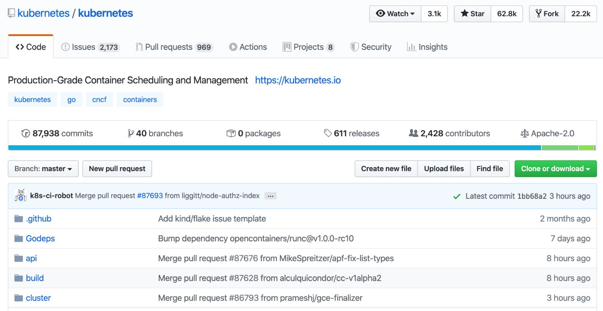


Figure 10.1: Kubernetes GitHub repository

In this lab, you will explore Kubernetes\' design and architecture,
followed by its API and access, and use the Kubernetes resources to
create containerized applications. Since Kubernetes is the leading
container orchestration tool, getting hands-on experience of it will
help you get into the world of containerized applications.


Kubernetes Design
=================


Kubernetes focuses on the life cycle of containers, including
configuration, scheduling, health checks, and scaling. With Kubernetes,
it is possible to install various types of applications, including
databases, content management systems, queue managers, load balancers,
and web servers.

For instance, imagine you are working at a new online food delivery
chain, named **InstantPizza**. You can deploy the backend of your mobile
application in Kubernetes and make it scalable to customer demand and
usage. Similarly, you can implement a message queue to communicate
between the restaurants and customers, again in Kubernetes. To store
past orders and receipts, you can deploy a database in Kubernetes with
storage. Furthermore, you can use load balancers to implement
**Blue/Green** or **A/B Deployment** for your application.

In this section, the design and architecture of Kubernetes are discussed
to illustrate how it achieves scalability and reliability.

Note

Blue/green deployments focus on installing two identical versions
(called blue and green, respectively) of the same application and
instantly moving from blue to green to reduce downtime and risk.

A/B deployments focus on installing two versions of the application
(namely, A and B), and the user traffic is divided between the versions
for testing and experiments.

The design of Kubernetes concentrates on running on one or multiple
servers---namely, clusters. On the other hand, Kubernetes consists of
numerous components that should be distributed over a single cluster in
order to have reliable and scalable applications.

There are two groups of Kubernetes components---namely, the **control
plane** and the **node**. Although there are different naming
conventions for the elements that make up the Kubernetes landscape, such
as master components instead of the control plane, the main idea of
grouping has not changed at all. Control plane components are
responsible for running the Kubernetes API, including the database,
controllers, and schedulers. There are four main components in the
Kubernetes control plane:

-   `kube-apiserver`: This is the central API server that
    connects all the components in the cluster.
-   `etcd`: This is the database for Kubernetes resources, and
    the `kube-apiserver` stores the state of the cluster on
    `etcd`.
-   `kube-scheduler`: This is the scheduler that assigns
    containerized applications to the nodes.
-   `kube-controller-manager`: This is the controller that
    creates and manages the Kubernetes resources in the cluster.

In servers with the role node, there are two Kubernetes components:

-   `kubelet`: This is the Kubernetes client that lives on the
    nodes to create a bridge between the Kubernetes API and container
    runtime, such as Docker.
-   `kube-proxy`: This is a network proxy that runs on every
    node to allow network communication regarding the workloads across
    the cluster.

The control plane and node components, along with their interactions,
are illustrated in the following diagram:


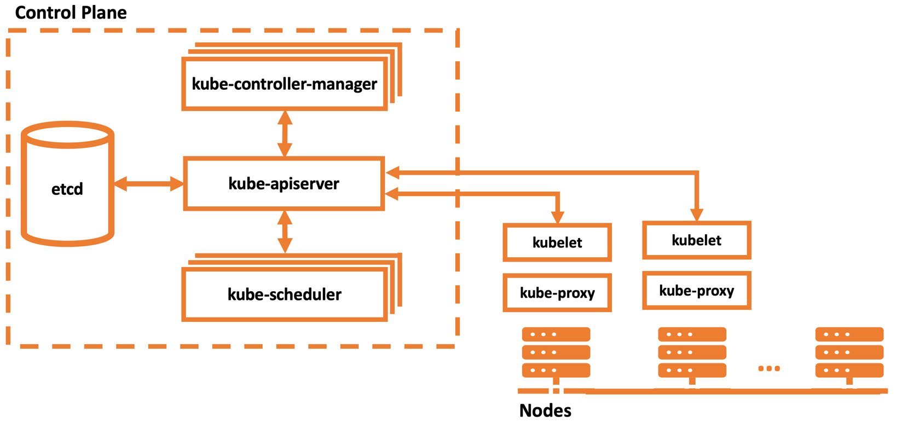


Figure 10.2: Kubernetes architecture

Kubernetes is designed to run on scalable cloud systems. However, there
are many tools to run Kubernetes clusters locally. `minikube`
is the officially supported CLI tool to create and manage local
Kubernetes clusters. Its commands focus on life cycle events and the
troubleshooting of clusters, as follows:

-   `minikube start`: Starts a local Kubernetes cluster
-   `minikube stop`: Stops a running local Kubernetes cluster
-   `minikube delete`: Deletes a local Kubernetes cluster
-   `minikube service`: Fetches the URL(s) for the specified
    service in the local cluster
-   `minikube ssh`: Logs in or runs a command on a machine
    with SSH

In the following exercise, you will create a local Kubernetes cluster to
check the components discussed in this lab. To create a local
cluster, you will use `minikube` as the official local
Kubernetes solution and run its commands to explore Kubernetes
components.

Note

`minikube` runs the cluster on hypervisors, and you need to
install a hypervisor such as KVM, VirtualBox, VMware Fusion, Hyperkit,
or Hyper-V based on your operating system. You can check the official
documentation for more information at
<https://kubernetes.io/docs/tasks/tools/install-minikube/#install-a-hypervisor>.

Note

Please use `touch` command to create files and `vim`
command to work on the file using vim editor.


Exercise 10.01: Starting a Local Kubernetes Cluster
---------------------------------------------------

Kubernetes was initially designed to run on clusters with multiple
servers. This is an expected characteristic for a container orchestrator
that runs scalable applications in the cloud. However, there are many
times that you need to run a Kubernetes cluster locally, such as for
development or testing. In this exercise, you will install a local
Kubernetes provider and then create a Kubernetes cluster. In the
cluster, you will check for the components discussed in this section.

To complete this exercise, perform the following steps:

1.  Download the latest version of the `minikube` executable
    for your operating system and set the binary as executable for your
    local system by running the following command in your terminal:

    
    ```
    # Linux
    curl -Lo minikube https://storage.googleapis.com/minikube/releases/latest/minikube-linux-amd64
    # MacOS
    curl -Lo minikube https://storage.googleapis.com/minikube/releases/latest/minikube-darwin-amd64 
    chmod +x minikube 
    sudo mv minikube /usr/local/bin
    ```
    

    These preceding commands download the binary for Linux or Mac and
    make it ready to use in the terminal:

    
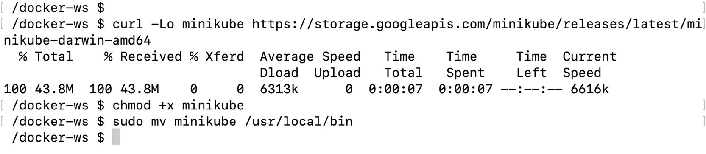
    

    Figure 10.3: Installation of minikube

2.  Start a Kubernetes cluster with the following command in your
    terminal:

    
    ```
    minikube start
    ```
    

    The single preceding command executes multiple steps to create a
    cluster successfully. You can check each stage and its output as
    follows:

    

    

    Figure 10.4: Starting a new Kubernetes cluster

    The output starts with printing out the version and the environment.
    Then, the images for Kubernetes components are pulled and started.
    Finally, you have a locally running Kubernetes cluster after a
    couple of minutes.

3.  Connect to the cluster node started by `minikube` with the
    following command:

    
    ```
    minikube ssh
    ```
    

    With the `ssh` command, you can continue working on the
    node running in the cluster:

    

    

    Figure 10.5: Cluster node

4.  Check for each control plane component with the following commands:

    
    ```
    docker ps --filter „name=kube-apiserver" --filter „name=etcd" --filter „name=kube-scheduler" --filter „name=kube-controller-manager" | grep -v „pause"
    ```
    

    This command checks for the Docker containers and filters with the
    control plane component names. The following output does not contain
    the pause container, which is responsible for the networking setup
    of the container groups in Kubernetes, so as to make analysis
    easier:

    

    

    Figure 10.6: Control plane components

    The output shows that four control plane components are running in
    Docker containers in the `minikube` node.

5.  Check for the first node component, `kube-proxy`, with the
    following command:

    
    ```
    docker ps --filter "name=kube-proxy"  | grep -v "pause"
    ```
    

    Similar to *Step 4*, this command lists a `kube-proxy`
    component, which is running in a Docker container:

    

    

    Figure 10.7: kube-proxy in minikube

    It can be seen that the `kube-proxy` component running in
    the Docker container has been up for 21 minutes.

6.  Check for the second node component, `kubelet`, with the
    following command:

    
    ```
    pgrep -l kubelet
    ```
    

    This command lists the process with its ID running in
    `minikube`:

    
    ```
    2554 kubelet
    ```
    

    Since `kubelet` communicates between the container runtime
    and API server, it is configured to run directly on the machine
    instead of inside a Docker container.

7.  Disconnect from the `minikube` node connected in *Step 3*
    with the following command:

    
    ```
    exit
    ```
    

    You should have returned to your terminal and get output similar to
    the following:

    
    ```
    logout
    ```
    

In this exercise, you have installed a Kubernetes cluster and checked
the architectural components. In the next section, the Kubernetes API
and access methods will be presented to connect and consume the cluster
created in this section.


The Kubernetes API and Access
=============================


The **Kubernetes API** is the fundamental building block of the
Kubernetes system. It is the home for all communication between the
components in the cluster. External communication, such as user
commands, is also executed against the Kubernetes API as REST API calls.
The Kubernetes API is a resource-based interface over HTTP. In other
words, the API server is oriented to work with resources to create and
manage Kubernetes resources. In this section, you will connect to the
API, and in the following section, you will start working with
Kubernetes resources, including, but not limited to, Pods, Deployments,
Statefulsets, and Services.

Kubernetes has an official command-line tool for client access, named
`kubectl`. If you want to access a Kubernetes cluster, you
need to install the `kubectl` tool and configure it to connect
to your cluster. Then you can securely use the tool to manage the life
cycle of applications running the cluster. `kubectl` is
capable of essential create, read, update, and delete operations, as
well as troubleshooting and log retrieval.

For instance, you can install a containerized application with
`kubectl`, scale it to more replicas, check the logs, and
finally delete it if you do not need it further. Furthermore,
`kubectl` has cluster management commands to check the status
of the cluster and servers. Therefore, `kubectl` is a vital
command-line tool for accessing Kubernetes clusters and managing the
applications.

`kubectl` is the key to controlling Kubernetes clusters with
its rich set of commands. The essential basic and deployment-related
commands can be listed as follows:

-   `kubectl create`: This command creates a resource from a
    filename with the `-f` flag or standard terminal input. It
    is helpful when creating resources for the first time.
-   `kubectl apply`: This command creates or updates the
    configuration to a Kubernetes resource, similar to the
    `create` command. It is an essential command if you are
    changing the resource configuration after the first creation.
-   `kubectl get`: This command displays one or multiple
    resources from the cluster with its name, labels, and further
    information.
-   `kubectl edit`: This command edits a Kubernetes resource
    directly in the terminal with an editor such as `vi`.
-   `kubectl delete`: This command deletes Kubernetes
    resources and passes filenames, resource names, and label flags.
-   `kubectl scale`: This command changes the number of
    resources of a Kubernetes cluster.

Similarly, the cluster management and configuration commands required
are listed as follows:

-   `kubectl cluster-info`: This command displays a summary of
    the cluster with its API and DNS services.
-   `kubectl api-resources`: This command lists the supported
    API resources on the server. It is especially helpful if you work
    with different installations of Kubernetes that support different
    sets of API resources.
-   `kubectl version`: This command prints the client and
    server version information. If you are working with multiple
    Kubernetes clusters with different versions, it is a helpful command
    to catch version mismatches.
-   `kubectl config`: This command configures
    `kubectl` to connect different clusters to each other.
    `kubectl` is a CLI tool designed to work with multiple
    clusters by changing its configuration.

In the following exercise, you will install and configure
`kubectl` to connect to the local Kubernetes cluster and start
exploring the Kubernetes API with the help of its rich set of commands.


Exercise 10.02: Accessing Kubernetes Clusters with kubectl
----------------------------------------------------------

Kubernetes clusters are installed in cloud systems and can be accessed
from various locations. To access the clusters securely and reliably,
you need a reliable client tool, which is the official client tool of
Kubernetes---namely, `kubectl`. In this exercise, you will
install, configure, and use `kubectl` to explore its
capabilities along with the Kubernetes API.

To complete this exercise, perform the following steps:

1.  Download the latest version of the `kubectl` executable
    for your operating system and set this as the executable for your
    local system by running the following command in your terminal:

    
    ```
    # Linux
    curl -LO https://storage.googleapis.com/kubernetes-release/release/'curl -s https://storage.googleapis.com/kubernetes-release/release/stable.txt'/bin/linux/amd64/kubectl
    # MacOS
    curl -LO "https://storage.googleapis.com/kubernetes-release/release/$(curl -s https://storage.googleapis.com/kubernetes-release/release/stable.txt)/bin/darwin/amd64/kubectl"
    chmod +x kubectl 
    sudo mv kubectl /usr/local/bin
    ```
    

    These preceding commands download the binary for Linux or Mac and
    make it ready to use in the terminal:

    
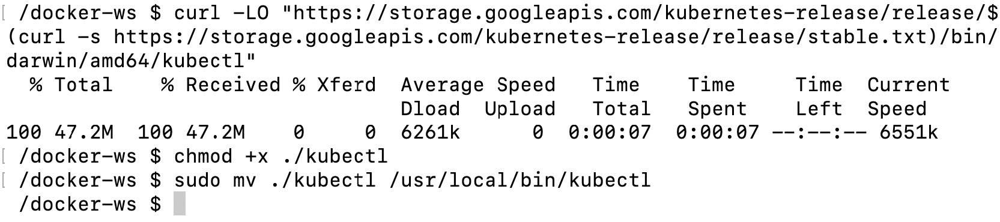
    

    Figure 10.8: Installation of minikube

2.  In your terminal, run the following command to configure
    `kubectl` to connect to the `minikube` cluster
    and use it for further access:

    
    ```
    kubectl config use-context minikube
    ```
    

    The `use-context` command configures the
    `kubectl` context to use the `minikube` cluster.
    For the following steps, all commands will communicate with the
    Kubernetes cluster running inside `minikube`:

    
    ```
    Switched to context "minikube".
    ```
    

3.  Check for the cluster and client version with the following command:

    
    ```
    kubectl version --short
    ```
    

    This command returns the human-readable client and server version
    information:

    
    ```
    Client Version: v1.17.2
    Server Version: v1.17.0
    ```
    

4.  Check for further information about the cluster with the following
    command:

    
    ```
    kubectl cluster-info
    ```
    

    This command shows a summary of Kubernetes components, including the
    master and DNS:

    
    ```
    Kubernetes master is running at https://192.168.64.5:8443
    KubeDNS is running at https://192.168.64.5:8445/api/v1/
    namespaces/kube-system/Services/kube-dns:dns/proxy
    To further debug and diagnose cluster problems, use 
    'kubectl cluster-info dump'.
    ```
    

5.  Get a list of the nodes in the cluster with the following command:

    
    ```
    kubectl get nodes
    ```
    

    Since the cluster is a `minikube` local cluster, there is
    only one node named `minikube` with the `master`
    role:

    
    ```
    NAME        STATUS        ROLES        AGE        VERSION
    Minikube    Ready         master       41h        v1.17.0
    ```
    

6.  List the supported resources in the Kubernetes API with the
    following command:

    
    ```
    kubectl api-resources --output="name"
    ```
    

    This command lists the `name` field of the
    `api-resources` supported in the Kubernetes API server.
    The long list shows how Kubernetes creates different abstractions to
    run containerized applications:

    

    

Figure 10.9: Kubernetes resource listing

The output lists the API resources available in the Kubernetes cluster
we have connected to. As you can see, there are tens of resources you
can use and each of them helps you to create cloud-native, scalable, and
reliable applications.

In this exercise, you have connected to the Kubernetes cluster and
checked the functionalities of the client tool. `kubectl` is
the most critical tool for accessing and managing applications running
in Kubernetes. By the end of this exercise, you will have learned how to
install, configure, and connect to a Kubernetes cluster. In addition,
you will have checked its version, the statuses of its nodes, and the
available API resources. Using `kubectl` effectively is an
essential task in daily life for developers interacting with Kubernetes.

In the following section, the primary Kubernetes resources (seen in part
of the last step in the previous exercise) will be presented.


Kubernetes Resources
====================


Kubernetes provides a rich set of abstractions over containers to define
cloud-native applications. All these abstractions are designed as
resources in the Kubernetes API and are managed by the control plane. In
other words, the applications are defined as a set of resources in the
control plane. At the same time, node components try to achieve the
state specified in the resources. If a Kubernetes resource is assigned
to a node, the node components focus on attaching the required volumes
and network interfaces to keep the application up and running.

Let\'s assume you will deploy the backend of the InstantPizza
reservation system on Kubernetes. The backend consists of a database and
a web server for handling REST operations. You will need to define a
couple of resources in Kubernetes:

-   A **StatefulSet** resource for the database
-   A **Service** resource to connect to the database from other
    components such as the web server
-   A **Deployment** resource to deploy the web server in a scalable way
-   A **Service** resource to enable outside connections to the web
    server

When these resources are defined in the control plane via
`kubectl`, the node components will create the required
containers, networks, and storage in the cluster.

Each resource has distinctive characteristics and schema in the
Kubernetes API. In this section, you will learn about the fundamental
Kubernetes resources, including **Pods**, **Deployments**,
**StatefulSet**, and **Services**. In addition, you will learn about
more complex Kubernetes resources such as **Ingresses**, **Horizontal
Pod Autoscaling**, and **RBAC** **Authorization** in Kubernetes.


Pods
----

The Pod is the fundamental building block of containerized applications
in Kubernetes. It consists of one or more containers that could share
the network, storage, and memory. Kubernetes schedules all the
containers in a Pod into the same node. Also, the containers in the Pod
are scaled up or down together. The relationship between containers,
Pods, and nodes can be outlined as follows:


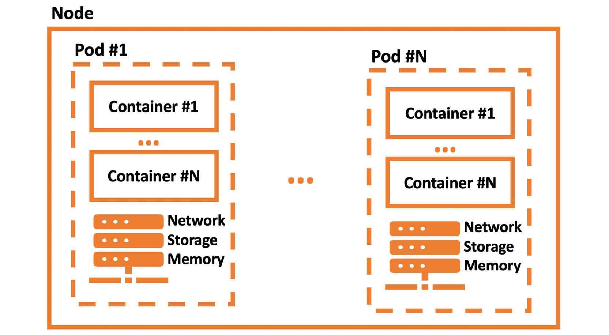


Figure 10.10: Containers, Pods, and nodes

It can be seen from the preceding diagram that a Pod can contain
multiple containers. All these containers share a common network,
storage, and memory resources.

The Pod definition is straightforward, with four main sections:


```
apiVersion: v1
kind: Pod
metadata:
  name: server
spec:
  containers:
  - name: main
    image: nginx
```


These four sections are required for all Kubernetes resources:

-   `apiVersion` defines the versioned schema of this resource
    of an object.
-   `kind` represents the REST resource name.
-   `metadata` holds the information of the resource, such as
    names, labels, and annotations.
-   `spec` is the resource-specific part where
    resource-specific information is kept.

When the preceding server Pod is created in the Kubernetes API, the API
will first check whether the definition is correct according to the
`apiVersion=v1` and `kind=Pod` schema. Then, the
scheduler will assign the Pod to a node. Following that, the
`kubelet` in the node will create the `nginx`
container for the `main` container.

Pods are the first abstraction of Kubernetes over containers, and they
are the building blocks of more complex resources. In the following
section, we will use resources such as Deployments and Statefulsets to
encapsulate Pods to create more sophisticated applications.


Deployments
-----------

Deployments are a Kubernetes resource that focuses on scalability and
high availability. Deployments encapsulate Pods to scale up, down, and
roll out new versions. In other words, you can define a three-replica
web server Pod as a Deployment. Deployment controllers in the control
plane will guarantee the number of replicas. Besides, when you update
the Deployment to a newer version, the controllers will gradually update
the application instances.

The definitions of Deployments and Pods are similar, although labels and
replicas are added to the schema of Deployments:


```
apiVersion: apps/v1
kind: Deployment
metadata:
  name: server
spec:
  replicas: 10
  selector:
    matchLabels:
      app: server
  template:
    metadata:
      labels:
        app: server
    spec:
      containers:
      - name: main
        image: nginx
        ports:
        - containerPort: 80 
```


The Deployment `server` has 10 replicas of the Pod
specification with the label `app:server`. In addition, port
`80` of the container is published for each main container of
the server instance. The Deployment controller will create or delete the
instances to match the 10 replicas of the defined Pod. In other words,
if a node with two running instances of the server Deployment goes
offline, the controller will create two additional Pods on the remaining
nodes. This automation of Kubernetes allows us to create scalable and
highly available applications out of the box.

In the following section, Kubernetes resources for stateful
applications, such as databases and message queues, will be presented.


Statefulsets
------------

Kubernetes supports running stateful applications that store their
states on the disk volumes with **StatefulSet** resources. StatefulSets
make it possible to run database applications or data analysis tools in
Kubernetes with the same reliability and high availability of temporary
applications.

The definition of StatefulSets resembles the definition of
**Deployments**, with **volume mount** and **claim additions**:


```
apiVersion: apps/v1
kind: StatefulSet
metadata:
  name: database
spec:
  selector:
    matchLabels:
      app: mysql
  serviceName: mysql
  replicas: 1
  template:
    metadata:
      labels:
        app: mysql
    spec:
      containers:
      - name: mysql
        image: mysql:5.7
        env:
        - name: MYSQL_ROOT_PASSWORD
          value: "root"
        ports:
        - name: mysql
          containerPort: 3306
        volumeMounts:
        - name: data
          mountPath: /var/lib/mysql
        subPath: mysql
  volumeClaimTemplates:
  - metadata:
      name: data
    spec:
      accessModes: ["ReadWriteOnce"]
      resources:
        requests:
          storage: 2Gi
```


The database resource defines a **MySQL** database with a disk volume of
**2 GB**. When the server `StatefulSet` resource is created in
the Kubernetes API, `cloud-controller-manager` will create a
volume and make it ready on the scheduled node. While creating the
volume, it uses the specification under
`volumeClaimTemplates`. Then, the node will mount the volume
in the container according to the `volumeMounts` section in
`spec`.

In this resource definition, there is also an example of setting an
environment variable for `MYSQL_ROOT_PASSWORD`. Statefulsets
are vital resources in Kubernetes since they enable running stateful
applications in the same cluster with ephemeral workloads.

In the following resource, the Kubernetes solution for the connection
between Pods will be presented.


Services
--------

Kubernetes clusters host multiple applications running in various nodes,
and most of the time, these applications need to communicate with each
other. Assume you have a three-instance Deployment of your backend and a
two-instance Deployment of your frontend application. Five Pods run,
spread over the cluster with their IP addresses. Since the frontend
instances need to connect to the backend, the frontend instances need to
know the IP addresses of backend instances, as shown in *Figure 10.11*:


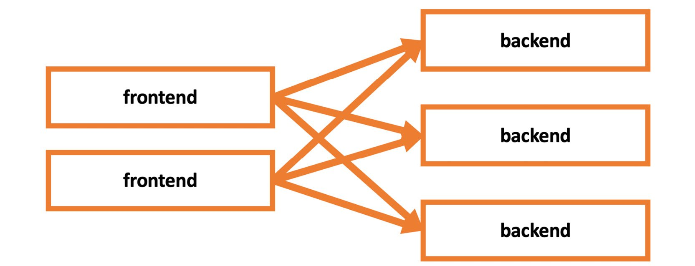


Figure 10.11: Frontend and backend instances

However, this is not a sustainable approach, with scaling up or down and
the prospect of numerous potential failures in the cluster. Kubernetes
proposes **Service** resources to define a set of Pods with labels and
access them using the name of the Service. For instance, the frontend
applications can connect to a backend instance by just using the address
of `backend-service`, as illustrated in *Figure 10.12*:


Figure 10.12: Frontend and backend instances connected via
backend-service

The definition of the Service resource is reasonably straightforward, as
shown here:


```
apiVersion: v1
kind: Service
metadata:
  name: my-db
spec:
  selector:
    app: mysql
  ports:
    - protocol: TCP
      port: 3306
      targetPort: 3306
```


When the `my-db` Service is created, all other Pods in the
cluster will be able to connect to the Pods with the label
`app:mysql` at port `3306` via the address,
`my-db`. In the following resource, external access to the
Services in the cluster by using the Kubernetes Ingress resources will
be presented.


Ingress
-------

Kubernetes clusters are designed to serve applications in and outside
the cluster. Ingress resources are defined to expose Services to the
outside world with additional features such as external URLs and load
balancing. Although the Ingress resources are native Kubernetes objects,
they require an Ingress controller up and running in the cluster. In
other words, Ingress controllers are not part of the
`kube-controller-manager`, and you need to install one in your
cluster. There are multiple implementations available on the market.
However, Kubernetes currently supports and maintains `GCE` and
`nginx` controllers officially.

Note

A list of additional Ingress controllers is available in the official
documentation at the following link:
<https://kubernetes.io/docs/concepts/Services-networking/Ingress-controllers>.

An Ingress resource with a host URL of
`my-db.docker-workshop.io` to connect to port `3306`
on the `my-db` Service looks like the following:


```
apiVersion: networking.k8s.io/v1beta1
kind: Ingress
metadata:
  name: my-db
spec:
  rules:
  - host: my-db.docker-workshop.io
    http:
      paths:
      - path: /
        backend:
          serviceName: my-db
          servicePort: 3306
```


Ingress resources are essential to open the Services to the outside
world. However, their configuration can be more complicated than it
seems. The Ingress resources could require individual annotations based
on the Ingress controller running in your cluster.

In the following resource, automatic scaling of the Pods with the help
of the Horizontal Pod Autoscaler will be covered.


Horizontal Pod Autoscaling
--------------------------

Kubernetes clusters provide a scalable and reliable containerized
application environment. However, it is cumbersome and unfeasible to
manually track the usage of applications and scale up or down when
needed. Therefore, Kubernetes provides the Horizontal Pod Autoscaler to
scale the number of Pods according to CPU utilization automatically.

Horizontal Pod Autoscalers are a Kubernetes resource with a target
resource for scaling and target metrics:


```
apiVersion: Autoscaling/v1
kind: HorizontalPodAutoscaler
metadata:
  name: server-scaler
spec:
  scaleTargetRef:
    apiVersion: apps/v1
    kind: Deployment
    name: server
  minReplicas: 1
  maxReplicas: 10
  targetCPUUtilizationPercentage: 50
```


When the `server-scaler` resource is created, the Kubernetes
control plane will try to achieve the target CPU utilization of
`50%` by scaling up or down the Deployment named as the
`server`. In addition, the minimum and maximum numbers of
replicas are set to `1` and `10`. This ensures that
the Deployment is not scaled to `0` when it is not used, nor
scaled too high so that it consumes all the resources in the cluster.
Horizontal Pod Autoscaler resources are essential parts of Kubernetes
for creating scalable and reliable applications that are automatically
managed.

In the following section, you will learn about authorization in
Kubernetes.


RBAC Authorization
------------------

Kubernetes clusters are designed to connect and make changes to
resources securely. However, when the applications are running in a
production environment, it is critical to limit the scope of actions of
the users.

Let\'s assume that you have conferred extensive powers on everyone in
your project group. In such circumstances, it will not be possible to
protect your application running in the cluster from deletion or
misconfiguration. Kubernetes provides **Role-Based Access Control**
(**RBAC**) to manage users\' access and abilities based on the roles
given to them. In other words, Kubernetes can limit the ability of users
to perform specific tasks on specific Kubernetes resources.

Let\'s start with the `Role` resource to define the
capabilities:


```
kind: Role
apiVersion: rbac.authorization.k8s.io/v1
metadata:
  namespace: critical-project
  name: Pod-reader
rules:
  - apiGroups: [""]
    resources: ["Pods"]
    verbs: ["get", "watch", "list"]
```


The `Pod-reader` role defined in the preceding snippet is only
allowed to `get`, `watch`, and `list` the
Pod resources in the `critical-project` namespace. When the
user only has the role `Pod-reader`, they will not be able to
delete or modify the resources in the `critical-project`
namespace. Let\'s see how roles are assigned to users using the
`RoleBinding` resource:


```
kind: RoleBinding
apiVersion: rbac.authorization.k8s.io/v1
metadata:
  name: read-Pods
  namespace: critical-project
subjects:
  - kind: User
    name: new-intern
roleRef:
  kind: Role
  name: Pod-reader
  apiGroup: rbac.authorization.k8s.io
```


The `RoleBinding` resource combines the `Role`
resource with the subjects. In `read-Pods RoleBinding`, the
user `new-intern` is assigned to the `Pod-reader`
`Role`. When the `read-Pods` resource is created in
the Kubernetes API, it will not be possible for the
`new-intern` user to modify or delete the Pods in the
`critical-project` namespace.

In the following exercise, you will see the Kubernetes resources in
action using `kubectl` and the local Kubernetes cluster.


Exercise 10.03: Kubernetes Resources in Action
----------------------------------------------

Cloud-native containerized applications require multiple Kubernetes
resources due to their complex nature. In this exercise, you will create
an instance of the popular WordPress application on Kubernetes by using
one **Statefulset**, one **Deployment**, and two **Service** resources.
In addition, you will check the status of the Pods and connect to the
Service using `kubectl` and `minikube`.

To complete this exercise, perform the following steps:

1.  Create a `StatefulSet` definition in a file, named
    `database.yaml`, with the following content:

    
    ```
    apiVersion: apps/v1
    kind: StatefulSet
    metadata:
      name: database
    spec:
      selector:
        matchLabels:
          app: mysql
      serviceName: mysql
      replicas: 1
      template:
        metadata:
          labels:
            app: mysql
        spec:
          containers:
          - name: mysql
            image: mysql:5.7
            env:
            - name: MYSQL_ROOT_PASSWORD
              value: "root"
            ports:
            - name: mysql
              containerPort: 3306
            volumeMounts:
            - name: data
              mountPath: /var/lib/mysql
              subPath: mysql
      volumeClaimTemplates:
      - metadata:
          name: data
        spec:
          accessModes: ["ReadWriteOnce"]
          resources:
            requests:
              storage: 2Gi
    ```
    

    This `StatefulSet` resource defines a database to be used
    by WordPress in the following steps. There is only one container
    named `mysql` with the Docker image of
    `mysql:5.7`. There is one environment variable for the
    root password and one port defined in the container specification.
    In addition, one volume is claimed and attached to
    `/var/lib/mysql` in the preceding definition.

2.  Deploy the `StatefulSet` to the cluster by running the
    following command in your terminal:

    
    ```
    kubectl apply -f database.yaml
    ```
    

    This command will apply the definition in the
    `database.yaml` file since it is passed with the
    `-f` flag:

    
    ```
    StatefulSet.apps/database created
    ```
    

3.  Create a `database-service.yaml` file in your local
    computer with the following content:

    
    ```
    apiVersion: v1
    kind: Service
    metadata:
      name: database-service
    spec:
      selector:
        app: mysql
      ports:
        - protocol: TCP
          port: 3306
          targetPort: 3306
    ```
    

    This Service resource defines a Service abstraction over database
    instances. WordPress instances will connect to the database by using
    the specified Service.

4.  Deploy the Service resource with the following command:

    
    ```
    kubectl apply -f database-service.yaml
    ```
    

    This command deploys the resource defined in the
    `database-service.yaml` file:

    
    ```
    Service/database-service created
    ```
    

5.  Create a file with the name `wordpress.yaml` and the
    following content:

    
    ```
    apiVersion: apps/v1 
    kind: Deployment
    metadata:
      name: wordpress
      labels:
        app: wordpress
    spec:
      replicas: 3
      selector:
        matchLabels:
          app: wordpress
      template:
        metadata:
          labels:
            app: wordpress
        spec:
          containers:
          - image: wordpress:4.8-apache
            name: wordpress
            env:
            - name: WORDPRESS_DB_HOST
              value: database-Service
            - name: WORDPRESS_DB_PASSWORD
              value: root
            ports:
            - containerPort: 80
              name: wordpress
    ```
    

    This `Deployment` resource defines a three-replica
    WordPress installation. There is one container defined with the
    `wordpress:4.8-apache` image and
    `database-service` is passed to the application as an
    environment variable. With the help of this environment variable,
    WordPress connects to the database deployed in *Step 3*. In
    addition, a container port is defined on port `80` so that
    we can reach the application from the browser in the following
    steps.

6.  Deploy the WordPress Deployment with the following command:

    
    ```
    kubectl apply -f wordpress.yaml
    ```
    

    This command deploys the resource defined in the
    `wordpress.yaml` file:

    
    ```
    Deployment.apps/wordpress created
    ```
    

7.  Create a `wordpress-service.yaml` file on your local
    computer with the following content:

    
    ```
    apiVersion: v1
    kind: Service
    metadata:
      name: wordpress-service
    spec:
      type: LoadBalancer
      selector:
        app: wordpress
      ports:
        - protocol: TCP
          port: 80
          targetPort: 80
    ```
    

    This Service resource defines a Service abstraction over the
    WordPress instances. The Service will be used to connect to
    WordPress from the outside world via port `80`.

8.  Deploy the `Service` resource with the following command:

    
    ```
    kubectl apply -f wordpress-service.yaml
    ```
    

    This command deploys the resource defined in the
    `wordpress-service.yaml` file:

    
    ```
    Service/wordpress-service created
    ```
    

9.  Check the status of all running Pods with the following command:

    
    ```
    kubectl get pods
    ```
    

    This command lists all the Pods with their statuses, and there are
    one database and three WordPress Pods with the `Running`
    status:

    

    

    Figure 10.13: Pod listing

10. Get the URL of `wordpress-service` by running the
    following command:

    
    ```
    minikube service wordpress-service --url
    ```
    

    This command lists the URL of the Service, accessible from the host
    machine:

    
    ```
    http://192.168.64.5:32765
    ```
    

    Open the URL in your browser to access the setup screen of
    WordPress:

    
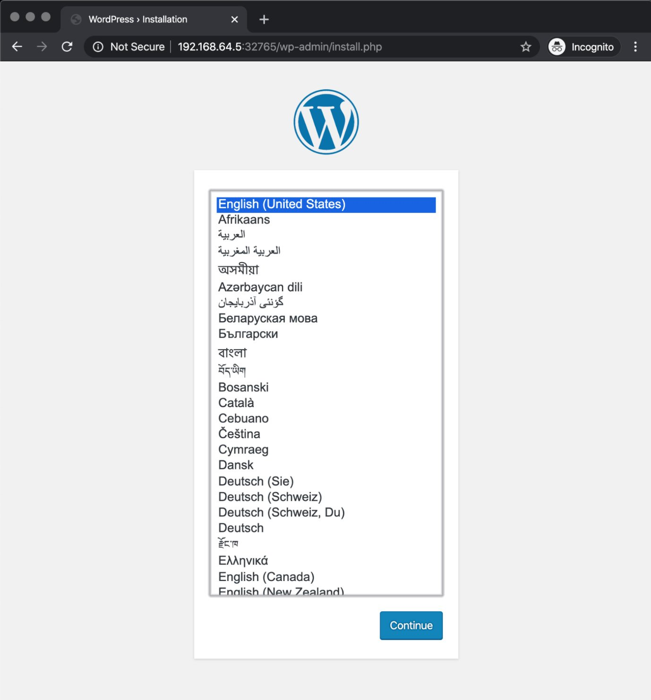
    

Figure 10.14: WordPress setup screen

The setup screen indicates that the WordPress instances are running and
accessible via their Service. Furthermore, it shows that the
`StatefulSet` database is also running and accessible via its
Service by the WordPress instances.

In this exercise, you have used different Kubernetes resources to define
and install a complex application in Kubernetes. First, you deployed a
`Statefulset` resource for installing MySQL in the cluster.
Then, you deployed a `Service` resource to reach the database
inside the cluster. Following that, you deployed a
`Deployment` resource to install the WordPress application.
Similarly, you created another `Service` to reach the
WordPress application outside the cluster. You have created
independently scalable and reliable microservices using different
Kubernetes resources and connected them. Furthermore, you have learned
how to check the status of `Pods`. In the following section,
you will learn about the Kubernetes package manager: Helm.


Kubernetes Package Manager: Helm
================================


Kubernetes applications consist of multiple containers, volumes, and
networking resources due to the nature of cloud-native microservices
architecture. The microservice architecture divides large applications
into smaller chunks and thus results in numerous Kubernetes resources
and a vast amount of configuration values.

Helm is the official Kubernetes package manager that collects the
resources of applications as templates and fills them with the values
provided. The essential advantage here is the accumulated community
knowledge of installing the applications with the best practices. You
can install an app with the most popular methods, even if you are
working with it for the first time. Besides, working with Helm charts
augments the developer experience.

For instance, installing and managing complex applications in Kubernetes
becomes similar to downloading apps in Apple Store or Google Play Store,
with fewer commands and configurations. In Helm terminology, a
collection of resources for a single application is a **chart**. Charts
can be used to deploy anything from a simple pod to a full web app stack
with HTTP servers, databases, caches, and such when you work with the
Helm package manager. The encapsulation of applications as charts makes
it easier to deploy complicated applications.

In addition, Helm has a chart repository with popular and stable
applications that are packaged as charts and maintained by the Helm
community. The stable Helm chart repository has a high variety of
applications, including databases such as MySQL, PostgreSQL, CouchDB,
and InfluxDB; CI/CD tools such as Jenkins, Concourse, and Drone; or
monitoring tools such as Grafana, Prometheus, Datadog, and Fluentd. The
chart repository not only makes it easier to install apps but also
ensures that you are deploying the application with the latest,
well-accepted methods in the Kubernetes community.

Helm is a client tool, with its latest version being Helm 3. You only
need to install it on your local system, configure it for the chart
repository, and then you can start deploying applications. Helm is a
powerful package manager with its exhaustive set of commands, including
the following:

-   `helm repo`: This command adds, lists, removes, updates,
    and indexes chart repositories to the local Helm installation.
-   `helm search`: This command searches for Helm charts in
    various repositories using user-provided keywords or chart names.
-   `helm install`: This command installs a Helm chart on the
    Kubernetes cluster. It is also possible to set variables with a
    value file or command-line parameters.
-   `helm list` or `helm ls`: These commands list
    the installed charts from the cluster.
-   `helm uninstall`: This command removes an installed chart
    from Kubernetes.
-   `helm upgrade`: This command upgrades an installed chart
    with new values or new chart versions on the cluster.

In the following exercise, you will install Helm, connect to a chart
repository, and install applications on the cluster.


Exercise 10.04: Installing the MySQL Helm Chart
-----------------------------------------------

Helm charts are installed and managed by the official client tool,
`helm`. You need to install the `helm` client tool
locally to retrieve the charts from the chart repository and then
install applications on the clusters. In this exercise, you will start
working with Helm and install **MySQL** from its stable Helm chart.

To complete this exercise, perform the following steps:

1.  Run the following command in your terminal to download the latest
    version of the `helm` executable with the installation
    script:

    
    ```
    curl https://raw.githubusercontent.com/helm/helm/master/scripts/get-helm-3 | bash
    ```
    

    The script downloads the appropriate binary of `helm` for
    your operating system and makes it ready to use in the Terminal:

    
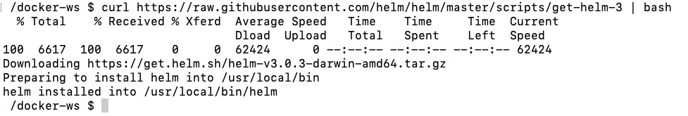
    

    Figure 10.15: Installation of Helm

2.  Add the chart repository to `helm` by running the
    following command in your terminal:

    
    ```
    helm repo add stable https://kubernetes-charts.storage.googleapis.com/
    ```
    

    This command adds the URL of the chart repository to the locally
    installed `helm` instance:

    
    ```
    "stable" has been added to your repositories
    ```
    

3.  List the charts in the `stable` repository from *Step 2*
    with the following command:

    
    ```
    helm search repo stable
    ```
    

    This command will list all the available charts in the repository:

    
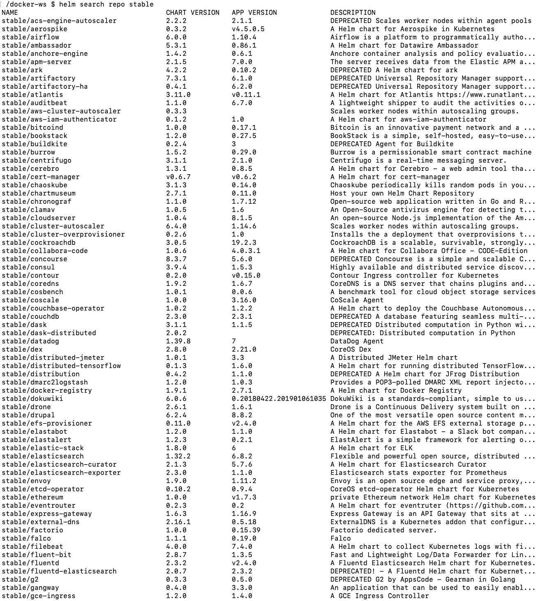
    

    Figure 10.16: Chart repository listing

4.  Install the MySQL chart with the following command:

    
    ```
    helm install database stable/mysql
    ```
    

    This command will install the MySQL Helm chart from the
    `stable` repository under the name `database`
    and print information on how to connect to the database:

    
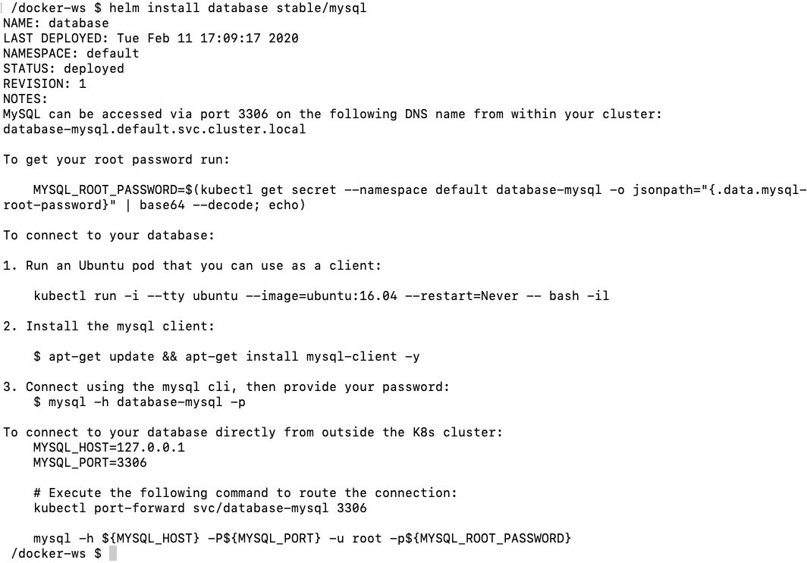
    

    Figure 10.17: MySQL installation

    The information in the output is valuable if you want to connect to
    the MySQL installation using the `mysql` client inside or
    outside the cluster.

5.  Check the status of the installation with the following command:

    
    ```
    helm ls
    ```
    

    We can see that there is an installation of
    `mysql-chart-1.6.2` with the status `deployed`:

    
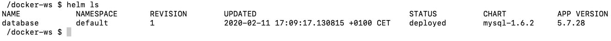
    

    Figure 10.18: Helm installation status

    You can also use the `helm ls` command to check the
    application and chart versions, such as `5.7.28` and
    `mysql-1.6.2`.

6.  Check for the Kubernetes resources related to the installation from
    *Step 4* with the following command:

    
    ```
    kubectl get all -l release=database
    ```
    

    This command lists all the resources with the label
    `release = database`:

    
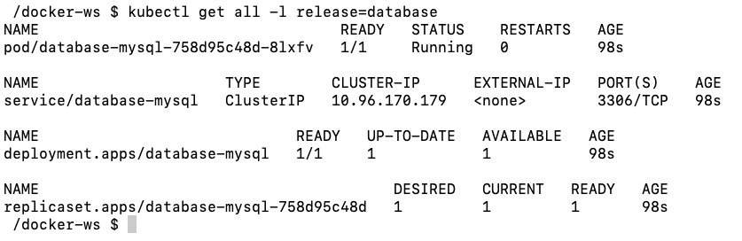
    

Figure 10.19: Kubernetes resource listing

There are various resources listed since the installation of a
production-grade MySQL instance is not straightforward and consists of
multiple resources. Thanks to Helm, we do not need to configure each of
these resources and connect them. In addition, listing with the label
`release = database` is helpful to provide a troubleshooting
overview when some parts of your Helm installation fail.

In this exercise, you have installed and configured the Kubernetes
package manager, Helm, and installed applications using it. Helm is an
essential tool if you are planning to use Kubernetes for production and
need to manage complex applications.

In the following activity, you will configure and deploy the Panoramic
Trekking App to the Kubernetes cluster.


Activity 10.01: Installing the Panoramic Trekking App on Kubernetes
-------------------------------------------------------------------

You have been assigned to create a Deployment of the Panoramic Trekking
App on Kubernetes. You will take advantage of the three-tier
architecture of the Panoramic Trekking App with state-of-the-art
Kubernetes resources. You will install the database using Helm, and the
backend with `nginx` using a Statefulset. Therefore, you will
design it as a Kubernetes application and manage it with
`kubectl` and `helm`.

Perform the following steps to complete the exercise:

1.  Install the database using the PostgreSQL Helm chart. Ensure that
    the `POSTGRES_PASSWORD` environment variable is set to
    `kubernetes`.

2.  Create a Statefulset with two containers for the Panoramic Trekking
    App backend and `nginx`. Ensure that you are using the
    Docker images,
    `packtworkshops/the-docker-workshop:chapter10-pta-web` and
    `packtworkshops/the-docker-workshop:chapter10-pta-nginx`,
    for the containers. In order to store the static files, you need to
    create a `volumeClaimTemplate` section and mount it to the
    `/Service/static/` paths of both containers. Finally, do
    not forget to publish port `80` of the `nginx`
    container.

3.  Create a Kubernetes Service for the Panoramic Trekking App to
    connect to the Statefulset created in *Step 2*. Ensure that the
    `type` of Service is `LoadBalancer`.

4.  With a successful deployment, obtain the IP of the Kubernetes
    Service created in *Step 3* and connect to the
    `$SERVICE_IP/admin` address in the browser:

    
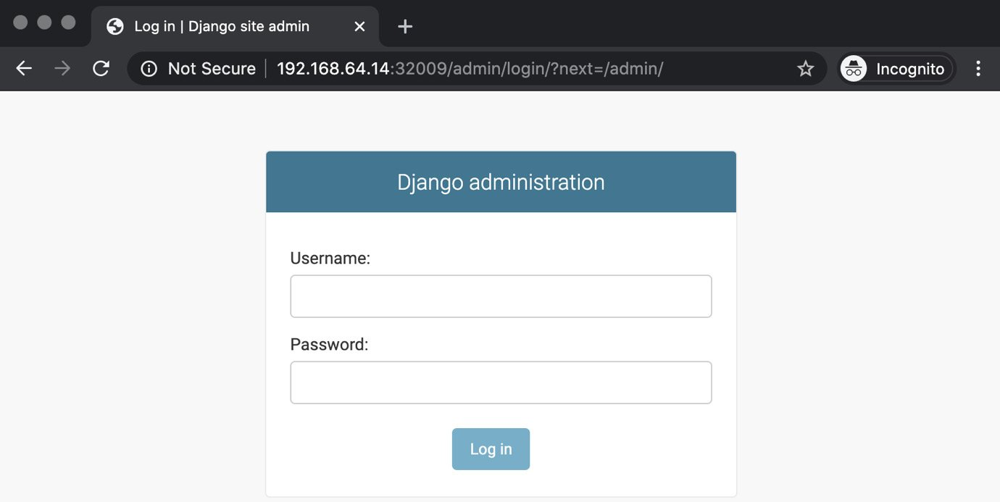
    

    Figure 10.20: Admin login

5.  Log in with the username `admin` and the password
    `changeme` and add new photos and countries:

    
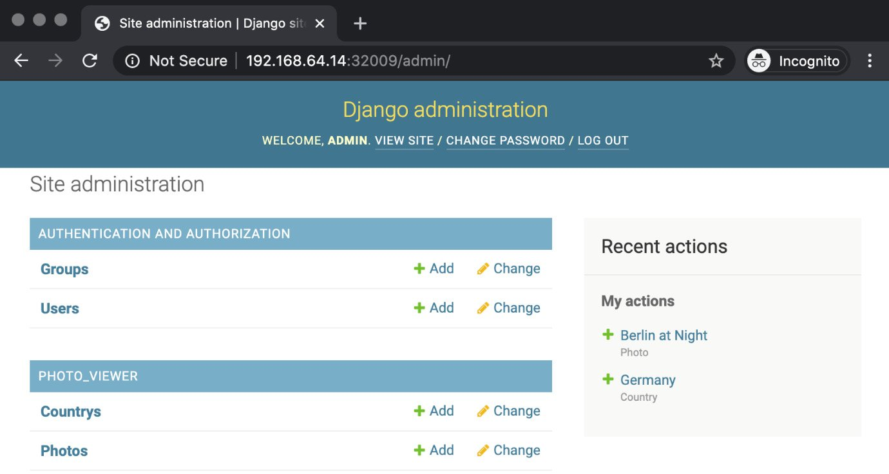
    

    Figure 10.21: Admin setup

6.  The Panoramic Trekking App will be available at the address
    `$SERVICE_IP/photo_viewer` in the browser:
    
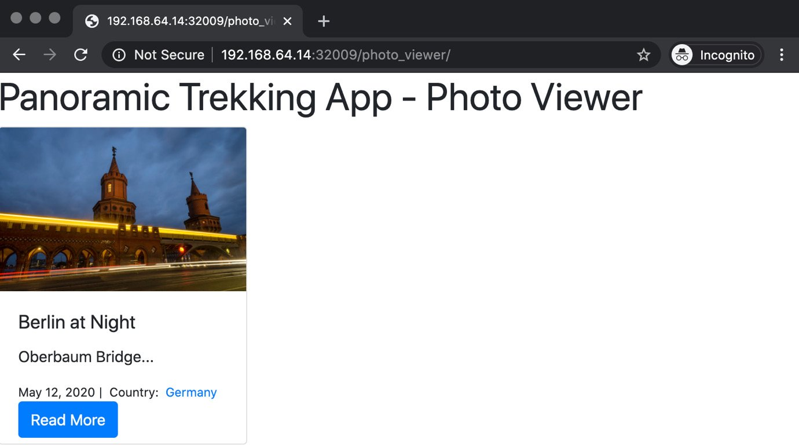


Summary
=======


This lab focused on using Kubernetes to design, create, and manage
containerized applications. Kubernetes is the up-and-coming container
orchestrator in the market, with a high adoption rate and an active
community. In this lab, you have learned about its architecture and
design, followed by the Kubernetes API and its access methods, and dove
into the vital Kubernetes resources to create complex cloud-native
applications.

Every exercise in this lab aimed to illustrate the Kubernetes design
approach and its capabilities. With the Kubernetes resources and its
official client tool, `kubectl`, it is possible to configure,
deploy, and manage containerized applications.

In the following lab, you will learn about security in the Docker
world. You will learn the security concepts for container runtimes,
container images, and Linux environments, and how to securely run
containers in Docker.
